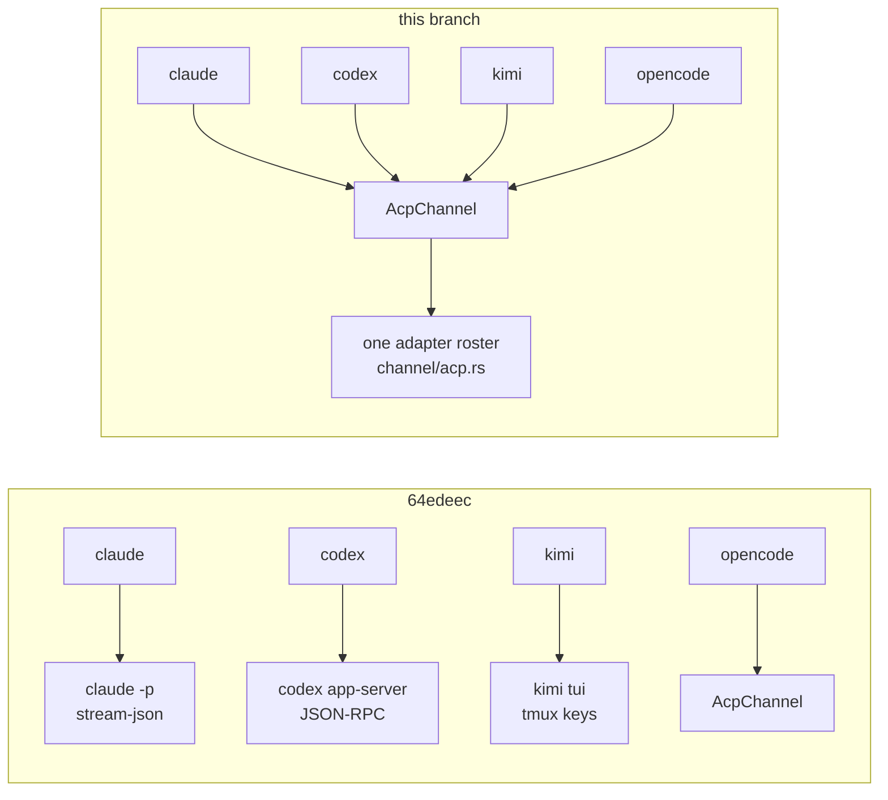

# acp-all-harnesses REPORT

## Table of contents

1. [What flipped](#1-what-flipped)
2. [Files](#2-files)
3. [The adapter roster](#3-the-adapter-roster)
4. [Model ids differ per harness, and codex does not fit](#4-model-ids-differ-per-harness-and-codex-does-not-fit)
5. [Resume: every adapter advertises loadSession](#5-resume-every-adapter-advertises-loadsession)
6. [The old channels stay, unwired](#6-the-old-channels-stay-unwired)
7. [Gates](#7-gates)
8. [Left for the user](#8-left-for-the-user)

## 1. What flipped

Every lane conversation is now one ACP session. `Harness::open_channel` mints an
`AcpChannel` for all four harnesses; the harness-specific transports (claude
stream-json, codex app-server, kimi tui) construct nothing.



## 2. Files

| file | change |
|---|---|
| `crates/boop-acp/src/channel/acp.rs` | adapter roster consts, `open_adapter`, per-adapter model lever with a diagnosable rejection, 8 new tests (2 of them live legs plus 2 live resume legs) |
| `crates/boop-harness/src/harness/claude.rs` | `open_channel` -> `AcpChannel::open_adapter(spec, CLAUDE_ADAPTER)`; `send_midflight` false |
| `crates/boop-harness/src/harness/codex.rs` | `open_channel` -> `CODEX_ADAPTER` |
| `crates/boop-harness/src/harness/kimi.rs` | `open_channel` -> `KIMI_ADAPTER`; `send_midflight` false |
| `crates/boop-acp/src/channel/opencode.rs` | takes its command from the roster instead of an inline literal |
| `crates/boop-acp/src/channel/{claude,codex,kimi,tui}.rs` | retirement note in the header, no code change |
| `crates/boop/tests/lane_wait_exit.rs` | the codex lane e2e's fake is an ACP agent shadowing `npx`, not a fake `codex app-server` |

`send_midflight` was true for claude and kimi on their old transports and cannot
be true on this one: `session/prompt` is one request per turn, and `steer`
returns `Delivery::NextTurn` for every channel. Both capability tests now assert
the false.

## 3. The adapter roster

`crates/boop-acp/src/channel/acp.rs`, one const per harness. Not a config row:
`config.json` is parsed by boop-proc, which depends on boop-acp, so a lookup
there would invert the crate order. `~/Library/Application Support/boop/config.json`
carries model presets and harness routing only, no command rows.

| harness | command | adapter version seen |
|---|---|---|
| claude | `npx -y @agentclientprotocol/claude-agent-acp` | 0.70.0 |
| codex | `npx -y @agentclientprotocol/codex-acp` | 1.6.2 |
| kimi | `kimi acp` | Kimi Code CLI 0.37.2 |
| opencode | `opencode acp` | OpenCode 1.18.18 |

## 4. Model ids differ per harness, and codex does not fit

`spec.model` still goes through `session/set_config_option` untranslated. The
ids each adapter offers, read off its own `session/new` reply on 2026-08-20:

| harness | `model` option values | effort |
|---|---|---|
| claude | `default`, `opus[1m]`, `fable`, `sonnet`, `haiku` | separate `effort` option: default/low/medium/high/xhigh/max |
| codex | `gpt-5.6-sol`, `gpt-5.6-terra`, `gpt-5.6-luna`, `gpt-5.5`, `gpt-5.4`, `gpt-5.4-mini`, `gpt-5.3-codex-spark` | separate `reasoning_effort` option: low/medium/high/xhigh/max/ultra |
| kimi | `kimi-code/kimi-for-coding`, `kimi-code/kimi-for-coding-highspeed`, `kimi-code/k3`, `kimi-code/k3-256k` | separate `thinking` option: low/high/max |
| opencode | the full provider catalog, e.g. `openrouter/deepseek/deepseek-v4-flash-0731` | none |

boop spells a codex preset `gpt-5.6-luna@medium` (`config.json` presets terra,
luna, sol). Measured, verbatim from the wire:

```
--> {"method":"session/set_config_option","params":{"sessionId":"01a01fd0-...","configId":"model","value":"gpt-5.6-luna[medium]"}}
<-- {"error":{"code":-32602,"message":"Invalid params"}}
--> {"method":"session/set_model","params":{"sessionId":"...","modelId":"gpt-5.6-luna@medium"}}
<-- {"error":{"code":-32603,"data":{"details":"Unsupported format of modelId: gpt-5.6-luna@medium. Expected: modelId[effort]."}}}
--> {"method":"session/set_model","params":{"sessionId":"...","modelId":"gpt-5.6-luna[medium]"}}
<-- {"result":{}}
```

So a codex lane spelled `gpt-5.6-luna@medium` fails at open, loudly, with the
offered ids in the message (`model_rejection`). Nothing is rewritten on the way
through. The join is a user decision; the pieces already exist
(`boop_store::session::ModelSpec` parses name and effort, and the adapter takes
them on two separate config options).

## 5. Resume: every adapter advertises loadSession

`AcpChannel` already carried resume: `spec.resume` becomes `session/load` when
the agent advertises `loadSession`, else a warning and a fresh session
(`channel/acp.rs`, `handshake`). All four adapters advertise
`agentCapabilities.loadSession: true` and `sessionCapabilities.resume`, so
nothing is faked and no adapter is missing the leg.

| harness | loadSession | sessionCapabilities.resume | live receipt |
|---|---|---|---|
| claude | true | yes | `a_real_claude_acp_session_is_resumed_by_a_second_child` |
| codex | true | yes | not run live |
| kimi | true | yes | `a_real_kimi_acp_session_is_resumed_by_a_second_child` |
| opencode | true | yes | not run live |

`session/resume` (reconnect without history replay) is the other spelling in the
skill's session-method table; the channel uses `session/load` only, which is the
one that replays history and therefore the one a respawned lane wants.

## 6. The old channels stay, unwired

`channel/claude.rs`, `channel/codex.rs`, `channel/kimi.rs` and `channel/tui.rs`
keep their code and their tests as the rollback door. Each header says so.
Nothing outside their own test modules constructs them:

```
$ grep -rn "ClaudeChannel\|CodexChannel\|KimiChannel\|TuiChannel::open\|kimi_profile\|opencode_profile" --include=*.rs crates/ \
  | grep -v "^crates/boop-acp/src/channel/\(claude\|codex\|kimi\|tui\).rs"
(no output)
```

## 7. Gates

### `cargo test --workspace`

```
passed 613 failed 0 ignored 7
```

Base was 607/0/2. The six new passes are the unit tests added to `channel/acp.rs`
(roster shape, steer tier, activity clock, idle join, two rejection-message
cases); the five new ignores are the three live turn legs and the two live
resume legs.

### `cargo clippy --workspace -- -D warnings`

```
    Finished `dev` profile [unoptimized + debuginfo] target(s) in 3.47s
```

Green. `--all-targets` (not the gate) additionally reports one pre-existing
`needless_borrow` at `crates/boop/tests/host_chat.rs:44`, in a file this branch
does not touch.

### The live e2e legs

```
$ cargo test -p boop-acp --lib channel::acp::tests::a_real_claude_acp_turn_ends_the_turn -- --ignored --nocapture
npx -y @agentclientprotocol/claude-agent-acp session Some("12bd1809-2028-4ce1-8d98-9fa01ead659b") in 2.392132417s
verdict Done { detail: "end_turn" } in 1.856612416s
last_activity_ms Some(1787240089988)
test channel::acp::tests::a_real_claude_acp_turn_ends_the_turn ... ok

$ cargo test -p boop-acp --lib channel::acp::tests::a_real_codex_acp_turn_ends_the_turn -- --ignored --nocapture
npx -y @agentclientprotocol/codex-acp session Some("01a01fd2-15bc-7771-80ee-1f6d6821af85") in 1.049834917s
verdict Done { detail: "end_turn" } in 3.438696708s
last_activity_ms Some(1787240260492)
test channel::acp::tests::a_real_codex_acp_turn_ends_the_turn ... ok

$ cargo test -p boop-acp --lib channel::acp::tests::a_real_kimi_acp_turn_ends_the_turn -- --ignored --nocapture
kimi acp session Some("session_947b40b3-3883-4157-83a0-658cc346049f") in 1.225076542s
verdict Done { detail: "end_turn" } in 5.279837167s
last_activity_ms Some(1787240098074)
test channel::acp::tests::a_real_kimi_acp_turn_ends_the_turn ... ok

$ cargo test -p boop-acp --lib channel::acp::tests::a_real_opencode_acp_turn_ends_the_turn -- --ignored --nocapture
opencode acp session Some("ses_fe036efd8ffeHNkJysXqiv1aeE") in 2.91421025s
verdict Done { detail: "end_turn" } in 1.96089125s
last_activity_ms Some(1787239667714)
test channel::acp::tests::a_real_opencode_acp_turn_ends_the_turn ... ok

$ cargo test -p boop-acp --lib channel::acp::tests::a_real_claude_acp_session_is_resumed -- --ignored --nocapture
claude session 9ed9acbd-d5f2-4f88-8836-65407cfd52a2 resumed as 9ed9acbd-d5f2-4f88-8836-65407cfd52a2
test channel::acp::tests::a_real_claude_acp_session_is_resumed_by_a_second_child ... ok

$ cargo test -p boop-acp --lib channel::acp::tests::a_real_kimi_acp_session_is_resumed -- --ignored --nocapture
kimi session session_2e18e2fc-cb93-4c9e-955a-d954cc8dbd66 resumed as session_2e18e2fc-cb93-4c9e-955a-d954cc8dbd66
test channel::acp::tests::a_real_kimi_acp_session_is_resumed_by_a_second_child ... ok
```

`kimi` is on PATH at `~/.kimi-code/bin/kimi`, so its leg ran; nothing was left
unmeasured for want of a binary.

### `boop beep lane create --dry-run`, unchanged

Same brief, same flags, installed 64edeec binary vs this branch's build:

```
harness: opencode
branch: feature/smoke-acp (kind feature)
worktree: /Users/chrishafley/projects/hafley-rs/.boop-worktrees/feature/smoke-acp
boop-start: no recipe in /Users/chrishafley/projects/hafley-rs, nothing to warm
base-sha: 64edeec (from --base-sha)
tmux: feature-smoke-acp
parent: codex-1205 (from caller; completion hail appended on exit)
goal: reply pong
```

Byte-identical apart from the build string (`0.0.2 (64edeec)` vs
`0.0.2 (64edeec-dirty)`).

### One real claude lane turn through the supervisor

```
$ BOOP_DB=$SMOKE/boop.db ./target/debug/boop beep lane run --lane smoke-claude-acp \
    --harness claude --brief $SMOKE/repo/brief.md --model sonnet --mail-dir $SMOKE/mail
INFO boop_acp::channel::acp: acp channel opening command=npx -y @agentclientprotocol/claude-agent-acp model="sonnet"
INFO boop_acp::channel::acp: acp agent initialized agent=Some(Implementation { name: "@agentclientprotocol/claude-agent-acp", version: "0.70.0" }) protocol_version=ProtocolVersion(1) load_session=true
INFO boop_acp::channel::acp: acp session model set model="sonnet"
INFO boop_acp::channel::acp: acp session opened conversation_id="591c884b-8c77-4a20-a0da-24f69a128bef" conversation_id_kind="acp_session"
[boop] turn ended: end_turn
INFO boop_proc::supervise: lane turn ended turn_end_reason="end_turn" turn_ok=true retryable=false
INFO boop_proc::supervise: lane supervision complete exit_code=0
[boop] result rc=0 hailed to coordinator
[boop] lane smoke-claude-acp finished rc=0

$ cat $SMOKE/mail/bus.ndjson
{"id":"m-758290d5","from":"smoke-claude-acp","to":"coordinator","kind":"result","body":"lane smoke-claude-acp done rc=0","rc":0}
```

## 8. Left for the user

| open | why it needs a word |
|---|---|
| codex model spelling | boop says `gpt-5.6-luna@medium`, codex-acp takes `gpt-5.6-luna` on `model` plus `medium` on `reasoning_effort`, or `gpt-5.6-luna[medium]` on `session/set_model`. Picking one is a model-naming decision, so nothing was translated here. |
| effort for claude and kimi | both expose an effort/thinking option ACP-side that boop never sets; the lane runs the adapter default (claude `high`, kimi `high`, codex `low`). |
| retiring the old channels | `channel/{claude,codex,kimi,tui}.rs` stay this arc. Deleting them is a separate call once a week of lanes has run on ACP. |
