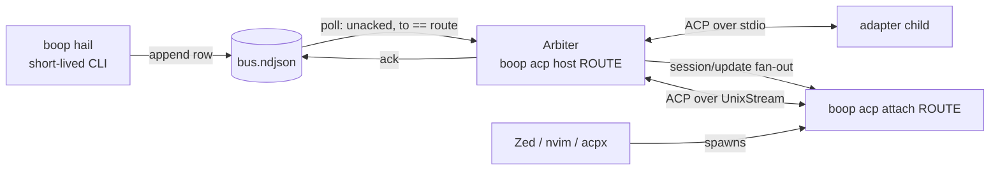

# boop acp host

One resident boop process per addressed route owns the ACP session, binds a
unix socket, and is the only caller of `session/prompt`.

## Contents

1. [Build vs buy: the fan-out](#1-build-vs-buy-the-fan-out)
2. [Build vs buy: the transport](#2-build-vs-buy-the-transport)
3. [What was built](#3-what-was-built)
4. [Tests](#4-tests)
5. [What the plan got wrong](#5-what-the-plan-got-wrong)
6. [Forks that are Chris's](#6-forks-thats-chriss)

---

## 1. Build vs buy: the fan-out

Question: does a crate carry N clients into one upstream ACP session?

`cargo add agent-client-protocol-conductor@2.0.0` into a scratch bin, sources
read at `~/.cargo/registry/src/index.crates.io-*/agent-client-protocol-conductor-2.0.0`.

| candidate | version | what its code does | fits | disqualifier, cited |
|---|---|---|---|---|
| `agent-client-protocol-conductor` | 2.0.0, 3 src files, 1401 lines in `conductor.rs` | orchestrates a **linear** chain: `Editor -> Conductor -> Proxy 1 -> Proxy 2 -> Agent` (`README.md:8`). Routes `LeftToRight { target_component_index: usize }` / `RightToLeft { source_component_index }` (`src/conductor.rs:1097`, `:1108`) | **no** | `ComponentIndex::Client` (`src/conductor.rs:829`) is a single variant carrying no index: the chain has exactly one client. `ConductorImpl::run(self, transport: impl ConnectTo<Host>)` (`src/conductor.rs:200`) consumes `self` and takes ONE transport. No `attach`, no client collection, no method that admits a second client to a running chain |
| `agent-client-protocol-http` server side | 2.0.0 | `AcpHttpServer::new(factory: F) where F: Fn() -> C` (`src/server.rs:101`) | **no** | `ConnectionRegistry::create_connection_with_transport` calls `self.factory.spawn_agent()` per connection (`src/connection.rs:465`) and keys them in `connections: HashMap<String, Arc<Connection>>` (`:402`). One agent instance **per** connection is the exact opposite of one session behind many connections |
| `agent-client-protocol` core SDK | 2.0.0, already a dependency (`crates/boop-acp/Cargo.toml:31`) | `ConnectionTo<R>` is `Clone` (`src/jsonrpc.rs:2908`); `Builder` serves either role over any transport; `ByteStreams<OB: AsyncWrite, IB: AsyncRead>` (`src/jsonrpc.rs:5551`) | **yes, for the parts** | none. It gives both roles and the transport; it has no opinion about how many clients share a session, which is the policy this arc had to write |

Verdict: **conductor does not fit and the bespoke `Fanout` stays**, at 2.0.0.
It is a proxy *chain* (one client, N interposed proxies, one agent), not a
proxy *fan-in* (N clients, one agent). A crate whose name says "orchestrating
proxy chains" is describing a different topology from the one the card needs,
and the single-variant `ComponentIndex::Client` is where that shows in code.

What the SDK bought outright, so `Fanout` shrank rather than being written in
full:

| piece the plan priced as bespoke | bought at |
|---|---|
| id remapping per downstream client (`lspmux`'s trick, plan §5.2 and §10) | not needed. Each downstream connection has its own id space and the host never forwards a raw id: it makes its **own** upstream request and answers the `Responder` it was handed (`crates/boop-acp/src/host.rs:419`) |
| the socket transport | `ByteStreams::new(outgoing, incoming)` over an `async_net::unix::UnixStream` (`crates/boop-acp/src/host.rs:487`) |
| per-connection event loop, cancellation forwarding, response routing | `Builder` / `ConnectionTo` |

## 2. Build vs buy: the transport

| candidate | fits a unix socket | cost | verdict |
|---|---|---|---|
| `ByteStreams` over `async_net::unix::UnixStream` | yes: `async-net` yields futures `AsyncRead`/`AsyncWrite`, which is what `ByteStreams` is generic over (`src/jsonrpc.rs:5556`), and the reactor under the ACP crate is async-io's already (`crates/boop-acp/Cargo.toml:36`) | one crate, `async-net`, on the `async-io`/`blocking`/`futures-lite` tree already in `Cargo.lock` | **chosen** |
| `agent-client-protocol-http` | no unix door: `AcpHttpServer::into_router()` (`src/server.rs:121`) hands back an `axum::Router` and the crate binds nothing itself | axum + reqwest + tower-http + uuid + async-tungstenite, for HTTP/SSE/WS this design never speaks | rejected. It is the better-maintained door for a **remote** client; the host's client is a process on the same machine |
| hand-rolled JSON-RPC framing | | | never considered: `crates/boop-acp/Cargo.toml:26-31` already settled it |

Both crates were fetched and read, not judged from their descriptions.

## 3. What was built

| verb | what it does | site |
|---|---|---|
| `boop acp host <ROUTE>` | binds the socket, spawns the adapter, opens or loads the session, polls the mailbox, is the only `session/prompt` caller | `crates/boop-acp/src/host.rs:121` (`run`), `crates/boop/src/cli/acp.rs:80` |
| `boop acp attach <ROUTE>` | two byte pumps, stdin to socket and socket to stdout | `crates/boop-acp/src/host.rs:556` (`attach`), 24 lines |
| `boop acp list` | one row per route: kind, whether a host answers, its socket | `crates/boop/src/cli/acp.rs:137` |
| `boop acp agents [--refresh-from upstream --out PATH]` | the vendored ACP agent registry, 39 rows, and the explicit refresh | `crates/boop/src/cli/acp.rs:29`, `crates/boop-acp/src/agents.rs` |
| `deliver_hail`'s new first arm | a live host answers its socket, so the row is left for its poll | `crates/boop/src/cli/mail.rs:161-171` |
| `PromptQueueing::{Advertised,Rejects,Unknown}` | read off `initialize._meta.<vendor>.promptQueueing`, demoted by a typed `data.code == "turn.agent_busy"` | `crates/boop-acp/src/channel/acp.rs:59` (enum), `:109` (`busy`) |

Ordering that is the correctness argument, unchanged from the plan: the socket
is bound before the adapter is spawned (`host.rs:122-123`), and a mail row is
acked after the prompt is sent and before its response arrives
(`host.rs:381`).

Budgets, since a host is resident: 2 worker threads and 4 blocking threads
(`host.rs:31`, `:34`), a 700ms mail poll on a `tokio::time::interval` with
`MissedTickBehavior::Delay` (`host.rs:261`), and a bounded 4096-frame fan-out
that drops a client that cannot keep up (`host.rs:38`). Nothing in the host
spins; every loop awaits.

### The adapter roster is now data

`crates/boop-acp/registry/acp-agents.json` is a vendored snapshot of
`https://cdn.agentclientprotocol.com/registry/v1/latest/registry.json`, 39
agents, `sha256 2f9b030c5e6221e1ba5a23f8affe412d5feca3aba8108d81c6c23a2b0defc97d`
after re-indenting. `adapter_for` reads it and falls back to the four compiled
consts, which are untouched (`crates/boop/src/cli/acp.rs:14-26`).

| harness | was, floating on the npm dist-tag | is, pinned by the registry |
|---|---|---|
| claude | `npx -y @agentclientprotocol/claude-agent-acp` | `npx -y @agentclientprotocol/claude-agent-acp@0.70.0` |
| codex | `npx -y @agentclientprotocol/codex-acp` | `npx -y @agentclientprotocol/codex-acp@1.6.2` |
| kimi | `kimi acp` | `kimi acp` (registry `binary.darwin-aarch64.cmd` + `args`) |
| opencode | `opencode acp` | `opencode acp` (same shape) |

The npx pin is what `crates/boop-acp/src/channel/acp.rs:29-33`'s own comment
said was missing. No verb touches the network: `--refresh-from` is explicit and
shells out to `curl`, and `--out` is required before anything is written
(`crates/boop/src/cli/acp.rs:29-72`).

## 4. Tests

Every test runs on a temp `HOME`, a temp `BOOP_DB`, a temp `--mail-dir`, and a
python3 ACP stub shadowing the `npx` that `codex-acp` spawns. Nothing reaches
`~/.agent/boop.db` or `~/.agent/mail/`, and every wait is capped at 10s
(`crates/boop/tests/acp_host.rs:17`).

| test | asserts | file |
|---|---|---|
| `a_host_and_an_attached_shim_exchange_a_prompt` | three real frames through `boop acp attach`: `initialize` answered with the upstream's own `agentCapabilities`, `session/new` answered with the session already open, `session/prompt` answered `end_turn`, and exactly one prompt reaching the stub | `acp_host.rs:283` |
| `a_second_host_on_one_route_loses_the_bind_before_it_forks` | the second host exits nonzero with `already has a live acp host`, and the adapter spawn count stays at 1 | `acp_host.rs:317` |
| `a_mail_row_reaches_a_live_host_as_a_prompt` | `boop hail` prints `(acp host delivers it)`; the stub receives `session/prompt` whose `params.prompt[0].type == "text"` carrying the body and the mood envelope; the row is acked; and the attached client gets a `session/update` / `user_message_chunk` with the same text | `acp_host.rs:341` |
| `a_route_with_no_host_takes_the_old_path` | with no host, a coordinator route with no pane still prints `(no pane)` and no prompt is sent | `acp_host.rs:410` |
| `a_restarted_host_loads_the_pinned_session` | host 1 pins `sessionId` on the route, host 2 sends `session/load` with it and never a second `session/new` | `acp_host.rs:425` |
| `the_queueing_capability_is_read_off_initialize` | the host logs `prompt_queueing` `advertised` from the stub's `_meta.claudeCode.promptQueueing` | `acp_host.rs:453` |

Unit tests, in `boop-acp`:

| test | asserts |
|---|---|
| `a_vendor_meta_flag_reads_as_advertised` | claude 0.70.0's exact `_meta` shape reads `Advertised` |
| `any_vendor_key_carries_the_flag` | the vendor key is found by its leaf, not by a compiled-in vendor name |
| `silence_is_unknown_and_never_advertised` | no `_meta`, and `promptQueueing: false`, both read `Unknown` |
| `the_typed_busy_code_is_what_demotes_an_adapter` | kimi 0.37.2's `-32600` + `data.code = turn.agent_busy` is `busy` |
| `an_untyped_error_is_not_a_busy_turn` | the same prose with no typed code is not, and neither is another typed code |
| `steer_still_waits_for_the_turn_boundary` | delivery timing is `NextTurn` even on an `Advertised` adapter |
| `the_socket_sits_beside_the_mail_dir`, `a_route_with_a_slash_stays_one_path_component` | socket naming |
| `an_overlong_socket_path_is_named_not_bound` | a path past `sun_path` names the limit instead of a pathless ENAMETOOLONG |
| `a_dead_route_is_not_alive`, `mail_renders_through_the_route_mood` | liveness and envelope |
| 5 in `agents::tests` | the four harness argv rows, the version pin, an unknown harness, the whole 39-row snapshot, and a malformed document |

Counts: `cargo test -p boop --test acp_host` 6 passed 0 failed;
`cargo test -p boop-acp --lib` 62 passed 0 failed 6 ignored.

`docs/failure-modes.md` entry 12 records the one incident that bit: an ACP stub
that pattern-matched the rpc id with `sed` answered every frame with `"id":`,
and the test hung on an uncapped `JoinHandle::join`.

## 5. What the plan got wrong

| # | plan says | code says |
|---|---|---|
| 1 | §5.2 and §10: the host "remaps every downstream id before forwarding", `lspmux`'s trick, listed as a uniqueness condition | not needed and not built. The host never forwards a downstream request. It makes its **own** upstream request and answers the `Responder` the SDK handed it (`host.rs:419-449`), so each downstream connection keeps its own id space by construction. `lspmux` needs the trick because it forwards frames; a role-serving proxy does not |
| 2 | §5.2: "the bespoke part is roughly 200 lines of routing policy" | `host.rs` is 731 lines including tests. The routing policy is about 120; the rest is the bind, the poll, the mailbox read/ack, the mood render, and the runtime budget |
| 3 | §8: `SessionHost::open/attach/deliver/pump/reattach/alive` as a struct with a `pump(timeout)` method | there is no `pump`. The SDK's `Builder` owns the event loop for each connection, so the host is a message-driven `Arbiter` over one mpsc (`host.rs:307-330`), not a polled object. `reattach` is not a second constructor either: `resume` is read off the route in the CLI (`cli/acp.rs:53-56`) and `open` handles both |
| 4 | §5.2 fork 7: "`agent-client-protocol-conductor` possibly the closest official answer. If it does what its name says, the fan-out layer is bought too" | it does not. See section 1. Both the plan and the brief left this open; it is now closed against source |
| 5 | §7.5: "**No new persisted field is needed**" | **holds, verified.** `Route.session_id`, `cwd`, `model` and `harness` are all read at `cli/acp.rs:37-57`, all already written by `bus.rs:36-56`. The only write is `sessionId` through the same `cas_update_json` path the lane supervisor uses (`host.rs:614`) |
| 6 | §3: adapter argv is a compiled roster | stale as of today. An official registry publishes all four with pinned versions and per-platform SHA-256, so the roster is now vendored data. Found by the ecosystem lab, verified by fetching it |

## 6. Forks that are Chris's

None was settled. Every one is listed with what is already built against it.

| # | fork | state after this arc |
|---|---|---|
| 1 | does a hand-started coordinator keep an adopt path | untouched. `boop adopt` is unchanged and all five `deliver_hail` arms still run; the host arm sits ahead of them and only fires when a socket answers |
| 2 | the human's input device: shim, boop TUI, or the client's own port | the shim is built because it was the only one that could be tested. Nothing else was removed; `tui.rs` is untouched |
| 3 | mid-turn semantics: always-send, always-hold, or per-adapter | **capability read and logged, timing unchanged.** `steer` still returns `NextTurn` (`acp.rs:172-183`) and the host still holds mail while a turn is in flight (`host.rs:337`). Flipping the policy is one match arm once you decide |
| 4 | `session/cancel` then `session/prompt` as a named `--interrupt` | not built. The host forwards a downstream `session/cancel` and nothing else cancels |
| 5 | who answers `session/request_permission` when a human is attached | still auto-allowed, exactly as a lane does (`host.rs:195-208`). `Fanout.permission_holder` from the plan is **not** built: electing a holder is your call, and the wrong default wedges turns |
| 6 | Agent-tool subagents stay unaddressable | untouched |
| 7 | verify conductor and http before writing proxy code | **closed by measurement**, section 1. Not a decision, a finding |

Two new questions this arc raised, both yours:

| # | question | why it is not mine |
|---|---|---|
| 8 | a mail row is acked after `send_request` returns and before the response. If that response is a typed `turn.agent_busy`, the row is already acked and is dropped rather than re-offered (`host.rs:381`, `:399`). Today the host never sends mail into a busy turn, so the path is defensive. Under fork 3 policy (a) it stops being defensive | it is a delivery-semantics call: at-most-once versus at-least-once for a row the adapter refused |
| 9 | the registry ships 39 agents and boop names 4. `boop acp host --harness <id>` could take any registry id, which would let a route run `gemini` or `goose` with no boop-side harness row at all | that is a fleet-composition decision, and the `HARNESS_AGENTS` map (`agents.rs:16`) is the one place it lands |
