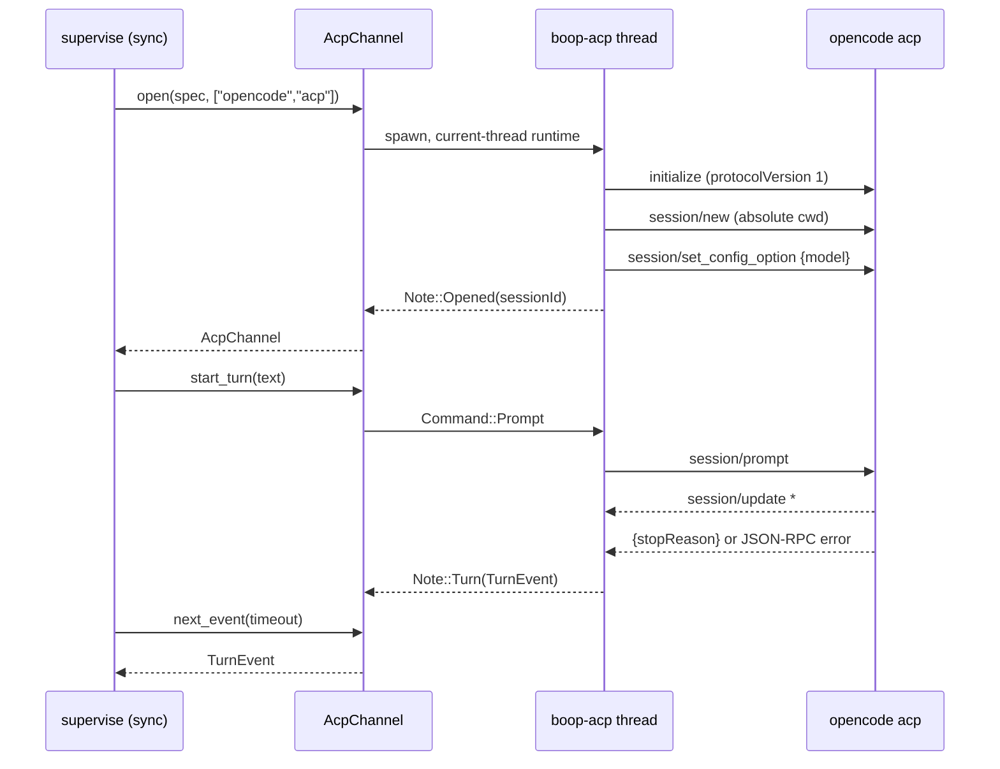

# boop-acp-official-crate REPORT

## Table of contents

1. [What landed](#1-what-landed)
2. [Files](#2-files)
3. [Library decision: the -tokio crate was dropped](#3-library-decision-the--tokio-crate-was-dropped)
4. [Gates](#4-gates)
5. [Commits](#5-commits)
6. [Blocked: the ACP channel is not yet reached by a real lane](#6-blocked-the-acp-channel-is-not-yet-reached-by-a-real-lane)
7. [Left undone](#7-left-undone)
8. [Follow-up: the harness is wired to ACP](#8-follow-up-the-harness-is-wired-to-acp)

## 1. What landed

`AcpChannel`, one lane conversation spoken over the Agent Client Protocol on the
official `agent-client-protocol` 2.0.0 crate. No JSON-RPC frame is written by
hand anywhere in it.



`LaneChannel` stays sync. The ACP connection is async and only reachable inside
`Builder::connect_with`, so it owns one thread with a current-thread tokio
runtime; the sync and async sides trade `Command`/`Note` values.

Turn verdict mapping (`channel/acp.rs` `turn_verdict`):

| prompt outcome | `TurnEvent` | retryable |
|---|---|---|
| `stopReason: end_turn` | `Done { detail: "end_turn" }` | no |
| `cancelled` / `refusal` / `max_tokens` / `max_turn_requests` | `Failed { detail: "stop_reason=<name>" }` | no |
| JSON-RPC error on `session/prompt` | `Flaked { detail: <peer message verbatim> }` | yes |

Other trait calls:

| call | behavior |
|---|---|
| `conversation_id` / `conversation_id_kind` | the ACP `sessionId` / `"acp_session"` |
| `steer` | `Delivery::NextTurn` (ACP has one `session/prompt` per turn) |
| `interrupt` | `session/cancel` notification |
| `last_activity_ms` | epoch millis of the newest `session/update`, `None` before the first |
| `close` | drops the connection, which SIGKILLs the child's process group |

`session/request_permission` auto-selects the first `allow_once`/`allow_always`
option; a reject-only request is answered `Cancelled`. `fs/*` and `terminal/*`
stay unimplemented: no client capability is advertised in `initialize`, and an
unhandled request already gets `method_not_found`
(`agent-client-protocol-2.0.0/src/jsonrpc/incoming_actor.rs:632`).

## 2. Files

| file | change |
|---|---|
| `crates/boop/src/channel/acp.rs` | new, 591 lines with tests |
| `crates/boop/src/channel.rs` | one line, `pub mod acp;` |
| `crates/boop/src/channel/opencode.rs` | `OpencodeChannel::open` is now `AcpChannel::open(spec, ["opencode","acp"])`; the per-turn `opencode run` child and its exit-code verdict are deleted |
| `crates/boop/Cargo.toml` | `agent-client-protocol = "2.0.0"`, `tokio = { version = "1", features = ["rt", "sync"] }` |
| `Cargo.lock` | resolved |
| `docs/failure-modes.md` | entry 11 |

`last_message_state`, `newest_session`, `newest_activity` and `wait_for` STAY in
`channel/opencode.rs`. The brief said to delete them only if nothing outside the
file references them. They are referenced:

```
crates/boop/src/channel/tui.rs:102   crate::channel::opencode::newest_session
crates/boop/src/channel/tui.rs:355   crate::channel::opencode::newest_session
crates/boop/src/channel/tui.rs:370   crate::channel::opencode::last_message_state
crates/boop/src/channel/tui.rs:430   crate::channel::opencode::newest_session
crates/boop/src/channel/tui.rs:432   crate::channel::opencode::newest_activity
crates/boop/src/channel/kimi.rs:96   crate::channel::opencode::wait_for
```

`channel/tui.rs` is a forbidden file for this lane, so they stayed.

## 3. Library decision: the -tokio crate was dropped

The brief named `agent-client-protocol-tokio` 0.11.1 for the stdio transport
helpers. It cannot be used with `agent-client-protocol` 2.0.0.

| receipt | path |
|---|---|
| the -tokio crate is pinned to the OLD major | `~/.cargo/registry/src/index.crates.io-1949cf8c6b5b557f/agent-client-protocol-tokio-0.11.1/Cargo.toml`, `[dependencies.agent-client-protocol] version = "0.11.1"` |
| its `AcpAgent`/`Stdio` implement 0.11.1's `ConnectTo`/`Role` | `agent-client-protocol-tokio-0.11.1/src/lib.rs:10`, `impl<Counterpart: Role> ConnectTo<Counterpart> for Stdio` |
| 2.0.0 ships both natively | `agent-client-protocol-2.0.0/src/acp_agent.rs` (`AcpAgent`, `AcpAgentConfig`, `LineDirection`), `src/stdio.rs` (`Stdio`), re-exported at `src/lib.rs:139,142` |
| 2.0.0's reactor is async-io, not tokio | `agent-client-protocol-2.0.0/Cargo.toml` dependencies: `async-io`, `async-process`, `blocking`; no tokio |

Handing a 0.11.1 `AcpAgent` to 2.0.0's `Client.builder().connect_with(...)` is a
trait-from-a-different-crate-version type error, not a version bump.

tokio stayed, exactly as the brief decided: a current-thread runtime owned by the
channel, features `rt` and `sync` only. It runs the connection future and gives
the async command receiver; the IO reactor under it is async-io's.

## 4. Gates

### `cargo test -p boop`

23 test targets, 461 tests, 0 failures, rc=0. Every target, paired with its
result line:

```
$ cargo test -p boop
     Running unittests src/lib.rs (target/debug/deps/boop-566be8b2a762d102)  ->  test result: ok. 338 passed; 0 failed; 1 ignored; 0 measured; 0 filtered out; finished in 10.60s
     Running unittests src/main.rs (target/debug/deps/boop-67d37c93ff41032b)  ->  test result: ok. 47 passed; 0 failed; 0 ignored; 0 measured; 0 filtered out; finished in 0.11s
     Running tests/0_sqlite_contention.rs (target/debug/deps/0_sqlite_contention-72d00ee2e56bb993)  ->  test result: ok. 1 passed; 0 failed; 0 ignored; 0 measured; 0 filtered out; finished in 0.44s
     Running tests/bench_grid.rs (target/debug/deps/bench_grid-e12ccea904ca6b2c)  ->  test result: ok. 2 passed; 0 failed; 0 ignored; 0 measured; 0 filtered out; finished in 0.27s
     Running tests/boop_start_warm.rs (target/debug/deps/boop_start_warm-9f20948693ec30c5)  ->  test result: ok. 5 passed; 0 failed; 0 ignored; 0 measured; 0 filtered out; finished in 0.60s
     Running tests/concatmap_e2e.rs (target/debug/deps/concatmap_e2e-b7f841f36d07dd83)  ->  test result: ok. 0 passed; 0 failed; 1 ignored; 0 measured; 0 filtered out; finished in 0.00s
     Running tests/coordinator_ping.rs (target/debug/deps/coordinator_ping-a552547f8d8205ee)  ->  test result: ok. 3 passed; 0 failed; 0 ignored; 0 measured; 0 filtered out; finished in 0.81s
     Running tests/host_chat.rs (target/debug/deps/host_chat-5a242c60a8d740a1)  ->  test result: ok. 3 passed; 0 failed; 0 ignored; 0 measured; 0 filtered out; finished in 0.03s
     Running tests/inbox_hooks.rs (target/debug/deps/inbox_hooks-9b96da2964c91baf)  ->  test result: ok. 8 passed; 0 failed; 0 ignored; 0 measured; 0 filtered out; finished in 1.18s
     Running tests/install_rail.rs (target/debug/deps/install_rail-3a498222dcf6b41a)  ->  test result: ok. 8 passed; 0 failed; 0 ignored; 0 measured; 0 filtered out; finished in 0.19s
     Running tests/lane_carcass.rs (target/debug/deps/lane_carcass-dd2c75a566d89c18)  ->  test result: ok. 3 passed; 0 failed; 0 ignored; 0 measured; 0 filtered out; finished in 6.46s
     Running tests/lane_completion_row.rs (target/debug/deps/lane_completion_row-85d976eb1c8288dc)  ->  test result: ok. 1 passed; 0 failed; 0 ignored; 0 measured; 0 filtered out; finished in 0.06s
     Running tests/lane_wait_exit.rs (target/debug/deps/lane_wait_exit-6de769a8eee48ba6)  ->  test result: ok. 7 passed; 0 failed; 0 ignored; 0 measured; 0 filtered out; finished in 4.28s
     Running tests/native_agent_liveness.rs (target/debug/deps/native_agent_liveness-5dd157626454fc18)  ->  test result: ok. 1 passed; 0 failed; 0 ignored; 0 measured; 0 filtered out; finished in 2.05s
     Running tests/parent_death.rs (target/debug/deps/parent_death-eda4801515ca4e09)  ->  test result: ok. 4 passed; 0 failed; 0 ignored; 0 measured; 0 filtered out; finished in 3.55s
     Running tests/parent_failure_hail.rs (target/debug/deps/parent_failure_hail-f06182f27f3254b2)  ->  test result: ok. 5 passed; 0 failed; 0 ignored; 0 measured; 0 filtered out; finished in 0.08s
     Running tests/registry_kinds.rs (target/debug/deps/registry_kinds-9be153c5a8ccdf24)  ->  test result: ok. 3 passed; 0 failed; 0 ignored; 0 measured; 0 filtered out; finished in 0.03s
     Running tests/session_mood.rs (target/debug/deps/session_mood-96a2d8ad51f4868d)  ->  test result: ok. 4 passed; 0 failed; 0 ignored; 0 measured; 0 filtered out; finished in 0.09s
     Running tests/tell.rs (target/debug/deps/tell-b243f104e02de773)  ->  test result: ok. 8 passed; 0 failed; 0 ignored; 0 measured; 0 filtered out; finished in 0.02s
     Running tests/temp_home_rail.rs (target/debug/deps/temp_home_rail-53b856d0628bb225)  ->  test result: ok. 2 passed; 0 failed; 0 ignored; 0 measured; 0 filtered out; finished in 0.07s
     Running tests/wait_mail.rs (target/debug/deps/wait_mail-ac1e51fb4eed5f97)  ->  test result: ok. 7 passed; 0 failed; 0 ignored; 0 measured; 0 filtered out; finished in 2.03s
     Running tests/wal_three_writers.rs (target/debug/deps/wal_three_writers-5089b3719d86191a)  ->  test result: ok. 1 passed; 0 failed; 0 ignored; 0 measured; 0 filtered out; finished in 0.07s
   Doc-tests boop  ->  test result: ok. 0 passed; 0 failed; 0 ignored; 0 measured; 0 filtered out; finished in 0.00s
```

`error connecting to /private/tmp/tmux-501/boop-test-<pid>-*` lines appear on
stderr during the tui tests. Pre-existing: those tests kill tmux sessions that
were never started. Every target still reports `ok`.

### `cargo clippy -p boop -- -D warnings`

```
$ cargo clippy -p boop -- -D warnings
   Compiling boop v0.0.2 (/Users/chrishafley/projects/hafley-rs/.boop-worktrees/fix/boop-acp-official-crate/crates/boop)
    Finished `dev` profile [unoptimized + debuginfo] target(s) in 2.39s
rc=0
```

`cargo clippy -p boop --all-targets -- -D warnings` is RED on one PRE-EXISTING
finding this lane did not introduce and does not own:

```
error: this expression creates a reference which is immediately dereferenced by the compiler
  --> crates/boop/tests/host_chat.rs:44:24
   |
44 |             next_turn: &self.next_turn,
   |                        ^^^^^^^^^^^^^^^ help: change this to: `self.next_turn`
   = note: `-D clippy::needless-borrow` implied by `-D warnings`
```

`crates/boop/tests/host_chat.rs` is untouched by this branch (`git diff --stat`
lists no `tests/` file). The brief's gate is the non-`--all-targets` form, which
is green.

### fail-first: the flake mapping

Test `channel::acp::tests::a_prompt_error_frame_is_a_retryable_flake` feeds the
`error` member of a canned `session/prompt` error frame
(`{"jsonrpc":"2.0","id":3,"error":{"code":-32603,"message":"AI_APICallError:
Upstream request failed: Endpoint is unavailable."}}`).

RED, with `turn_verdict` sabotaged to `Err(error) => TurnEvent::failed(...)`:

```
running 6 tests
test channel::acp::tests::end_turn_is_the_only_clean_verdict ... ok
test channel::acp::tests::every_other_stop_reason_is_a_terminal_failure ... ok
test channel::acp::tests::an_empty_command_is_refused_before_a_thread_is_spawned ... ok
test channel::acp::tests::a_reject_only_permission_request_selects_nothing ... ok
test channel::acp::tests::the_first_allow_option_wins_over_a_leading_reject ... ok
test channel::acp::tests::a_prompt_error_frame_is_a_retryable_flake ... FAILED

failures:

---- channel::acp::tests::a_prompt_error_frame_is_a_retryable_flake stdout ----

thread 'channel::acp::tests::a_prompt_error_frame_is_a_retryable_flake' (56986811) panicked at crates/boop/src/channel/acp.rs:459:9:
Failed { detail: "AI_APICallError: Upstream request failed: Endpoint is unavailable." }
note: run with `RUST_BACKTRACE=1` environment variable to display a backtrace


failures:
    channel::acp::tests::a_prompt_error_frame_is_a_retryable_flake

test result: FAILED. 5 passed; 1 failed; 0 ignored; 0 measured; 332 filtered out; finished in 0.00s
```

GREEN, with `Err(error) => TurnEvent::flaked(error.message)`:

```
running 6 tests
test channel::acp::tests::end_turn_is_the_only_clean_verdict ... ok
test channel::acp::tests::every_other_stop_reason_is_a_terminal_failure ... ok
test channel::acp::tests::an_empty_command_is_refused_before_a_thread_is_spawned ... ok
test channel::acp::tests::the_first_allow_option_wins_over_a_leading_reject ... ok
test channel::acp::tests::a_reject_only_permission_request_selects_nothing ... ok
test channel::acp::tests::a_prompt_error_frame_is_a_retryable_flake ... ok

test result: ok. 6 passed; 0 failed; 0 ignored; 0 measured; 332 filtered out; finished in 0.00s
```

### live: a real turn through the new channel against `opencode acp`

`channel::acp::tests::a_real_opencode_acp_turn_ends_the_turn`, `#[ignore]`d,
model `openrouter/deepseek/deepseek-v4-flash-0731`, prompt `reply with the
single word pong`, 30s deadline asserted in the test.

```
$ cargo test -p boop --lib channel::acp -- --ignored --nocapture
    Finished `test` profile [unoptimized + debuginfo] target(s) in 0.12s
     Running unittests src/lib.rs (target/debug/deps/boop-566be8b2a762d102)

running 1 test
session Some("ses_fe53dfca0ffeIgAx3eUyhnGhlv") in 3.433545042s
verdict Done { detail: "end_turn" } in 3.272013834s
last_activity_ms Some(1787155320892)
test channel::acp::tests::a_real_opencode_acp_turn_ends_the_turn ... ok

test result: ok. 1 passed; 0 failed; 0 ignored; 0 measured; 338 filtered out; finished in 6.71s
```

First run of the same test, before the report was written:

```
running 1 test
session Some("ses_fe5412329ffejYqw7oakv3oeJK") in 3.404493083s
verdict Done { detail: "end_turn" } in 4.162987s
last_activity_ms Some(1787155115309)
test channel::acp::tests::a_real_opencode_acp_turn_ends_the_turn ... ok

test result: ok. 1 passed; 0 failed; 0 ignored; 0 measured; 338 filtered out; finished in 7.57s
```

Handshake 3.4s, `end_turn` 3.3s and 4.2s, both well inside 30s.

### `boop beep lane create --dry-run` unchanged

```
$ ./target/debug/boop beep lane create --branch fix/dry-run-probe \
    --brief /tmp/dryrun-brief.md --goal "probe" --preset flash4 \
    --base-sha 446f0ae --dry-run
2026-08-19T15:59:00.434014Z  INFO boop: lane create resolved lane="fix-dry-run-probe" tmux_target="fix-dry-run-probe" harness="opencode" cwd=/Users/chrishafley/projects/hafley-rs boop_build="0.0.2 (446f0ae-dirty)"
2026-08-19T15:59:00.442454Z  INFO boop: lane create dry run lane="fix-dry-run-probe" harness="opencode"
cmd: LC_ALL='en_US.UTF-8' LANG='en_US.UTF-8' BOOP_SESSION='fix-dry-run-probe' BOOP_LANE='fix-dry-run-probe' BOOP_HARNESS='opencode' BOOP_PARENT='codex-1205' boop beep lane run --lane 'fix-dry-run-probe' --harness 'opencode' --brief '/tmp/dryrun-brief.md' --mail-dir '/Users/chrishafley/.agent/mail' --model 'openrouter/deepseek/deepseek-v4-flash-0731'; __rc=$?; boop beep lane delete 'fix-dry-run-probe' --route-only --mail-dir '/Users/chrishafley/.agent/mail'; exit $__rc
to: fix-dry-run-probe
cwd: /Users/chrishafley/projects/hafley-rs
harness: opencode
branch: fix/dry-run-probe (kind fix)
worktree: /Users/chrishafley/projects/hafley-rs/.boop-worktrees/fix/dry-run-probe
boop-start: no recipe in /Users/chrishafley/projects/hafley-rs, nothing to warm
base-sha: 446f0ae (from --base-sha)
tmux: fix-dry-run-probe
parent: codex-1205 (from caller; completion hail appended on exit)
goal: probe
```

Nothing on the spawn path changed: `git diff --stat 446f0ae..HEAD` names no
`main.rs`, no `worktree.rs`, no `bus.rs`.

### no `eprintln!` in `src/**`

Zero in the files this branch adds or changes. The five in `crates/boop/src/main.rs`
are pre-existing and in a forbidden file:

```
$ grep -rn "eprintln!" crates/boop/src/
crates/boop/src/main.rs:1237:                    eprintln!("resume offset: {}", chunk.next_offset);
crates/boop/src/main.rs:1545:        eprintln!("note: transcript shorter than stored offset; restarted from byte 0");
crates/boop/src/main.rs:1548:        eprintln!("note: skipped {skipped} line(s) that failed to parse as JSON");
crates/boop/src/main.rs:2394:        eprintln!("[boop] lane purpose not recorded: {error}");
crates/boop/src/main.rs:2600:            eprintln!("{timed_out}"); // @eprintln-ok: the re-run line must survive a redirected stdout

$ grep -n "eprintln!" crates/boop/src/channel/acp.rs crates/boop/src/channel/opencode.rs crates/boop/src/channel.rs
(no output)
```

## 5. Commits

| sha | subject |
|---|---|
| `756f1d1` | deps: agent-client-protocol 2.0.0 + a current-thread tokio runtime for boop |
| `806c987` | feat(channel): AcpChannel, the ACP lane conversation on the official crate |
| `300e143` | refactor(channel): opencode speaks ACP; the opencode-run turn is deleted |
| `0c4bf9a` | docs: failure mode 11, an opencode ACP session on a dead model endpoint |

Base: `446f0ae` (`git merge --ff-only 446f0ae` reported `Already up to date.`).

## 6. Blocked: the ACP channel is not yet reached by a real lane

**SUPERSEDED by section 8.** Ownership of `crates/boop/src/harness/opencode.rs`
was extended to this lane after the first pass and the wiring landed. The
section is kept as written for the record.

`OpencodeChannel::open` now returns an `AcpChannel`, but nothing calls it. The
opencode harness builds a `TuiChannel` instead:

```
crates/boop/src/harness/opencode.rs:26
        Ok(Box::new(crate::channel::tui::TuiChannel::open(
            profile, spec, None,
        )?))
```

`crates/boop/src/harness/*` is a forbidden file for this lane, so the wiring was
NOT changed. A `boop beep lane create --harness opencode` today still opens a
tmux TUI channel, exactly as before this branch.

The change that would flip it is one expression at `harness/opencode.rs:21-29`:

```rust
    fn open_channel(
        &self,
        spec: &crate::channel::ChannelSpec,
    ) -> anyhow::Result<Box<dyn crate::channel::LaneChannel>> {
        Ok(Box::new(crate::channel::opencode::OpencodeChannel::open(
            spec,
        )?))
    }
```

That call is not free of consequence and wants a decision, not a lane's
judgment: `TuiChannel` accepts mid-turn steering (`Delivery::MidTurn`) and the
ACP channel cannot, and `channel/tui.rs` would then be the only remaining caller
of the opencode store readers.

## 7. Left undone

| item | why |
|---|---|
| ~~wiring `harness/opencode.rs` to `OpencodeChannel::open`~~ | DONE, section 8 |
| a real `boop beep lane create` on this branch's build | `harness.rs:143` spawns a bare `boop` from PATH, and `~/.cargo/bin/boop` is `18e8148`; installing over it is outside this lane's grant, section 8 |
| the supervisor's five flake resumes fire with no backoff | observed in section 8, lives in `supervise.rs`, not this lane's file |
| deleting `last_message_state` / `newest_session` / `newest_activity` | still called from `channel/tui.rs`, a forbidden file; the brief said to leave and report |
| the `needless_borrow` clippy finding in `crates/boop/tests/host_chat.rs:44` | pre-existing, not on this branch's diff |
| `spec.resume` over ACP is implemented but not live-tested | `session/load` when the agent advertises `agentCapabilities.loadSession`, otherwise a warn and a fresh `session/new`. opencode 1.18.18 does advertise it (probed: `initialize` returns `"loadSession": true`, `sessionCapabilities` `{close, fork, list, resume}`), so the resume path is reachable; only the fresh-session path was exercised live |

## 8. Follow-up: the harness is wired to ACP

Ownership of `crates/boop/src/harness/opencode.rs` was extended to this lane,
with the loss of `Delivery::MidTurn` steering accepted (`steer` returns
`NextTurn` and the supervisor re-offers the text after `join`).

```diff
 impl Harness for Opencode {
     fn open_channel(
         &self,
         spec: &crate::channel::ChannelSpec,
     ) -> anyhow::Result<Box<dyn crate::channel::LaneChannel>> {
-        let profile = crate::channel::tui::opencode_profile(spec);
-        Ok(Box::new(crate::channel::tui::TuiChannel::open(
-            profile, spec, None,
-        )?))
+        Ok(Box::new(crate::channel::opencode::OpencodeChannel::open(
+            spec,
+        )?))
     }
```

`crate::channel::tui::opencode_profile` was referenced by full path rather than
a `use`, so the deleted line was the whole import. `grep -n "tui"
crates/boop/src/harness/opencode.rs` now returns nothing. `channel/tui.rs` is
untouched; `opencode_profile` stays live there through its own tests
(`tui.rs:582,591,596,622,656`).

### `cargo test -p boop` after the flip

23 targets, 461 tests, 0 failures.

```
$ cargo test -p boop
Running unittests src/lib.rs (target/debug/deps/boop-566be8b2a762d102)  ->  test result: ok. 338 passed; 0 failed; 1 ignored; 0 measured; 0 filtered out; finished in 20.46s
Running unittests src/main.rs (target/debug/deps/boop-67d37c93ff41032b)  ->  test result: ok. 47 passed; 0 failed; 0 ignored; 0 measured; 0 filtered out; finished in 0.10s
Running tests/0_sqlite_contention.rs  ->  test result: ok. 1 passed; 0 failed; 0 ignored; 0 measured; 0 filtered out; finished in 0.54s
Running tests/bench_grid.rs  ->  test result: ok. 2 passed; 0 failed; 0 ignored; 0 measured; 0 filtered out; finished in 0.25s
Running tests/boop_start_warm.rs  ->  test result: ok. 5 passed; 0 failed; 0 ignored; 0 measured; 0 filtered out; finished in 0.58s
Running tests/concatmap_e2e.rs  ->  test result: ok. 0 passed; 0 failed; 1 ignored; 0 measured; 0 filtered out; finished in 0.00s
Running tests/coordinator_ping.rs  ->  test result: ok. 3 passed; 0 failed; 0 ignored; 0 measured; 0 filtered out; finished in 0.79s
Running tests/host_chat.rs  ->  test result: ok. 3 passed; 0 failed; 0 ignored; 0 measured; 0 filtered out; finished in 0.01s
Running tests/inbox_hooks.rs  ->  test result: ok. 8 passed; 0 failed; 0 ignored; 0 measured; 0 filtered out; finished in 1.13s
Running tests/install_rail.rs  ->  test result: ok. 8 passed; 0 failed; 0 ignored; 0 measured; 0 filtered out; finished in 0.19s
Running tests/lane_carcass.rs  ->  test result: ok. 3 passed; 0 failed; 0 ignored; 0 measured; 0 filtered out; finished in 6.41s
Running tests/lane_completion_row.rs  ->  test result: ok. 1 passed; 0 failed; 0 ignored; 0 measured; 0 filtered out; finished in 0.04s
Running tests/lane_wait_exit.rs  ->  test result: ok. 7 passed; 0 failed; 0 ignored; 0 measured; 0 filtered out; finished in 4.23s
Running tests/native_agent_liveness.rs  ->  test result: ok. 1 passed; 0 failed; 0 ignored; 0 measured; 0 filtered out; finished in 2.05s
Running tests/parent_death.rs  ->  test result: ok. 4 passed; 0 failed; 0 ignored; 0 measured; 0 filtered out; finished in 3.90s
Running tests/parent_failure_hail.rs  ->  test result: ok. 5 passed; 0 failed; 0 ignored; 0 measured; 0 filtered out; finished in 0.07s
Running tests/registry_kinds.rs  ->  test result: ok. 3 passed; 0 failed; 0 ignored; 0 measured; 0 filtered out; finished in 0.03s
Running tests/session_mood.rs  ->  test result: ok. 4 passed; 0 failed; 0 ignored; 0 measured; 0 filtered out; finished in 0.03s
Running tests/tell.rs  ->  test result: ok. 8 passed; 0 failed; 0 ignored; 0 measured; 0 filtered out; finished in 0.01s
Running tests/temp_home_rail.rs  ->  test result: ok. 2 passed; 0 failed; 0 ignored; 0 measured; 0 filtered out; finished in 0.04s
Running tests/wait_mail.rs  ->  test result: ok. 7 passed; 0 failed; 0 ignored; 0 measured; 0 filtered out; finished in 2.03s
Running tests/wal_three_writers.rs  ->  test result: ok. 1 passed; 0 failed; 0 ignored; 0 measured; 0 filtered out; finished in 0.04s
Doc-tests boop  ->  test result: ok. 0 passed; 0 failed; 0 ignored; 0 measured; 0 filtered out; finished in 0.00s
```

### `cargo clippy -p boop -- -D warnings` after the flip

```
$ cargo clippy -p boop -- -D warnings
   Compiling boop v0.0.2 (/Users/chrishafley/projects/hafley-rs/.boop-worktrees/fix/boop-acp-official-crate/crates/boop)
    Finished `dev` profile [unoptimized + debuginfo] target(s) in 0.10s
rc=0
```

### `boop beep lane create --dry-run`, opencode preset

```
$ ./target/debug/boop beep lane create --branch fix/acp-pong-probe \
    --brief /tmp/acp-pong-brief.md --goal "acp pong" --preset flash4 \
    --base-sha 446f0ae --dry-run
2026-08-19T16:11:06.355824Z  INFO boop: lane create resolved lane="fix-acp-pong-probe" tmux_target="fix-acp-pong-probe" harness="opencode" cwd=/Users/chrishafley/projects/hafley-rs boop_build="0.0.2 (56efb87-dirty)"
2026-08-19T16:11:06.364559Z  INFO boop: lane create dry run lane="fix-acp-pong-probe" harness="opencode"
cmd: LC_ALL='en_US.UTF-8' LANG='en_US.UTF-8' BOOP_SESSION='fix-acp-pong-probe' BOOP_LANE='fix-acp-pong-probe' BOOP_HARNESS='opencode' BOOP_PARENT='codex-1205' boop beep lane run --lane 'fix-acp-pong-probe' --harness 'opencode' --brief '/tmp/acp-pong-brief.md' --mail-dir '/Users/chrishafley/.agent/mail' --model 'openrouter/deepseek/deepseek-v4-flash-0731'; __rc=$?; boop beep lane delete 'fix-acp-pong-probe' --route-only --mail-dir '/Users/chrishafley/.agent/mail'; exit $__rc
to: fix-acp-pong-probe
cwd: /Users/chrishafley/projects/hafley-rs
harness: opencode
branch: fix/acp-pong-probe (kind fix)
worktree: /Users/chrishafley/projects/hafley-rs/.boop-worktrees/fix/acp-pong-probe
boop-start: no recipe in /Users/chrishafley/projects/hafley-rs, nothing to warm
base-sha: 446f0ae (from --base-sha)
tmux: fix-acp-pong-probe
parent: codex-1205 (from caller; completion hail appended on exit)
goal: acp pong
```

### The real lane: `boop beep lane run`, not `lane create`

A full `boop beep lane create` CANNOT exercise this branch's build, and the
dry-run above is the receipt for why. The `cmd:` line spawns a bare `boop`,
resolved from PATH:

```
crates/boop/src/harness.rs:143
        "boop beep lane run --lane {} --harness {} --brief {} --mail-dir {}",
```

```
$ which boop && boop --version
/Users/chrishafley/.cargo/bin/boop
boop 0.0.2 (18e8148)
```

`18e8148` is not this branch, so a `lane create` would spawn a lane on the
installed build and prove nothing about ACP. Two ways out were rejected:

| option | why not |
|---|---|
| `cargo install --path crates/boop` over `~/.cargo/bin/boop` | a machine-wide mutation outside this lane's grant, and failure mode 3 is exactly this hazard |
| prepend `target/debug` to PATH | a tmux server is already running with live coordinator panes (`boop-debug-adopt`, `sprefa`, `sprefa-5`, ...); a new session inherits the SERVER's environment, and PATH is not in tmux's default `update-environment` |

What ran instead is the exact command the lane pane runs, with this branch's
binary, so the supervisor, the harness dispatch, the ACP channel and the lane
trail are all the real ones. Only the worktree creation and the tmux pane are
absent.

```
$ cd /tmp/acp-lane-work2
$ BOOP_DB=/tmp/acp-lane-home/.agent/boop.db RUST_LOG=info \
    <worktree>/target/debug/boop beep lane run --lane acp-pong2 \
    --harness opencode --brief /tmp/acp-pong-brief.md \
    --mail-dir /tmp/acp-lane-home/.agent/mail \
    --model openrouter/deepseek/deepseek-v4-flash-0731

2026-08-19T16:13:34.566179Z  INFO boop: lane supervisor starting lane="acp-pong2" harness="opencode" model="openrouter/deepseek/deepseek-v4-flash-0731" cwd=/private/tmp/acp-lane-work2 resume="" variant=""
2026-08-19T16:13:34.566455Z  INFO boop::channel::acp: acp channel opening command=opencode acp cwd=/private/tmp/acp-lane-work2 model="openrouter/deepseek/deepseek-v4-flash-0731"
2026-08-19T16:13:35.213916Z  INFO connection{name="boop"}: boop::channel::acp: acp agent initialized agent=Some(Implementation { name: "OpenCode", title: None, version: "1.18.18", meta: None }) protocol_version=ProtocolVersion(1) load_session=true
2026-08-19T16:13:35.811507Z  INFO connection{name="boop"}: boop::channel::acp: acp session model set model="openrouter/deepseek/deepseek-v4-flash-0731"
2026-08-19T16:13:35.811597Z  INFO boop::channel::acp: acp session opened conversation_id="ses_fe5335556ffeP4zRX7NaSHU4RS" conversation_id_kind="acp_session"
2026-08-19T16:13:35.816450Z  INFO lane.supervise{lane="acp-pong2" ...}: boop::supervise: lane brief loaded brief=/tmp/acp-pong-brief.md
2026-08-19T16:13:35.817273Z  INFO lane.supervise{lane="acp-pong2" ...}: boop::supervise: lane turn starting turn_bytes=42
2026-08-19T16:13:35.817462Z  INFO lane.supervise{lane="acp-pong2" ...}: boop::channel::acp: acp prompt turn starting conversation_id="ses_fe5335556ffeP4zRX7NaSHU4RS" text_bytes=42
2026-08-19T16:13:35.817476Z  INFO lane.supervise{lane="acp-pong2" ...}: boop::supervise: lane conversation resolved lane="acp-pong2" conversation_id="ses_fe5335556ffeP4zRX7NaSHU4RS" conversation_id_kind="acp_session"
[boop] turn ended: end_turn
2026-08-19T16:13:43.203308Z  INFO lane.supervise{lane="acp-pong2" ...}: boop::supervise: lane turn ended turn_end_reason="end_turn" turn_ok=true retryable=false
2026-08-19T16:13:43.204829Z  INFO lane.supervise{lane="acp-pong2" ...}: boop::supervise: lane supervision complete exit_code=0
2026-08-19T16:13:43.206532Z  INFO boop: lane supervisor finished lane="acp-pong2" harness="opencode" exit_code=0
[boop] lane acp-pong2 finished rc=0
```

Brief: `reply with the single word pong then exit`. Handshake 1.25s, turn 7.4s,
`exit_code=0`.

### The lane trail

```
$ ls -la ~/.agent/lanes/acp-pong2/
-rw-r--r--  1 chrishafley staff 4186 Aug 19 12:13 supervise.log

$ grep -E "acp |turn ended|supervision complete" ~/.agent/lanes/acp-pong2/supervise.log
2026-08-19T16:13:34.566455Z INFO boop::channel::acp: acp channel opening command=opencode acp cwd=/private/tmp/acp-lane-work2 model="openrouter/deepseek/deepseek-v4-flash-0731"
2026-08-19T16:13:35.213916Z INFO connection{name="boop"}: boop::channel::acp: acp agent initialized agent=Some(Implementation { name: "OpenCode", title: None, version: "1.18.18", meta: None }) protocol_version=ProtocolVersion(1) load_session=true
2026-08-19T16:13:35.811507Z INFO connection{name="boop"}: boop::channel::acp: acp session model set model="openrouter/deepseek/deepseek-v4-flash-0731"
2026-08-19T16:13:35.811597Z INFO boop::channel::acp: acp session opened conversation_id="ses_fe5335556ffeP4zRX7NaSHU4RS" conversation_id_kind="acp_session"
2026-08-19T16:13:35.817462Z INFO lane.supervise{lane="acp-pong2" ...}: boop::channel::acp: acp prompt turn starting conversation_id="ses_fe5335556ffeP4zRX7NaSHU4RS" text_bytes=42
2026-08-19T16:13:43.203308Z INFO lane.supervise{lane="acp-pong2" ...}: boop::supervise: lane turn ended turn_end_reason="end_turn" turn_ok=true retryable=false
2026-08-19T16:13:43.204829Z INFO lane.supervise{lane="acp-pong2" ...}: boop::supervise: lane supervision complete exit_code=0
```

`end_turn` via ACP, in the lane's own trail. Confirmed.

### Two things the live runs surfaced

**1. The `Flaked` mapping drives the supervisor's retry path, verified against a
real error.** A first attempt ran under a temp `HOME`, where opencode had no
credentials and answered every `session/prompt` with a JSON-RPC error. The
supervisor consumed the mapping exactly as designed:

```
[boop] turn ended: Internal error: User not found.
INFO boop::supervise: lane turn ended turn_end_reason="Internal error: User not found." turn_ok=false retryable=true
[boop] provider flake, resuming (3/5)
WARN boop::supervise: lane provider flake; resuming flake_resumes=3 flake_resume_cap=5
```

The peer's message reached the trail verbatim, `retryable=true`, and the
supervisor resumed to its cap. Worth a separate look, NOT this lane's file: the
five resumes fired inside 0.22s wall clock with no backoff between them
(16:12:31.567 to 16:12:31.785).

**2. A stale conversation route makes `session/load` the first call, and a
session id the agent has never seen fails the whole handshake.** Re-running a
lane name whose route still pointed at a session created under a different
opencode data dir produced:

```
DEBUG boop::channel::acp: acp wire direction=Stdin line="{...,\"method\":\"session/load\",\"params\":{\"mcpServers\":[],\"cwd\":\"/private/tmp/acp-lane-work2\",\"sessionId\":\"ses_fe5345496ffeLwgXcGnKlytEH1\"}}"
DEBUG boop::channel::acp: acp wire direction=Stdout line="{...,\"error\":{\"code\":-32603,\"message\":\"Internal error: OpenCode service failure\",\"data\":{\"service\":\"session\"}}}"
ERROR boop: lane channel open failed lane="acp-pong" harness="opencode" error=acp handshake failed: Internal error: OpenCode service failure
```

The resume path is correct on the wire (opencode advertises `loadSession: true`
and the request is well formed). The open is fail-closed: an unusable resume id
kills the channel instead of falling back to `session/new`. That is a deliberate
fork worth a decision rather than a silent fallback, so it was left as is.
