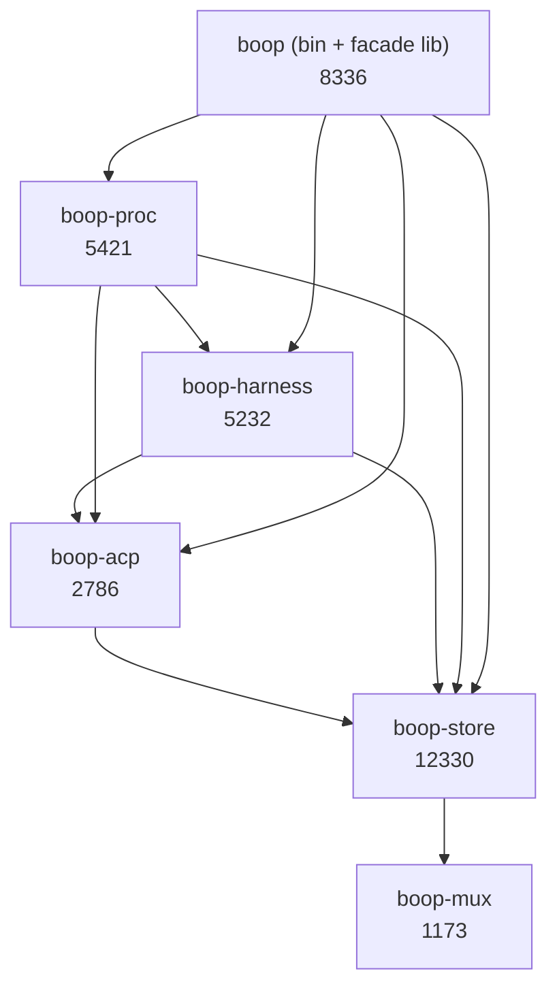

# boop-crate-split REPORT

`crates/boop` was 33363 lines in one crate. It is now five crates, 34105 lines
of `src/` in all, in a strict dependency order with no cycle. `cargo test
--workspace` passes the same 607 as base `f3d5123`, and all 84 `--help` screens
are byte-identical. No crate reaches another crate's tables by SQL string.

## Contents

1. [The five crates](#the-five-crates)
2. [Dependency order, and why it is not the brief's](#dependency-order-and-why-it-is-not-the-briefs)
3. [Seams that moved](#seams-that-moved)
4. [Gates](#gates)
5. [Deviations from the brief](#deviations-from-the-brief)
6. [The crate seam, closed](#the-crate-seam-closed)
7. [Commits](#commits)

## The five crates



| crate | src lines | owns |
|---|---|---|
| `boop-store` | 12330 | `ident.rs`, `rows.rs`, `session.rs`, `query.rs`, `usage.rs`, `activity.rs`, `summary.rs`, `_0_session_graph.rs`, `runtime.rs`, `tail.rs`, `proc.rs`, `bus.rs`, `trail.rs`, `tmux.rs`, `event.rs`, `testing.rs`, `sql/**`, `tests/wal_three_writers.rs` |
| `boop-acp` | 2786 | `channel.rs`, `channel/{acp,jsonrpc,claude,codex,kimi,opencode,tui}.rs` |
| `boop-harness` | 5232 | `harness.rs`, `harness/{claude,codex,kimi,opencode}.rs`, `identity.rs`, `registry.rs`, `worktree.rs`, `tests/fixtures/**`, `tests/bench_grid.rs` |
| `boop-proc` | 5421 | `lane.rs`, `supervise.rs`, `inbox.rs`, `mailwait.rs`, `config.rs`, `host.rs`, `concatmap.rs`, `tests/{parent_death,parent_failure_hail}.rs` |
| `boop` | 8336 | `main.rs`, `cli/{mod,job,db,me,mail,debug}.rs`, `debug.rs`, `chat.rs`, `lib.rs` (facade), the remaining 16 `tests/*.rs` |

`crates/boop/src/lib.rs` is 64 lines: a facade that re-exports every moved
module at its old path (`boop::ident`, `boop::lane`, `boop::channel`, ...), so
no library caller, example, or test spelling changed.

## Dependency order, and why it is not the brief's

The brief asked for store -> harness -> acp -> proc -> cli. Measured against
the code, that order is a cycle. `crates/boop/src` at `f3d5123` had one
8-module strongly connected component:

```
channel, harness, ident, identity, lane, registry, supervise, worktree
```

`Harness::open_channel` returns `Box<dyn crate::channel::LaneChannel>` and each
of the four adapters constructs its own concrete channel
(`harness/claude.rs:49`, `harness/codex.rs:45`, `harness/kimi.rs:42`,
`harness/opencode.rs:25`), so the channel is BELOW the adapters. Landed order:

```
boop-store -> boop-acp -> boop-harness -> boop-proc -> boop (cli)
```

## Seams that moved

Each is a move of existing code, re-exported at its old path, so the SCC breaks
without a redesign.

| seam | from | to | why |
|---|---|---|---|
| `SessionRef`, `KnownSession(s)`, `Ingested`, `ReadChunk`, `Capabilities`, `SendOutcome`, `SpawnSpec`, `OneShotSpec` | `harness.rs` | `boop_store::session` | `ident.rs:17` imported them; the store cannot depend on the crate above it |
| `parse_iso_ms` | `harness/claude.rs` | `boop_store::session` | called from `ident.rs`, `chat.rs`, `debug.rs`, `harness/codex.rs` |
| `sync_session`, `sync_session_with_pid` | `ident.rs` | `harness.rs` | they take `&dyn Harness`; the cursor half stayed in the store as `ident::sync_session_with`, which takes the projection as a closure |
| `ModelSpec`, `Effort` | `lane.rs` | `boop_store::session` | `channel/codex.rs:12` parses a model spelling |
| `ParentDeathPolicy` + its `FromStr` | `supervise.rs` | `boop_store::session` | its `clap::ValueEnum` derive was the one clap edge in `boop-proc`; in the store it sits behind an optional `clap` feature the binary turns on |
| `opencode::store_path`, `opencode_db_path` | `harness/opencode.rs` | `channel/opencode.rs` | both the adapter and the channel read the opencode store; the channel is lower |
| `SETUP_SENTENCE`, `start_status_path`, `record_start_status`, `start_preamble`, `brief_with_preamble` | `lane.rs` | `worktree.rs` | `prepare_spawn_dir` records the warm-up status and every adapter's `spawn` calls it |
| `assert_fixture_sessions_project` | `_0_session_graph.rs` | `harness.rs` | a `#[cfg(test)]` helper the four adapter fixture tests call |
| `summary.rs` (whole module) | `crates/boop` | `boop-store` | it ran three raw queries against the store's own tables; in-crate they are not a seam violation |
| `USAGE_TOTALS_SQL` + `Store::usage_totals`, `Store::context_tokens`, `testing::usage_totals_at` | `cli/db.rs`, `concatmap.rs`, `harness/{codex,kimi}.rs` | `boop_store::{usage, testing}` | the last four SQL reaches across a crate seam; see [The crate seam, closed](#the-crate-seam-closed) |
| `test_support.rs` | `crates/boop` | `boop-store/src/testing.rs`, `testing` feature | as the card asks |

## Gates

### 1. `cargo test --workspace`

```
base   f3d5123: 607 passed, 0 failed, 2 ignored
branch 5514685: 607 passed, 0 failed, 2 ignored
```

The brief named 4 known-red tests
(`codex_spawn_returns_handle_and_stop_tears_down` plus 3 worktree tests). None
of them failed on this machine, on base or on the branch; the base run is fully
green and so is the branch.

One unrelated flake fired once mid-branch and passed on rerun:
`soopy` `tests/6_git_optional.rs`
`plain_directory_watcher_reports_add_change_and_remove`, a filesystem-watcher
timing test in a crate this lane never touched.

### 2. `--help`, byte-identical

The base binary was built in a detached worktree at `f3d5123`. A recursive
sweep walks every `Commands:` block and prints each screen, 84 in all.

```
$ ./help_sweep.sh <base>/target/debug/boop  > help-before.txt
$ ./help_sweep.sh <branch>/target/debug/boop > help-after.txt
$ diff help-before.txt help-after.txt
$ echo $?
0
$ wc -l help-before.txt help-after.txt
    1385 help-before.txt
    1385 help-after.txt
$ grep -c '^=== boop' help-after.txt
84
```

Neither file is committed.

### 3. clippy

```
$ cargo clippy --workspace -- -D warnings
rc=0
```

`cargo clippy --workspace --all-targets -- -D warnings` is rc=101 on BOTH base
and branch, on the same one line this lane did not touch:

```
crates/boop/tests/host_chat.rs:44:24: warning: this expression creates a
reference which is immediately dereferenced by the compiler
```

That is the pre-existing red named in `TASKS/boop-main-split.REPORT.md`.

Two clippy findings this lane DID introduce were fixed rather than excluded:
`clippy::new_without_default` on `TempRepo::new` (it went from `pub(crate)` to
`pub` with the `testing` feature; now carries an `allow` with its reason), and
an unused `test_support` re-export in `crates/boop/src/lib.rs` (deleted).

### 4. cargo-semver-checks

Not run locally: `cargo semver-checks` is not installed on this machine
(`error: no such command: 'semver-checks'`).

`.github/workflows/ci.yml:34` pins an explicit package list, so it needed the
edit:

```diff
-          package: boop, boop-mux
+          package: boop, boop-mux, boop-store, boop-acp, boop-harness, boop-proc
```

Caveat for this PR only: the four new packages do not exist at
`baseline-rev`, so the semver job has no baseline to compare them against on
this PR. Every later PR has one.

### 5. `tests/temp_home_rail.rs` still covers every subprocess site

`src_modules()` and the `tests/` scan both walked `CARGO_MANIFEST_DIR` alone,
which after the split saw one crate of five. Both now iterate every `boop*`
crate directory that has the subdirectory, through a new `boop_crate_dirs`
helper, so a future crate is covered with no edit. Waiver spellings are
unchanged (paths are still relative to each crate's `src/`).

```
$ cargo test -p boop --test temp_home_rail
test result: ok. 2 passed; 0 failed
```

### 6. After the crate-seam fix, re-measured

```
cargo test --workspace:                        607 passed, 0 failed, 2 ignored
cargo clippy --workspace -- -D warnings:       rc=0
cargo clippy --workspace --all-targets:        1 warning, crates/boop/tests/host_chat.rs:44, the same pre-existing one
diff help-before.txt help-after.txt:           empty, 1385 lines, 84 screens
diff show-sql-base.txt show-sql-after.txt:     empty
issuectl ready boop-crate-split:               ready: true, 5 of 5
```

One clippy finding the seam fix introduced was fixed, not excluded: an
`empty_line_after_doc_comment` at `crates/boop-store/src/usage.rs:141`.

### 7. eprintln

No `eprintln!` was added or moved. The five in `cli/db.rs` and `cli/job.rs` are
the same five the main-split report recorded.

## Deviations from the brief

| brief said | landed | why |
|---|---|---|
| order store -> harness -> acp -> proc | store -> acp -> harness -> proc | `Harness::open_channel` returns a channel; the adapters construct them |
| `boop-store` = ident, rows, query, usage, activity, `_0_session_graph`, sql | plus `runtime.rs`, `tail.rs`, `proc.rs`, `bus.rs`, `tmux.rs`, `event.rs`, `trail.rs`, `session.rs`, `summary.rs` | each is imported by a file the brief put in the store. `_0_session_graph.rs` imports `bus`, `proc`, `runtime`, `tmux`; `query.rs` imports `proc`; `ident.rs` imports `tail`; `boop-acp` needs `trail::child_stderr`. All are leaves with no upward edge |
| `boop-proc` = lane, worktree, supervise, trail, proc, runtime, host | lane, supervise, inbox, mailwait, config, host, concatmap | `worktree.rs` moved to `boop-harness` (all four adapters call `prepare_spawn_dir` from `spawn`); `trail.rs`, `proc.rs`, `runtime.rs` moved down to the store; `config.rs` came up from the cli because `lane.rs` imports it |
| the ex-`boop-mail` files were unassigned | `bus.rs`, `event.rs` in `boop-store`; `inbox.rs`, `mailwait.rs` in `boop-proc` | `runtime.rs` and `_0_session_graph.rs` read `bus::{Message, Route}` |
| `boop-cli` = main.rs + cli/* + config/debug/summary/chat/tail | `main.rs`, `cli/*`, `debug.rs`, `chat.rs` | `config` -> proc, `tail` -> store, `summary` -> store (it queried store tables raw) |
| one PR per extraction | one commit per extraction on one branch, one PR | the accepted adaptation named in the task |
| fifth crate named `boop-cli` | package stays `boop` | the binary, the lib every caller links, `CARGO_BIN_EXE_boop`, the install recipe and release-plz all name `boop`. The card's own wording allows it: "`crates/boop` is gone **or is the bin crate only**" |

Cross-crate test fixture paths: `boop-store`'s cursor test and
`crates/boop/src/chat.rs`'s fixture reference the corpus that moved with
`boop-harness`, as `../boop-harness/tests/fixtures/...`. The corpus is not
duplicated.

## The crate seam, closed

The first pass left two production SQL reaches as `// TODO(crate-seam):`, which
the brief allowed. Chris's word was to fix them on this branch instead, so both
markers are gone and four typed `boop-store` functions took their place.

| caller | was | now calls |
|---|---|---|
| `crates/boop-proc/src/concatmap.rs` `context_tokens` | inline `SELECT ... FROM agent_usage JOIN dict_session` on `store.connection()` | `Store::context_tokens(session) -> Result<Option<i64>>` |
| `crates/boop/src/cli/db.rs` `run_usage` | its own `USAGE_TOTALS_SQL` const, run through `run_passthrough` | `Store::usage_totals() -> Result<(Vec<String>, Vec<Row>)>`, printing `boop_store::usage::USAGE_TOTALS_SQL` for `--show-sql` |
| `crates/boop-harness/src/harness/codex.rs` ingest test | inline `SELECT COUNT(*), SUM(...) FROM agent_usage` | `boop_store::testing::usage_totals_at(path) -> UsageTotals` |
| `crates/boop-harness/src/harness/kimi.rs` ingest test | the same inline query | the same `usage_totals_at` |

One source of truth for the printed SQL: `USAGE_TOTALS_SQL` is a `pub const` in
`boop-store`'s `usage.rs`, beside the `agent_usage` and `model_price` tables it
names. `Store::usage_totals` runs that const and `boop db usage --show-sql`
prints that const, so the two cannot drift.

`run_passthrough_at`'s printing half split out as `emit_named_rows(&names,
&rows, format)` so `run_usage` prints exactly what a passthrough prints; the
match arms are the same code, moved.

Behavior receipt, against the const as it stood at base `f3d5123`:

```
$ boop db usage --show-sql > show-sql-after.txt
$ diff show-sql-base.txt show-sql-after.txt
$ echo $?
0
```

The only SQL text left outside `boop-store` is `#[cfg(test)]` fixture seeding
in `concatmap.rs` (`INSERT INTO agent_usage`, seeding a row its own test then
reads) and the caller-owned window example printed in `boop concatmap --help`,
which is help text, never executed.

```
$ grep -rn 'TODO(crate-seam)' crates/
$ echo $?
1
```

## Commits

| commit | crate |
|---|---|
| `fc72555` | `boop-store` |
| `80ab732` | `boop-acp` |
| `dcb3e2f` | `boop-harness` |
| `5ac9b37` | `boop-proc` |
| `refactor(boop): reduce crates/boop to the cli` | `boop` reduced to the cli, docs, CI, card |
| `refactor(boop): close the crate seam with typed store fns` | the four SQL reaches, both TODO markers deleted |
