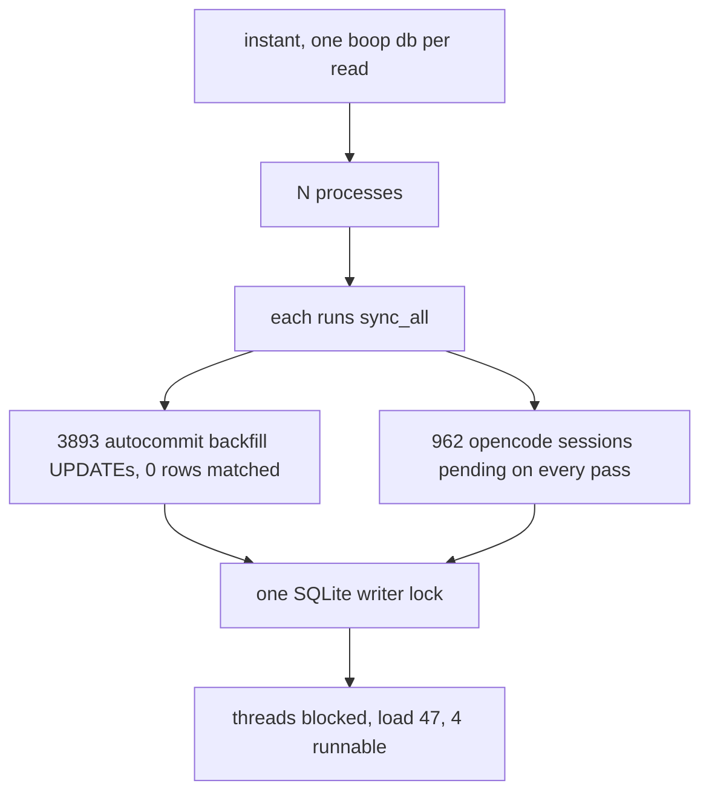

# boop db convoy

## Contents

1. [What was wrong](#what-was-wrong)
2. [Per-phase cold sync, measured](#per-phase-cold-sync-measured)
3. [Single-flight: candidate table](#single-flight-candidate-table)
4. [What changed](#what-changed)
5. [Fail-pre-fix transcripts](#fail-pre-fix-transcripts)
6. [After](#after)
7. [Found and not fixed](#found-and-not-fixed)

## What was wrong



Four causes multiplying, not one.

| # | cause | site |
|---|---|---|
| A | no single-flight: every read verb ran its own full pass | `crates/boop/src/cli/db.rs` `sync_all` from `main.rs:815` |
| B | `backfill_cursor_modified` per candidate in autocommit, `WHERE modified_ms = 0` matching zero rows | `crates/boop-store/src/ident.rs` `backfill_cursor_modified` |
| C | opencode reported `size: 0` while its cursor is a message rowid, so `known.cursor != session.size` held for all 962 synced sessions forever | `crates/boop-harness/src/harness/opencode.rs` `sessions_from` |
| D | no budget, no trail: a 43.96s pass reported nothing | `crates/boop/src/cli/db.rs` `sync_all` |

512 callers times 3893 no-op write transactions is 1.99M writes on one writer
lock. That is why the threads were blocked and not busy.

## Per-phase cold sync, measured

Instrumented with `std::time::Instant` per phase, written to
`~/.agent/sync-trail.ndjson`. Run against a copy of the live 446 MB store with
`sync_root_stamp` cleared, real `HOME`, so every adapter walks.

At `898be94`, cold:

| phase | ms | what it did |
|---|---|---|
| open | 1 | |
| refuse_stale | 0 | |
| `known_sessions` | 146 | 3893 rows into a HashMap |
| claude walk | 13 | 1699 candidates |
| claude backfill | 29 | 1699 autocommit UPDATEs, 0 rows matched |
| codex walk | 6 | 1094 candidates |
| codex backfill | 18 | 1094 autocommit UPDATEs, 0 rows matched |
| kimi walk | 17 | 129 candidates |
| kimi backfill | 2 | |
| opencode walk | 1 | 971 candidates |
| opencode backfill | 17 | 971 autocommit UPDATEs, 0 rows matched |
| routes | 0 | |
| **project** | **814** | **964 pending, 6 events written** |
| total | 1068 | |

962 of those 964 pending sessions were opencode, and each cost a
`begin`/`project_discovered_session`/`commit` to write nothing. That is cause C
and it is the largest single line.

The coordinator's hypothesis that `has_moved` was the lead is DISPROVED as the
wall: `has_moved_ms` measured 0 to 1ms every time it was reached. Its real cost
was correctness, not time (see [Found and not fixed](#found-and-not-fixed)), and
the root-stamp early-out it guarded is deleted.

The coordinator's earlier hypothesis about `backfill_cursor_modified` is
confirmed as an amplifier and still not the wall on one pass: 66ms of 1068ms.
Across 512 concurrent callers it is 1.99M write transactions.

**The 43.96s was not reproduced.** Every measurement here ran with the
transcript roots already in the page cache, where the same cold pass costs
1.20s. The 43.96s reading has 1s of CPU against 44s of wall, which is
page-cache misses over `~/.codex` and `~/.claude` plus writer-lock waiting, and
nothing from that run survived because the trail did not exist yet. Priced by
measurement where a measurement exists, and named as unreproduced where it does
not.

## Single-flight: candidate table

Requirements, in order: released when the holder dies including SIGKILL; a
non-blocking try; no lease, expiry or owner-pid sweep; no new dependency
without a reason.

| candidate | version | mechanism | released on SIGKILL | try-lock | cost | verdict |
|---|---|---|---|---|---|---|
| `std::fs::File::try_lock` | std, stable 1.89 | `flock(LOCK_EX\|LOCK_NB)` unix, `LockFileEx(FAIL_IMMEDIATELY)` windows | yes, the kernel drops it when the fd closes | yes | zero dependencies, maintained by the std team | **CHOSEN** |
| `fs4` | 1.1.0, 60.4M downloads, updated 2026-04-28 | same two syscalls, plus async variants and free-space helpers | yes | yes | one dependency for what std now has; the async half is unused here | rejected: std covers it since 1.89 and this crate is 1.89-era API parity |
| `fd-lock` | 4.0.4, 58.4M downloads, updated 2025-03-10 | RAII `RwLock<File>` over the same syscalls, rust-cli-wg | yes | yes | one dependency; the guard type is nicer than std's `unlock()` | rejected: the ergonomic gain is one `Drop` impl, written here in 5 lines |
| `named-lock` | 0.4.1, updated 2024-02-28 | named mutex abstraction; unix falls back to a file lock in the temp dir | yes on unix | yes | a lock whose name is not the db it guards, so two stores would contend | rejected on semantics: the lock must be per-store |
| `advisory-lock` | 0.3.0, last published 2020-12-31 | `AdvisoryFileLock` trait | yes | yes | unmaintained for 5 years | rejected |
| `file-lock` | 2.1.11 | `fcntl` byte-range locks | yes | yes | fcntl locks are per-process, not per-descriptor: any close of any fd on that file in the process drops the lock, and the test that holds the lock in-process could not then observe a child being refused | rejected on the footgun |
| `single-instance` | 0.3.3, last published 2021-12-16 | whole-application single instance | yes | no | wrong shape: this is per-store, not per-binary, and needs a try | rejected |
| SQLite `BEGIN IMMEDIATE` on the store | in tree | the store's own writer lock | yes | yes, `busy_timeout = 0` | it serialises passes, it does not elide them: caller 2 still runs its own pass after caller 1 finishes | rejected: serialising 512 identical passes is the incident |
| a `sync_lease` table with an owner pid and expiry | bespoke | a row | **no** | yes | needs an expiry, a clock, and a stale-owner sweep, and a SIGKILLed holder blocks every caller until the lease ages out | rejected on the first requirement |

The house law is that infra is bought. std is the strongest form of bought:
the same two syscalls every crate above wraps, with no supply chain.

## What changed

| # | change | file |
|---|---|---|
| 1 | single-flight on `<db>.sync.lock`; a caller that finds it held reads without syncing and records `deferred` | `crates/boop/src/cli/db.rs` `claim_sync`, `SyncFlight`, `SyncContention` |
| 2 | the v12 cursor backfill runs only while a cursor still carries `modified_ms = 0`, and then in one transaction per adapter | `crates/boop-store/src/ident.rs` `cursors_missing_modified` |
| 3 | opencode reports its per-session `MAX(rowid)` as `size` | `crates/boop-harness/src/harness/opencode.rs` `last_message_rowid` |
| 4 | the startup sync yields at `STARTUP_SYNC_BUDGET` (5s, under the ten-second law) and warns with what it was doing | `crates/boop/src/cli/db.rs` `SyncPhases::spent` |
| 5 | every pass appends `start` then `done` with its phase table to `~/.agent/sync-trail.ndjson` | `crates/boop-store/src/trail.rs` `append_sync_trail` |
| 6 | `boop debug` prints the passes, the deferrals, and any `start` with no `done` | `crates/boop/src/debug.rs` `sync_report`, `sync_json` |
| 7 | the root-stamp early-out is deleted, with `stamp_root`, `root_stamp_matches`, `has_moved` and `known_paths_can_move` | `crates/boop/src/cli/db.rs`, `crates/boop-store/src/ident.rs`, `crates/boop-store/src/session.rs` |
| 8 | `BOOP_NO_SYNC=1` skips the startup sync for every verb | `crates/boop/src/main.rs` `sync_suppressed` |

The trail is a file and not a table because the writer lock is the contended
resource and a SIGKILL mid-transaction loses the row; `~/.agent/lanes/<lane>/`
already sets the house pattern for a trail that outlives its process.

`boop debug` today:

```
transcript sync
  22:40:35 pid=25632 177ms known=6ms/4000 candidates+backfill=168ms project=0ms projected=0
  22:43:01 pid=33192 181ms known=4ms/4000 candidates+backfill=174ms project=0ms projected=0
  23 caller(s) found a sync in flight and read without one
```

## Fail-pre-fix transcripts

All three rails run against a worktree at `898be94`.

`crates/boop/tests/sync_convoy.rs`:

```
running 3 tests
test a_caller_that_finds_the_sync_lock_held_reads_without_syncing ... FAILED
test a_warm_read_stays_under_its_budget ... ok
test concurrent_reads_perform_one_sync_pass_between_them ... FAILED

---- a_caller_that_finds_the_sync_lock_held_reads_without_syncing stdout ----
panicked at crates/boop/tests/sync_convoy.rs:186:5:
assertion `left == right` failed: and must record why it did not
  left: 0
 right: 1

---- concurrent_reads_perform_one_sync_pass_between_them stdout ----
panicked at crates/boop/tests/sync_convoy.rs:215:5:
24 concurrent reads took 4.393911042s, over the 1.5s budget

test result: FAILED. 1 passed; 2 failed; 0 ignored; 0 measured; 0 filtered out; finished in 7.28s
```

`crates/boop/tests/sync_discovery.rs`:

```
---- a_new_session_in_a_known_project_directory_is_discovered stdout ----
panicked at crates/boop/tests/sync_discovery.rs:61:5:
assertion `left == right` failed: a new session beside a known one must be discovered
  left: 2
 right: 4

test result: FAILED. 0 passed; 1 failed; 0 ignored; 0 measured; 0 filtered out; finished in 0.26s
```

`crates/boop/tests/no_sync_hatch.rs`, at `172ee58`:

```
---- the_no_sync_hatch_skips_the_startup_sync_and_still_reads_rows stdout ----
panicked at crates/boop/tests/no_sync_hatch.rs:69:5:
assertion `left == right` failed: BOOP_NO_SYNC=1 must not project the appended transcript
  left: 4
 right: 2

test result: FAILED. 0 passed; 1 failed; 0 ignored; 0 measured; 0 filtered out; finished in 0.26s
```

`a_warm_read_stays_under_its_budget` passes on both trees. It is a ratchet, not
a red gate: the pre-fix warm number on the live store was 0.22 to 0.59s, and
the defect was the cold pass and the convoy, never the warm read.

Why a wall assertion at all, given the house prefers counts. The count
assertions carry the contract, and they are exact: `starts + deferred == N`,
`starts < N`. Neither can express the incident, because the thing that went
wrong is N passes taking the writer lock in turn and a pass that writes nothing
leaves no row in the store to count. The wall is asserted FIRST so a build with
no sync trail still fails on the incident rather than on the absence of the
receipt.

## After

Same machine, a copy of the live 446 MB store, real `HOME`, cursors cold on the
first run of each column. Two runs of `boop db "SELECT 1"`, real seconds:

| condition | 898be94 | after |
|---|---|---|
| cold cursors | 1.20 | 0.27 |
| second | 0.22 | 0.17 |
| warm | 0.22 | 0.18 |

Concurrent `boop db "SELECT 1"` against the same store, wall for the whole
burst:

| N | 898be94 | after | passes after |
|---|---|---|---|
| 24 | 1.81s | 0.20s | 1 start, 23 deferred |
| 64 | 5.29s | not run | |
| 128 | not run, it is the incident | 0.21s | 1 start, 127 deferred |

Pre-fix is superlinear in N (24 to 64 is 2.7x the processes and 2.9x the wall);
after, N does not move the wall at all. Load average did not rise above its
idle 4.9 to 6.4 during the post-fix N=128 burst.

Post-fix phase table on the same cold copy:

| phase | ms |
|---|---|
| `known_sessions` | 243 (3894 rows) |
| claude walk | 12 (1700 candidates) |
| codex walk | 5 (1094) |
| kimi walk | 6 (129) |
| opencode walk | 124 (971, including the new `MAX(rowid)` query) |
| backfill | 0, all four adapters |
| project | 8, 2 pending |
| total | 405 |

Test suite: `cargo test -p boop -p boop-store -p boop-harness --release` all
green, 21 result lines, 0 failures. Clippy clean on the three crates; the one
warning in the workspace is pre-existing at `crates/boop/tests/host_chat.rs:44`.

## Found and not fixed

| # | finding | evidence |
|---|---|---|
| 1 | `known_sessions()` is now the largest phase of a warm pass at 145 to 243ms, loading 3894 rows into a HashMap on every pass that takes the lock. Single-flight means one process pays it instead of 512, so it is no longer a convoy risk, but it is the next thing to cut. | `crates/boop-store/src/ident.rs:949` |
| 2 | opencode's `sessions_from` now runs `SELECT session_id, MAX(rowid) FROM message GROUP BY session_id` against opencode's own store and measured 124ms cold. There is no index on `message.session_id` in opencode's schema and boop must not add one to a store it does not own. | `crates/boop-harness/src/harness/opencode.rs` `last_message_rowid` |
| 3 | `sync_root_stamp` is now an unwritten, unread table. Dropping it is a schema migration and a `SCHEMA_VERSION` bump, which would refuse every store written by an older build; left in place deliberately. | `crates/boop-store/src/ident.rs:441` |
| 4 | An explicit `boop sync` blocks up to `EXPLICIT_SYNC_WAIT` (120s) for a pass in flight, then errors. That wait is over the ten-second law by design, because the caller asked for a sync; it is not on any read path. | `crates/boop/src/cli/db.rs` `EXPLICIT_SYNC_WAIT` |
| 5 | The 43.96s cold reading was never reproduced. See [Per-phase cold sync](#per-phase-cold-sync-measured). | |
| 6 | `instant` still spawns one `boop db` per read. Single-flight makes that survivable, and 512 short-lived processes per view is still the wrong shape; `boop` is linkable as a library (`crates/boop/src/lib.rs:1-8` names the four reads a host needs). | `crates/boop/src/lib.rs` |
