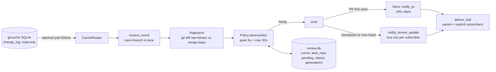

# Cached review notifications (ghcacher adapter) source receipt

Status: wip. Source review only. No build, test, or integration run was
performed: the parent held the build slot (two other build-heavy lanes exist).

## What was built



One shared consumer thread per mailbox. Never one poll per lane or subscriber.

## Files

| File | Change |
|---|---|
| `crates/boop-proc/src/review.rs` | New. Cache reader, correlation, coalescing scheduler, content fingerprint, review generations, durable state, shared consumer, notification emission, delivery, tests. |
| `crates/boop-proc/src/lib.rs` | `pub mod review;` |
| `crates/boop-proc/src/supervise.rs` | Calls `review::observe_lane` once per supervisor; removes `publish_pr`, `pr_view`, `pr_view_timeout` and their call sites. Keeps `is_pr_create` because adapters/unit tests use it. |

## Brief case coverage in tests

| Brief case | Test |
|---|---|
| rapid push coalescing to newest head | `scheduler_coalesces_a_push_burst_to_the_newest_head` |
| continuous pushes cannot starve review | `max_wait_bounds_a_continuous_push_stream` |
| rebase/push, unchanged content, reuse | `rewrite_with_identical_content_is_equivalent`, `equivalent_generation_reuses_the_review` |
| changed conflict resolution | `changed_content_fingerprint_differs`, `changed_conflict_resolution_requires_a_new_review` |
| base movement | `base_movement_requires_a_new_review` |
| PR after checkpoint upgrades final intent | `pr_after_checkpoint_upgrades_final_intent_once` |
| duplicate source event / replay dedup | `duplicate_source_event_does_not_renotify`, `replay_marks_events_seen_across_reopen`, `cursor_and_notice_claims_survive_reopen`, `pump_notifies_the_parent_from_a_real_cache_change` (replay leg) |
| push during running review, stale finalization | `stale_finalization_does_not_mark_the_newest_head_reviewed` |
| unrelated lane/repo excluded | `unrelated_repo_or_branch_is_not_correlated`, `cache_event_correlates_only_the_owning_lane` |
| exact repo+branch/PR correlation on real schema | `cache_event_correlates_only_the_owning_lane` |
| pending state round trip | `pending_round_trips_through_review_db` |
| notice reaches parent automatically, real store/git/sqlite | `pump_notifies_the_parent_from_a_real_cache_change` |
| patch-id alone is not equality | `changed_content_key_fingerprint_rejects_patch_id_only_equality` |

Semantics recorded:

- `Generation.head` and `Generation.base` are the exact revision and target a
  CI/final check validates. `fingerprint` (raw diff, mode/rename/delete status,
  binary patch, hash of merge-base) and `base_context` are used only to reuse a
  content review. Equivalence requires both fingerprints and both base contexts
  present and equal.
- `Intent::Checkpoint` (push) and `Intent::Final` (PR). A final event upgrades a
  pending checkpoint once; the PR-creation notice is claimed once per key under
  the sentinel token `pr-created`, so the URL claim from `Store::notify_pr` can
  never suppress a later genuinely new head.
- `ReviewRun::finalize` and `ReviewState::{advance_generation,finalize_review}`
  carry the supersession contract (only the desired generation may be marked
  reviewed). No reviewer is scheduled; this is state for a later consumer.

Known limitation: a checkpoint before any PR exists compares against the spawn
base sha recorded on the lane route, because the cache branch change carries no
base. PR events compare against `base_ref`. So relevant-base movement is exact
once a PR exists and weaker for pre-PR checkpoints. Detecting `base_ref` on a
branch change would need a ghcacher payload addition.

## Cache source boundary and the blocked dependency

`ghcache-client` cannot be declared in this workspace:

| Fact | Value |
|---|---|
| `ghcache-client` deps | `sqlx 0.8` with `sqlite`, `tokio full`, `reqwest` |
| sqlite native lib it links | `libsqlite3-sys 0.30.1` (`links = "sqlite3"`) |
| Boop store sqlite lib | `rusqlite 0.40.2` to `libsqlite3-sys 0.38.2` (`links = "sqlite3"`) |
| Result | Cargo refuses two packages with the same `links` value in one graph |

Required upstream change (not made here): make `sqlx`/`tokio` optional in
`ghcache-client` behind a default feature and gate `query`/`tail`, leaving
`cmd`/`EventStream` as a reqwest-only surface. Boop could then depend on
`ghcache-client` with that feature off and only `CacheReader` would change.
Until then `review::CacheReader` reads the documented schema (`change_log`,
`branch`, `pull_request`, `worktree`, `repo`) with the workspace's rusqlite.
No private cache database or credential is read by this module.

A second, smaller blocker: any dependency added now changes `Cargo.lock`, and
`cargo ... --locked` cannot pass until a build slot regenerates it. Nothing was
added.

No edits were made to `/Users/chrishafley/projects/ghcacher`. No missing
capability in its schema was found for this feature.

## Validation commands (not yet run)

```
cargo test --locked -p boop-proc --lib review:: -- --nocapture --test-threads=1
cargo test --locked -p boop-proc --lib -- --test-threads=1
cargo fmt --all -- --check
git diff --check
```

Live cache probe (after a build slot):

```
GHCACHE_DB="$(ghcache db-path)" boop ...   # one shared consumer tails change_log
```

Full matrix after the source tests pass, per the task brief:

```
cargo test --locked -p boop --test main lane_lifecycle_e2e -- --nocapture --test-threads=1
cargo test --locked -p boop --test main commit_push_e2e -- --nocapture --test-threads=1
cargo test --locked -p boop-harness --lib
```

Note: `pr_push_e2e::{both_producers_*,hung_gh_*}` set
`BOOP_PR_VIEW_TIMEOUT_SECS`, which this change removes. Those cases already
failed on the native channel (no `ToolCallFact`); they now need a cache-driven
fixture. Owned by the parent/native lane, not edited here.

## Implemented / untested / blocked

| Item | State |
|---|---|
| Scheduler, correlation, fingerprint, state, consumer, emission | Implemented, untested |
| Store notify path reuse (`notify_pr`) and update path | Implemented, untested |
| `ghcache-client` dependency | Blocked on upstream feature-gate and lockfile |
| Build, focused tests, live matrix | Blocked on parent build slot |
| Existing lifecycle tests | Not touched |
| Native channel, TUI doors, ps/list CLI, cleanup helpers | Not touched |
