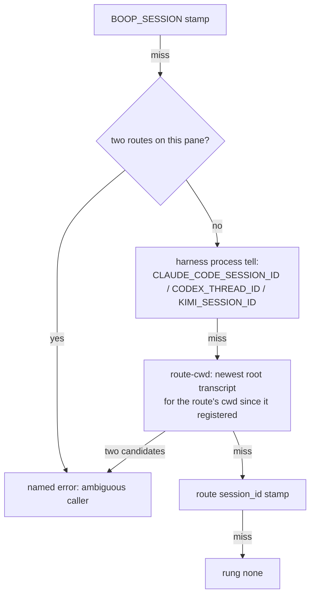

# caller-identity-rung

`boop whoami` answered `rung none (unresolved)` from an adopted claude
coordinator pane, so `tell-children`, `tell-parent` and every other
identity-derived verb refused to run from the one place they were built for.
Fixed on branch `fix/caller-identity-rung`, four commits, workspace suite
619 passed / 0 failed.

## Contents

1. [The ladder](#the-ladder)
2. [Verbatim before and after](#verbatim-before-and-after)
3. [A: what was actually broken, and why the fix is lazy resolution](#a-what-was-actually-broken-and-why-the-fix-is-lazy-resolution)
4. [B: tell-children, and the delivery truth for native children](#b-tell-children-and-the-delivery-truth-for-native-children)
5. [C: naming the rung, never guessing](#c-naming-the-rung-never-guessing)
6. [D: agent_edge.agent_type_id, filed not built](#d-agent_edgeagent_type_id-filed-not-built)
7. [cargo test totals](#cargo-test-totals)
8. [Commits and files](#commits-and-files)
9. [Findings for the next lane](#findings-for-the-next-lane)

## The ladder

`crates/boop-harness/src/identity.rs:71` `resolve_with`. First hit wins for the
session; a matched pane route always names the lane.



| rung | evidence it needs | what it resolves | confidence | state |
|---|---|---|---|---|
| `env` | `BOOP_SESSION`/`BOOP_LANE`/`BOOP_PARENT` in the caller's own env | a boop-spawned lane | exact | unchanged |
| `claude-process` | `CLAUDE_CODE_SESSION_ID` | the claude session running the caller | exact | NEW |
| `codex-process` | `CODEX_THREAD_ID` + a pane | the codex thread | exact | unchanged |
| `kimi-process` | `KIMI_SESSION_ID` | the kimi session | exact | unchanged |
| `route-cwd` | a pane-matched route with `harness`, `cwd`, `registeredAt` + the harness's transcripts on disk | the live session for that cwd | live-transcript | NEW |
| `pane` | a route whose tmux target names the caller's pane | lane, harness, and the route's `sessionId` stamp | stamped | FIXED (target match) |
| `none` | - | nothing, and it says so | unresolved | unchanged |

Anything above `pane` also adopts the matched route's lane name, so a codex or
claude process no longer invents `codex-1206` when a real route stands on its
pane.

## Verbatim before and after

Same pane both times: `boop-turn-visibility-v2:0.0`, `$TMUX_PANE=%2810`,
cwd `/Users/chrishafley/projects/sprefa`, route `sprefa-coordinator` adopted.
BEFORE is the installed `boop 0.0.2 (075ddc9)`; AFTER is this branch's build.

### `boop whoami`

BEFORE

```
session  -
lane     -
parent   -
harness  -
pane     -
rung     none (unresolved)
```

AFTER

```
session  555ec3f8-fcdf-4aa3-a3ed-22ebcf85a815
lane     sprefa-coordinator
parent   -
harness  claude
pane     %2810
rung     claude-process (exact)
```

### `boop tell-children --body "ping"`

BEFORE

```
Error: unknown caller: no lane and no session resolved (boop whoami shows the ladder)
rc=1
```

AFTER (live registry, whole output, trimmed to the first and last native rows)

```
no-route extract-driver (no hook, no pane)
dead fix-soopy-correctness (tmux fix-soopy-correctness is gone)
no-route 555ec3f8-fcdf-4aa3-a3ed-22ebcf85a815/agent-a2158d9cb73a52bad (native subagent: no pane, no route, nothing drains its mailbox)
... 13 more native subagent rows ...
no-route 555ec3f8-fcdf-4aa3-a3ed-22ebcf85a815/agent-afcfa1052d4058ed9 (native subagent: no pane, no route, nothing drains its mailbox)
0 landed, 16 no-route, 1 dead
rc=0
```

Zero rows were appended to `~/.agent/mail/bus.ndjson`: nothing was reachable,
and the tally says so instead of exiting clean and silent.

### `landed`, proved end to end

The live registry had no reachable child, so one was made: a throwaway tmux
session `boop-identity-probe` plus a `parent: sprefa-coordinator` route in a
copy of the registry under `--mail-dir`.

```
landed identity-probe-child m-3db26852 (pane boop-identity-probe)
1 landed, 16 no-route, 1 dead
```

`tmux capture-pane -t boop-identity-probe -p`:

```
[boop m-3db26852 from sprefa-coordinator] ping
```

Difference from the live pane: the probe child is a bare shell, not an agent,
so it proves the transport (keystrokes into a live pane) and not that an agent
read the row. The session was killed immediately after.

### The route-cwd rung, against the exact reported state

`--mail-dir` registry holding one route with **no** `sessionId`, matching the
mission's receipt 2, and `CLAUDE_CODE_SESSION_ID` removed from the environment
so the process rung cannot answer:

```
session  555ec3f8-fcdf-4aa3-a3ed-22ebcf85a815
lane     sprefa-coordinator
parent   -
harness  claude
pane     %2810
rung     route-cwd (live-transcript)
```

157 ms, measured. The two independent rungs (`claude-process` and `route-cwd`)
name the same session, which is the cross-check that the stamp was the only
wrong answer.

## A: what was actually broken, and why the fix is lazy resolution

Three separate misses, all of which had to be fixed for the pane to resolve.

| # | miss | evidence | fix |
|---|---|---|---|
| 1 | the pane rung compared route targets as strings | route `tmux` is `boop-turn-visibility-v2:0.0`; the caller has `%2810` and session `boop-turn-visibility-v2`. Neither equals the target | `Multiplexer::pane_id` asks tmux to resolve the target, `boop-mux/src/lib.rs` |
| 2 | claude exposed no process tell | `codex` and `kimi` each had one; claude sets `CLAUDE_CODE_SESSION_ID` in every process it runs | `Claude::identity_process`, `boop-harness/src/harness/claude.rs` |
| 3 | the route's `sessionId` was stale | registry said `da6da0ca-…` (transcript last written Aug 18 10:59); the live session is `555ec3f8-…` (Aug 20 13:11) | the `route-cwd` rung, and the stamp demoted below it |

### The argument: (iii), both, with a fixed precedence

The mission asked whether to stamp at adopt time, resolve lazily, or both.
Stamping alone is disproven twice over by measurement:

- **The stamp goes stale.** `boop --help` already states a session id moves on
  /clear, on compaction and on resume. The live registry proves it: the route
  was stamped `da6da0ca` and the pane has been on `555ec3f8` since.
- **The stamp is often unwritable at adopt time.** `run_adopt_with`
  (`crates/boop/src/cli/me.rs:94`) discovers a claude session through
  `session_id_in_pane`, which reads `claude --resume <id>` out of argv. The
  coordinator's live process argv is bare `claude` (measured: pid 42384,
  `ps -o command` prints `claude`), so a cold-started pane has no argv tell and
  the route is written session-less. That is exactly what receipt 2 saw across
  all 12 sampled routes.

Lazy resolution alone is not enough either: an opencode lane's `ses_…` id is
minted by the spawn and appears in no cwd scan, so the stamp is the only
evidence for those routes.

So both, with precedence rather than a choice:

1. `boop adopt` keeps stamping when it can (unchanged).
2. Live evidence outranks the stamp: the harness's own env tell first, then the
   cwd resolution, and only then the stamp, which whoami labels `stamped`
   rather than `exact`.

This survives session-id movement because nothing above `pane` reads a stored
id: `claude-process` reads the caller's own environment, and `route-cwd` reads
the transcript directory as it stands right now.

### How `route-cwd` picks, and how it refuses to pick

Same shape as `job.rs:318`'s `(cwd, harness)` resolution, done through the
harness registry instead of the external `instant-harness` binary (the registry
already owns per-harness transcript discovery; shelling out to another repo's
build artifact for the caller's own identity would be a second source of truth).

- candidates = root sessions (no parent, no `<parent>/agent-…` id) whose
  recorded cwd equals the route's cwd
- kept only if written at or after the route's `registeredAt`: a route is
  adopted onto a live pane, so this pane's session must have been written to
  since
- 0 candidates: the rung declines and the ladder falls through
- 1: that is the session
- 2+: named error, never a coin flip

Live data: 146 root transcripts carry cwd `/Users/chrishafley/projects/sprefa`;
exactly one was written at or after the route's `registeredAt` of 16:22:13Z.

### The cwd read was broken too

`first_record_context` read line 1 only. Current claude transcripts open with a
`queue-operation`, `mode`, `ai-title` or `last-prompt` metadata record that
carries no `cwd`. Measured over the live corpus: cwd first appears at line
index 2 in 150 transcripts, 3 in 31, 4 in 5, 5 in 2, 6 in 1, 7 in 1, and at
index 0 in **none**. So `SessionRef.cwd` was `None` for effectively every
current claude session, and any cwd lookup would have answered nothing. The
head is now scanned to 16 lines; a line that fails to parse is a partial write
and is skipped.

Cost control: `Claude::root_sessions_for_cwd` reads only the project directory
whose name is the cwd's encoding (`/a/b/.c` -> `-a-b--c`), 152 files here
instead of 1685, and still verifies the recorded cwd because that encoding is
lossy.

## B: tell-children, and the delivery truth for native children

Children now come from two places:

| source | what it names | reachable |
|---|---|---|
| registry `parent` edges | lanes and adopted coordinators | yes, via hook inbox / lane supervisor / pane keystrokes |
| store `agent_edge` `spawned` rows for the caller's session | claude Agent-tool subagents, id `<parent>/agent-<id>` | **no** |

### Native subagents cannot be mailed today. Nothing new was invented.

A claude Agent-tool child runs inside its parent's process. It owns no tmux
pane, no stdin of its own, and no registry route, so all three delivery paths
in `deliver_hail`/`child_reach` miss it. `tell-children` says `no-route` per
target and mints no bus row for one.

What would have to exist, and does not (each of these is NEW work, not a
rewiring of something already present):

1. a route keyed by the subagent session id, written when the spawn edge is
   discovered rather than only by `lane create`/`adopt`
2. something inside the subagent that drains it. The hook inbox is per project
   directory and per name (`inbox::installed_for(cwd, name)`), and a subagent
   shares its parent's project directory, so today's hook would drain the
   parent's mailbox from inside the child. A subagent-scoped drain needs a hook
   the harness fires in the sidechain with the sidechain's own name.
3. or, a live channel: claude's own SendMessage-to-a-running-agent is a tool the
   parent model calls, not an OS-level port boop can write to. Reaching it from
   outside would mean boop driving the parent's ACP session, which is a new
   transport.

Until one of those lands, the honest output is `no-route`, which is what the
verb now prints.

### `dead` vs `no-route`

`child_reach` used to return `None` for both "this route never had a target"
and "its target is gone", and the verb printed `dead` for both. They are now
`ChildReach::NoRoute(why)` and `ChildReach::Dead(target)`, printed apart, and
the run ends in `N landed, M no-route, K dead`.

## C: naming the rung, never guessing

- whoami's last line names the rung and its confidence; the six rungs are
  distinguishable, so `claude-process` and `route-cwd` and `pane` never read
  alike.
- ambiguity is a named error at both places it can arise. Two routes on one
  pane, run live against a constructed `--mail-dir`:

```
Error: ambiguous caller: pane %2810 is registered as both `coord-a` and `coord-b`; prune one route
rc=1
```

  and two root sessions written to one cwd since the route registered bails with
  both session ids and points at `boop adopt --session-id`.

## D: agent_edge.agent_type_id, filed not built

Not cheap. Filed with its receipts.

- `agent_type_id` is declared (`boop-store/src/ident.rs:2451`) and **written
  nowhere**: grep across `crates/` returns the schema line and nothing else.
- The spawn edge is written by `project_discovered_session`
  (`boop-store/src/ident.rs:1002`) from the transcript's **file path**
  (`subagents/agent-x.jsonl` -> parent). That path carries no agent type, and
  that function never opens the parent transcript.
- The agent type lives in the parent transcript, split across two records:
  the `tool_use` block (`input.subagent_type`, e.g. `general-purpose`) and,
  later, the `tool_result` record whose `toolUseResult.agentId` gives the child
  stem. Correlation key is the `tool_use` id.
- Two blockers make it a project rather than a patch:
  1. the tool is named `Agent` in the current transcript (16 blocks in
     `555ec3f8`) and `Task` in older ones, and one sampled older transcript has
     17 `agentId` results with **zero** recorded `subagent_type` blocks, so the
     backfill will be partial and must say so;
  2. sync is incremental over byte offsets, and a `tool_use` and its
     `tool_result` can land in different chunks, so the correlation needs state
     that survives across sync passes.
- Recommended shape when someone takes it: a backfill pass over
  `agent_edge WHERE agent_type_id IS NULL`, reading each parent transcript once,
  rather than new state in the incremental hot path.

## cargo test totals

`cargo test --workspace --locked --no-fail-fast`, shared target dir.

| run | when | suites | passed | failed | ignored |
|---|---|---|---|---|---|
| 1 | before | 54 | 612 | 1 | 7 |
| 2 | before | 54 | 613 | 0 | 7 |
| 3 | after | 54 | 619 | 0 | 7 |
| 4 | after | 54 | 619 | 0 | 7 |
| 5 | after | 54 | 619 | 0 | 7 |

Baseline failing set is empty, and the two failures seen in pre-change runs are
flakes in crates this branch does not touch, each seen once and not reproduced:

- `soopy::6_git_optional::plain_directory_watcher_reports_add_change_and_remove`
- `boop-acp::channel::jsonrpc::tests::a_write_to_a_closed_session_names_the_session`

+6 tests, all new, no test removed: 3 in `identity`, 2 in `harness::claude`,
1 in `boop --test tell`. `cargo clippy --workspace --all-targets` is clean;
`cargo fmt` was applied to the touched files only (`crates/boop/src/lib.rs`
carries a fmt diff that predates this branch and was left alone).

## Commits and files

| commit | what |
|---|---|
| `10f9b59` | `fix(mux)`: `Multiplexer::pane_id`; `has-session` through `output()` so a liveness probe stops printing `can't find session` on the caller's stderr |
| `231cba6` | `fix(identity)`: the ladder, the claude rung, the route-cwd rung, the transcript head scan |
| `9d889de` | `fix(tell-children)`: store spawn edges as children, per-target landed/no-route/dead plus a tally |
| `48c7e38` | `feat(whoami)`: `--mail-dir` |

Files: `crates/boop-mux/src/lib.rs`, `crates/boop-store/src/testing.rs`,
`crates/boop-harness/src/{identity.rs,harness.rs,harness/claude.rs}`,
`crates/boop/src/{main.rs,cli/me.rs,cli/mail.rs}`, `crates/boop/tests/tell.rs`.

New tests, each pinning a measured failure:

| test | pins |
|---|---|
| `a_route_adopted_as_session_window_pane_names_its_own_caller_pane` | the string compare that produced `rung none` |
| `two_routes_standing_on_one_pane_are_a_named_error` | no coin flip on an ambiguous pane |
| `the_claude_process_rung_names_the_session_claude_stamped` | the new rung |
| `a_transcript_whose_head_is_metadata_still_reports_its_cwd` | cwd was `None` for every current transcript |
| `the_project_directory_name_encodes_the_cwd` | the directory encoding the fast path relies on |
| `tell_children_names_a_native_subagent_child_as_no_route` | a native child is enumerated and never claimed landed |

## Findings for the next lane

1. **The stale stamp is still on disk.** `sprefa-coordinator.sessionId` is
   `da6da0ca-…` and the pane is on `555ec3f8-…`. Nothing in this branch writes
   it back, because whoami is a read. `boop resolve <to>` only fills a route
   whose `sessionId` is null (`job.rs:293`); it should also refresh one the live
   ladder disagrees with, behind an explicit flag.
2. **A subagent's shell resolves the hosting root session, not itself.**
   `CLAUDE_CODE_SESSION_ID` in a subagent's bash names the parent, and claude
   agrees with itself here: a sidechain transcript records the root's
   `sessionId` and `isSidechain: true`. So `boop tell-parent` run from inside a
   subagent addresses the coordinator's parent, not the coordinator. Worth a
   decision before anything relies on it.
3. **The `env-tell in every process` hazard.** `CLAUDE_CODE_SESSION_ID` is set
   in every process claude spawns, including `cargo test`. Three existing
   identity tests had to clear it explicitly. Any future test asserting an
   unresolved caller must do the same.
4. **`crates/boop/src/lib.rs` fails `cargo fmt --check` on `origin/main`.**
   Pre-existing, untouched here, and it will keep any `cargo fmt --check` CI leg
   red.
