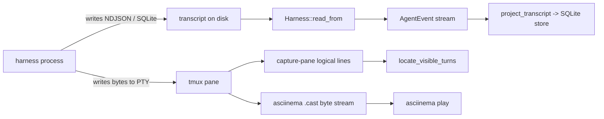
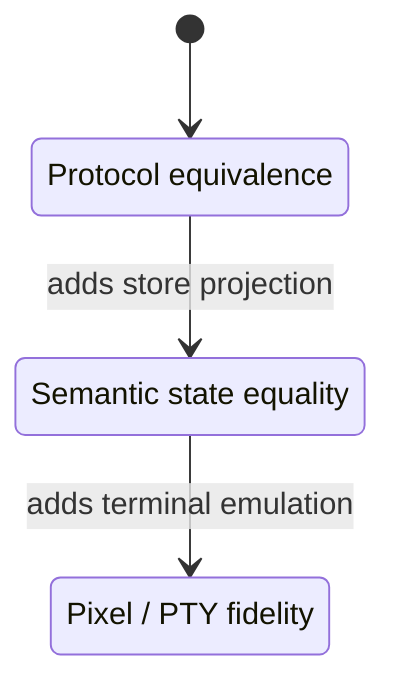

# 6. Harness replay research

Research inventory plus one implemented offline Codex replay proof in section 6.
No dependency was added. The coordinator independently ran that test successfully.
Every claim carries a file:line or a URL. Statements are split into **TESTED** (a test in the
repo exercises the code) and **PROPOSAL** (design text with no runner behind it).

## Table of contents

1. [Question in one line](#1-question-in-one-line)
2. [The two replay planes](#2-the-two-replay-planes)
3. [Supported harnesses and their wire formats](#3-supported-harnesses-and-their-wire-formats)
4. [Local reuse inventory](#4-local-reuse-inventory)
   - 4.1 [Event-plane seam: `Harness::read_from`](#41-event-plane-seam-harnessread_from)
   - 4.2 [Scrubber: exists, deleted from HEAD, recoverable](#42-scrubber-exists-deleted-from-head-recoverable)
   - 4.3 [Screen-plane assets](#43-screen-plane-assets)
   - 4.4 [Schema versioning and validation already shipped](#44-schema-versioning-and-validation-already-shipped)
   - 4.5 [Virtual time: what is and is not there](#45-virtual-time-what-is-and-is-not-there)
   - 4.6 [Gap table against the target design](#46-gap-table-against-the-target-design)
5. [External capability comparison](#5-external-capability-comparison)
6. [Smallest bounded proof task](#6-smallest-bounded-proof-task)
7. [Limits of any 1:1 claim](#7-limits-of-any-11-claim)
8. [Source links](#8-source-links)

---

## 1. Question in one line

Replay scrubbed real harness transcripts through Boop's own adapters, deterministically, with no
model generation bought per test; and separately replay a TUI screen.

---

## 2. The two replay planes



| plane | source of truth | what replay reproduces 1:1 | what it can never reproduce |
| --- | --- | --- | --- |
| event / protocol | transcript file bytes | record set, ordering, ids, tool calls, usage, exit | cursor position, colors, wrap, spinner frames, redraw count |
| byte / PTY screen | PTY output bytes | glyphs, SGR, cursor moves, resizes, input echo | which logical event caused a repaint; harness-side state |

Neither plane subsumes the other. The event plane has no screen. The screen plane has no ids.

---

## 3. Supported harnesses and their wire formats

Boop names exactly four. `crates/boop-store/src/harness_id.rs:18` — `enum HarnessId { Claude,
Codex, Kimi, Opencode }`, `ALL` is a 4-element const array at `harness_id.rs:29`.

| harness | on-disk shape | adapter | LOC |
| --- | --- | --- | --- |
| claude | `~/.claude/projects/<cwd-slug>/<sessionId>.jsonl`, append-only NDJSON, identity `(sessionId, uuid)` | `crates/boop-harness/src/harness/claude.rs` | 1343 |
| codex | rollout NDJSON, records `{timestamp, type, payload}` | `crates/boop-harness/src/harness/codex.rs` | 2135 |
| kimi | one `wire.jsonl` per agent under a session dir (`crates/boop-harness/src/harness.rs:696`) | `crates/boop-harness/src/harness/kimi.rs` | 1267 |
| opencode | `~/.local/share/opencode/opencode.db` SQLite, `message(id, session_id, time_created, data-json)` | `crates/boop-harness/src/harness/opencode.rs` | 2247 |

Format notes are the module doc at `crates/boop-harness/src/transcript.rs:5-9`. Note the asymmetry:
three file-backed harnesses, one database-backed. `dict_harness` stays `String` on read because
older stores hold `gemini` from the acpx preset (`harness_id.rs:1-5`), so an enum-only fixture
loader would reject real historical rows.

Codex record shape, verbatim from the one committed Boop fixture
(`crates/boop/tests/fixtures/codex_live_native_child.jsonl:1`):

```json
{"timestamp":"2026-08-21T03:33:50.000Z","ordinal":0,"type":"session_meta","payload":{"session_id":"...","parent_thread_id":"...","cwd":"/Users/chrishafley/projects/sprefa","originator":"codex-tui","source":{"subagent":{"thread_spawn":{"parent_thread_id":"...","depth":1,"agent_path":"/root/tmux_child_projector_finish"}}},"thread_source":"subagent"}}
```

That fixture carries a real absolute user path. It is unscrubbed.

---

## 4. Local reuse inventory

### 4.1 Event-plane seam: `Harness::read_from`

The replay seam already exists and is file-driven, which is the whole reason a fixture can
substitute for a live session.

| symbol | file:line | signature | status |
| --- | --- | --- | --- |
| `Harness::read_from` | `crates/boop-harness/src/harness.rs:564` | `fn read_from(&self, session: &SessionRef, offset: u64) -> Result<ReadChunk>` | TESTED |
| `Harness::ingest` | `crates/boop-harness/src/harness.rs:569` | `fn ingest(&self, store, session, from) -> Result<Ingested>` | TESTED |
| `ReadChunk` | `crates/boop-store/src/session.rs:167` | `{ events: Vec<AgentEvent>, next_offset: u64, reset: bool, skipped: usize }` | TESTED |
| `AgentEvent` | `crates/boop-store/src/event.rs:11` | 12 fields, see below | TESTED |
| `SessionRef` | `crates/boop-store/src/session.rs:30` | `{ harness, session_id, nickname, path: PathBuf, cwd, git_branch, modified_ms, size, tmux, tmux_socket, parent }` | TESTED |
| `project_transcript` | `crates/boop-store/src/ident.rs:3248` | `fn(&Store, &SessionRef, from: u64) -> Result<Ingested>` | TESTED |
| `sync_session` | `crates/boop-harness/src/harness.rs:402` | `fn(&Store, &dyn Harness, &SessionRef) -> Result<SyncStat>` | TESTED |
| `observe_native_children` | `crates/boop-harness/src/harness.rs:595` | `fn(&SessionRef, from: u64) -> Result<Vec<NativeChildEvent>>` | TESTED |

`SessionRef.path` is a plain `PathBuf`. Point it at a fixture under a `tempfile::TempDir` and the
real adapter parses it with no network and no model call. `crates/boop/tests/sync_convoy.rs:132`
(`write_transcript`), `sync_discovery.rs:10`, `no_sync_hatch.rs:14` and
`native_projector_contention.rs:70` each already do exactly this with hand-written JSONL, so the
technique is proven in-tree; what is missing is a shared corpus rather than a mechanism.

`ReadChunk.reset` and `ReadChunk.skipped` are the unknown-record survival channel: unparseable
lines are counted, not dropped silently, and a shortened file restarts from 0.

**`AgentEvent` is the constraint.** `crates/boop-store/src/event.rs:11`:

```rust
pub struct AgentEvent {
    pub harness: &'static str, pub session_id: String, pub ts_ms: u64,
    pub uuid: Option<String>, pub parent_uuid: Option<String>,
    pub cwd: Option<String>, pub git_branch: Option<String>,
    pub record_type: String, pub tool_name: Option<String>,
    pub paths: Vec<ToolPath>, pub urls: Vec<String>,
    pub raw_line_offset: u64,
}
```

Against the target design's list of distinct event kinds, this type carries: kind
(`record_type`), ids (`uuid`), correlation (`parent_uuid`), ordering (`raw_line_offset`), tool
request name (`tool_name`). It carries **no** usage counts, **no** partial-chunk marker, **no**
cancellation flag, **no** error payload, **no** process exit code. Those facts survive only
downstream in SQL rows (`agent_trace_event` kind `supervisor-exit`, `crates/boop-adapters/src/8_read.ts:31-35`;
usage extraction at `crates/boop-harness/src/transcript.rs:160`, keyed on `input_tokens`).

`record_type` can distinguish event kinds when an adapter retains those names. Payload
details such as usage counts and exit codes require raw-record or projected-store assertions;
the absence of a dedicated field alone does not prove that two kinds are indistinguishable.

The module header of `event.rs:3-5` records the origin: the field set is hand-vendored from
`agent-session`'s `types.rs`, which is **not** a dependency. No license obligation is carried in
tree; if that crate is third-party, the vendoring should be checked before any wider publication of
the type.

### 4.2 Scrubber: exists, deleted from HEAD, recoverable

This is the single highest-value find. The target design's "scrub at capture boundary" was built,
run, and its output committed — then the generator was deleted.

| artifact | path | state |
| --- | --- | --- |
| capture + scrub generator | `instant/scripts/capture-transcripts.mjs` | **428 lines, DELETED from HEAD** in `061a2bc0 remove agent integration surfaces from instant`; live copies in `instant/.worktrees/patchset-ui/`, `.worktrees/flash-json-rx-gate/`, `.worktrees/dockview-reactflow-lab/`, `.boop-worktrees/fix/instant-origin-family-reconcile-terra/` |
| secret-scan validator | `instant/scripts/scan-secrets.mjs` | 73 lines, **present at HEAD**, TESTED-by-use |
| scrubbed output | `instant/fixtures/transcripts/{claude,codex,kimi}/session.jsonl`, `claude/subagent.jsonl` | present |
| coverage manifest | `instant/fixtures/transcripts/manifest.json` | present |
| documentation | `instant/fixtures/transcripts/README.md` | present, describes the deleted script |

Generator internals, from the worktree copy (line numbers are that file):

| symbol | line | role |
| --- | --- | --- |
| `SCRUB` | 43 | regex table: `$HOME`→`/Users/dev`, username→`dev`, emails, `sk-`/`ghp_`/`github_pat_`/`xox`/`AKIA`, `Bearer`, PEM blocks |
| `DROP_KEYS` | 56 | `/^(encrypted_\w+\|\w*(token\|secret\|password\|passwd\|api_?key\|access_key\|credential\|cookie\|authorization)\w*)$/i` → `"[dropped]"` |
| `deIdentify(s)` | 60 | applies `SCRUB` to every string **and every object key** |
| `trim(s)` | 68 | `--max-chars` cut with a `…[trimmed N]` marker |
| `sanitize(value)` | 73 | recursive walk; `--max-items` array cut |
| `CLASSIFY` | 98 | per-harness record-kind classifier |
| `REQUIRED` | 142 | per-harness required kind set — the stale-schema gate |
| `FEATURES` | 150 | kind→feature grouping (files, tasks, subagents, skills, thinking) |
| `selectRecords` | 242 | keeps `--per-kind` records per kind (default 2) |
| `coverage(harness, kindsSeen)` | 287 | fails `--check` when a `REQUIRED` kind is unseen |

The manifest is already the version/digest artifact the design asks for
(`instant/fixtures/transcripts/manifest.json`):

```json
{ "captured": "2026-07-25", "perKind": 2, "maxChars": 600,
  "note": "Sanitized slices of real harness sessions. Home paths, emails, and tokens are scrubbed...",
  "fixtures": [{ "harness": "claude", "file": "...", "discovery": "cass",
                 "records": 48, "sourceLines": 668, "bytes": 48545,
                 "sourceHash": "f275753cde07",
                 "kinds": { "assistant:text": 2, "assistant:thinking": 2, "tool:Agent": 2,
                            "tool:Bash": 2, "user:tool_result": 2, "line:queue-operation": 2,
                            "user:system-task-notification": 2, ... 25 kinds total } }] }
```

`sourceHash` is source origin. `kinds` is named schema coverage per harness. `--check` writing
nothing is the stale-schema test. All three requested properties, already shipped.

Two design decisions in the README worth carrying forward verbatim:

- Codex stores reasoning as Fernet ciphertext under `encrypted_content`; redacting *inside*
  ciphertext leaves a half-scrubbed blob and buys no coverage, so the whole value is dropped.
- `scan-secrets.mjs` is a separate exit-1 gate over the committed tree, not a flag on the
  generator. Patterns at `scripts/scan-secrets.mjs:12-33` cover Anthropic, OpenAI, GitHub, AWS,
  Google, Slack, Stripe, npm, JWT, PEM, SSH, `Bearer`, credential-shaped assignments, emails.

**No matching implementation found in the searched-local scope** (`hafley-rs`, `instant`, and
`hafley-rxjs`): referentially consistent surrogate IDs. `deIdentify` rewrites strings by regex; it
does not maintain a session-id → surrogate map. Replacing `uuid`/`parent_uuid` today would break
the parent-child DAG that `AgentEvent.parent_uuid` and `SessionTopology::NativeChild` depend on.

### 4.3 Screen-plane assets

Two independent bodies of work, in two repos.

**asciinema v2 casts (`instant`) — byte fidelity.**

| artifact | path | status |
| --- | --- | --- |
| cast fixtures | `instant/fixtures/transcripts/terminal/{claude,codex,opencode}-markdown.cast` | present |
| cast parser + replay spec | `instant/scripts/0_terminalCast.ts` (135 lines) | present |
| live capture driver | `instant/e2e-live/1_terminal-cast.live.ts` (116 lines) | present |
| agent TUI replay driver | `instant/scripts/2_agentTuiReplay.ts` (332 lines) | present |
| agent TUI live spec | `instant/e2e-live/2_agent-tui.live.ts` (192 lines) | present |

`0_terminalCast.ts:6` types the event as `readonly [time: number, code: "o"|"i"|"m"|"r", data: string]`
and `0_terminalCast.ts:33` types `ParsedTerminalCast` with `header`, `events`, `inputEvents`,
`outputEvents` split. Replay is shelled out, not reimplemented (`0_terminalCast.ts:26-28`):
`asciinema play --quiet --idle-time-limit 0.25 --speed 1 <file>`. **`--idle-time-limit` and
`--speed` are the deterministic playback controls the design asks for, already selected.**

The committed cast header:

```
{"version":2,"width":100,"height":30,"title":"Instant Claude Code terminal transcript","env":{"TERM":"xterm-256color","SHELL":"/bin/sh","INSTANT_HARNESS":"claude"}}
[0.0,"r","100x30"]
[0.1,"i","render the terminal flow\r"]
[0.2,"o","Claude Code ready\r\n❯ render the terminal flow\r\n..."]
```

Timing is **relative seconds from t=0**, not wall timestamps. That is the design's
"relative/virtual timing" property, satisfied by the format itself.

`2_agentTuiReplay.ts` is harness-parameterised over exactly Boop's four:
`type LiveAgentHarness = "codex" | "claude" | "opencode" | "kimi"` (`scripts/2_agentTuiReplay.ts:6`).
`AgentTuiAdapter` (`:36`) writes a launch with `executable`, `args`, `env`, `configPaths`, `turns`,
`beginReplay`, `replyMarker`. `liveAgentReplyMarker = "FIXED_TERMINAL_REPLY"` (`:5`) is a fixed
determinism anchor rather than a model output. `AgentTuiDriver` (`:8`) exposes
`waitText`/`type`/`keyboard.press`/`startRecording`.

**Logical-line goldens (`hafley-rs/crates/boop-turnvis`) — semantic screen matching.**

TESTED. `tests/golden.rs:200 golden_fixtures()` walks `tests/fixtures`.

| fixture pair | screen bytes | turn corpus |
| --- | --- | --- |
| `claude.json` / `claude.golden.json` / `claude.turns.json` | 12480 | 93201 |
| `claude-narrow.*` | 13364 | — |
| `claude-wide.*` | 17999 | — |
| `codex.*` | 11743 | 1508353 |
| `kimi.*` | 15506 | 234152 |
| `opencode.*` | 13768 | 224484 |
| `ccz.*` | 13882 | 129626 |

`Capture` (`tests/golden.rs:7`) is `{ session, cols, rows, bytes, lines: Vec<LogicalLine> }`.
`boop_turnvis::locate_visible_turns` matches store turns to on-screen lines and returns
`VisibleTurn` with `confidence: Anchored | Extended` (`src/lib.rs:24`, `:29`). The lib header
(`src/lib.rs:1`) states it is a port of a TypeScript matcher, byte-identical on this corpus — so
the corpus is already load-bearing for cross-language equivalence.

**These fixtures are unscrubbed.** `crates/boop-turnvis/tests/fixtures/claude.json` line 3 holds a
verbatim user prompt including profanity and real project intent, plus real `cols`/`rows`. Any
sharing of this corpus needs the §4.2 scrubber applied first — and applying it to screen text is
harder than to JSON, because the scrubber's unit is a JSON string value, while a terminal line is
a wrap-sliced fragment of one.

**tmux control-mode plane.** `boop_mux::parse_event` (`crates/boop-mux/src/lib.rs:569`) parses
`%begin`/`%end`/`%error`/`%output`/`%session-changed`/`%exit` into
`ControlEvent { BlockBegin, BlockEnd, BlockError, Body, Notification }` (`:560`). A third replayable
protocol, line-oriented, already parsed. `boop-mux` depends only on `anyhow`, `tmux_interface 0.4`,
`tracing` (`crates/boop-mux/Cargo.toml:8-14`) — no PTY crate anywhere in the workspace.

### 4.4 Schema versioning and validation already shipped

`hafley-rxjs/packages/boop-adapters` is the versioned-envelope prior art.

| symbol | file:line | role |
| --- | --- | --- |
| `BOOP_AGENT_SNAPSHOT_VERSION` | `src/0_types.ts:6` | `"boop-agent/1"` |
| `BoopAgentSnapshot` | `src/0_types.ts:51` | `{ schemaVersion, nodes[], edges[], events[] }` |
| `BoopAgentEvent` | `src/0_types.ts:37` | `{ id, kind, nodeId, from, to, message, preview, start, end, duration, phases[], metadata }` |
| `parseBoopAgentSnapshot` | `src/1_validate.ts:3` | zod parse **plus** duplicate-identity and dangling-edge rejection |
| `nodeIdentity` | `src/1_validate.ts:20` | `${harness}:${id}` — harness-namespaced ids |
| `timeOf` / `eventStart` / `eventEnd` | `src/1_validate.ts:33,44,48` | accepts number, numeric string, or ISO string |
| `AGENT_NETWORK_ROWS_SQL` | `src/8_read.ts:5` | the SQL that turns the Boop store back into rows |
| NDJSON fixtures | `packages/boop-adapters/fixtures/2026-08-17-agent-network.{frames,rows}.ndjson` | present |
| tests | `src/6_boopAdapters.test.ts` (141), `src/9_network.test.ts` (82) | TESTED |

`BoopAgentEvent.kind` is a free `string`, and `phases[]` carries start/end pairs — so this envelope
*can* express cancellation, error and exit as distinct kinds, unlike `AgentEvent`. It is a
projection of the store, not a decode of the wire, so it sits above the replay seam.

Sibling: `@hafley66/marbler` has `MarbleEventSchema` / `FrameSchema` / `PhaseSchema` as zod objects
(`packages/marbler/src/0_types.ts:4,11,56`) with NDJSON frame fixtures — an existing timeline
rendering target for whatever the replay emits.

### 4.5 Virtual time: what is and is not there

Searched `hafley-rxjs/packages` for `TestScheduler` and `VirtualTimeScheduler`: **no source hits**
outside `node_modules`. The repo does not use RxJS marble testing.

What exists instead is *viewport* virtual time, not *scheduler* virtual time:

| symbol | file | role |
| --- | --- | --- |
| `TimeViewport` | `packages/marbler/src/0a_TimeViewport.ts` (+ `.test.ts`) | pan/zoom over a time axis |
| time helpers | `packages/marbler/src/0b_time.ts` (+ `.test.ts`) | formatting/scaling |
| `marblerSync` | `packages/report-shell/src/lib/marblerSync.ts` (+ `.test.ts`) | drives the marbler from a report |

Reuse consequence: replay pacing has no existing scheduler to borrow. Deterministic ordering has to
come from the fixture's own sequence, the same way `asciinema play --speed` does, rather than from
a virtualised RxJS clock.

### 4.6 Gap table against the target design

| target property | prior art | file:line | status |
| --- | --- | --- | --- |
| scrub at capture boundary | `capture-transcripts.mjs` `deIdentify`/`sanitize`/`DROP_KEYS` | worktree copy `:43,56,60,73` | EXISTS, deleted from HEAD |
| event kind preserved | `AgentEvent.record_type` | `event.rs:20` | EXISTS |
| ids / correlation | `uuid`, `parent_uuid` | `event.rs:15,17` | EXISTS |
| ordering | `raw_line_offset`, `ReadChunk.next_offset` | `event.rs:25`, `session.rs:169` | EXISTS |
| tool request | `tool_name`, `paths`, `urls` | `event.rs:21-23` | EXISTS |
| tool **result** distinct | classifier kind `user:tool_result` in manifest | `manifest.json` kinds | manifest only, not in `AgentEvent` |
| usage | `transcript::usage` recursive `input_tokens` probe | `transcript.rs:160` | separate path, not an event |
| cancellation | — | — | **GAP** |
| error | `ControlEvent::BlockError` (tmux only) | `boop-mux/src/lib.rs:563` | **GAP** on the transcript plane |
| partial chunks | — | — | **GAP** |
| completion | codex `event_msg`/`task_complete` payload | fixture `codex_live_native_child.jsonl:2` | wire-level only |
| process exit | `agent_trace_event` kind `supervisor-exit` | `boop-adapters/src/8_read.ts:31-35` | store rows only |
| relative/virtual timing | asciicast `[time, code, data]` | `0_terminalCast.ts:6` | EXISTS, screen plane only |
| deterministic playback controls | `--idle-time-limit 0.25 --speed 1` | `0_terminalCast.ts:27` | EXISTS |
| named schema coverage per harness | `REQUIRED` + `coverage()` + manifest `kinds` | worktree copy `:142,287` | EXISTS |
| unknown-event accounting | `ReadChunk.skipped` counts skipped records; payload is not retained in this count | `session.rs:174` | EXISTS; lossless preservation requires raw fixtures |
| version + digest + origin | `schemaVersion`, `sourceHash`, `captured`, `discovery` | `0_types.ts:6`, `manifest.json` | EXISTS, two systems |
| stale-schema test | `capture-transcripts.mjs --check` | README regenerate block | EXISTS |
| replay through real adapters, no network | `SessionRef.path` + `read_from` + tempdir tests | `harness.rs:564`, `sync_convoy.rs:132` | EXISTS |
| referentially consistent surrogate ids | — | — | **GAP** in the searched-local scope |
| secret/PII scan gate | `scan-secrets.mjs` 15 pattern families | `scripts/scan-secrets.mjs:12-33` | EXISTS |

---

## 5. External capability comparison

Primary sources only. No repository content left this machine; queries were generic
("asciicast v2 format", "marble testing").

| tool | what it records/replays | fidelity plane | format | license | toolchain | gap for this job |
| --- | --- | --- | --- | --- | --- | --- |
| asciinema (asciicast v2) | PTY byte stream + resize + input | byte/screen | NDJSON: JSON header line, then `[time, code, data]`; codes `o`/`i`/`m`/`r`; `.cast`, `application/x-asciicast` | GPL-3.0 (recorder); format spec is open | `asciinema` binary on PATH | no event ids, no correlation; `i` input is optional at record time; carries whatever bytes the terminal emitted, so scrubbing is post-hoc string surgery |
| RxJS `TestScheduler` | virtualised scheduler clock | logical time | marble strings, `testScheduler.run(cb)` | Apache-2.0 | RxJS dep | documented limit: cannot reliably test code that consumes a Promise, only code on RxJS schedulers; harness IO is Promise/child-process shaped |

Notes with evidence:

- asciicast v2 is line-incremental precisely so an interrupted recording keeps its prefix and long
  sessions stay memory-flat ([asciinema docs](https://docs.asciinema.org/manual/asciicast/v2/)).
  That property matters here: a fixture can be truncated at any line and stay valid, which pairs
  with `ReadChunk.next_offset` resumption on the event plane.
- `r` events carry `"{COLS}x{ROWS}"` in response to SIGWINCH (same source). Replay at a different
  terminal size will therefore not match; the cast pins its own geometry, and the committed Boop
  goldens pin theirs separately as `cols`/`rows`.
- `TestScheduler`'s Promise limitation is stated in the RxJS marble-testing guide. Since §4.5 found
  no existing use in `hafley-rxjs`, adopting it would be new surface, not reuse.

Categories searched and **not** found in the three local repos, so any of them would be a new
dependency: HTTP record/replay proxies (no `msw`, `nock`, `polly` hits), PTY crates (no
`portable_pty`, `vt100`, `termwiz`, `node-pty` in workspace manifests), terminal emulator libraries
for headless screen assertion.

---

## 6. Smallest bounded proof task

One test, one harness, one property. Proves the seam without building a framework.

**Claim to prove:** a scrubbed NDJSON fixture, fed through the real `codex` adapter, produces the
same `AgentEvent` sequence on two runs and touches no network.

**Why codex:** it is the only harness with a committed Boop-side fixture already
(`crates/boop/tests/fixtures/codex_live_native_child.jsonl`), and its native-child events exercise
correlation (`parent_thread_id`), which is the property most at risk from scrubbing.

Fixture, typed, two records, distinct kinds:

```jsonl
{"timestamp":"2026-01-01T00:00:00.000Z","ordinal":0,"type":"session_meta","payload":{"session_id":"S-0001","id":"S-0001","parent_thread_id":"S-0000","timestamp":"2026-01-01T00:00:00.000Z","cwd":"/Users/dev/replay","originator":"codex-tui","source":{"subagent":{"thread_spawn":{"parent_thread_id":"S-0000","depth":1,"agent_path":"/Users/dev/replay"}}},"thread_source":"subagent"}}
{"timestamp":"2026-01-01T00:00:04.630Z","ordinal":1,"type":"event_msg","payload":{"type":"task_complete"}}
```

Every value is synthetic: `S-0000`/`S-0001` are scrubbed surrogate ids, `/Users/dev/replay` is the
scrubber's home replacement, and timestamps are round. `parent_thread_id` is session-topology
metadata. The Codex decoder does not copy it into `AgentEvent.parent_uuid`; the session's
`SessionRef.parent` is the topology input.

Test shape, no new dependency:

```rust
// crates/boop/tests/2_replay_fixture.rs
let path = PathBuf::from(env!("CARGO_MANIFEST_DIR"))
    .join("tests/fixtures/codex_replay.jsonl");
let session = SessionRef { harness: HarnessId::Codex, session_id: "S-0001".into(),
                           path: path.clone(), parent: Some("S-0000".into()), .. };
let a = boop_harness::harness::codex::Codex.read_from(&session, 0)?;
let b = boop_harness::harness::codex::Codex.read_from(&session, 0)?;
```

Assertions, in priority order:

| # | assertion | proves |
| --- | --- | --- |
| 1 | `a.events.len() == 2` and `a.skipped == 0` | both kinds decoded, nothing silently dropped |
| 2 | `a.events[0].record_type != a.events[1].record_type` | kinds stay distinct through decode |
| 3 | `a.events[0].parent_uuid == None` and `session.parent == Some("S-0000")` | decoder/topology boundary is preserved: `parent_thread_id` is session metadata, while `parent_uuid` is not populated by this adapter |
| 4 | `a.next_offset == FIXTURE.len()` and `!a.reset` | cursor arithmetic is exact |
| 5 | serialised `a.events == b.events` | determinism across runs |
| 6 | `read_from(&session, a.next_offset)?.events.is_empty()` | replay is idempotent at the cursor |

This two-record proof does not cover usage, cancellation, partial chunks, errors or exit.
Additional fixtures must check retained kind names and raw/projection payloads separately.
Session topology is supplied explicitly in this test, so it does not prove discovery of
the parent from transcript metadata.

Cost: zero model generations, zero network, one committed fixture file.

---

## 7. Limits of any 1:1 claim

Three different equivalences, routinely conflated. They are ordered weakest to strongest and none
implies the next.



| equivalence | what it asserts | achievable here with | breaks on |
| --- | --- | --- | --- |
| protocol | same decoded event sequence from same bytes | `read_from` on a fixture; §6 assertions 1-6 | adapter changes; `AgentEvent`'s missing fields make some real differences invisible |
| semantic state | same store rows after ingest | `project_transcript` + SQL compare | `projection_version` bumps (`harness.rs:491`) intentionally rewrite rows; `dict_*` intern ids are allocation-ordered, so raw row compare is unstable |
| pixel / PTY | same glyphs and SGR at every tick | `asciinema play` into a fixed-geometry terminal | terminal size (`r` events pin `100x30`), `$TERM`, font/wrap, spinner and clock glyphs, and the harness's own redraw timing |

Specific limits that must be stated rather than assumed:

1. **A cast replay does not exercise Boop.** `asciinema play` writes bytes to a terminal. Nothing in
   `boop-harness` reads them. The screen plane can only be validated against
   `boop_turnvis::locate_visible_turns`, and only after the bytes are already reduced to
   `LogicalLine`s.
2. **Boop's own screen goldens are pre-reduced.** `Capture` (`tests/golden.rs:7`) holds `lines`, not
   bytes; `bytes` is a count. The reduction from PTY bytes to logical lines is not in this repo, so
   "pixel fidelity" is currently unreachable in-tree by construction.
3. **Scrubbing changes bytes, so it changes the screen.** Replacing `/Users/chrishafley` with
   `/Users/dev` shortens a line, which can change wrap points, which changes
   `LogicalLine.start`/`end`, which changes every golden offset. On the event plane the same
   substitution changes byte length, which changes `raw_line_offset` and `next_offset`. Fixtures
   must be scrubbed *before* offsets are computed, which is exactly what "scrub at the capture
   boundary" means operationally.
4. **Opencode is not a file.** It is SQLite (`transcript.rs:7`). A `.jsonl` fixture strategy covers
   three of four harnesses; opencode needs a fixture `.db` or a seam below `read_from`.
5. **Surrogate ids require a consistent map.** Rewriting `uuid`/`parent_uuid` without one breaks
   `SessionTopology::NativeChild` (`harness.rs:466-473`) and every `parent_uuid` edge. §4.6 records
   the searched-local scope for this gap.
6. **The store is not the wire.** Usage, exit status and error classification live only in
   `agent_trace_event` / `agent_live_span` rows (`boop-adapters/src/8_read.ts:31-35`). A fixture that
   only replays wire records cannot assert them, and a fixture that only replays store rows is not
   exercising an adapter.

---

## 8. Source links

Local, `hafley-rs` (MIT OR Apache-2.0, `LICENSE-MIT` / `LICENSE-APACHE` at repo root):

- `crates/boop-store/src/harness_id.rs:18` — the four harnesses
- `crates/boop-store/src/event.rs:11` — `AgentEvent`; header at `:3-5` records hand-vendoring from `agent-session`
- `crates/boop-store/src/session.rs:30,167` — `SessionRef`, `ReadChunk`
- `crates/boop-store/src/ident.rs:3248` — `project_transcript`
- `crates/boop-harness/src/harness.rs:402,439,564,569,595` — `sync_session`, `Harness` trait, `read_from`, `ingest`, `observe_native_children`
- `crates/boop-harness/src/transcript.rs:5-9,160` — on-disk format notes, usage probe
- `crates/boop-harness/src/transcript_tests.rs` — 718 lines, the tested decode surface
- `crates/boop-mux/src/lib.rs:560,569` — `ControlEvent`, `parse_event`
- `crates/boop-turnvis/src/lib.rs:1,24,29` and `tests/golden.rs:7,200` — screen goldens
- `crates/boop/tests/fixtures/codex_live_native_child.jsonl` — the one committed Boop wire fixture
- `crates/boop/tests/{sync_convoy.rs:132,sync_discovery.rs:10,no_sync_hatch.rs:14,native_projector_contention.rs:70}` — existing tempdir-transcript technique

Local, `instant` (MIT, `LICENSE`, © 2026 Chris Hafley):

- `fixtures/transcripts/README.md` — the scrubbing contract
- `fixtures/transcripts/manifest.json` — coverage, `sourceHash`, capture parameters
- `scripts/scan-secrets.mjs:12-33` — the secret gate
- `.worktrees/patchset-ui/scripts/capture-transcripts.mjs:43,56,60,73,98,142,150,242,287` — the deleted generator, recoverable
- `scripts/0_terminalCast.ts:6,26,33` — cast event type, replay argv, parsed shape
- `scripts/2_agentTuiReplay.ts:5,6,8,36` — reply marker, harness union, driver, adapter
- `e2e-live/{1_terminal-cast.live.ts,2_agent-tui.live.ts}` — the live capture specs
- deletion commit: `061a2bc0 remove agent integration surfaces from instant`

Local, `hafley-rxjs`:

- `packages/boop-adapters/src/0_types.ts:6,37,51` — `BOOP_AGENT_SNAPSHOT_VERSION`, event, snapshot
- `packages/boop-adapters/src/1_validate.ts:3,20,33` — validation, identity, time coercion
- `packages/boop-adapters/src/8_read.ts:5,31-35` — store-to-rows SQL, exit rows
- `packages/boop-adapters/fixtures/2026-08-17-agent-network.{frames,rows}.ndjson`
- `packages/marbler/src/0_types.ts:4,11,56` — zod frame/phase/event schemas
- `AGENTS.md` — "The serialized graph, IR discriminants, and marble fixtures are the compatibility record across packages and target languages."

External:

- [asciicast v2 format — asciinema docs](https://docs.asciinema.org/manual/asciicast/v2/)
- [asciicast-v2.md at v2.0.0 — asciinema/asciinema](https://github.com/asciinema/asciinema/blob/v2.0.0/doc/asciicast-v2.md)
- [asciicast v2: file extension and media type — asciinema issue #224](https://github.com/asciinema/asciinema/issues/224)
- [RxJS marble testing guide](https://github.com/ReactiveX/rxjs/blob/master/apps/rxjs.dev/content/guide/testing/marble-testing.md)
