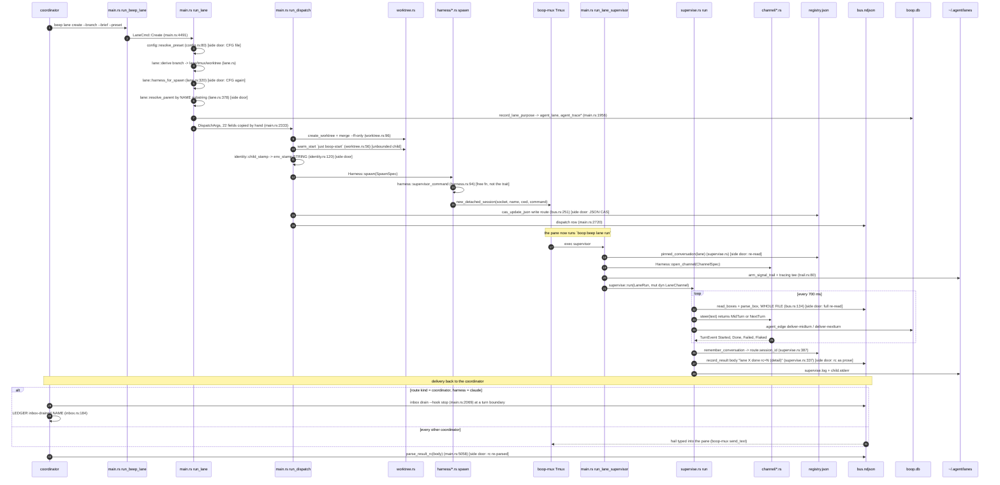
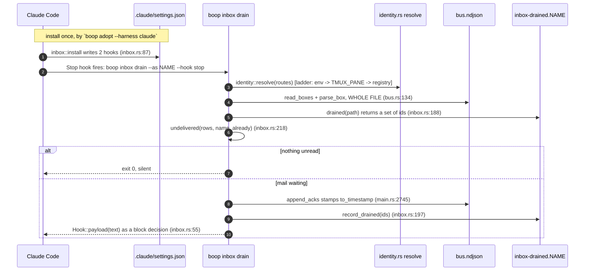

# boop audit, 2026-08-17

Read-only audit of `crates/boop` (+ `crates/boop-mux`, `crates/soopy` at the
call seams) at `88dd100`. No code changed.

## Contents

1. [Facts at spawn, re-measured](#1-facts-at-spawn-re-measured)
2. [CLI surface](#2-cli-surface)
3. [Trait math](#3-trait-math)
4. [Wiring findings](#4-wiring-findings)
5. [Type findings](#5-type-findings)
6. [Flow diagrams](#6-flow-diagrams)
7. [main.rs split proposal](#7-mainrs-split-proposal)
8. [boop verbs as dl6 hosts](#8-boop-verbs-as-dl6-hosts)
9. [Ranked findings](#9-ranked-findings)
10. [Cards to file](#10-cards-to-file)

---

## 1. Facts at spawn, re-measured

| claim in the brief | measured at 88dd100 | verdict |
|---|---|---|
| `main.rs` 5791 lines | 6061 | stale, grew |
| `ident.rs` 3355 | 2981 | stale, shrank |
| `runtime.rs` 1609 | 1609 | holds |
| `concatmap.rs` 1390 | 1393 | holds |
| 26183 lines in `crates/boop/src` | 26845 | stale |
| three traits | `proc.rs:26 ProcReader`, `channel.rs:101 LaneChannel`, `harness.rs:15 Harness` | holds |
| four harness impls, three channels | four harness impls, **five** channel impls (`opencode`, `claude`, `tui`, `kimi`, `codex`) | brief undercounts |
| store is SQLite `~/.agent/boop.db` | 382 MB on this machine | holds |

`cargo test -p boop -j4`: **341 passed, 0 failed, 1 ignored**, exit 0, ~15 s
wall. The ignored one is `bench_grid`.

A second store exists that the brief does not name: the file bus at
`~/.agent/mail/` (`registry.json` 3.7 KB, `bus.ndjson` 716 KB / 1707 rows,
`inbox-drained.<name>` ledgers), plus per-lane trails at `~/.agent/lanes/`
(25 dirs). Section 4 is mostly about that second store.

---

## 2. CLI surface

Store keys used below: **DB** = `~/.agent/boop.db`; **REG** =
`<mail>/registry.json`; **BUS** = `<mail>/*.ndjson`; **LEDGER** =
`<mail>/inbox-drained.<name>`; **TRAIL** = `~/.agent/lanes/<lane>/`; **CFG** =
`<config_dir>/boop/config.json`; **TMUX** = the multiplexer; **XSCRIPT** = the
harness transcripts on disk; **SET** = `<cwd>/.claude/settings.json`.

`host shape` reads as a `sh`-style host declaration: input columns to output
columns. `hostable today` is `yes` (typed rows exist now), `needs typed
output` (the verb prints prose or a table with no row struct), or `effect`
(side-effecting; a dl6 host would be a mutation, not a bind).

### 2.1 The `beep` tree (drive agents)

| verb | args | reads | writes | caller | host shape | hostable today |
|---|---|---|---|---|---|---|
| `beep harness list` | none | registry (compiled) | none | human | `() -> (harness: text)` | yes |
| `beep harness get` | `<harness>` | compiled caps | none | human | `(harness: text) -> (send_midflight: bool, resume: bool, spawn: bool, subagent_visible: bool)` | yes |
| `beep lane list` | `--state --harness --mail-dir` | REG, TMUX, BUS, TRAIL | none | human, coordinator | `(state: option(text), harness: option(text)) -> (lane, state, harness, tmux, cwd, dead_reason: text)` | needs typed output (`main.rs:4642` prints padded text, no row struct) |
| `beep lane create` | 18 flags | CFG, REG, TMUX, git, DB | REG, TMUX, DB(`agent_lane`,`agent_trace*`), worktree | human, coordinator | `(branch, brief, goal, model, preset, base_sha, parent) -> (lane, tmux, worktree, base_sha, rc)` | effect |
| `beep lane run` | `--lane --harness --brief --model --resume --variant` | BUS, REG, brief file | BUS, REG, TRAIL, DB | the lane pane only | n/a (the supervisor loop) | effect |
| `beep lane get` | `<lane>` | REG, TMUX | none | human | `(lane) -> (kind, harness, tmux, cwd, model, session_id, parent, goal, state)` | needs typed output |
| `beep lane patch` | `<lane> --tmux …` | REG | REG | human | `(lane, tmux, harness, session_id, cwd, model, mode, parent, goal) -> (ok: bool)` | effect |
| `beep lane delete` | `<lane> --route-only --state` | REG, TMUX | REG, TMUX | human, on-exit epilogue | `(lane, route_only: bool) -> (killed: bool)` | effect |
| `beep lane prune` | `--dry-run` | REG, TMUX, proc | REG | human, cron | `(dry_run: bool) -> (lane, reason: text)` | effect |
| `beep lane route` | `<lane>` | REG | none | human, scripts | `(lane) -> (tmux: text, session_id: text)` | needs typed output |
| `beep lane pane` | `<lane> --lines` | TMUX capture | none | human | `(lane, lines: int) -> (screen: text)` | needs typed output |
| `beep lane message list` | `<lane>` | BUS | none | human | `(lane) -> (id, from, to, kind, ts, body)` | needs typed output (`bus::Message` is not `Serialize`) |
| `beep lane wait` | `<lane> --timeout` | BUS, REG | none | coordinator | `(lane, timeout: int) -> (rc: int)` | effect (blocking) |
| `beep agent register` | `<name> --kind --parent` | REG | REG | native subagent | `(name, kind, parent) -> (ok: bool)` | effect |
| `beep agent done` | `<name> --rc` | REG | REG, BUS | native subagent | `(name, rc: int) -> (ok: bool)` | effect |
| `beep hail` | `<lane> --body --from --kind --wait-timeout` | REG, TMUX | BUS, TMUX, DB(`agent_edge`) | coordinator, lane | `(lane, body, from, kind) -> (id: text, delivery: text)` | effect |
| `beep message ack` | `--lane --box --max-age-days` | BUS, REG | BUS | human, cron | `(lane, max_age_days: int) -> (acked: int)` | effect |
| `beep ps` | `[lane] --all` | REG, TMUX, proc | none | human, coordinator | `(lane: option(text), all: bool) -> (lane, pid: int, rss: int, cpu: real, uptime: int, children: int)` | needs typed output |
| `beep pstree` | `--all --format` | REG, TMUX, proc | none | human | `(all: bool) -> (lane, parent, depth: int, state)` | yes (`LaneNode`, `main.rs:5225`, ndjson form exists) |

### 2.2 The `db` tree (read what agents did)

| verb | args | reads | writes | caller | host shape | hostable today |
|---|---|---|---|---|---|---|
| `db "<SQL>"` | `<SQL> --format` | DB read-only | none | human, agent | `boop_db(sql: text) -> (row: json)` | yes (`ident.rs:462 passthrough`) |
| `db session list/get` | `--limit --format` | DB | none | human | `() -> SessionRow` | yes (`rows.rs:12`) |
| `db turn list/get` | `QueryArgs` | DB | none | human, concatmap | `(harness, session, role, since, until, turn_from, turn_to, path, limit) -> TurnRow` | yes (`rows.rs:57`) |
| `db chat list` | `QueryArgs --all --follow` | DB | none | human | `(…same filter…) -> ChatTurn` | yes (`chat.rs:17`) |
| `db touch list` | `FactArgs` | DB | none | human, concatmap | `(session, since, until, like, limit) -> TouchRow` | yes (`rows.rs:70`) |
| `db command list` | `FactArgs` | DB | none | human | `(…) -> CommandRow` | yes (`rows.rs:81`) |
| `db fetch list` | `FactArgs` | DB | none | human | `(…) -> FetchRow` | yes (`rows.rs:90`) |
| `db skill list` | `FactArgs` | DB | none | human | `(…) -> (session, turn, ts, skill)` | needs typed output (no row struct; goes through `query_facts`) |
| `db pr list` | `FactArgs` | DB | none | human | `(…) -> (session, turn, ts, pr)` | needs typed output |
| `db span list` | `FactArgs` | DB | none | human | `(…) -> (session, turn, ts, span)` | needs typed output |
| `db edge list` | `--session --limit` | DB | none | human | `(session, limit) -> EdgeRow` | yes (`rows.rs:100`) |
| `db usage` | `--format --show-sql` | DB | none | human | `() -> UsageRow` | yes (`rows.rs:119`) |
| `db usage blocks` | `--window-hours --active` | DB | none | human | `(window_hours: int, active: bool) -> UsageRow` | yes |
| `db usage burn-rate` | `--window-minutes` | DB | none | human | `(window_minutes: int) -> (tokens_per_min: real, usd_per_hour: real)` | needs typed output |
| `db price list/set` | 6 rate flags | DB | DB(`model_price`) | human | `(model, input_per_mtok, output_per_mtok, …) -> (ok: bool)` | effect |
| `db favorite add/list` | `--file --note --source` | stdin/file, DB | DB(`agent_favorite`, `markdown_cache`) | human | `(body, note, source) -> (id: int)` | effect / yes for list |
| `db sync create` | `--rebuild --forever` | XSCRIPT, DB | DB (all fact tables) | human, daemon | `(rebuild: bool) -> (sessions: int, turns: int, …)` | effect |
| `db sync-cursor list` | `--limit` | DB | none | human | `() -> FactCursor` | yes (`rows.rs:135`) |
| `db status` | `--window --format` | DB, REG, TMUX, proc | DB(`agent_live*`) | human, coordinator | `(window: int) -> StatusRow` | yes (`rows.rs:25`), but it WRITES on read |

### 2.3 Top-level verbs

| verb | args | reads | writes | caller | host shape | hostable today |
|---|---|---|---|---|---|---|
| `concatmap` | 12 flags | DB(ro), CFG, state dir, env | state dir, harness child | human | see [section 8.2](#82-concatmap-as-rules) | mixed |
| `whoami` | `--json` | env, REG, TMUX | none | agent | `() -> (name, rung, confidence, session, lane, parent, harness, pane)` | yes (`identity.rs:50 to_json`) |
| `wait` | `[id] --me --as --wait-timeout` | BUS | BUS (ack) | agent | `(id, as: text, timeout: int) -> (message: json)` | effect (blocking) |
| `inbox drain` | `--as --hook` | BUS, LEDGER | BUS, LEDGER | claude Stop/UserPromptSubmit hook | `(as: text, hook: text) -> (text: text)` | effect |
| `inbox hooks` | `--name --cwd --uninstall` | SET | SET | human | `(name, cwd, uninstall: bool) -> (changed: int)` | effect |
| `me` | `--name` | TMUX, env | REG | interactive codex pane | `(name) -> (lane: text)` | effect |
| `config path/show/presets` | none | CFG | none | human | `() -> (preset, model, variant, harness, is_default: bool)` | needs typed output |
| `agent summary/sessions` | `--format --cwd --history` | DB, REG, TMUX, proc | DB | CASS, instant | `() -> AgentSummary` (json) | yes |

### 2.4 Hidden pre-split verbs

16 top-level verbs carry `#[command(hide = true)]` (17 attributes in the file; the 17th hides `db agent-summary`) and route to the same
`run_*` function as their `beep`/`db` twin. They are not separate code paths;
they are 470 lines of duplicated clap arms in `main.rs:325-611` plus the match
arms at `main.rs:646-919`.

| hidden verb | live spelling | note |
|---|---|---|
| `harnesses` | `beep harness list` | |
| `sessions` | none (no `beep` twin) | orphan, not an alias |
| `tail <session>` | none | orphan; the only byte-offset reader on the CLI |
| `events` | `db turn list` | |
| `list` | `beep lane list` | different output shape |
| `measure` | `beep ps` | |
| `dispatch` | `beep lane create` | 17 flags, the low-level form |
| `resolve` | `beep lane route` | plus a 3 s poll |
| `hail` | `beep hail` | hidden form keeps `--box_`, live form drops it |
| `sweep` | `beep message ack` | |
| `lane` | `beep lane create` | |
| `adopt` | `beep lane patch` + hook install | **not equivalent**; only `adopt` installs the claude hook inbox |
| `prune` | `beep lane prune` | hidden form has no `--dry-run` |
| `chat` | `db chat list` | |
| `sync` | `db sync create` | |
| `follow` | `db sync create --forever` | |

Three of the sixteen are not aliases at all (`sessions`, `tail`, `adopt`), so
"delete the hidden tree" is not a pure deletion. `adopt` is the one the
doctrine tells coordinators to run (`CLAUDE.md`), and it is hidden.

### 2.5 Ergonomics defects found in `--help`

| defect | evidence | why it bites |
|---|---|---|
| 8 `db` subcommands print a blank description | `boop db --help`: `session`, `touch`, `command`, `fetch`, `skill`, `pr`, `span`, `edge` have no `///` on their `DbCmd` arm (`main.rs:4113-4160`) | the read tree is the agent-facing one |
| `db turn list` and `db chat list` describe themselves as "The shared read filter, used by `chat` and `events`" | clap derive lifts the doc comment of the flattened `QueryArgs` struct (`main.rs:560`) onto the subcommand | the help names two verbs (`chat`, `events`) that are hidden |
| `beep harness list`/`get` blank | `HarnessCmd` (`main.rs:3768-3772`) | |
| `lane create` needs 4 flags for the documented common case | `--branch --brief --goal --preset` plus `--base-sha` per `CLAUDE.md` | `--base-sha` already defaults to `origin/main`; the doctrine tells callers to pass it anyway |
| `--mail-dir` is declared 34 times | `grep -c 'mail_dir: Option<PathBuf>,' main.rs` = 34 | a global `#[arg(global = true)]` would carry it once |
| `--format` spelled 3 ways | `QueryFormat` (ndjson/text), `OutputFormat` (text/json), `PstreeFormat` (text/ndjson) | three enums, three defaults, same idea |
| `--wait-timeout` vs `--timeout` | `beep hail --wait-timeout`, `lane create --wait-timeout`, `beep lane wait --timeout` | same concept, two spellings, three defaults (540 / 3600 / 0) |

No verb encodes SQL in flags. `db "<sql>"` is the query surface and the
`db <noun> list` verbs are named row projections over typed structs, which is
what the standing law asks for. `db usage --show-sql` prints the alias SQL.

---

## 3. Trait math

### 3.1 `Harness` (`harness.rs:15`)

11 methods, 4 real impls, 1 fake.

| method | claude | codex | kimi | opencode | notes |
|---|---|---|---|---|---|
| `id` | y | y | y | y | |
| `sessions` | y | y | y | y | |
| `read_from` | y | y | y | y | |
| `ingest` (default) | **default** | override | override | override | claude alone takes the default `project_transcript` |
| `capabilities` | y | y | y | y | |
| `preview_command` | y | y | y | y | |
| `one_shot` | **default (bail)** | default (bail) | default (bail) | y | only opencode; `concatmap` OneShot feed therefore works on exactly one harness |
| `spawn` | y | y | y | y | |
| `send` | y | y | y | y | |
| `stop` | y | y | y | y | |
| `open_channel` | y | y | y | y | |

| break | site | shape |
|---|---|---|
| a general date parser lives inside an adapter and is imported by three other modules | `harness/claude.rs:352 pub(crate) fn parse_iso_ms` used from `harness/codex.rs:314,439`, `ident.rs:1337,1409`, `chat.rs:82` | `claude` is a namespace for `time`; belongs in a `timestamp` module |
| `main.rs` has its own second `parse_iso_ms` | `main.rs:2297` | two parsers for the same RFC-3339 input |
| `spawn`/`send`/`stop`/`preview_command`/`capabilities` exist on the trait but the spawn path calls `harness::supervisor_command` instead | `harness.rs:94 supervisor_command` builds the same command string for every adapter; `Harness::spawn` is then called with the composed spec | the spawn seam is half trait method, half free function |
| `Registry::all()` returns `&[Box<dyn Harness>]`, forcing callers to double-deref | `registry.rs:28` | `impl Iterator<Item = &dyn Harness>` is the shape callers want |
| `concatmap` leaks the registry to get `&'static dyn Harness` | `concatmap.rs:717 Box::leak(Box::new(Registry::discover()))` | the trait is `Send + Sync`; a `&'static` requirement comes from `one_shot_bounded` spawning a thread (`concatmap.rs:790`) |
| `#![allow(dead_code)]` at the top of `harness.rs` | `harness.rs:2` | suppresses the exact signal that says which trait methods are unused |

### 3.2 `LaneChannel` (`channel.rs:101`)

9 methods, 5 real impls, 3 fakes.

| method | opencode | claude | codex | kimi | tui | notes |
|---|---|---|---|---|---|---|
| `conversation_id` | y | y | y | y | y | |
| `conversation_id_kind` | default | default | default | default | **override** | only the TUI answers something else |
| `set_brief` | default (no-op) | default | default | default | **override** | the respawn re-feed (PR #13) lives only in TUI |
| `start_turn` | y | y | y | y | y | |
| `steer` | y | y | y | y | y | |
| `next_event` | y | y | y | y | y | |
| `interrupt` | default | default | default | default | override | |
| `last_activity_ms` | **override** | default | default | default | override | |
| `close` | y | y | y | y | y | |

| break | site | shape |
|---|---|---|
| `channel/opencode.rs` and `channel/kimi.rs` are 339 + 170 lines that both delegate to `TuiChannel` | `channel/opencode.rs:36`, `channel/kimi.rs:36`, profiles at `channel/tui.rs:504` and `:527` | two impls of the trait exist only to carry a `TuiProfile`; the profile is already data |
| the profile carries the harness id as `&'static str` and the TUI branches on transport quirks by field, not by id | `channel/tui.rs:504-538` (`steer_key: None` vs `Some("C-s")`, `boot_keys`) | this is the RIGHT shape; the two wrapper impls above are what should go |
| `supervise` holds `&mut dyn LaneChannel` and no harness id | `supervise.rs:100,188,387` | clean; the trait math holds here |
| 5 methods have defaults that 4 of 5 impls take | table above | `set_brief`, `interrupt`, `last_activity_ms`, `conversation_id_kind` are TUI-only concerns wearing trait clothes |

### 3.3 `ProcReader` (`proc.rs:26`)

5 methods, 1 real impl (`SysinfoSnapshot`), 3 fakes.

| break | site | shape |
|---|---|---|
| callers take the concrete type, not the trait | `main.rs:4812 dead_reason(route, snapshot: &proc::SysinfoSnapshot)`; `main.rs:5114 run_ps` builds a `SysinfoSnapshot` directly | the trait exists so the reader is fakeable; two call sites bypass it |
| `SysinfoSnapshot::tree_sum` is an inherent method duplicating the free `tree_sum_of(&dyn ProcReader, …)` | `proc.rs:54` vs `proc.rs:90` | two ways to sum a tree, one trait-generic, one not |
| `descendent_count` is spelled with an `e` | `proc.rs:40` | `descendant` everywhere else in the file |
| `#![allow(dead_code)]` | `proc.rs:3` | same signal suppression |

---

## 4. Wiring findings

### W1. The bus is a full-file re-read on a 700 ms poll (top finding)

Every supervisor calls `supervise::pending` (`supervise.rs:61`) every
`POLL = 700 ms` (`supervise.rs:15`). That calls `bus::read_boxes` +
`bus::parse_box` (`bus.rs:134`, `bus.rs:150`), which `read_to_string`s **every
`.ndjson` file in the mail dir** and `serde_json`-parses **every line**.

Measured on this machine right now: `~/.agent/mail/bus.ndjson` is 716 KB /
1707 rows, append-only, no rotation. Per live lane that is ~1 MB/s of read and
~2400 JSON parses/s. `trail::dead_reason` (`trail.rs:131`) and
`main.rs:1438 all_messages` do the same full read per call, and `lane list`
calls `dead_reason_token` once per dead lane.

`lib.rs:3` says the thing this crate replaces is agent-session's "transport
(full-file re-reads)". The mail leg still does it.

### W2. The lane result code round-trips through prose

`supervise.rs:337 record_result` writes the exit code into `Message.body` as
the text `lane <id> done rc=<n> (<detail>)`. Three separate parsers recover it:

| parser | site |
|---|---|
| `parse_result_rc` | `main.rs:5058` |
| `parse_result_body` | `trail.rs:118` |
| `mailwait` reply matching | `mailwait.rs:64` (matches on id, not rc) |

`bus::Message` has no `rc` field and no `detail` field. `beep lane wait` exits
with a number recovered by `body.split_whitespace().find_map(strip_prefix("rc="))`.

### W3. `registry.json` is a hand-rolled CAS store beside a SQLite database

| leg | site |
|---|---|
| read | `bus.rs:57 read_routes`, then `bus.rs:72 route_from_value` builds `Route` field by field out of `serde_json::Value` |
| dual key spellings | `sessionId` OR `session_id`, `sourcePath` OR `source_path`, `registeredAt` OR `registered_at`, `baseSha` OR `base_sha`, `worktreeDir` OR `worktree_dir` (`bus.rs:92-104`) |
| a bare string is a legal route | `bus.rs:77` |
| write | `bus.rs:251 cas_update_json`: read, hash, mutate, re-read, compare hash, `fs::rename` |
| the hash is `DefaultHasher` | `bus.rs:290 sha256_hex` is named sha256 and is a 64-bit SipHash |
| retry ladder | 5 attempts, then `bail!` |

`Route` is not `Serialize`; `main.rs:2677 route_to_json` hand-builds the JSON
object, so the read shape and the write shape are two hand-written mirrors that
can drift. `~/.agent/mail/registry.json.bak-20260809` (30 KB) sits next to the
live 3.7 KB file with nothing owning it.

Against the standing law "boop never reinvents SQLite or SQL": the transcript
store obeys it and the lane store does not.

### W4. `expand_env` pulls arbitrary process env into rules and templates

`concatmap.rs:417 expand_env` substitutes `${NAME}` and `${NAME:-default}` from
`std::env::var` into both the rules JSON and the prompt template, before parse.
Unset and defaultless silently becomes empty string (`concatmap.rs:431`). No
contract names which variables a rules file may read.

### W5. SQL built by string interpolation

```rust
// concatmap.rs:258
let sql = format!(
    "SELECT input_tokens + cache_read_tokens AS ctx FROM agent_usage
     JOIN dict_session s ON s.id = agent_usage.session_id
     WHERE s.value = '{session}' ORDER BY ts DESC LIMIT 1"
);
let (_, rows) = store.passthrough(&sql).ok()?;
```

The session id comes from `LaneChannel::conversation_id()`, so it is
harness-controlled text spliced into a quoted literal. Every other read in the
crate binds parameters. It also routes a first-party read through
`passthrough`, the door meant for a human typing SQL, and swallows the error
with `.ok()?`.

### W6. One shell-quoting function, eight copies

Byte-identical `format!("'{}'", value.replace('\'', r"'\''"))`:

| site | name |
|---|---|
| `harness.rs:117` | `quote` |
| `lane.rs:262` | `shell_word` |
| `identity.rs:133` | `shell_word` |
| `main.rs:2559` | `shell_quote` |
| `channel/tui.rs:540` | `quote` |
| `harness/claude.rs:139` | `shell_quote` |
| `harness/codex.rs:197` | `shell_quote` |
| `harness/opencode.rs:472` | `shell_quote` |

Plus `harness/opencode.rs:478 shell_quote_double`, a ninth variant. Every lane
spawn composes a shell line through these; a fix to one fixes one eighth of the
spawn path.

### W7. Other duplicated helpers

| helper | copies | sites |
|---|---|---|
| `random_hex` | 3 | `harness/{claude:145, codex:201, opencode:484}` |
| `now_ms` | 4 | `channel.rs:149`, `main.rs:5782`, `harness/{codex:210, opencode:493}` |
| `record(stat, inserted)` | 3 | `harness/{opencode:302, codex:383, kimi:310}` |
| `parse_iso_ms` | 2 | `harness/claude.rs:352`, `main.rs:2297` |
| `TempRepo` test fixture | 3 | `harness/{claude:517, codex:726, opencode:864}`, identical but for the temp-dir prefix, while `test_support.rs` already exists |
| bus.ndjson appender | 2 | `supervise.rs:373 append_row`, `main.rs:2720 append_message_to` |
| `coalesce_with_cap` / `coalesce_jobs` | 2 | `concatmap.rs:398` and `concatmap.rs:640`, same body over two element types |
| model `@variant` split | 4 | `lane.rs:269`, `lane.rs:295`, `channel/codex.rs:149 split_effort`, `harness/codex.rs:177` (the last two repeat the `low\|medium\|high` allowlist) |

### W8. `Command::new` has no single spawn seam

58 `Command::new` sites. `worktree.rs` alone has 23 `Command::new("git")`,
mostly funnelled through `run_git` (`worktree.rs:96`) but not all
(`worktree.rs:100`, `:317`, `:563` build their own). Three unbounded children
sit in the spawn path:

| site | child | bound |
|---|---|---|
| `worktree.rs:83 has_recipe` | `just --show boop-start` | none |
| `worktree.rs:62 warm_start` | `just boop-start` | none |
| `worktree.rs:119 run_shell` | `sh -c <setup step>` | none |

Against the 10-second law: a lane spawn can block for as long as the repo's
`just boop-start` takes, with no deadline and no way to say what it was doing.

### W9. Typed values flattened to strings and re-split

| value | typed upstream | flattened at | re-parsed at |
|---|---|---|---|
| tmux target (`session` vs `session:win.pane`) | `SpawnSpec.tmux`, `Route.tmux` | stored as one `Option<String>` | `main.rs:4710 lane_state` does `target.split(':').next()`; `channel/tui.rs:550` parses the pane index back out |
| `model@effort` | the CLI flag and the preset | one `String` | 4 sites (W7) |
| message `kind` | 6 known values | `Message.kind: String` | `supervise.rs:80 deliverable` matches `"request" \| "hail" \| "note" \| "retry" \| "resume"`; `trail.rs:139` matches `"result"`; `main.rs:1989 record_control_edge` matches more |
| route `kind` | 3 known values | `Route.kind: String` defaulting to `"lane"` | `lane.rs:378` matches on `lane.contains("coordinator")` (a substring of the NAME, not the kind) |
| lane state | derived | `&'static str` `"live"/"dead"/"?"` | `beep lane list --state <s>` and `lane delete --state <s>` filter on the string |
| concatmap done marker | `(session, turn)` | a filename `<session>-<turn>` | `concatmap.rs:693 name.rsplit_once('-')` |

`lane.rs:378 resolve_parent` picking the coordinator by
`routes.keys().filter(|lane| lane.contains("coordinator"))` is the sharpest
one: `Route.kind` already carries `"coordinator"` and the code reads the name
instead.

### W10. Env vars as transport

| var | written | read |
|---|---|---|
| `BOOP_SESSION`, `BOOP_LANE`, `BOOP_PARENT`, `BOOP_HARNESS` | `identity.rs:120 child_stamp` composes a shell `A=b C=d` prefix; `SpawnSpec.env_stamp` carries it as a **string** | `identity.rs:81-89` |
| `TMUX_PANE` | tmux | `identity.rs:89`, `identity.rs:98`, `main.rs:5822`, `channel/tui.rs:473` (4 sites) |
| `BOOP_DB` | operator | `ident.rs:290` |
| `LC_ALL`, `LANG` | shell | `lane.rs:241` |
| anything | operator | `concatmap.rs:430-431`, unrestricted |

`env_stamp: Option<String>` (`harness.rs:203`) is a pre-quoted shell fragment
carried through `SpawnSpec` and prepended by string concat in three adapters
(`harness/claude.rs:125`, `harness/codex.rs:190`, `harness.rs:110`). A
`BTreeMap<String, String>` would let the spawn seam quote it once.

### W11. Things that are wired right

Worth naming so a later pass does not "fix" them:

| leg | why it holds |
|---|---|
| the DB schema | dictionary tables with `INTEGER PRIMARY KEY` and `UNIQUE` on the natural key (`ident.rs:1645-1677`); no composite TEXT PK anywhere |
| SQL parameter binding | every read outside W5 uses `params!` / named binds |
| `unwrap`/`expect` on IO | 4 sites total in production code (`inbox.rs` 2, `main.rs` 1, `channel/jsonrpc.rs` 1) |
| `eprintln!` | 9 sites, one carries an `@eprintln-ok` waiver (`main.rs:2175`); `tracing` is used throughout the supervisor |
| the CLI does not match on harness id | confirmed: no `match harness_id` outside `registry.rs`; the string literals in `lane.rs:22-45` are model-prefix tables, not dispatch |
| `window_rows` validates its row contract | `query.rs:48`, errors name the missing column |

---

## 5. Type findings

### 5.1 Structs with 8+ fields

| struct | fields | site |
|---|---|---|
| `DispatchArgs` | 22 | `main.rs:1485` |
| `LaneArgs` | 19 | `main.rs:2309` |
| `StatusRow` | 19 | `rows.rs:25` |
| `SpawnSpec` | 18 | `harness.rs:184` |
| `AgentRuntimeRow` | 16 | `runtime.rs:176` |
| `ActivityCount` | 15 | `activity.rs:37` |
| `Route` | 13 | `bus.rs:30` |
| `AgentSummaryActivity` | 13 | `summary.rs:56` |
| `AgentEvent`, `UsageRow`, `ResolvedRoute` | 12 | `event.rs:11`, `rows.rs:119`, `runtime.rs:50` |
| `TuiChannel`, `SessionRef`, `LaneSpawn` | 11 | `channel/tui.rs:40`, `harness.rs:129`, `ident.rs:100` |
| `LaneRuntime`, `Args`, `QueryArgs` | 10 | `runtime.rs:107`, `concatmap.rs:37`, `main.rs:561` |
| `AgentShellNode`, `TurnQuery`, `LaneNode` | 9 | `_0_session_graph.rs:66`, `ident.rs:86`, `main.rs:5225` |
| `SessionRow`, `Message`, `ChatTurn` | 8 | `rows.rs:12`, `bus.rs:17`, `chat.rs:17` |

### 5.2 One spawn, four parallel shapes

`LaneArgs` (19) -> `DispatchArgs` (22) -> `SpawnSpec` (18) -> `Route` (13).
Field-by-field overlap:

| field | LaneArgs | DispatchArgs | SpawnSpec | Route | LaneSpawn |
|---|---|---|---|---|---|
| harness | y | y | y | y | y |
| model | y | y | y | y | y |
| branch | y | y | y | - | y |
| base_sha | y | y | y | y | - |
| cwd | y | y | `repo`+`worktree_dir` | y | y |
| tmux | y | y | y | y | - |
| socket | y | y | y | - | - |
| parent | y | y | - | y | y |
| goal | y | y | - | y | y |
| brief | y | `cmd`/`body` | `prompt` | - | `brief_path`+`brief_body` |
| variant | y | y | y | - | - |
| mail_dir | y | y | y | - | - |
| lane id | `name` | `to` | `lane` | (the map key) | `lane` |

Five names for the lane id (`name`, `to`, `lane`, the key, `lane`), three for
the brief (`brief`, `cmd`, `prompt`), two for the repo (`cwd`, `repo`). Each
hop is a hand-written field copy in `main.rs`; `main.rs:646-919` alone contains
two full 22-field literal constructions of `DispatchArgs`.

### 5.3 `String` fields that want a newtype or an enum

| field | site | should be |
|---|---|---|
| `Route.kind` | `bus.rs:32` | `enum RouteKind { Lane, Coordinator, Native }` |
| `Message.kind` | `bus.rs:23` | `enum MailKind { Request, Hail, Note, Retry, Resume, Result, Dispatch }` |
| `Message.from_timestamp` / `to_timestamp` | `bus.rs:21-22` | `i64` epoch ms, or a `Timestamp` newtype; today they are RFC-3339 strings re-parsed 5 times |
| `Route.tmux`, `SpawnSpec.tmux` | `bus.rs:34`, `harness.rs:214` | `enum TmuxTarget { Session(String), Pane { session, window, pane } }` |
| `SpawnSpec.env_stamp` | `harness.rs:203` | `BTreeMap<String, String>` |
| `SpawnSpec.model` / `variant` | `harness.rs:206,209` | `struct ModelSpec { family: String, effort: Option<Effort> }` |
| `Route.registered_at`, `base_sha` | `bus.rs:46,49` | epoch ms; `struct Sha(String)` |
| `SessionRef.harness` is `&'static str` while `Route.harness` is `Option<String>` | `harness.rs:131` vs `bus.rs:31` | one `HarnessId` type |
| `lane_state` returns `&'static str` | `main.rs:4710` | `enum LaneState { Live, Dead, Unknown }`, which `--state` would then parse |
| `ParentPick.source: &'static str` | `lane.rs:69` | `enum ParentSource { Flag, Caller, Registry, None }` |

No `Option<Option<_>>` anywhere. Bool parameters worth naming:

| call | site |
|---|---|
| `run_chat_query(&query, all, follow, json)` | `main.rs:1032`, three bools in a row, `_json` is unused |
| `write_inbox_hooks(cwd, name, uninstall)` | `main.rs:2097`, one function for install and uninstall |
| `run_lane_delete(dir, lane, route_only)` | `main.rs:4747` |
| `report_inbox_hooks(cwd, name, uninstall, changed)` | `main.rs:2115` |

### 5.4 Shape duplication across `rows.rs` / `event.rs` / `lane.rs` / `registry.rs`

| pair | overlap |
|---|---|
| `harness::SessionRef` (11) and `rows::SessionRow` (8) | `session_id`/`session`, `nickname`, `harness`, `cwd`, `git_branch`/`branch`; one is the on-disk handle, one is the stored row, and nothing converts between them |
| `rows::StatusRow` (19) and `runtime::AgentRuntimeRow` (16) | both carry lane, state, pid, tmux_pane, rss, cpu, uptime, first_seen/last_seen/died |
| `runtime::ResolvedRoute` (12) and `bus::Route` (13) | `ResolvedRoute` is `Route` plus liveness; it re-lists every field |
| `event::AgentEvent` (12) and `rows::TurnRow` (6) + `rows::TouchRow` (6) | `AgentEvent` is the pre-projection form; `paths: Vec<ToolPath>` is the only nesting in the crate |
| `registry.rs` | 38 lines, no shape duplication; it is the clean one |

`rows.rs` claims "one struct maps 1:1 onto one relation" (`rows.rs:3`). That
holds for the DB rows and does not hold for `Route`, `SessionRef`,
`AgentRuntimeRow`, which are the lane-side shapes with no relation behind them.

---

## 6. Flow diagrams

### 6.1 `lane create` to coordinator drain



Side doors marked above, in one list:

| # | hop | door |
|---|---|---|
| 1 | `run_lane` | `config::loaded()` read from inside `harness_for_model`, not passed in |
| 2 | `resolve_parent` | picks the coordinator by name substring, ignoring `Route.kind` |
| 3 | `child_stamp` | identity crosses as a pre-quoted shell string |
| 4 | `cas_update_json` | route write is a file CAS, not a transaction |
| 5 | supervisor poll | whole mail dir re-read and re-parsed every 700 ms |
| 6 | `record_result` | exit code encoded in prose, recovered by 3 parsers |
| 7 | `pinned_conversation` | the supervisor re-reads the registry it just wrote |

### 6.2 `inbox drain --hook`



Side doors here:

| hop | door |
|---|---|
| `--as NAME` | the hook command line carries the coordinator name as a literal string, baked into `settings.json` by `inbox::drain_command` (`inbox.rs:81`); renaming the coordinator silently orphans the hook |
| LEDGER | a second durability record beside the bus ack, by the module's own admission (`inbox.rs:180`) |
| whole-file read | same W1 read, now on every Claude turn boundary |

---

## 7. `main.rs` split proposal

6061 lines. 930 are the inline `mod tests` (`main.rs:2772-3701`), so ~5130 are
production. Sections are already marked with `// ---` banners, which is the
seam to cut on.

| proposed module | verbs / content | source lines | count |
|---|---|---|---|
| `main.rs` (kept) | `Cli`, `SubCmd`, `main()`, `init_tracing`, `supervised_lane`, format enums | 1-947 | ~950 |
| `cli/beep.rs` | `BeepCmd`, `LaneCmd`, `AgentCmd`, `MessageCmd`, `HarnessCmd` decls + `run_beep`, `run_beep_lane`, `run_agent`, `run_harness_get`, lane list/get/delete/prune/pane/wait | 3708-3800, 4363-5160 | ~890 |
| `cli/db.rs` | `DbCmd` and its 15 child enums + `run_db`, `run_fact`, `run_status`, `run_passthrough`, `emit_json_rows` | 4080-4362, 5426-5816 | ~670 |
| `cli/spawn.rs` | `DispatchArgs`, `LaneArgs`, `run_dispatch`, `run_lane`, `resolve_dispatch_harness`, `spawn_env_stamp`, `git_head` | 1481-1687, 2305-2562 | ~465 |
| `cli/mail.rs` | `run_hail`, `deliver_hail`, `run_wait`, `wait_and_exit`, `run_sweep`, `cass_hit`, `append_message*`, `append_ack*`, `parse_iso_ms` | 1760-2304, 2716-2771 | ~600 |
| `cli/route.rs` | `run_adopt`, `run_prune`, `run_resolve`, `run_me`, `run_whoami`, `write_route`, `route_to_json`, `lane_state`, `dead_reason*` | 1688-1759, 2563-2715, 4703-4825 | ~350 |
| `cli/supervisor.rs` | `run_lane_supervisor`, `record_lane_purpose`, `record_control_edge` | 1893-2004 | ~110 |
| `cli/read.rs` | `run_harnesses`, `run_sessions`, `run_tail`, `run_query`, `run_chat_query`, `run_sync_all`, `run_follow`, `emit_*` | 948-1360 | ~410 |
| `cli/ps.rs` | `run_ps`, `run_pstree`, `LaneNode`, `resolve_edges`, `build_lane_nodes`, `render_text`, `render_ndjson` | 1361-1480, 5161-5425 | ~385 |
| `cli/config.rs` | `run_config`, `presets_table`, `default_preset_for_harness`, `run_usage*`, `run_price` | 5876-6061 | ~185 |
| `cli/doctrine.rs` | `DOCTRINE` and `CONCATMAP_EXAMPLES` string constants | 1-202 | ~200 |
| `tests/cli_*.rs` | the inline `mod tests`, moved to integration tests | 2772-3701 | ~930 |

Leaves `main.rs` at ~950 lines, all of it the clap tree and `main()`.

Two notes on the cut:

1. `DOCTRINE` (`main.rs:200`) is a 170-line string const that is the usage
   contract agents read. It contains a rotting number ("this build writes
   version 10") that duplicates `ident.rs:26 SCHEMA_VERSION`. Moving it should
   come with a `{SCHEMA_VERSION}` interpolation.
2. The 16 hidden verb arms (`main.rs:325-611` decls, `:646-919` dispatch) are
   ~470 lines that delete rather than move, once `sessions`, `tail` and `adopt`
   get real `beep`/`db` homes.

---

## 8. boop verbs as dl6 hosts

Scope from the card `~/projects/sprefa/issues/boop-hosted-in-dl6/item.md`. Rel
declarations only; where a dl6 construct is missing, the gap is named and the
section stops there.

The per-verb `host shape` and `hostable today` columns are in
[section 2](#2-cli-surface).

### 8.1 What is bindable, hostable, or neither

| class | count | verbs |
|---|---|---|
| `yes` (a typed row struct exists in `rows.rs` and the verb is a pure read) | 12 | `db "<sql>"`, `db session list/get`, `db turn list/get`, `db chat list`, `db touch/command/fetch list`, `db edge list`, `db usage`, `db usage blocks`, `db sync-cursor list`, `db status`, `beep pstree`, `whoami`, `beep harness list/get` |
| `needs typed output` (the read exists; the CLI prints prose or an untyped `Row`) | 11 | `beep lane list/get/route/pane`, `beep lane message list`, `beep ps`, `db skill/pr/span list`, `db usage burn-rate`, `config presets` |
| `effect` (a write, a spawn, or a block) | 19 | every `beep lane create/run/patch/delete/prune/wait`, `beep agent *`, `beep hail`, `beep message ack`, `db price set`, `db favorite add`, `db sync create`, `inbox *`, `me`, `wait` |

Caveat on the `yes` column: 8 pure-read call sites, covering 15 `db` verbs,
open the store **read-write** through `open_store()` (`main.rs:5437, 5442,
5454, 5482, 5528, 5545, 5598, 5614`). `open_store` is `Store::open`
(`main.rs:5555`), which runs the `CREATE TABLE IF NOT EXISTS` batch plus
`PRAGMA user_version` on every call. Only 4 sites use `open_ro_store()`
(`main.rs:5977`). A dl6 bind polling through those verbs is a would-be writer
against a 382 MB store in `journal_mode=delete`.

`db status` additionally joins a store row to a lane by comparing `route.cwd`
against the row's `cwd` string when the session id does not match
(`main.rs:5622`). Two lanes in one repo bind to the same row.

### 8.2 concatmap as rules

`concatmap` is already the shape the card describes. Splitting the current 1393
lines by dl6 role:

| dl6 role | today's code | notes |
|---|---|---|
| **bind** (rows arriving from the store) | `concatmap.rs:492 poll_once` -> `query.rs:349 turn_rows(TurnQuery)`; and `query.rs:48 window_rows(sql, …)` when `formula.window` is set | poll only; there is no sqlite update hook anywhere in the crate. `Store::open_readonly` (`ident.rs:202`) is what the loop uses, so a second reader is already the design |
| **pure rule** (`pair` from two `turn` rows) | `concatmap.rs:300 bundle_pairs`, `concatmap.rs:328 bundle_runs`, `concatmap.rs:293 trim_double_encoded`, `concatmap.rs:398 coalesce_with_cap`, `concatmap.rs:441 normalize` | all total functions over `&[TurnRow]`, no IO. These port to dl6 rules unchanged |
| **host** (the model pass) | `concatmap.rs:790 one_shot_bounded` -> `Harness::one_shot` (`harness.rs:54`), retry ladder at `concatmap.rs:585-610` (`REWRITE_ATTEMPTS = 3`, `REWRITE_BACKOFF = 10 s`, `ONESHOT_TIMEOUT = 600 s`) | the retry policy is caller-side, not adapter-side; a host contract has to say which side owns it |
| **host** (the resident chat) | `Rewriter::Chat` (`concatmap.rs:163`) driving `LaneChannel` | the chat feed returns `Ok(String::new())`: its output is not a value, it is the model's own transcript turns, ingested later by `db sync`. A dl6 host returning nothing and writing out-of-band has no shape in the card |
| **accumulator (scan)** | `done: BTreeSet<(String, i64)>` + `cursor: i64`, both mirrored to disk | see the side-door table below |
| **write side** | none. `run` opens the store read-only on purpose (`concatmap.rs:709`) | the "staged mutations back to the store" leg of the card does not exist yet |

Proposed rel decls, from what the code already computes:

```
rel turn(session: text, turn: int, ts: int, role: text, said: text)
rel pair(session: text, turn: int, ts: int, ai_text: text, user_text: text)
rel touch(session: text, turn: int, ts: int, path: text, verb: text)
rel done(session: text, turn: int)
host boop_oneshot(model: text, prompt: text) -> (output: text)
host boop_db(sql: text) -> (row: json)
```

`bundle_pairs` as a rule, in dl6 terms:

```
pair(Session, Turn, Ts, AiText, UserText) :-
    turn(Session, Turn, Ts, "user", UserText),
    not prefix(UserText, "mode: "),
    AiTurn = max { T : turn(Session, T, T2, "assistant", _), T2 < Ts },
    turn(Session, AiTurn, _, "assistant", AiText).
```

Every side door the current code reads state through, which a host contract
would have to name:

| # | door | site | what a contract must say |
|---|---|---|---|
| 1 | `<state>/cursor`, an i64 parsed out of a text file | `concatmap.rs:649 load_or_seed_cursor` | the loop's watermark lives outside the store; a dl6 bind would own it |
| 2 | `<state>/done/<session>-<turn>`, one empty file per processed pair, re-derived by filename split | `concatmap.rs:678 marker_planted`, `:686 load_done`, `:751 write_done_marker`, `:693 rsplit_once('-')` | the dedup relation is on disk as filenames; `rel done(session, turn)` in the store replaces it |
| 3 | arbitrary process env into the rules JSON and the template | `concatmap.rs:417 expand_env`, `:430-431` | which variables a rules file may read |
| 4 | interpolated SQL through `passthrough`, error swallowed | `concatmap.rs:258 mapper_context_tokens` | the context-size read has to be a bind, not a string splice |
| 5 | caller-owned raw SQL from a JSON file, replacing the compiled bundlers | `Formula.window` (`concatmap.rs:78`), contract in `query.rs:48` | either the window IS the dl6 rule, or it stays an escape hatch outside the language |
| 6 | `config::loaded()` read from inside `harness_for_model` | `lane.rs:275` called at `concatmap.rs:714` | model-to-harness resolution is a lookup table the host must be handed |
| 7 | the chat feed's output is the harness transcript, arriving later through a different process (`db sync`) | `concatmap.rs:247` returns `Ok(String::new())` | the host's output column is not produced by the host |
| 8 | `Box::leak(Registry)` to satisfy `&'static dyn Harness` | `concatmap.rs:717` | lifetime, not semantics; noted so a host wrapper does not inherit it |
| 9 | the loop's own turns are filtered back out by a string prefix (`"mode: "`) | `concatmap.rs:311` | self-exclusion is currently prose matching; a `rel` for loop-authored turns would say it |
| 10 | `state_dir` doubles as the resident model's cwd | `concatmap.rs:189` | one path carrying two meanings |

Named gaps, stated and stopped at:

| gap | why it stops here |
|---|---|
| a host whose output arrives out-of-band (the chat feed) | the card's `host … -> (output: text)` shape assumes the host returns the value. No dl6 construct here is asserted |
| retry / backoff / timeout as a declared policy on a host | `REWRITE_ATTEMPTS`, `REWRITE_BACKOFF`, `ONESHOT_TIMEOUT` are caller constants today. Whether that is host metadata or a rule is a language question |
| a dropped pair's status | the card lists it as undecided (option vs status column). Today a permanently-failed pair writes the SAME done marker as a mapped one (`concatmap.rs:745`), so success and permanent failure are indistinguishable on disk. This is a defect regardless of dl6 |
| bind by sqlite update hook | no update hook exists in the crate; `rusqlite`'s `update_hook` is unused. Poll is the only bind available today |
| a read that writes (`db status`) | needs a split before it can be a bind |

### 8.3 SQL statement inventory against `~/.agent/boop.db`

142 non-DDL statement sites in production code. By file:

| file | sites |
|---|---|
| `ident.rs` | 62 |
| `activity.rs` | 22 |
| `query.rs` | 22 |
| `usage.rs` | 12 |
| `_0_session_graph.rs` | 8 |
| `channel/opencode.rs` | 5 |
| `main.rs` | 5 |
| `harness/opencode.rs` | 3 |
| `concatmap.rs`, `harness/codex.rs`, `supervise.rs` | 1 each |

`channel/opencode.rs` and `harness/opencode.rs` (8 sites) read **opencode's
own** SQLite database (`session`, `message`, `part` tables), not `boop.db`.
They are excluded from the bind inventory below.

The tables a dl6 bind would need, with the function that owns each:

| table | R sites | W sites | owning functions |
|---|---|---|---|
| `agent_turn` | `ident.rs:233,443,526,1176`; `query.rs:350,447,450,451`; `main.rs:57` | `ident.rs:358 add_turn` | `is_stale`, `max_turn`, `sparse_sessions`, `query_turns`, `turn_rows`, `session_rows` |
| `agent_session` | `ident.rs:1179`; `query.rs:353`; `activity.rs:56,58` | `ident.rs:341 upsert_session_row` | |
| `agent_usage` | `ident.rs:420`; `query.rs:537,539`; `usage.rs:220,304`; `concatmap.rs:260`; `activity.rs:62` | `ident.rs:397 add_usage` | the one interpolated read is `concatmap.rs:260` |
| `agent_touch` | `ident.rs:1215`; `query.rs:203,363` | `ident.rs:562 add_touch` | `touch_rows` is the `references` feed |
| `agent_cmd` | `query.rs:253` | `ident.rs:581 add_cmd` | |
| `agent_fetch` | `query.rs:300` | `ident.rs:594 add_fetch`, `:605 add_search` | |
| `agent_skill` | via `query_facts` (`query.rs:173`) | `ident.rs:616 add_skill` | no typed row struct |
| `agent_pr` | `ident.rs:185`; via `query_facts` | `ident.rs:626 add_pr`, `:184` migration | no typed row struct |
| `agent_span` | via `query_facts` | (written by projection) | no typed row struct |
| `agent_edge` | `ident.rs:897,956,986`; `usage.rs:189`; `_0_session_graph.rs:168`; `main.rs:150` | `ident.rs:724 add_edge_at`, `:744 ensure_edge` | `edge_rows` is typed |
| `agent_lane` | `ident.rs:83,85` (activity), `_0_session_graph.rs:200`; `activity.rs:76` | `ident.rs:870 record_lane_spawn` | the spawn ledger |
| `agent_trace` / `agent_trace_span` | `ident.rs:786,819`; `activity.rs:64,70,72,74`; `main.rs:184` | `ident.rs:804,809 attach_trace`, `:930,935 backfill_traces` | |
| `agent_favorite` | `ident.rs:243`; `query.rs:491` | `ident.rs:280,774 favorite_add` | |
| `agent_live` / `agent_live_span` | `ident.rs:1038,1070,1100`; `query.rs:550-556` | `ident.rs:1027,1054,1060 record_status` | read path writes |
| `sync_cursor` | `ident.rs:649,667`; `query.rs:400,505` | `ident.rs:636 set_cursor`, `:1317` | |
| `markdown_cache` | `ident.rs:763` | `ident.rs:758 intern_markdown` | brief bodies dedupe here |
| `model_price` | `usage.rs:286` | `usage.rs:324,328 price_set` | |
| `dict_*` (24 tables) | `ident.rs:317,320,947`; `query.rs:34`; `usage.rs:187,197` | `ident.rs:315 intern`, `:368 intern_request` | every natural key lives here once, `UNIQUE` on `value` |
| `sqlite_master` | `ident.rs:153,264` | - | schema probing |

Assessment for a dl6 bind: the schema is already dictionary-encoded with
`INTEGER PRIMARY KEY` surrogates and `UNIQUE` on each natural key
(`ident.rs:1645-1677`), which is the shape the sprefa relational law asks for.
A `rel turn(session, turn, ts, role, said)` bind is a join of `agent_turn`
against `dict_session` and `dict_role`, which is exactly what
`query.rs:349 turn_rows` already emits as `TurnRow`. The read side needs no
schema work.

Two blockers stand in front of a poller, both already carded:

| blocker | card |
|---|---|
| `journal_mode=delete` on a 382 MB store; a dl6 poller is one more reader against a single writer lock | `boop-db-wal-lock` (WAL first) |
| 8 pure-read call sites open read-write and re-run the DDL batch, so they queue behind the writer lock too | new, `boop-db-readonly-open`, [section 10](#10-cards-to-file) |

---

## 9. Ranked findings

| # | finding | path:line | cost | needs Chris |
|---|---|---|---|---|
| 1 | whole mail dir read and JSON-parsed every 700 ms per lane, per `dead_reason` call, and on every claude turn boundary; 716 KB / 1707 rows today, append-only, no rotation | `bus.rs:134,150`; `supervise.rs:15,61`; `trail.rs:131`; `main.rs:1438` | M | y (store choice) |
| 2 | the lane exit code round-trips as prose in a message body and is recovered by 3 parsers | `supervise.rs:337`; `main.rs:5058`; `trail.rs:118` | S | n |
| 3 | the lane registry is a hand-rolled JSON CAS with dual key spellings, a `DefaultHasher` named `sha256_hex`, and hand-mirrored read/write shapes, sitting beside a SQLite store | `bus.rs:57,72,251,290`; `main.rs:2677` | L | y (standing law: never reinvent SQLite) |
| 4 | one spawn described by four parallel structs (19/22/18/13 fields) with five names for the lane id, copied field by field | `main.rs:1485,2309`; `harness.rs:184`; `bus.rs:30` | M | n |
| 5 | SQL built by string interpolation of harness-controlled text, routed through the human `passthrough` door, error swallowed | `concatmap.rs:258` | S | n |
| 6 | `main.rs` at 6061 lines with 930 lines of inline tests and 120 free functions | `main.rs` | M | n |
| 7 | shell quoting duplicated 8 times (9 with the double-quote variant); every spawn composes a command through one of them | `harness.rs:117`; `lane.rs:262`; `identity.rs:133`; `main.rs:2559`; `channel/tui.rs:540`; `harness/{claude:139,codex:197,opencode:472,478}` | S | n |
| 8 | three unbounded children in the spawn path (`just --show`, `just boop-start`, `sh -c <setup>`), against the 10-second law | `worktree.rs:62,83,119` | S | n |
| 9 | the coordinator is picked by name substring while `Route.kind` already says it | `lane.rs:378` | S | n |
| 10 | 16 hidden pre-split verbs, 3 of which are not aliases (`sessions`, `tail`, `adopt`); `adopt` is the verb the doctrine tells coordinators to run | `main.rs:325-611,646-919` | M | y (retire or promote) |
| 11 | a general RFC-3339 parser lives inside the claude adapter and is imported by codex, ident and chat; `main.rs` has a second copy | `harness/claude.rs:352`; `main.rs:2297` | S | n |
| 12 | `channel/opencode.rs` + `channel/kimi.rs` (509 lines) are `LaneChannel` impls that only carry a `TuiProfile`, which is already data | `channel/opencode.rs:36`; `channel/kimi.rs:36`; `channel/tui.rs:504,527` | M | n |
| 13 | `Message.kind` and `Route.kind` are `String` matched against literals in 4+ places | `bus.rs:23,32`; `supervise.rs:80`; `trail.rs:139`; `main.rs:1989` | S | n |
| 14 | 8 pure-read call sites covering 15 `db` verbs open the store read-write (`Store::open` re-runs the DDL batch and `PRAGMA user_version` each call); only 4 sites use the read-only open. Every one is a would-be writer under `journal_mode=delete` | `main.rs:5437,5442,5454,5482,5528,5545,5598,5614` vs `:5977` | S | n |
| 15 | 8 `db` subcommands have blank help; `db turn list` and `db chat list` describe themselves as a struct doc naming two hidden verbs | `main.rs:4113-4160,560` | S | n |
| 16 | model `@effort` split in 4 places, 2 of which repeat the `low\|medium\|high` allowlist | `lane.rs:269,295`; `channel/codex.rs:149 split_effort`; `harness/codex.rs:177` | S | n |
| 17 | concatmap loop memory (cursor + done set) lives as a text file and a directory of empty marker files; a permanently-failed pair writes the SAME marker as a mapped one | `concatmap.rs:649,678,686,745,751` | M | y (dl6 card overlaps) |
| 18 | `TempRepo` test fixture triplicated across three adapters while `test_support.rs` exists | `harness/{claude:517,codex:726,opencode:864}`; `test_support.rs` | S | n |
| 19 | `expand_env` splices arbitrary process env into rules and templates; unset becomes empty silently | `concatmap.rs:417,430` | S | n |
| 20 | tmux target is one `String` holding two shapes (`session` and `session:win.pane`), re-split at 2 sites | `bus.rs:34`; `harness.rs:214`; `main.rs:4710`; `channel/tui.rs:550` | S | n |
| 21 | `--mail-dir` declared 34 times; `--format` spelled by 3 enums; `--wait-timeout` vs `--timeout` with 3 defaults | `main.rs` (24 hits) | S | n |
| 22 | `env_stamp` crosses the spawn seam as a pre-quoted shell fragment instead of a map | `harness.rs:203`; `identity.rs:120` | S | n |
| 23 | `#![allow(dead_code)]` at the top of `harness.rs` and `proc.rs` suppresses the unused-trait-method signal | `harness.rs:2`; `proc.rs:3` | S | n |
| 24 | `DOCTRINE` hardcodes "this build writes version 10", duplicating `SCHEMA_VERSION` | `main.rs:200`; `ident.rs:26` | S | n |
| 25 | `run_chat_query(&query, all, follow, json)` takes 3 bools and ignores `_json` | `main.rs:1032` | S | n |
| 26 | `~/.agent/mail/registry.json.bak-20260809` (30 KB) is unowned cruft beside the live 3.7 KB file | on disk | S | n |
| 27 | `ProcReader` bypassed by two call sites taking `&SysinfoSnapshot`; `descendent_count` misspelled | `main.rs:4812,5114`; `proc.rs:40` | S | n |
| 28 | `crates/boop/target/bench-grid.md` is TRACKED (`.gitignore` only ignores `/target` at the root), so any `cargo test -p boop` dirties the tree; the doctrine tells coordinators to prove lane work with `git status` | `.gitignore:1`; `crates/boop/target/bench-grid.md` | S | n |
| 29 | `one_shot` is implemented by exactly one adapter, so `concatmap --rules {"feed":"oneshot"}` silently only works on opencode | `harness.rs:54`; `harness/opencode.rs:86` | S | y (is that intended) |

Not filed, already carded: `boop-db-wal-lock`, `boop-doa-lane-carcass`,
`boop-spawn-flake-cluster`, `boop-parent-death-cascade`,
`boop-parent-broadcast-easy-tell`, `boop-route-drop-live`,
`boop-install-clobber`, `boop-lane-death-no-trail`,
`boop-controlmode-brief-inject-error`, `boop-tui-respawn-loses-brief`,
`boop-wait-mail-id`, `boop-hosted-in-dl6`.

---

## 10. Cards to file

| slug | one line |
|---|---|
| `boop-bus-fullfile-poll` | the supervisor re-reads and re-parses the entire mail dir every 700 ms; move the mailbox into the store or index it, and rotate `bus.ndjson` |
| `boop-result-rc-typed` | give `bus::Message` typed `rc` and `detail` fields and delete the three prose parsers |
| `boop-registry-into-sqlite` | retire the `registry.json` CAS file for a routes table in `boop.db`; needs the WAL card first |
| `boop-spawn-one-shape` | collapse `LaneArgs` / `DispatchArgs` / `SpawnSpec` / `Route` into one spawn type with one name per field |
| `boop-concatmap-interpolated-sql` | `mapper_context_tokens` splices a session id into SQL and swallows the error; bind it and route it off `passthrough` |
| `boop-main-split` | split `main.rs` (6061) into `cli/*` by subcommand family per section 7; move the 930 inline test lines to `tests/` |
| `boop-one-shell-quote` | one `shell::quote`, delete the eight copies (and `random_hex`, `now_ms`, `record`, `parse_iso_ms` duplicates) |
| `boop-spawn-unbounded-children` | put a deadline on `just --show`, `just boop-start` and `sh -c <setup>` in the spawn path |
| `boop-coordinator-by-kind` | `resolve_parent` must select on `Route.kind == "coordinator"`, not on the lane name containing the word |
| `boop-hidden-verbs-retire` | retire the 16 pre-split verbs; `sessions`, `tail` and `adopt` need real `beep`/`db` homes first, `adopt` most of all |
| `boop-tui-profile-not-impl` | delete `channel/opencode.rs` and `channel/kimi.rs` as `LaneChannel` impls; the `TuiProfile` is already the data |
| `boop-kind-enums` | `Message.kind` and `Route.kind` become enums; `lane_state` and `ParentPick.source` too |
| `boop-db-readonly-open` | 8 pure-read `db` call sites open the store read-write and re-run the DDL batch; move them to `open_ro_store` |
| `boop-db-help-blank` | 8 `db` subcommands have no help; `db turn list` / `db chat list` inherit a struct doc naming hidden verbs |
| `boop-model-spec-newtype` | `model@effort` parsed in 4 places with 2 copies of the allowlist; one `ModelSpec` |
| `boop-concatmap-state-in-store` | cursor file and `done/` marker directory become store relations; a failed pair must not write the same marker as a mapped one |
| `boop-mail-dir-global-flag` | the 34 `--mail-dir` declarations become one global arg; unify the three `--format` enums and the two timeout spellings |
| `boop-bench-grid-tracked` | `crates/boop/target/bench-grid.md` is tracked and rewritten by `cargo test`, so every test run dirties a lane worktree and `git status` stops proving anything |

---

Audit branch `audit/boop-review`. Read-only; `cargo test -p boop -j4` was the
only command run against the tree.
