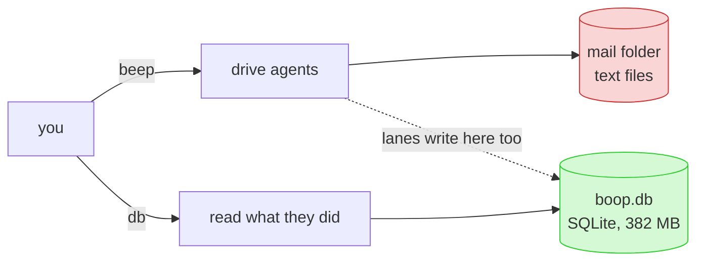
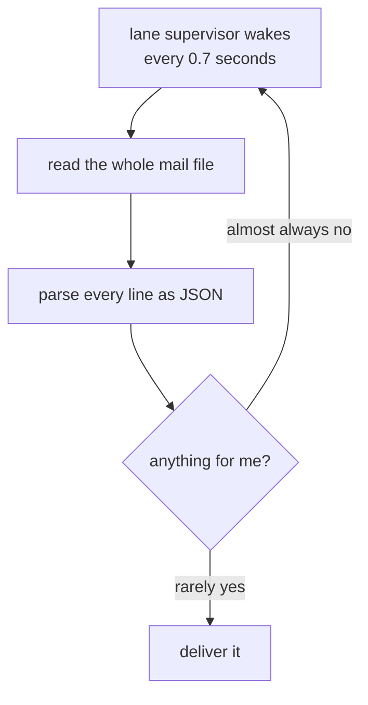
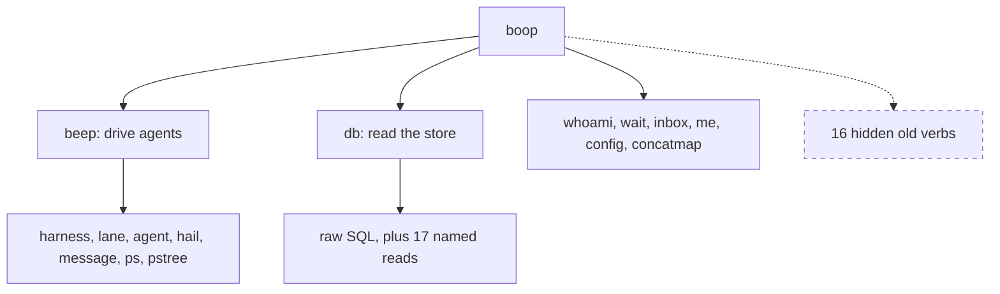
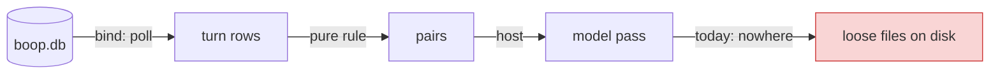

# boop audit, plain words

## What boop is, in one picture

Green half is healthy. Red half is the problem.

## The one-sentence finding

boop has two stores. The SQLite one is well built. The lane and mail one is a
folder of text files that gets read from top to bottom, in full, every 0.7
seconds, by every running lane.

## Why that hurts

The mail file is 716 KB and 1707 lines today. Nothing ever trims it. Five lanes
running means about five megabytes a second of reading and re-parsing to answer
"anything for me?" almost always with "no".

## The top eight, in order

| rank | plain words | size of fix |
|---|---|---|
| 1 | the whole mail file is re-read every 0.7 s per lane, forever, and never trimmed | medium |
| 2 | a lane's exit code is written as a sentence and read back out with string tricks, in three separate places | small |
| 3 | the lane registry is a hand-written locking scheme over a JSON file, sitting right next to a real database | large |
| 4 | one thing (spawning a lane) is described by four different structs with 19, 22, 18 and 13 fields, and five different names for the lane id | medium |
| 5 | one place builds a database query by gluing text together instead of asking properly | small |
| 6 | the main file is 6000 lines with 930 lines of tests inside it | medium |
| 7 | the same eight-line quoting helper is copy-pasted eight times, and every lane launch goes through one of the copies | small |
| 8 | three commands run during a lane spawn with no time limit at all | small |

## What is already good

- the database schema is textbook: numbered ids, one place per name, no
  stringly-typed keys
- almost every query asks properly instead of gluing text
- four crashes-waiting-to-happen in the whole non-test codebase
- the command line never asks "which agent brand is this?"; it asks the
  adapter, which is the right shape

## The rename that would help most

| today | should be |
|---|---|
| a message's `kind` is free text | a fixed list of six kinds |
| a route's `kind` is free text | lane, coordinator, or native |
| a tmux target is one string holding two different shapes | one type that knows which shape it is |
| a model is `name@effort` in one string, taken apart in four places | one type that already knows both halves |
| a timestamp is a text date, re-read five times | a number |

## The command line

The hidden row was supposed to disappear one release ago. Three of the sixteen
have no replacement yet, and one of those three is the verb the house rules
tell every coordinator to run.

Small annoyances worth one pass: eight of the read commands print no help text
at all, two of them print a sentence describing a struct instead of themselves,
one flag is declared thirty-four times, and the same idea is spelled
`--timeout` in one place and `--wait-timeout` in two others with three
different defaults.

## Chris wants boop hosted from dl6

Good news: the reading half is ready. The tables are already shaped right, and
the row types boop hands out are already flat named columns.

The refinement loop is already close to rules. Its pairing and bundling code is
pure and would port straight across. What blocks it:

| what | today |
|---|---|
| where the loop keeps its place | a number in a text file |
| which pairs are done | a folder of empty files named `session-turn` |
| how a pair that failed forever is marked | exactly the same as a pair that worked, so you cannot tell them apart |
| where the chat feed's answers go | not returned at all; they land in the transcript and get picked up later by a different process |
| how the retry policy is declared | three constants inside the loop, invisible from outside |

The last two are language questions and stop here for Chris.

## One number that matters

341 tests, all green, 15 seconds. Nothing in this audit is a broken build.
Everything here is shape.

## Next action

File the eighteen cards. Start with the mail-file poll: it is the only finding
that costs real machine time every second boop is running.
