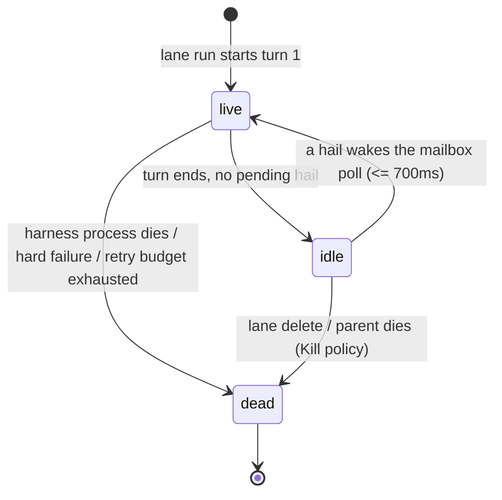

# Lane lifecycle

A lane pane runs one supervisor (`crates/boop-proc/src/supervise.rs`) that owns
one `LaneChannel` and the lane's inbox. Ending a turn with nothing queued no
longer ends the pane: the supervisor parks on the mailbox instead.

## States

| state | `lane list` | what it means | how it's read |
| --- | --- | --- | --- |
| live | `live` | a turn is running | tmux target alive, no residency file or residency `live` |
| idle | `idle` | parked between turns, channel open, process alive | tmux target alive, residency file says `idle` |
| dead | `dead` | pane or process gone | tmux target not alive |

## The three real exits

Only these end the supervisor process (`Ended` returned, pane exits):

| exit | trigger | where |
| --- | --- | --- |
| explicit delete | `boop beep lane delete <lane>` kills the tmux session; the supervisor's `SIGTERM`/`SIGHUP`/`SIGINT` handler writes the result row and exits | `arm_signal_trail`, `signal_exit` |
| harness gone | a hard `Failed` turn, or a `Flaked` turn past `FLAKE_RESUME_CAP` retries | the `held.is_empty() && !end.is_done()` branch in `supervise` |
| parent died (Kill policy) | `ParentWatch::probe` sees the lane's parent route go dead under `ParentDeathPolicy::Kill` | `ParentWatch::probe`, checked every poll whether running or parked |

A turn that completes cleanly (`TurnEvent::Done`) with no pending hail is
**not** an exit. The brief-done marker (a `result` row, written once, the
first time a turn completes with the brief considered done) reports status
without ending the lane; the lane keeps its channel open and parks.

## Residency file

`crates/boop-proc/src/supervise.rs` writes `<mail-dir>/lane-residency.json`,
a `{lane: "live"|"idle"}` map, at the top of every turn (`live`) and right
before parking (`idle`). `crates/boop/src/cli/job.rs::lane_state` reads it
back only once tmux confirms the pane is alive; a lane whose file is absent
or stale reads through as `live`, today's behavior.

## Stall detection

`STALL_LIMIT` (config key `BOOP_STALL_LIMIT_SECS`, default 30 minutes) only
applies to a turn that is actually running (`supervise`'s inner poll loop). A
parked lane never calls `stalled()` at all, so waiting on the mailbox is never
mistaken for a hung child.

**Not implemented**: distinguishing a mid-turn wait on a background job
(`Bash` with `run_in_background`, an `until`-loop) from a genuinely silent
child. `LaneChannel` exposes only `last_activity_ms`, no tool-call content, so
a long-running background wait still relies on the 30-minute bound rather
than an exemption tied to the tool call itself.
