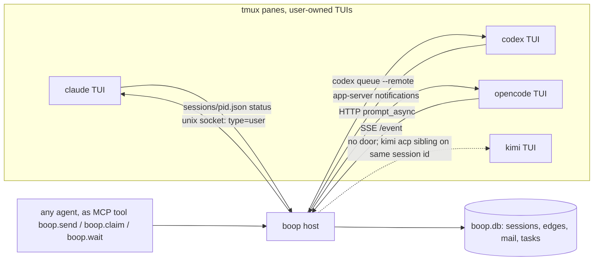

# Driving native agent TUIs from outside, 2026-08-22

One sentence: every harness you run now ships its own out-of-band control door for a live TUI, so boop's job shrinks to reading four registries and writing to four sockets, with ACP reserved for headless lanes.

## Contents

| § | subject |
|---|---|
| [1](#1-what-each-harness-exposes-today) | What each harness exposes for a TUI that is already running |
| [2](#2-how-the-field-does-it) | How Zed, herdr, acpx, AHP, agent teams do it |
| [3](#3-the-shape-for-boop) | The shape for boop: TUIs stay, transport per harness, one store |
| [4](#4-what-this-deletes) | What this deletes and what it keeps |
| [5](#5-receipts) | Receipts |

---

## 1. What each harness exposes today

Measured on this machine unless cited.

| harness | discover live sessions | send into the running TUI | learn idle / turn end | resume by id | notes |
|---|---|---|---|---|---|
| claude 2.1.240 | `~/.claude/sessions/<pid>.json`: `sessionId`, `cwd`, `tmux` pane, `status` (`busy`/`idle`), `messagingSocketPath`, `name` | unix socket `/tmp/cc-socks/<pid>.sock`, newline JSON: optional `{"type":"auth","token":…}` then `{"type":"user","message":{"role":"user","content":"…"}}` (format is in the binary's own help text) | `notify_when_idle` one-shot over the same peer protocol; `status` field in the registry file | `claude --resume <id>` | delivery is at a tool-call boundary or starts a turn when idle; inbound held/refused per `crossSessionInbound`; 34 sockets live now, 7 interactive |
| codex 0.149 | `codex app-server --remote-control` daemon, `~/.codex/state_5.sqlite` `threads` table | `codex queue --thread <id> --message … --remote unix://…` (what `send_native` does) | app-server notifications over the WebSocket | `codex resume <id> --remote …` | boop already proxies this; the proxy is the part that broke today |
| opencode 1.18 | `GET /session` on `opencode serve` (port 4096) | `POST /session/:id/prompt_async`, or `/tui/submit-prompt` to drive the attached TUI | `GET /event` SSE | `opencode attach` to the same server, TUI and API share sessions | the only harness whose TUI is a client of a server by design |
| kimi 0.37 | none for the TUI | none for the TUI; `kimi acp` and `kimi --wire` are separate headless processes over stdio | wire `TurnEnd` event | `--session <id>` on a new process | the TUI is a dead end; control means running a second kimi headless on the same session id |

The claude row changes the picture: the registry file carries the tmux pane id and a `busy`/`idle` status, which is the identity ladder `boop whoami`, `agent_live`, and the `live/idle/dead` residency file rebuild by hand.

## 2. How the field does it

| system | transport to agent | agent ↔ agent | liveness | keeps native TUI | verdict for boop |
|---|---|---|---|---|---|
| Zed | ACP client per thread; agent owns runtime, auth, model | none | per thread | no, Zed is the UI | the model for headless lanes only |
| herdr (Rust, PTY owner, MIT) | owns real PTYs, no tmux; `pane.send_text`, `agent.prompt{wait}`, `pane.read` | none documented | `working/blocked/done/idle` from foreground process + output heuristics, plus `pane.report_agent` for hooks; `events.subscribe` on `pane.agent_status_changed` | yes, that is the product | the state model and `report_agent`/`events.subscribe` API are worth copying; replacing tmux is not, instant already owns panes |
| acpx 0.13.1 | ACP, one process per session, respawn + `session/resume`→`load`→`new` | none | pid file | no | coordinator transport; already pinned in `cli/acpx.rs` |
| AHP (Microsoft, MIT; `ahp`, `ahp-ws` crates) | host speaks ACP down, AHP up; N clients subscribe to one session's sequenced action log | none | host state | no, host spawns the agent | the N-clients-one-session design `lab/acp-one-send-path` §4 called bespoke now has a spec; still wrong for a TUI the user owns |
| Claude Code agent teams | in-process or tmux teammates | mailbox files + `SendMessage`, task list with deps and file locks, idle notification, plan approval | `TeammateIdle` hook | yes (split-pane mode) | claude-only; cross-session messaging (§1) is the subset that reaches any claude TUI, team or not |
| ACP proxy-chains RFD | conductor → proxies → agent, linear | none | n/a | no | prototype; one transport per `run` (lab §1.0) |

Nothing in the field does agent↔agent across harnesses. That layer is boop's to keep.

## 3. The shape for boop

`boop shell-init` stays: `claude`, `codex`, `kimi`, `opencode` resolve to `boop tui <harness>` so every pane is registered. Everything else changes direction: boop stops injecting keystrokes and stops inferring state, and reads and writes the harness's own door.

Caption: four doors in, one MCP door out, one store; tmux is for looking, never for typing.

| concern | today | proposed |
|---|---|---|
| who is alive, where | `agent_live` + `registry.json` + residency file + `boop_mux_session` pane lookup | claude: read `~/.claude/sessions/*.json`; codex: `state_5.sqlite` + app-server; opencode: `GET /session`; project all three into `agent_live` on each sync |
| deliver mail to a TUI | `deliver_hail`: 5 early returns, tmux `send-keys`, claude hook inbox | claude socket, `codex queue`, opencode `prompt_async`; kimi falls back to the ACP sibling |
| idle / turn end | 700ms poll on mail dir + tmux capture heuristics | claude `status` + `notify_when_idle`; opencode SSE; codex notifications; herdr-style `report_agent` from hooks for anything else |
| agent asks boop for something | `boop tell-parent`, `boop wait`, `boop inbox` CLI verbs the agent must know | the same verbs exposed once as an MCP server (`boop mcp`), loaded by all four harnesses from their normal config; CLI verbs remain as the human door |
| headless workers | `lane run` supervisor over `LaneChannel` (acp / codex / tui impls) | ACP only (`feature/acp-all-harnesses`), acpx for coordinator queueing |
| task records | none | A2A-shaped `Task` rows (`submitted/working/input-required/completed/failed`) in `boop.db`; not A2A transport |

## 4. What this deletes

| deleted | lines | replaced by |
|---|---|---|
| `crates/boop-acp/src/channel/codex.rs` `InspectingProxy` | ~150 + today's fixes | none: read the thread id from `state_5.sqlite` after the TUI starts (`threads.updated_at_ms` newest for cwd), no proxy in the socket path |
| `crates/boop-acp/src/channel/tui.rs` | 864 | harness doors above |
| `deliver_hail` tmux keystroke arm, claude hook inbox | `cli/mail.rs:161-202` | socket / HTTP / queue |
| mail dir 700ms full-file poll | `bus.rs:63`, `supervise.rs:15` | rows in `boop.db`, harness-native idle signals |
| `channel/opencode.rs`, `channel/kimi.rs` | 509 | ACP channel |

Kept: `boop-store`, the `db` verbs, `lane create` worktrees, `supervise.rs` as the ACP lane loop, `shell-init`.

## 5. Receipts

| claim | receipt |
|---|---|
| claude inbox format | `strings ~/.local/share/claude/versions/2.1.240` contains the literal example `{ echo '{"type":"auth","token":"'"$CLAUDE_CODE_MESSAGING_TOKEN"'"}'; echo '{"type":"user","message":{"role":"user","content":"hello"}}'; } \| socat - UNIX-CONNECT:…` |
| claude registry shape | `~/.claude/sessions/29500.json`: `{"pid":29500,"sessionId":"ca20fd09-…","cwd":"/Users/chrishafley/projects","tmux":"projects-2:@3418.%3418","messagingSocketPath":"/tmp/cc-socks/29500.sock","name":"projects-e3","status":"busy","peerFeatures":["notify_idle"],…}` |
| live sockets | `ls /tmp/cc-socks` = 34; 7 map to interactive `claude` processes |
| opencode API | `GET /session`, `POST /session/:id/prompt_async` (204), `GET /event` SSE, `/tui/submit-prompt`, port 4096 |
| kimi | `kimi acp` and `kimi --wire` are stdio subprocess entry points; docs name no attach path for the TUI |
| herdr API | `events.subscribe{pane.agent_status_changed}`, `pane.report_agent{state}`, `agent.prompt{wait}`; socket `~/.config/herdr/herdr.sock` |
| AHP | Rust crates `ahp`, `ahp-types`, `ahp-ws`; host sequences N clients over one ACP session; MIT |

Sources: [Claude cross-session messaging](https://code.claude.com/docs/en/cross-session-messaging), [Claude agent teams](https://code.claude.com/docs/en/agent-teams), [herdr socket API](https://herdr.dev/docs/socket-api/), [herdr-terminal](https://github.com/SuperCodeAgents/herdr-terminal), [OpenCode server](https://opencode.ai/docs/server/), [kimi wire mode](https://moonshotai.github.io/kimi-cli/en/customization/wire-mode.html), [kimi acp](https://www.kimi.com/code/docs/en/kimi-code-cli/reference/kimi-acp.html), [Zed external agents](https://zed.dev/docs/ai/external-agents), [AHP and ACP](https://microsoft.github.io/agent-host-protocol/guide/ahp-and-acp), [agent-host-protocol](https://github.com/microsoft/agent-host-protocol), [ACP proxy chains RFD](https://agentclientprotocol.com/rfds/proxy-chains), [acpx](https://github.com/openclaw/acpx).
