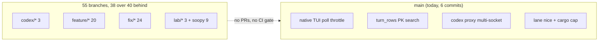
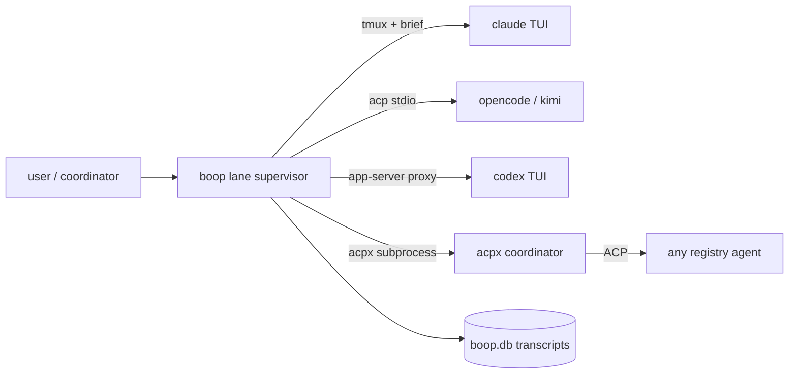

# boop review, 2026-08-22

One sentence: boop is a tmux-and-SQLite agent supervisor whose open work is 55 unmerged local branches (0 GitHub PRs), most of them rebuilding primitives that ACP, acpx, and Claude Code agent teams now ship.

## Contents

| § | subject |
|---|---|
| [1](#1-state-of-the-tree) | State of the tree: branches, worktrees, tests, cards |
| [2](#2-todays-incidents) | Today's incidents and what they say about the design |
| [3](#3-boop-against-the-field) | boop against ACP / acpx / agent teams / A2A |
| [4](#4-branch-triage) | Branch triage: merge, rebase, delete |
| [5](#5-recommendations) | Recommendations, ranked |

---

## 1. State of the tree

| fact | value | receipt |
|---|---|---|
| GitHub PRs open | 0 | `gh pr list --state open` empty; remote `hafley66/hafley-rs` |
| local branches unmerged into main | 55 | `git branch` + `merge-base --is-ancestor` |
| worktrees | 60 across `/private/tmp`, `hafley-rs-worktrees/`, `.boop-worktrees/` | `git worktree list` |
| branches ≥ 40 commits behind main | 38 | same matrix |
| source lines | boop 9,850 · boop-store 12,627 · boop-harness 6,220 · boop-proc 5,645 · boop-acp 3,766 · boop-mux 1,195 · soopy 9,995 | `wc -l` |
| tests | boop 133 · boop-store 122 · boop-proc 115 · boop-harness 85 · boop-acp 62 · boop-mux 12 | `grep #[test]` |
| issue cards | 76 in `issues/` | `ls` |
| failure-mode rows | 12 in `docs/failure-modes.md`, all dated 08-17 to 08-21 | |
| pre-existing red test on main | `inbox_hooks::a_hail_during_a_long_turn_arrives_once_at_the_next_stop_and_never_as_keystrokes` | fails on HEAD before today's commits |

Caption: nothing flows from the branch pile into main except by hand; the two proxy branches cut on 08-22 were already on a relay shape main no longer has.

## 2. Today's incidents

| # | symptom | cause | file | fix |
|---|---|---|---|---|
| 1 | `replayd` 257% CPU for a day | 5 leaked headless Chromes from a css-loops agent run, never closed | external to boop | killed |
| 2 | every `boop codex` / `boop tui codex` wrapper at 42–49% CPU | `run_native_tui` ran `known_sessions` (join over 4,032 `sync_cursor` rows, unindexed `agent_edge` subquery, 190ms) every 250ms | `crates/boop/src/cli/control.rs:88`, `boop-store/src/ident.rs:980` | throttle 2s, `idx_edge_child` (`5a38640`) |
| 3 | instant at 66–120% | `turn_rows` planned `SCAN t` over 518,477 `agent_turn` rows per single-session read; `(?n IS NULL OR col = ?n)` defeats the PK | `boop-store/src/query.rs:349` | dynamic WHERE (`8bb7dc9`) |
| 4 | `/resume` inside `boop codex`: "failed to connect to remote app server" | `InspectingProxy` accepted one socket, ever | `boop-acp/src/channel/codex.rs:103` | accept loop + LocalSet (`1a100ee`), starvation test (`b20c18c`) |
| 5 | load 20.8 on 12 cores | three agent-launched `cargo build --release` in parallel | none | `nice -n 10` on lanes, `[build] jobs = 6` |

Pattern across 2, 3, 4: each is a hot loop or single-slot resource in code that wraps a harness's own control plane (codex app-server, transcript store). The audit of 08-17 already ranked "whole mail dir read every 700 ms per lane" as finding #1 (`crates/boop/docs/audit-2026-08-17.md` §9); `supervise.rs:15` still polls at 700ms and `bus.rs:63` still re-reads the full routes file. Incident 2 is the same shape in a new place.

## 3. boop against the field

Measured capabilities, from the 08-20 labs (`lab/acp-ecosystem`, `lab/acp-one-send-path`) and today's doc reads.

| capability | boop today | ACP 2.0 (schema 1.5, wire v1) | acpx 0.13.1 (2026-08-19) | Claude Code agent teams (v2.1.178+) | A2A v1.0 |
|---|---|---|---|---|---|
| spawn a worker | `lane create` → tmux session + worktree + `boop beep lane run` supervisor | `session/new` over stdio or any byte stream | `acpx` spawns the agent, persists pid + session per repo, named sessions | `Agent` tool with `name`; in-process or tmux/iTerm2 split panes | remote HTTP endpoint, Agent Card |
| send mid-turn | `Delivery::MidTurn` declared, unreachable: `acp.rs:180` returns `NextTurn` unconditionally; codex path uses `codex queue` | adapter-specific; claude-acp advertises `promptQueueing`, kimi returns `turn.agent_busy` (lab §1 C4) | prompt queueing + cooperative `session/cancel` via queue IPC | `SendMessage` to a named teammate, delivered automatically | `tasks/send`, `input-required` state |
| resume after crash | `supervise.rs` retry budget; native codex via `resume` thread id | `session/load` (v1) / `session/resume`; every local adapter advertises `loadSession: true` | respawn + `session/resume` → `session/load` → `session/new` fallback | none for in-process teammates (`/resume` loses them) | task id re-query |
| parent/child graph | `agent_edge` in SQLite + `registry.json` routes (hand-rolled CAS, audit #3) | none; client holds the graph | per-repo session store | `~/.claude/teams/{name}/config.json` members + task list with deps + file-locked claims | none |
| mailbox | `~/.agent/mail`, full-file re-read per poll, hook inbox for claude | `session/update` notifications | stdout of `acpx` | `~/.claude/teams/{name}/inboxes/{agent}.json`, validated per read | messages on a task |
| liveness | tmux-target alive + residency file (`live/idle/dead`) | process alive | pid file | idle notification to lead; `TeammateIdle` hook | task state |
| model select | `--model` spelling picks harness; `session/set_config_option model` | `session/set_config_option` | `--model` | fixed at spawn, `CLAUDE_CODE_SUBAGENT_MODEL` | Agent Card |
| cross-harness | claude, codex, kimi, opencode, each a `Harness` impl + a `LaneChannel` impl | any ACP agent; registry JSON lists 39 pinned agents | Pi, OpenClaw, Codex, Claude, any ACP agent | Claude only | any, over HTTP |
| trace / debug | `boop debug` WARN/ERROR rows; `lane-tracing-events` branches unmerged | `agent-client-protocol-trace-viewer` binary reads JSONL | `acpx/runtime` exports | transcript per teammate | none |

What boop has that nothing else has: one SQLite store of every harness's transcripts (`agent_turn`, `agent_touch`, `agent_cmd`, `agent_usage`) and the `db` read verbs over it. That is the part worth keeping.

What boop has that the field now provides: spawn, queue, cancel, resume, session naming, crash recovery (acpx covers all five, and `boop --preset` already shells to `acpx@0.13.1`); mailbox, task list, idle notification, plan approval (agent teams, claude-only).

What boop lacks that the field has: prompt queueing on the ACP path (`acp.rs:180`), `session/load` use on respawn (supervisor re-feeds the brief instead), trace viewer, registry-pinned adapter versions (`acp.rs:35-38` floats on npm dist-tags).

A2A is the wrong layer for boop: it is remote, HTTP, card-discovered; boop is local processes on one machine. Nothing in the branch pile targets it and nothing should.

Caption: four transport shapes for one job; `lab/acp-one-send-path` prices collapsing them onto ACP, and `feature/acp-all-harnesses` (`1fbc69e`, 30 behind) already did it for claude, codex, kimi.

## 4. Branch triage

Grouped by what to do. Ahead/behind is `main...branch`.

### 4.1 Merge or rebase now (small, recent, on main's current shape)

| branch | behind/ahead | what | why now |
|---|---|---|---|
| `fix/native-codex-thread-start` | 9/1 | observe native Codex thread startup; touches `control.rs`, `codex.rs` | overlaps today's `1a100ee`; rebase, keep its test |
| `feature/acp-all-harnesses` | 30/2 | claude, codex, kimi lanes on the ACP channel | deletes two `LaneChannel` impls (audit #12); the direction §5 recommends |
| `fix/boop-db-convoy` | 27/2 | one transcript sync pass across concurrent readers, `BOOP_NO_SYNC=1` | instant and every `boop db` read sync first; today's SCAN fix sits next to it |
| `fix/boop-main-fixes` | 46/1 | registry verbs stop syncing, tests get temp HOME, typed rc | closes audit #2, #14 and failure mode 10 |
| `fix/boop-fixture-lanes-purge` | 41/1 | names the two src tests writing into live `~/.agent` | failure mode 10 rail |
| `fix/boop-doa-carcass` | 44/2 | reclaim a dead lane's worktree and branch | 60 worktrees on disk is the symptom |
| `lab/acp-ecosystem`, `lab/acp-one-send-path` | 27/1 each | docs only | merge the plans into `crates/boop/docs` |

### 4.2 Superseded, delete

| branch | behind/ahead | superseded by |
|---|---|---|
| `fix/codex-inspecting-proxy` | 8/1 | written against the sync `tungstenite` relay (`grep tokio::select` = 0); main's relay is async (`= 2`). `1a100ee` + `b20c18c` cover the multi-socket case; backpressure on the async path is a separate, unfiled card |
| `backup/local-main-before-pr24-25-20260818`, `feature/boop-auto-sync` | 84/4 | identical commit sets; `integrate/pr-24-25` merged |
| `feature/boop-tell-parent` | 49/1 | `tell-parent` is on main (`boop --help`); `feature/boop-tell-parent-2` carries the rest |
| `fix/boop-pane-lane-state`, `fix/boop-pane-liveness-luna`, `fix/boop-route-liveness-luna` | 104–114 | three copies of "pane routes reported dead"; failure mode 12 landed `live/idle/dead` on main |
| `feature/lane-tracing-events-luna` vs `feature/lane-tracing-events-json` vs `feature/boop-me-favorite` | 104 | same `6ac9ef6`/`cace514` base, three tips; keep `-json`, delete the other two |
| `fix/boop-codex-spawner-parent`, `fix/codex-parent-discovery-terra`, `feature/session-family-contract-terra` | 84 | share `582b54f`/`0d52ace`; `codex/harness-session-addressing` (16/3) is the newest statement of the same idea |
| `feature/lazy-codex-control-broker`, `fix/boop-shared-codex-control`, `feature/boop-acpx-coordinator` | 22–23/1 | three answers to "who owns the codex app-server"; pick one after §5.1 |

### 4.3 Soopy (9 branches, 125–143 behind)

Unrelated to boop; a separate review. None touch `crates/boop*`.

### 4.4 Worktree cleanup

`/private/tmp/*` holds 15 worktrees, one already `prunable`. `git worktree prune` then delete the directories for every branch in §4.2.

## 5. Recommendations

| # | recommendation | evidence | cost |
|---|---|---|---|
| 1 | Stop building coordinator transport. Make ACP the one lane channel (`feature/acp-all-harnesses`) and let `acpx` own queue/cancel/resume for coordinators, which `boop --preset` already does | §3 row "send mid-turn", "resume after crash"; lab C4 | M |
| 2 | Delete the codex app-server proxy once codex-acp 1.6.2 carries `resume` and `list`; until then keep today's multi-socket relay and file backpressure as a card | lab §3 capability table; `fix/codex-inspecting-proxy` stale | S now, M later |
| 3 | Replace `registry.json` + mail dir with rows in `boop.db` (audit #1, #3; card `boop-registry-into-sqlite`, `boop-bus-fullfile-poll`) | `supervise.rs:15` 700ms full-file poll; today's incident 2 is the same shape | L |
| 4 | Every poll loop gets a budget test like `known_sessions_stays_under_budget` and `session_turn_read_uses_primary_key_not_scan` | incidents 2 and 3 were invisible until CPU pinned | S each |
| 5 | Keep the store and the `db` verbs as the product. Nothing in ACP, acpx, or agent teams reads across harnesses | §3 last paragraph | 0 |
| 6 | Open PRs. 55 branches with no remote review surface is why three copies of one fix exist | §4.2 | S |
| 7 | For claude-only work, try agent teams before a lane: mailbox, task deps, idle hooks, plan approval exist there and not in boop. Known gaps: no `/resume` of in-process teammates, one team per session, no nested teams | agent-teams doc "Limitations" | 0 |
| 8 | Pin adapters from the ACP registry JSON (39 agents, sha256) instead of `acp.rs:35-38` | lab §1.0 | S |

Sources: [Claude Code agent teams](https://code.claude.com/docs/en/agent-teams), [acpx on GitHub](https://github.com/openclaw/acpx), [acpx changelog](https://github.com/openclaw/acpx/blob/main/CHANGELOG.md), [A2A specification](https://a2a-protocol.org/latest/specification/), [ACP session config options RFD](https://agentclientprotocol.com/rfds/session-config-options), `plans/2026-08-20-acp-ecosystem-buy.PLAN.md` (branch `lab/acp-ecosystem`), `plans/2026-08-20-acp-one-send-path.PLAN.md` (branch `lab/acp-one-send-path`).
