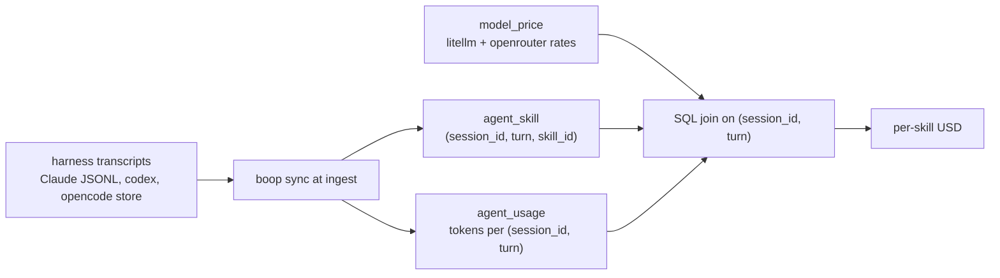

# Skill cost estimates

Estimate what each skill activation costs, priced by boop's own `model_price` table,
refilled from LiteLLM's `model_prices_and_context_window.json` (the same file ccusage
vendors). Zero LLM tokens: analysis is SQL over rows the store already projects.

## Contents

- [Data path](#data-path)
- [Cost views](#cost-views)
- [Price source](#price-source)
- [Results 2026-09-03](#results-2026-09-03)
- [Coverage caveats](#coverage-caveats)
- [Reproduce](#reproduce)

## Data path



## Cost views

| view | span | question it answers |
|---|---|---|
| activation turn | the usage row at `(session_id, turn)` of the Skill call | what the activation itself costs |
| window | activation turn through the turn before the next `role=user` turn | what the work the skill kicked off costs |

The store ships both as SQL views (schema 22): `v_usage_cost` holds the cost
formula once, `v_skill_cost_act` and `v_skill_cost_window` answer the two
questions above with no hand-written SQL:

```bash
boop db "select * from v_skill_cost_act order by cost_usd desc limit 10"
boop db "select * from v_skill_cost_window order by cost_usd desc limit 10"
```

`boop db schema` lists every table and view with its columns and derived join
keys, so an agent never probes `sqlite_master` to find the seam.

Cost per usage row:

```
coalesce(cost_usd_recorded,
  (input_tokens            * input_per_mtok
 + output_tokens           * output_per_mtok
 + cache_create_5m_tokens  * cache_write_5m_per_mtok
 + cache_create_1h_tokens  * cache_write_1h_per_mtok
 + cache_read_tokens       * cache_read_per_mtok) / 1e6)
```

## Price source

| source | rows | fetched |
|---|---|---|
| litellm | 26 | 2026-09-03 19:25 UTC |
| openrouter | 8 | 2026-08-12 19:40 UTC |

litellm rows were written through boop's own verb:
`boop db price set <model> --input-per-mtok ... --source litellm`, keyed off
`https://raw.githubusercontent.com/BerriAI/litellm/main/model_prices_and_context_window.json`.
No ccusage dependency.

## Results 2026-09-03

Activation turn, top by spend (76 usage-bearing activations, $6.65 total):

| skill | acts | usd per act | usd total |
|---|---|---|---|
| i:save-session | 13 | 0.3428 | 4.46 |
| i:load-session | 1 | 0.4642 | 0.46 |
| i:agent-bus | 3 | 0.1228 | 0.37 |
| i:opencode-orchestration | 3 | 0.1180 | 0.35 |
| i:d2-authoring | 1 | 0.2825 | 0.28 |
| issue | 1 | 0.2067 | 0.21 |
| keybindings-help | 1 | 0.1229 | 0.12 |
| smash-sim-mechanic | 3 | 0.0332 | 0.10 |
| sprefa-v5-working-conventions | 8 | 0.0090 | 0.07 |
| add-mode | 4 | 0.0145 | 0.06 |

Window to next user turn, top by spend:

| skill | windows | usd per window | usd total |
|---|---|---|---|
| sprefa-dl | 6 | 3.4835 | 20.90 |
| sprefa-v5-working-conventions | 26 | 0.3035 | 7.89 |
| i:save-session | 13 | 0.3428 | 4.46 |
| sqlite-costs | 5 | 0.2910 | 1.45 |
| add-mode | 7 | 0.1457 | 1.02 |
| sql-relational-design | 4 | 0.2478 | 0.99 |
| sprf-write-plan | 10 | 0.0476 | 0.48 |
| i:load-session | 1 | 0.4642 | 0.46 |
| add-animation | 2 | 0.2214 | 0.44 |
| i:agent-bus | 3 | 0.1228 | 0.37 |

## Coverage caveats

- 576 activations total, 76 carry a usage row at the activation turn; the rest sit on
  turns where the harness wrote no usage block. Costs cover the 76.
- Harness split of the 76: opencode 44, claude 32.
- Activation-turn cost is 95% cache read: avg 112,689 cached tokens at the cache-read
  rate vs avg 2,941 uncached input tokens. The activation re-reads an already-paid cache.
- The window view sums every usage row in the span, sidechain rows included, so a skill
  that spawns work inherits that work's cost. `sprefa-dl` at $3.48 per window is scan
  work, and the skill body itself is the smallest term.
- Repeat activations of the same skill are cheap: prompt cache absorbs the body. Worst
  case body size is `wc -c SKILL.md / 4` tokens.

## Reproduce

```sql
-- activation turn, per skill
with costed as (
  select s.session_id, d.value skill,
    coalesce(u.cost_usd_recorded,
      (u.input_tokens*p.input_per_mtok + u.output_tokens*p.output_per_mtok
       + u.cache_create_5m_tokens*p.cache_write_5m_per_mtok
       + u.cache_create_1h_tokens*p.cache_write_1h_per_mtok
       + u.cache_read_tokens*p.cache_read_per_mtok)/1e6) cost
  from agent_skill s
  join agent_usage u on u.session_id=s.session_id and u.turn=s.turn
  join dict_skill d on d.id=s.skill_id
  left join model_price p on p.model_id=u.model_id)
select skill, count(*) n, round(avg(cost),4) usd_per_act, round(sum(cost),2) usd_total
from costed group by 1 order by usd_total desc;

-- window: activation to next user turn
with act as (
  select s.session_id, s.turn s_turn, s.skill_id,
    (select min(t.turn) from agent_turn t
     where t.session_id=s.session_id and t.role_id=1 and t.turn>s.turn) nu
  from agent_skill s),
costed as (
  select a.session_id, a.s_turn, d.value skill,
    sum(coalesce(u.cost_usd_recorded,
      (u.input_tokens*p.input_per_mtok + u.output_tokens*p.output_per_mtok
       + u.cache_create_5m_tokens*p.cache_write_5m_per_mtok
       + u.cache_create_1h_tokens*p.cache_write_1h_per_mtok
       + u.cache_read_tokens*p.cache_read_per_mtok)/1e6)) cost
  from act a
  join agent_usage u on u.session_id=a.session_id and u.turn>=a.s_turn
                    and u.turn<coalesce(a.nu,100000000)
  join dict_skill d on d.id=a.skill_id
  left join model_price p on p.model_id=u.model_id
  group by a.session_id, a.s_turn, d.value)
select skill, count(*) wins, round(avg(cost),4) usd_per_window, round(sum(cost),2) usd_total
from costed group by 1 order by usd_total desc;
```
