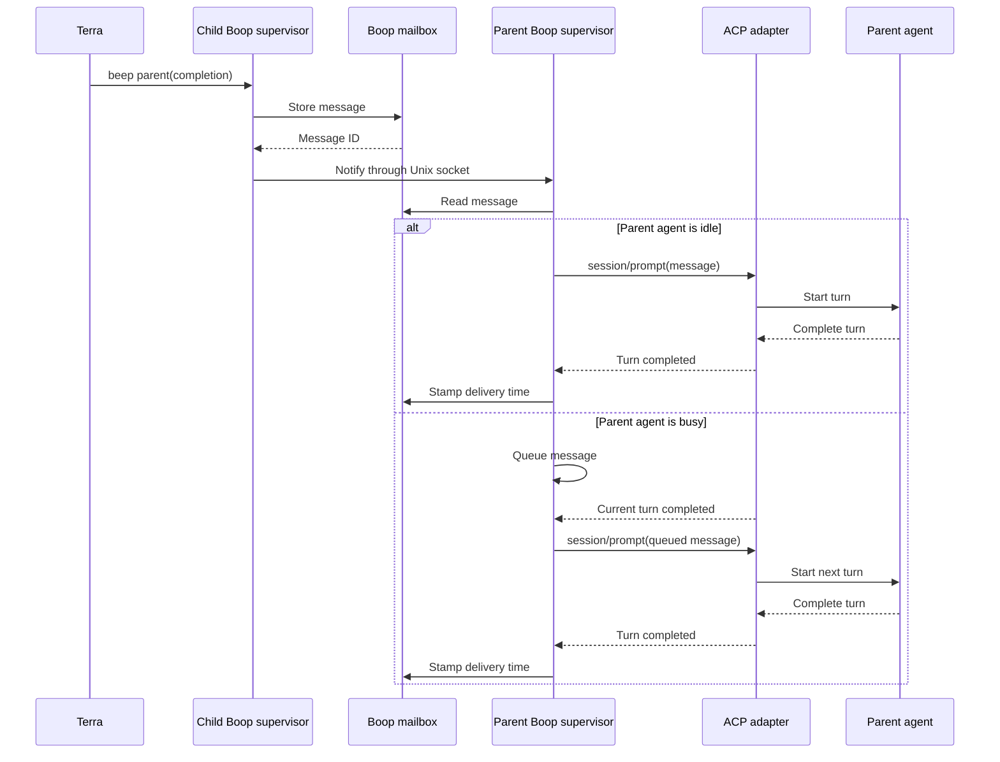

# beep parent / beep children

A child already carries its own identity and the edge that names its parent, so
neither end of that edge is worth spelling in a prompt.

```
boop beep parent "TEXT" [--kind completion|yield|note] [--as NAME]
boop beep children "TEXT" [--as NAME]
```

Use the positional route and body shown above. The removed `tell-parent` and
`tell-children` commands are rejected. Hidden `--body TEXT` remains a compatibility
alias for the positional body.
`--no-wait` returns after delivery admission; ordinary sends wait for a response
up to `--timeout` seconds and return 124 on timeout.

| step | where it comes from |
|---|---|
| the sender | explicit `--as`, otherwise `BOOP_SESSION` / legacy `BOOP_LANE`; `boop whoami` displays the resolved identity |
| the recipient | the caller's registry route `parent`, written by `lane create --parent` and `agent register --parent` |
| the fallback | the one registered coordinator with a pane, when the route records no parent |
| delivery | `boop-proc::deliver::deliver_hail_budgeted`; harness door or owned queue, installed hook, lane supervisor, and explicit fallback outcomes |

`--kind` is the mail row's kind. A body is required for `completion` and
`note`. `yield` alone has a default, `yield <lane> rc=0 branch=<branch>
head=<sha>`, read from the route's worktree, and it is a turn boundary: the
lane stays alive and can be hailed again.

A caller the ladder cannot name, and a caller with no parent edge and no lone
coordinator, are each an error naming the caller and a non-zero exit. Neither
writes a row.

`beep children` enumerates registered parent edges and observed native spawned
edges, then prints one line per target and an outcome tally:

```
landed feature-a m-02be8593 (hook inbox)
dead   feature-b
```

A reachable target can have a native harness door, a lane supervisor, an installed
hook or a live pane. Dead/unroutable targets are reported individually. Native
transcript receipt is stronger evidence than queue admission or mailbox ack.

## Historical ACP delivery design target

The diagram below records the earlier proposed supervisor control-socket design.
Current delivery is implemented by the adapter doors and shared delivery ladder
named above; the diagram is not an executable lifecycle receipt.

The target transport keeps one ACP connection alive for every agent, including
the coordinator. The owning supervisor exposes a local control socket; mailbox
senders address the supervisor rather than attempting to reconstruct an ACP
connection from a session id.



The ACP adapters remain the protocol servers. Boop owns the ACP clients and
routes local delivery through supervisor sockets. tmux injection and hook
inboxes remain compatibility transports for coordinators without an owned ACP
connection.
