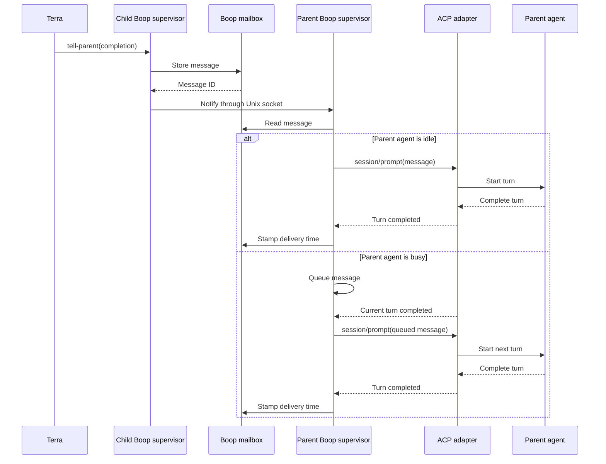

# tell-parent / tell-children

A child already carries its own identity and the edge that names its parent, so
neither end of that edge is worth spelling in a prompt.

```
boop tell-parent [--kind completion|yield|note] [--body TEXT]
boop tell-children --body TEXT
```

| step | where it comes from |
|---|---|
| the sender | the identity ladder (`boop whoami`): `BOOP_LANE`/`BOOP_SESSION`, else the registered pane, else the harness process |
| the recipient | the caller's registry route `parent`, written by `lane create --parent` and `agent register --parent` |
| the fallback | the one registered coordinator with a pane, when the route records no parent |
| delivery | the path `beep hail` uses: pane injection for a coordinator, inbox drain for a hook, the mailbox for a lane supervisor |

`--kind` is the mail row's kind. `--body` is required for `completion` and
`note`. `yield` alone has a default, `yield <lane> rc=0 branch=<branch>
head=<sha>`, read from the route's worktree, and it is a turn boundary: the
lane stays alive and can be hailed again.

A caller the ladder cannot name, and a caller with no parent edge and no lone
coordinator, are each an error naming the caller and a non-zero exit. Neither
writes a row.

`tell-children` sends one body to every route registered as a child of the
caller and prints one line per target:

```
landed feature-a m-02be8593 (hook inbox)
dead   feature-b
```

A child is reachable when a boop drain hook is installed in its project or its
tmux target is alive. A dead child gets a line and no row, so nothing queues up
for a lane that will never read it.

## ACP delivery target

The target transport keeps one ACP connection alive for every agent, including
the coordinator. The owning supervisor exposes a local control socket; mailbox
senders address the supervisor rather than attempting to reconstruct an ACP
connection from a session id.



The ACP adapters remain the protocol servers. Boop owns the ACP clients and
routes local delivery through supervisor sockets. tmux injection and hook
inboxes remain compatibility transports for coordinators without an owned ACP
connection.
