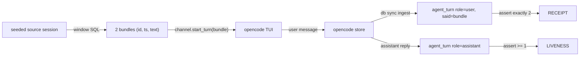
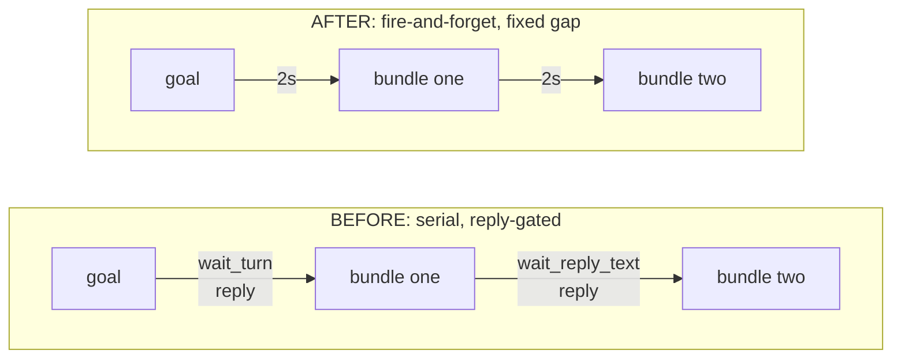

# concatmap e2e: receipts for delivered bundles, liveness only

Date: 2026-08-16. Status: built. The e2e test is green (12s); the Chat feed
was changed from serial reply-waiting to fire-and-forget.

## TOC

1. Goal
2. The receipt (what is one-way, why we assert only that)
3. Before vs after: the feed was the slow part, not the model
4. Fallback model chain
5. Test fixture and mechanics
6. Seams to add
7. Type signatures
8. Acceptance assertions
9. Open decisions

## Goal

One e2e test that proves concatmap actually feeds bundles into a live model
and gets a reply back, without asserting on any model *output*. The only
things asserted are receipts: that exactly the 2 bundles the window query
emitted reached the mapper session as user turns (one-way, deterministic),
and that the mapper produced at least one assistant turn (liveness).

The receipts live in the boop store as `agent_turn` rows, so `boop db turns`
is the assertion oracle. Nothing counts model text.

## The receipt (what is one-way, why we assert only that)



The user turn is fully deterministic: `bundle.text` is fixed by the window
SQL over seeded rows, and `start_turn` ships it byte-for-byte into the TUI
(`channel/tui.rs:280`, `type_and_submit_or_respawn`). The assistant turn is
not deterministic, so it is asserted only as ">= 1 row exists".

| asserted | how | deterministic? |
| --- | --- | --- |
| 2 bundles emitted by window query | `bundle` count from the fixture | yes |
| 2 user turns in mapper session | `boop db turns --session <mapper> --role user`, `said` == bundle text (trimmed) | yes |
| mapper responded | `boop db turns --session <mapper> --role assistant` count >= 1 | no (liveness only) |

## Before vs after: the feed was the slow part, not the model

The receipt (one-way user turns) was gated behind the model reply because the
Chat feed serialized each bundle with `wait_turn` + `wait_reply_text`. The fix
is fire-and-forget with a fixed `TURN_GAP` (2s) between submits, so deliveries
land at fixed offsets independent of model latency.



Marble (the channel is the output subject; `start_turn` is `next`):

```
BEFORE   goal──reply──bundle one──reply──bundle two──reply──▶   (~3 x model latency)
AFTER    goal─2s─bundle one─2s─bundle two────────────────────▶   (fixed ~4s)
```

Proven by `the_chat_feed_nexts_each_bundle_at_a_fixed_gap_not_reply_latency`
(`concatmap.rs`): a `TimedSubject` records each `start_turn` timestamp, two
bundles are `next`ed through `rewrite`, and every adjacent gap is asserted to
be the fixed `TURN_GAP` (1-3s), never reply latency.

## Fallback model chain

The test resolves the first model that answers, in this order, and asserts
against that one. Any higher link that is unavailable or unconfigured is
skipped, not failed.

| order | harness | model spelling |
| --- | --- | --- |
| 1 | opencode | `openrouter/deepseek/deepseek-v4-flash-0731` (flash4 preset) |
| 2 | opencode | `google/gemini-3.7-preview` (gem37) |
| 3 | claude | `claude-haiku-*` |
| 4 | codex | `gpt-5.6-luna@medium` (luna preset) |

All four harnesses implement `open_channel` (`opencode.rs:21`, `claude.rs:20`,
`codex.rs:23`), so the Chat feed works for any. Resolution reuses
`lane::harness_for_model` + `Registry::by_id`; the chain is a fixed array in
the test, not new production code.

## Test fixture and mechanics

1. Temp store, temp `state/` and `out/` dirs, temp tmux socket.
2. Seed a source session `ses_src` with turns arranged so the window SQL
   (gaps-and-islands over `agent_turn`, the `--help` example) yields exactly
   2 bundles of known text.
3. Write `rules.json`: `{"feed":"chat", "goal":"reply ok", "window":"<the
   gaps-and-islands SQL>"}`.
4. Spawn `db sync` (resident) against the temp store, then spawn
   `boop concatmap --session ses_src --rules rules.json --store <tmp> --model <resolved>`.
5. Poll `boop db turns --session <mapper> --role user` until 2 rows land or
   timeout; assert `said` equals each bundle text after `trim_double_encoded`.
6. Poll `boop db turns --session <mapper> --role assistant` until >= 1 row.
7. Teardown: kill concatmap, kill sync, remove temp dirs, kill tmux socket.

The mapper session id is resolved the same way `mapper_session` does
(`concatmap.rs:245`): the newest opencode session whose `cwd` is the pipe's
`state_dir`, or via `channel.conversation_id()`.

## Seams to add

| seam | today | change |
| --- | --- | --- |
| store path | `run()` hardcodes `Store::default_path()` (`concatmap.rs:460`) | add `--store <path>` flag threaded into `Args` |
| e2e gate | no env/ignore convention exists | mark the test `#[ignore]`, run with `cargo test --ignored concatmap_e2e` |
| model chain | none | fixed array in the test only |

## Type signatures

```rust
// the fallback chain, test-side only
struct ModelChain {
    harness: &'static str,
    model: &'static str,
}

// the receipt, read from the store
struct Receipt {
    session: String,      // mapper session id
    user_turns: Vec<String>,   // said, trimmed, in ts order
    assistant_turns: usize,
}
```

## Acceptance assertions

| case | expected |
| --- | --- |
| exactly 2 user turns land | `user_turns.len() == 2` |
| user turns are the bundles | `user_turns[i] == bundles[i].text.trim()` |
| mapper responded | `assistant_turns >= 1` |
| no model available | test skips (returns early), not fails |

## Open decisions

| decision | options | lean |
| --- | --- | --- |
| "gem37" exact spelling | `google/gemini-3.7-preview` (user-set 2026-08-16) | settled |
| e2e gate mechanism | `#[ignore]` + env `BOOP_E2E`, or env-only skip | `#[ignore]` (runs only when asked, no accidental API spend) |
| `--store` flag shape | new `Args` field + CLI flag, or env `BOOP_STORE` | CLI flag, matches `--state`/`--out` style |

## Out of scope

- Asserting tag output or any model text (this test is receipts + liveness).
- A production model-fallback feature in concatmap; the chain is test-only.
- Multi-source fan-in.
