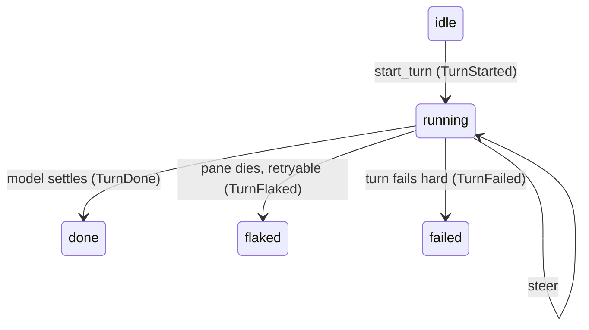

# Turn-lifecycle event system for the lane channel

Date: 2026-08-17. Status: plan, to build.

## TOC

1. Why
2. The turn lifecycle as a state machine
3. Event types (type signatures)
4. Channel surface change
5. Feed consumption (concatMap)
6. Instance lifetimes
7. Blast radius

## Why

The fire-and-forget feed threw away the turn-done signal to make the receipt
test fast. That broke the mapper: without "done" there is no backpressure, so
the feed floods the resident chat and the model never cleanly completes a
turn. The fix is to make the turn lifecycle a first-class event stream the
feed subscribes to, instead of the ad-hoc `poll_turn` polling that was removed.

## The turn lifecycle as a state machine



Two distinct moments matter, and today only one is visible:

| event | when | latency |
| --- | --- | --- |
| `TurnStarted` | the model began its reply (input accepted) | ~1-2s |
| `TurnDone` | the model finished (pane idle) | model latency |

The receipt (one-way user turn) needs only `TurnStarted`. The fold needs
`TurnDone` before the next bundle. A full event system exposes both, and the
feed chooses which it waits for.

## Event types

```rust
// channel.rs — replaces TurnEnd { ok, retryable, detail }
pub enum TurnEvent {
    /// The model began its reply (first paint after our submit).
    Started,
    /// The model finished its reply.
    Done,
    /// The turn died on a provider flake the agent never saw; retryable.
    Flaked { detail: String },
    /// The turn failed hard.
    Failed { detail: String },
}
```

`TurnEnd` folds away: `ok:true -> Done`, `ok:false retryable:true -> Flaked`,
`ok:false retryable:false -> Failed`.

## Channel surface change

```rust
pub trait LaneChannel: Send {
    fn start_turn(&mut self, text: &str) -> Result<()>;
    fn steer(&mut self, text: &str) -> Result<Delivery>;
    /// Block up to `timeout` for the next turn event; `None` = still running.
    fn next_event(&mut self, timeout: Duration) -> Result<Option<TurnEvent>>;
    fn interrupt(&mut self) -> Result<()> { Ok(()) }
    fn close(&mut self) -> Result<()>;
    fn conversation_id(&self) -> Option<String>;
    // ... existing last_activity_ms, conversation_id_kind
}
```

`poll_turn(&mut self, Duration) -> Result<Option<TurnEnd>>` becomes
`next_event(&mut self, Duration) -> Result<Option<TurnEvent>>`.

## Feed consumption (concatMap)

```rust
fn rewrite(&mut self, msg: &str) -> Result<()> {
    channel.start_turn(msg)?;                       // emit TurnStarted downstream
    let deadline = Instant::now() + TURN_TIMEOUT;
    while Instant::now() < deadline {
        match channel.next_event(CHAT_POLL)? {
            Some(TurnEvent::Done) => return Ok(()), // turn done: advance
            Some(TurnEvent::Flaked { detail }) => {
                channel.interrupt()?;
                bail!("turn flaked: {detail}");
            }
            Some(TurnEvent::Failed { detail }) => bail!("turn failed: {detail}"),
            Some(TurnEvent::Started) | None => continue,
        }
    }
    bail!("turn exceeded {}s", TURN_TIMEOUT.as_secs())
}
```

The OneShot feed is unchanged (one call, no turn loop). The Chat feed waits
for `TurnDone` — restoring the fold — while the `.md` output and
`wait_reply_text` stay removed.

## Instance lifetimes

| instance | lifetime |
| --- | --- |
| `TurnEvent` | transient; handed out by `next_event`, not retained |
| channel | resident, one per conversation; emits events across turns |
| feed | resident loop; one `rewrite` per bundle, blocking on `TurnDone` |

## Blast radius

`poll_turn`/`TurnEnd` touch 8 files: `channel.rs`, `channel/{claude,codex,kimi,opencode,tui}.rs`, `supervise.rs`, `concatmap.rs`. The supervisor reads the
same end-of-turn verdict, so it migrates to `TurnEvent` with the feed; the
TUI channel is the only producer that actually detects `Started` today (the
jsonrpc-backed channels emit `Done`/`Flaked` only).

## Out of scope

- A store-backed `ReplyLanded` event (sync ingest as a separate stream); the
  feed no longer needs the reply text, only `TurnDone`.
- Multi-source fan-in.
