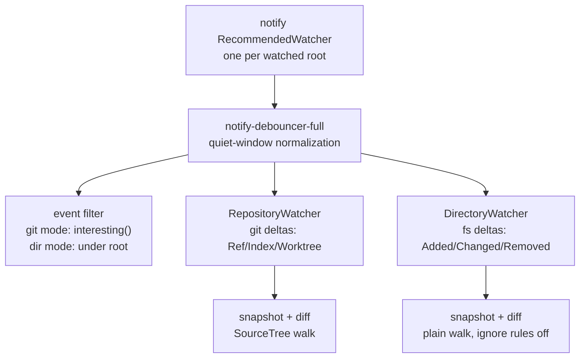

# Git-optional source roots, watching, and tracked-file state

Date: 2026-08-14. Status: plan, not built.

## TOC

1. Why
2. Requirements
3. What exists today
4. Type signatures
5. Instance lifetimes
6. Storage, reads, writes, and uniqueness
7. Runtime order and file placement
8. Migration
9. Tests and performance
10. Out of scope

## Why

Consumers need to watch trees that are not git repositories: harness
transcript dirs (`~/.claude/projects/...`, `~/.codex/sessions/...`,
`~/.kimi-code/...`) for the boop sync/concatMap lanes, and scratch dirs.
Today every watcher in soopy is git-rooted, so those consumers either poll
(`boop db sync create --forever`, one stat per file per second) or wrap
`notify` themselves.

## Requirements

| # | requirement |
| --- | --- |
| R1 | Git optional: watching works on a plain directory with no `.git` anywhere above it. |
| R2 | Raw-fs interfaces keep working unchanged: `SourceWatcher`, `RepositoryWatcher`, `WatchQuery`, all delta types, all existing call sites and tests compile and behave identically. |
| R3 | One debounce/coalescing implementation shared by git and non-git paths. |
| R4 | No git process spawned for a non-git root (no `discover`, no `cat-file`, nothing). |
| R5 | Registration gap handled: events between watcher creation and first snapshot must not be lost (FSEvents starts async; existing comment in `_8_watch.rs:50`). |
| R6 | Snapshot, enumerate, stream-read, and watch work for a plain directory without constructing Git coordinates. |
| R7 | Opening a directory may discover Git and return added Git capabilities, but discovery is caller-selected and never required by filesystem operations. |
| R8 | Git mode distinguishes tracked clean, unstaged, staged, and staged-plus-unstaged state per path by comparing HEAD, index, and worktree content identities. |
| R9 | Existing Git-backed source, revision, ref, graph, span, and watch behavior remains available through the Git capability. |

## What exists today

| piece | location | git coupling |
| --- | --- | --- |
| `RepositoryWatcher` | `src/_8_watch.rs:23` | opens a `Repository`, derives `git_dir`/`common_dir`, filters every event through `interesting()` (`_8_watch.rs:250`) which keeps only paths under the repo root minus git dirs |
| `SourceWatcher` | `src/_8_watch.rs:270` | compatibility wrapper; delegates to `RepositoryWatcher` |
| `validate_query` | `src/_8_watch.rs:331` | requires `Revision::Worktree` inside the repository |
| debounce/coalescing | `WatchCoalescing` (`quiet_ms`/`max_ms`), `recv`, `recv_timeout` | git-agnostic already |
| snapshots/diffing | `SourceTree` walk + `SourceSnapshot` compare -> `SourceDelta` | walk honors ignore rules via git; plain-dir mode needs a no-ignore variant |

## Type signatures



The root type exposes filesystem mechanics first and an optional Git capability:

```rust
pub enum SourceRoot {
    Directory(DirectoryRoot),
    GitWorktree(GitWorktreeRoot),
}

pub struct DirectoryRoot {
    pub root: PathBuf,
    pub identity: DirectoryId,
}

pub struct GitWorktreeRoot {
    pub directory: DirectoryRoot,
    pub repository: Repository,
}

impl SourceRoot {
    pub fn open_directory(root: impl AsRef<Path>) -> Result<Self>;
    pub fn discover_git(root: impl AsRef<Path>) -> Result<Self>;
    pub fn directory(&self) -> &DirectoryRoot;
    pub fn git(&self) -> Option<&GitWorktreeRoot>;
}
```

Filesystem coordinates contain no fabricated repository, revision, or blob:

```rust
pub struct DirectoryId(pub Arc<str>);
pub struct FileRef {
    pub directory: DirectoryId,
    pub path: RootPath,
}
pub struct FileEntry {
    pub file: FileRef,
    pub content: ContentId,
    pub size: u64,
}
pub struct FileQuery { pub patterns: Vec<Pattern> }
pub struct FileSnapshot { pub files: Vec<FileEntry>, pub directories: Vec<RootPath> }

impl DirectoryRoot {
    pub fn snapshot(&mut self, query: &FileQuery) -> Result<FileSnapshot>;
    pub fn read_each(&mut self, requests: &[FileReadRequest], visit: impl FnMut(FileBytesRef<'_>) -> Result<()>) -> Result<()>;
    pub fn watch(&self, query: FileWatchQuery) -> Result<DirectoryWatcher>;
}
```

Git adds repository-qualified coordinates and status:

```rust
pub enum TrackedFileState {
    Clean,
    Unstaged,
    Staged,
    StagedAndUnstaged,
}

pub struct TrackedFileObservation {
    pub path: RepoPath,
    pub state: TrackedFileState,
    pub head: Option<ContentId>,
    pub index: Option<ContentId>,
    pub worktree: Option<ContentId>,
}

impl GitWorktreeRoot {
    pub fn tracked_state(&mut self, query: &GitFileQuery) -> Result<Vec<TrackedFileObservation>>;
}
```

Status comparison is explicit:

```text
HEAD == index and index == worktree    Clean
HEAD == index and index != worktree    Unstaged
HEAD != index and index == worktree    Staged
HEAD != index and index != worktree    StagedAndUnstaged
```

The two comparisons are transitions. `HEAD == worktree` does not remove a
staged-plus-unstaged state when both adjacent transitions differ.

Comparison uses entry identity `(kind, mode, normalized content)`, not content
alone. This preserves executable-bit, symlink, tree, and gitlink changes.

Additions, deletions, unmerged index stages, intent-to-add, sparse entries,
and absent `HEAD` require explicit enum variants or typed fields. They must not
be collapsed into one `dirty` boolean.

The watcher retains two front doors over one core:

- Core (new, private): notify registration, event receive, coalescing, the
  registration-gap handling, and the snapshot-diff loop. No git types.
- `RepositoryWatcher`: keeps its exact public surface; becomes the git mode
  of the core, with `interesting()` and ref/index/worktree surfaces intact.
- `DirectoryWatcher` (new): `open(root)`, `recv() -> Vec<DirectoryDelta>`,
  `recv_timeout`. Root may be any directory. R4: constructor must not call
  `repository::open`/`discover` at all.

## Instance lifetimes

```rust
// New. Mirrors SourceDelta shape minus revision semantics.
pub enum DirectoryDelta {
    Added(PathBuf),
    Changed(PathBuf),
    Removed(PathBuf),
    RescanRequired,
}

pub struct DirectoryWatcher { /* core handle, no Repository field */ }

impl DirectoryWatcher {
    pub fn open(root: impl AsRef<Path>) -> Result<Self>;
    pub fn recv(&mut self) -> Result<Vec<DirectoryDelta>>;
    pub fn recv_timeout(&mut self, timeout: Duration) -> Result<Option<Vec<DirectoryDelta>>>;
}

// Unchanged signatures (R2): RepositoryWatcher, SourceWatcher, WatchQuery,
// WatchCoalescing, SourceDelta, RepositoryDelta, SourceTree::watch*.
```

- `DirectoryRoot` owns a canonical root and its filesystem metadata cache.
- `GitWorktreeRoot` owns `DirectoryRoot`, Git coordinates, and persistent Git
  batch processes. Dropping it terminates those processes.
- `DirectoryWatcher` owns the notify watcher and the mpsc receiver,
  same ownership shape as `RepositoryWatcher` today. No `Repository`, no
  `Arc` sharing with caller trees.

## Storage, reads, writes, and uniqueness

- Directory storage: in-memory last-snapshot map `path -> (mtime_ns, len,
  content)`; diff on
  debounce quiet. No persistence, no db.
- Git status storage: one observation contains the three identities. Cache keys
  include `WorktreeId`, path, index identity, HEAD, mtime, and size. A changed
  index or HEAD invalidates the relevant comparison.
- Read order: enumerate tracked paths and index stages, resolve HEAD blobs,
  then hash regular current worktree paths through one persistent
  `git hash-object --stdin-paths` worker. Git performs attributes, CRLF, and
  clean-filter normalization before returning the object identity. Return one
  path row only after its three identities are known. A repository-owned
  `git hash-object --stdin --no-filters` byte worker hashes symlink target
  bytes because the path worker follows links.
- Watch order: register notify paths first, take baseline snapshot
  second, then drain events; any event whose path predates the baseline is a
  no-op diff (R5).
- Writes: these APIs never mutate the filesystem, index, refs, or object DB.
- Uniqueness: `DirectoryId` names one canonical directory; `WorktreeId` names
  one Git checkout; one status row exists per `(WorktreeId, RepoPath)` per
  observation. One `DirectoryWatcher` per root; overlapping roots undefined,
  same as today.

## Runtime order and file placement

```text
crates/soopy/src/
  _0_types.rs                 shared filesystem and Git coordinate types
  _1_patterns.rs              path-pattern mechanics
  _2_directory.rs             canonical directory identity and open
  _3_files.rs                 plain filesystem snapshot and streaming reads
  _4_git_repository.rs        optional Git discovery and coordinates
  _5_git_status.rs            HEAD/index/worktree comparison
  _6_git_objects.rs           revision and blob reads
  _7_source_tree.rs           compatibility adapter
  _8_watch.rs                 public watcher adapters
  _8a_watch_core.rs           private registration and coalescing core
```

Renumber only when implementation begins and update module declarations in the
same change. Keep one semantic name per layer. Fixture repositories and runtime
snapshots live under `target/` or `$TMPDIR`; no generated repositories, status
captures, or performance samples enter Git.

## Migration

1. Extract watcher construction + drain loop from `_8_watch.rs` into the
   private core module (`_8a_watch_core.rs` or inside `_8_watch.rs`).
   `notify-debouncer-full` owns raw notify normalization and rename stitching;
   the core retains only the public maximum-window receipt collection.
2. `RepositoryWatcher::open` becomes: validate git query -> build core ->
   attach git event filter and git delta surfaces.
3. `interesting()` moves behind the git mode only; dir mode filters on
   `path.starts_with(root)` and skips nothing else (no `.git` exclusion
   needed when there is none; keep excluding a `.git` dir if one appears
   nested inside the watched root).
4. No behavior change for git mode: existing `8_watch.rs` tests must pass
   untouched (R2 gate).
5. Move the existing worktree walker and streaming read path behind
   `DirectoryRoot`; retain `SourceTree` as the Git compatibility adapter.
6. Add caller-selected `SourceRoot::open_directory` and
   `SourceRoot::discover_git`. Do not auto-run Git from the former.
7. Add the tracked-state query using Git's index and object protocols plus the
   shared filesystem reader. Replace no existing API until downstream Sprefa
   binds have moved.

## Tests and performance

| case | input | expected | why |
| --- | --- | --- | --- |
| plain dir, no git anywhere | tempdir, write/append/rename/unlink file | Added/Changed/Removed deltas in order | R1 core path |
| non-git root spawns no git | `DirectoryWatcher::open` with `PATH` scrubbed of git | succeeds, no child processes | R4 |
| registration gap | mutate file immediately after `open` returns | delta still delivered on first recv | R5; FSEvents async start |
| coalescing shared | burst of N writes inside `quiet_ms` | one delta batch | R3 |
| git mode regression | existing `tests/8_watch.rs` suite, untouched | green, no edits | R2 |
| snapshot diff correctness | append bytes to a file between recvs | Changed with new (mtime,len), no false Removed+Added | diff must be stable for appends |
| nested repo inside watched root | mkdir inner git repo, touch file in it | deltas for inner files; inner `.git` filtered | watch is about fs, not repo pruning |
| plain snapshot/read | directory outside Git, nested files | enumerate and stream exact bytes | R6 |
| explicit discovery | same path through both constructors | directory mode spawns zero Git; discovery mode returns Git capability | R7 |
| tracked state matrix | clean, unstaged, staged, staged plus unstaged | exact enum and three identities for every path | R8 |
| unborn and deletion cases | repository without HEAD; staged deletion; worktree deletion | explicit typed rows | no dirty collapse |
| bounded status read | large tracked set with one large file | bounded buffer reuse and stable RSS warm passes | batch contract |

The existing Soopy Justfile remains the command surface. Add:

```text
just test-git-optional
just perf-git-status-smoke
just perf-git-status <repo>
```

`perf-git-status-smoke` creates its repository under `$TMPDIR`, executes one
cold and three warm observations, and emits one JSON result to stdout. The
record contains `files`, `cold`, `warm`, `wall_ms`, `peak_rss_bytes`, and
`open_file_descriptors`. `cold` and every `warm` receipt contain `wall_ms`,
an in-process `rss_bytes` sample, and typed `metrics` with
`git_child_processes`, `hash_worker_launches`, `byte_worker_launches`,
`bytes_hashed`,
`worktree_cache_hits`, and `worktree_cache_misses`. `bytes_hashed` is only
worktree content read after a cache miss; `git_child_processes` counts every
Git child launched during that observation. `perf-git-status <repo>` accepts a
caller-owned corpus and writes no artifacts into it.

Untested: network filesystems (kqueue/FSEvents semantics differ); watcher
behavior when the watched root itself is deleted (accept RescanRequired,
do not promise more).

## Dependency boundaries

- `notify` remains the platform watcher backend and
  `notify-debouncer-full` owns raw event normalization. Its only added
  transitive dependency beyond Soopy's existing watcher tree is `file-id`.
- Git CLI remains the backend for repository discovery, trees, blobs,
  revisions, index stages, conflicts, refs, and worktree-content normalization.
  This plan does not add `gix-index` or `git2`.
- Plain directory snapshots/readers use BLAKE3 and make no Git process calls.

## Out of scope

- Transcript-format parsing (jsonl line projection stays in boop's
  `project_transcript`).
- Recursing into ignore rules for dir mode; ignore handling stays a git-mode
  feature.
- Async runtime integration; keep the std mpsc surface.
