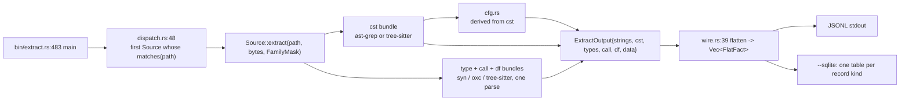
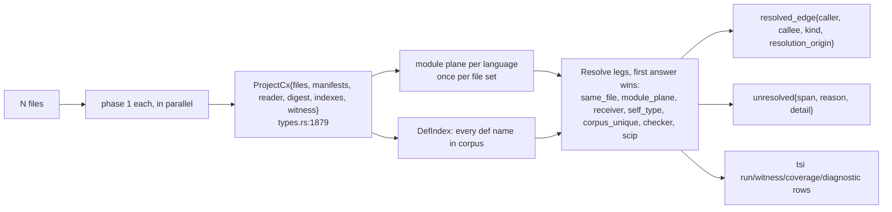
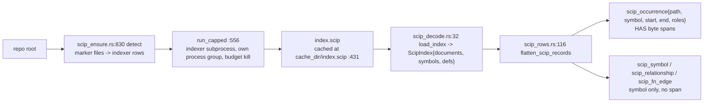
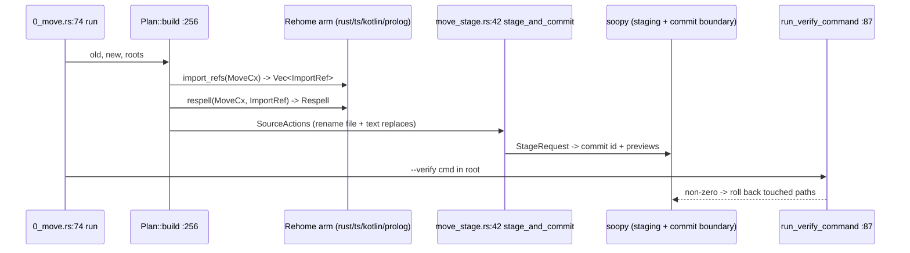

# sprefa-extract: architecture, language matrix, and how it stacks against Joern and CodeQL

Date: 2026-09-17. Receipts are `file:line` inside `crates/sprefa-extract/` at commit `16ebd451`.

## TOC

1. Context
2. Reader's model
3. Language x capability matrix (fast / slow)
4. Architecture boards
5. Plane vocabularies (module, df, type, cfg)
6. Joern and CodeQL, side by side
7. The model in graph terms

## 1. Context

`extract` is used at work to gather code context before a model call. Today's CTF on the crate's own source showed the syntax planes hold (cst, df, spans, names after `16ebd451`) and the parse-based cross-file call resolver lies (148 false `push` edges, 3 of 4 `project` callers missed). The user wants: a matrix of what works per language in fast and slow mode, a re-explanation of the architecture from zero, a comparison against Joern and CodeQL, and a plan that makes `extract move` / `extract rename` correct without a compiler, using syn (rust), oxc_semantic + oxc_resolver (ts), and tree-sitter (go, kotlin, python).

## 2. Reader's model (zero knowledge assumed)

| term | meaning | where |
| --- | --- | --- |
| fact | one JSONL row: a node, an edge, or an aux row, with byte spans | `src/types.rs:3006` `FlatFact`, 57 variants |
| family / plane | one graph layer over a file: `cst` (syntax tree), `type` (declarations), `call` (call sites + defs), `df` (dataflow), `cfg` (control flow, derived from cst), `data` (json/yaml/toml values) | `src/types.rs:173` `Family`, `FamilyBundle{nodes, edges, aux}` at `:1635` |
| phase 1 | one file in, its facts out. Pure, parallel, cacheable. No cross-file knowledge | `Source::extract` `src/types.rs:2713`, `dispatch` `src/dispatch.rs:48` |
| phase 2 | `--resolve`: bind names across files. Runs per language "legs" in order; first leg that answers wins | `resolve_project` `src/project.rs:236`, `Resolve<CallF>`/`Resolve<TypeF>` `src/types.rs:2353` |
| leg / origin | each way a name got bound is stamped on the edge: `same_file`, `module_plane`, `corpus_unique`, `receiver`, `self_type`, `checker`, `scip`, ... | `ResolutionOrigin` `src/types.rs:1660`; decision sites `src/lang/rust.rs:454-493,1154-1222` |
| unresolved reason | when no leg answers: `no_corpus_def`, `ambiguous`, `inferred`, `external`, ... | `UnresolvedReason` `src/types.rs:753`; `src/lang/rust.rs:1414-1424` |
| module plane | the language's own import rules, run once per file set, so `use a::b` binds through the real module tree | `rust_modules.rs`, `ts_resolve.rs`, `go_modules.rs`, `kotlin_modules.rs`, `python/_2_modules.rs` |
| fast | phase 1 + phase 2 with parsers only | `extract fast` |
| slow | a real compiler's index (SCIP protobuf from rust-analyzer / scip-typescript / scip-go / ...) decoded to `scip_*` rows | `src/scip_ensure.rs:62-105`, `src/scip.rs` |
| checker tier | a real type checker asked per site during phase 2 (rust-analyzer in-process, tsc sidecar, go/types sidecar); declines loudly when its tool is missing | `src/project.rs:434-478,830-943`, `TierDecline` `:178` |
| TSI | "type-system interchange": envelope rows (`run`, `witness`, `coverage`, `diagnostic`) that say which tier produced what and how exhaustively | `src/tsi/types.rs:13` `Mode{Syntax, Semantic}` |
| move / rename | `extract move old new`, `extract rename`: plan -> per-language `Rehome`/`Rename` -> staged edits through soopy -> commit -> optional verify command with rollback | `src/0_move.rs`, `src/0_rename.rs`, `src/move_stage.rs` |
| the boundary law | this crate answers "what is written"; programs over the facts answer "what it means" | `AGENTS.md:6-13` |

## 3. Language x capability matrix

Legend: `Y` works, `-` absent, `p` partial. Receipts in the per-row file:line column; the crate is `crates/sprefa-extract/`.

### 3a. Fast lane (per-file, no compiler)

| lang | parser cst / type+call+df | cst | type | call | df | cfg | module plane | `Resolve<CallF>` | `Resolve<TypeF>` | move | rename | receipt |
| --- | --- | --- | --- | --- | --- | --- | --- | --- | --- | --- | --- | --- |
| rust | ast-grep / syn | Y | Y | Y | Y | Y | `use`/`mod`/`#[path]`/star, syn re-walk | Y | Y | Y +manifests +plan_check | Y | `src/lang/rust.rs:3356-3415`, `rust_modules.rs`, `rust_rehome.rs:81`, `rust_rename.rs:34` |
| ts | ast-grep / oxc | Y | Y | Y | Y | Y | `oxc_resolver` on disk (tsconfig paths, pkg exports) | Y | Y | Y +manifests +text_spellings | Y (`oxc_semantic` scopes) | `src/lang/ts.rs:4062-4135`, `ts_resolve.rs`, `ts_rehome.rs:30`, `ts_rename.rs:17,30` |
| go | ast-grep / tree-sitter-go | Y | Y | Y | Y | Y | per-dir package index, no re-export | Y | Y | - | - | `src/lang/go.rs:2746-2805`, `go_modules.rs` |
| kotlin | ast-grep / tree-sitter-kotlin-sg | Y | Y | Y | Y | Y | `import` vs supplied `package` headers only | Y | Y | Y core only | Y | `src/lang/kotlin.rs:1615-1674`, `kotlin_modules.rs`, `kotlin_rehome.rs:44`, `kotlin_rename.rs:33` |
| python | ast-grep / tree-sitter-python | Y | Y | Y | Y | Y | dotted name from `__init__.py` ancestry, relative + star imports, supplied set only | Y | Y | - | - | `src/lang/python/_0_source.rs:2522-2580`, `_2_modules.rs` |
| prolog | tree-sitter-prolog | Y | Y | Y | Y | Y | - | Y | - | Y +shim | Y | `src/lang/prolog/_0_source.rs:1070-1115`, `_1_rehome.rs:44`, `_2_rename.rs:38` |
| markdown | tree-sitter-md | Y | p (doc nodes, only when cst masked off) | - | - | - | - | - | Y (heading -> def) | - | - | `src/lang/markdown/_0_source.rs:125-149,494` |
| data (json/yaml/toml) | delegates cst; own data plane | p | - | - | - | - | - | - | - | - | - | `src/lang/data/_0_source.rs:31-53` |
| gdscript | tree-sitter-gdscript | Y | - | - | - | - | - | - | - | - | - | `src/lang/gdscript/_0_source.rs:6-9` (by design) |
| commonlisp | tree-sitter-commonlisp | Y | - | - | - | - | - | - | - | - | - | `src/lang/commonlisp/_0_source.rs:6-8` (by design) |
| astgrep fallback | ast-grep | Y | - | - | - | - | - | - | - | - | - | `src/lang/astgrep.rs:254-271` |

### 3b. Slow lane (compiler-backed)

| lang | SCIP indexer (`extract slow`) | checker tier (in-process / sidecar) | semantic TSI rows | receipt |
| --- | --- | --- | --- | --- |
| rust | `rust-analyzer scip` | `ra_ap_hir`/`ra_ap_ide`, feature `rust-checker` | Y | `src/scip.rs:133-146`, `rust_checker_ra.rs:32-89`, `project.rs:773-798` |
| ts | `scip-typescript` (npx fallback pinned 0.4.0) | `node ts_checker.mjs` on the project's own `typescript`, feature `ts-checker` | Y | `src/scip.rs:119-132`, `ts_checker.rs:406`, `ts_checker.mjs:15-34` |
| go | `scip-go` (`go run` fallback v0.2.7) | `tools/go_checker` sidecar on `go/packages` + `go/types`, feature `go-checker` | Y | `src/scip.rs:156-169`, `go_checker.rs:583-630` |
| python | `scip-python` | - | - | `src/scip.rs:180-190` |
| kotlin/java | `scip-java` | - | - | `src/scip.rs:194-207` |
| cpp | `scip-clang` | - | - | `src/scip.rs:208-221` |
| others | - | - | - | `src/scip_ensure.rs:62-105` has 6 rows |

`scip_def` / `scip_ref` / `scip_fn_edge` carry `file` + `symbol` only; `scip_occurrence` carries byte spans (see 4c). Issue `extract-fast-slow-trait-divide` AC 3 is about the projections, and the join exists through the occurrence table.

### 3c. Move/rename test coverage

| tests | count | lang |
| --- | --- | --- |
| `1_move.rs`, `42_move_list.rs`, `38_move_perf.rs` | 20 + 8 + 4 | multi |
| `3_move_rust.rs` | 18 | rust |
| `41_move_ts.rs`, `2_move_refs.rs`, `5_move_scip.rs` | 4 + 4 + 5 | ts |
| `4_move_kotlin.rs` | 5 | kotlin |
| `4_rename_ts.rs` | 18 | ts |
| `5_rename_rust.rs` | 8 | rust |
| `7_rename_kotlin.rs` | 3 | kotlin |
| `8_rename_prolog.rs` | 4 | prolog |
| go, python | 0 | not in `rehomes()` / `renames()` |

### 3d. Open defects found in test headers

| where | defect |
| --- | --- |
| `tests/90_mutation_battery.rs:389-402` | python: a param named like an import does not shadow it; call keeps a `corpus_unique` edge |
| `tests/90_mutation_battery.rs:379-386` | python: same-file duplicate def does not flip the edge to absent |
| `tests/90_mutation_battery.rs:24-27` | rust answers no `corpus_unique`; python and ts mint no `same_file` edges: the origins are not one vocabulary across languages |
| today's CTF | rust: `corpus_unique` absorbs every `Vec::push` (148 false edges); spelled receiver `CstProjector.project` unresolved; `same_file` beats the spelled receiver in ts.rs |
| `src/lang/markdown/_0_source.rs:142` | `FamilyMask::ALL` on markdown yields `types: None` |

## 4. Architecture boards

### 4a. Per-file phase 1

### 4b. Phase 2, `--resolve`

The order of legs is the accuracy story: `same_file` and `corpus_unique` answer before a spelled receiver is examined (today's CTF: `ts.rs:4073` and the 148 `push` edges).

### 4c. Slow lane, SCIP

Correction to the issue text: `scip_occurrence` (`src/types.rs:3483-3514`) already carries `start`/`end` byte spans plus `enclosing_start`/`enclosing_end`. The join fast<->slow is `node.span` = `scip_occurrence.start..end`; the `scip_def`/`scip_ref`/`scip_fn_edge` tables are symbol-only projections of it.

### 4d. Move and rename

`Rehome` = 4 fns (`src/types.rs:2776-2808`): `import_refs`, `respell`, `directory_stem`, `moved_names`. `Rename` = 3 fns (`:2958-2981`): `symbol_refs`, `respell_symbol`, `text_spellings`. `--verify-scip` (`src/1_rename_verify.rs`) reads a SCIP index as a second opinion, report only.

## 5. Plane vocabularies

### 5a. Module plane (no `ModuleF` family; collapsed by decision 2026-08-17, `src/types.rs:1563-1578`)

| lang | reads | core fn | emits `resolved_import` | feeds call/type resolve as `module_plane` | holes |
| --- | --- | --- | --- | --- | --- |
| rust | `use`, `pub use`, `use ::*`, `mod x;`, `#[path]`, inline `mod` | `RustModuleIndex::build` `rust_modules.rs:536-671` | Y `project.rs:1962` | Y `rust.rs:454,490,1175-1211` | inline `mod` and `extern crate` mint no row `rust.rs:1807-1820` |
| ts | every ESM/CJS import/export form, tsconfig `paths`/`baseUrl`/`extends`, pkg `exports` | `TsModuleIndex::build` `ts_resolve.rs:608-678` on `oxc_resolver` | Y `project.rs:1948` | Y `ts.rs:4243,4938,5083` | ambiguous `export *` fan-in dropped `ts_resolve.rs:507`; re-export cycles never cached `:598` |
| go | `import "x/y"`, alias, dot, blank, `go.mod` module line | `GoModuleIndex::build` `go_modules.rs:215-239` | Y `project.rs:1981` | Y `go.rs:2902,4301,4392` | phase-1 binding guesses last path segment (`yaml.v3`) `go_modules.rs:14` |
| kotlin | `package`, `import a.b.C`, `import a.b.*` | `KtModuleIndex::build` `kotlin_modules.rs:106-124` | Y `project.rs:2009` | **N**: index built at `project.rs:429` and never read by `kotlin.rs` resolve; calls fall to `corpus_unique` | same-package two-file ambiguity binds nothing `kotlin_modules.rs:9-11` |
| python | `import a.b as c`, `from m import n`, `from . import`, star, `__init__.py`/PEP 420 | `PyModuleIndex::build` `python/_2_modules.rs:261-278` | Y `project.rs:1995` | **N**: index built at `project.rs:420`, never read by `_0_source.rs` resolve | supplied set only, never site-packages `_2_modules.rs:2` |

Wire rows: `specifier` (phase 1, per language), `resolved_import{src_path, name, local, target_path, target_name, kind, hops}` (`types.rs:3671`), `file_edge`, `file_unresolved` (ts diet resolver only, `deps.rs`), `package_edge` (`manifests.rs`). Stale comment at `types.rs:3665-3669` says go/rust emit no `resolved_import`; all five do.

### 5b. Dataflow plane `DfF` (`types.rs:1037-1234`)

| piece | values |
| --- | --- |
| node kinds | `Param LetBind VarRead VarWrite Lit CallRes New Member Ret Binop Unop Loop If Closure Try Expr Logic Ext(lang)` |
| edge kind | `Direct` only, intra-procedural, dst receives src |
| aux rows | `df_param{node,pos}`, `df_arg{call,pos,arg}` (pos -1 = receiver), `df_field{owner,name,value}`, `df_lit{node,kind,text}`, `df_loop{span,var,collection}`, `df_nest{call,loop_span,depth,collection}`, `df_allocates{owner}` (rust only) |
| inter-procedural `FlowF` | `ArgToParam`, `RetToCallRes` emitted by `flow_edges` `types.rs:1289-1359` under `--resolve`; `LambdaElem`, `LambdaRet` declared, never constructed. `AGENTS.md:52-54` is stale on the first two |
| per-language kinds used | rust 16 (+BORROW BREAK MATCH BLOCK), ts 13 (+COND CONCAT TEMPLATE), go 14, python 13 (+COND), kotlin 10, prolog 8, gdscript 0, commonlisp 0 |

### 5c. Type plane `TypeF` (`types.rs:202-550`)

| piece | values |
| --- | --- |
| entity kinds | `Struct Enum Class Interface Alias Function Method Const Ext(lang)`; rust adds `TRAIT`, python adds `MODULE` |
| edge kinds | `Field Variant Impl Generic Param Returns Uses DocRef` (doc says 7, lists 8) |
| rows | `sig{owner, slot param|ret, pos, ty}`, `const{owner, field, text, kind}`, `method_owner{owner, self_type, trait}` (rust only fills), `resolved_type_edge{owner_*, target_*, kind, resolution_origin}` |
| per-language entities | rust 6+TRAIT, ts 7, go 5, kotlin 4, python 4+MODULE, prolog 1 (Function), gdscript/commonlisp 0 |
| per-language edges | ts all 7 core, rust 5 (via `rust_type_edges.rs`), python 5, go 4, kotlin 4 |

### 5d. Cfg plane (`cfg.rs`, `types.rs:1386-1450`)

Nodes `Entry Exit Stmt Branch Loop Jump Ret`; edges `Next Arm Jump Exit`. One generic builder over the cst plus a `(tree-sitter kind, role)` table per language: rust, go, ts, kotlin, python, prolog. None for commonlisp, gdscript, markdown, data.

## 6. Joern and CodeQL, side by side

| axis | CodeQL | Joern | extract |
| --- | --- | --- | --- |
| how facts get made | one extractor per language, compiled langs hook the real build (javac, cl.exe); JS/Python/Ruby via own parsers | one frontend per language: c2cpg (fuzzy, no build), jssrc2cpg (TypeScript compiler), javasrc2cpg (JavaParser + symbol solver), kotlin2cpg (kotlinc frontend), pysrc2cpg (own parser), gosrc2cpg (own) | fast: syn / oxc / tree-sitter per file. slow: SCIP index from the language's own indexer subprocess |
| what the graph is | relational tables (TRAP tuples) per AST node kind, with typed columns | Code Property Graph: one property graph, nodes typed AST/CFG/PDG/CALL/TYPE, edges labelled | JSONL / SQLite rows: `node{family, span, kind, name}`, `edge{family, kind, from, to}`, aux rows per plane |
| planes | AST, CFG, SSA dataflow, call graph, types; taint library per language | AST, CFG, CDG, DDG (REACHING_DEF), PDG, CALL, TYPE, EVAL_TYPE | cst, cfg, df (intra), call, type, module rows, scip rows |
| cross-file name binding | exact for compiled languages (build-integrated); for JS/Python their own inference | fuzzy by design; a "type recovery" pass guesses; precision documented as partial | fast: ordered legs with a label per edge. slow: SCIP |
| inter-procedural dataflow | global taint tracking, configured by source/sink/sanitizer classes | call-graph joined REACHING_DEF; taint via dataflowengineoss | `ArgToParam` / `RetToCallRes` joined in phase 2; the rest deferred to programs over facts |
| query language | QL (Datalog with classes) | Scala traversal DSL over the graph | SQL over sqlite today; `.dl` datalog programs one layer up (AGENTS.md) |
| incremental | no; a database is one build | per-file passes exist but the CPG is whole-program | yes; phase 1 is per-file, content-keyed, cacheable |
| refactoring | none | none | `move`, `rename` with staging + verify + rollback |
| crawl many repos at many revs without building | no (compiled langs need the build) | c2cpg / jssrc2cpg yes, others need deps | fast yes; slow needs the project buildable |

Joern is the nearest shape to `extract fast`: fuzzy frontends, a labelled property graph, honest about partial precision. CodeQL is the nearest shape to `extract slow`: exact because the compiler ran.

## 7. The model in graph terms (for a reader who knows graphs, not program analysis)

| graph idea | in extract |
| --- | --- |
| vertex | a byte span in a file with a kind: `node{family, span, kind, name}` |
| edge label | the plane: `cst.child`, `df.direct`, `cfg.next`, `call.calls`, `type.field`, ... |
| a file's subgraph | phase 1 output; disjoint across files, computed in parallel |
| dangling edge | a call site or type reference whose target vertex is in another file; phase 1 records the *name* on it, no target |
| phase 2 | for each dangling edge, pick a target vertex. Each rule that picks is a "leg"; the rule's name is stamped on the edge as `resolution_origin` |
| deterministic legs | follow a path that the language spec defines: the module plane (`use a::b` -> file that declares `b`), a spelled receiver (`Type::method`), the enclosing `impl` (`self_type`), a param's declared type. Each has exactly one answer or none |
| guess legs | pick by a global property of the whole graph: `corpus_unique` ("only one vertex in the corpus has this name, take it"), `same_file` ("a vertex with this name exists in this file, take it"). These have no locality; the 148 false `push` edges are `corpus_unique` picking `RustCallDefs::push` for every `Vec::push` in the corpus |
| the slow graph | the same vertices (spans) with edges the compiler chose; `scip_occurrence{start, end, symbol, roles}` |
| accuracy | fast graph minus slow graph, joined on span: edges in both = true, fast-only = false positive, slow-only = miss. This is the number the issue asks for and no test computes today |
| move | rewrite every edge that names a file path; only module-plane edges do, so move needs only the deterministic legs |
| rename of a top-level item | rewrite every edge whose target is that vertex; module-plane + within-file scopes suffice |
| rename of a method/field | needs the receiver's type; without a checker, only answerable when the receiver is spelled. Otherwise the tool must stop (`RenameStop`), never guess |

The fundamentally simple thing: the crate has both kinds of legs in one table and runs the guess legs early. Move and rename only need the deterministic ones, and those are available without any compiler for every language in the roster.

