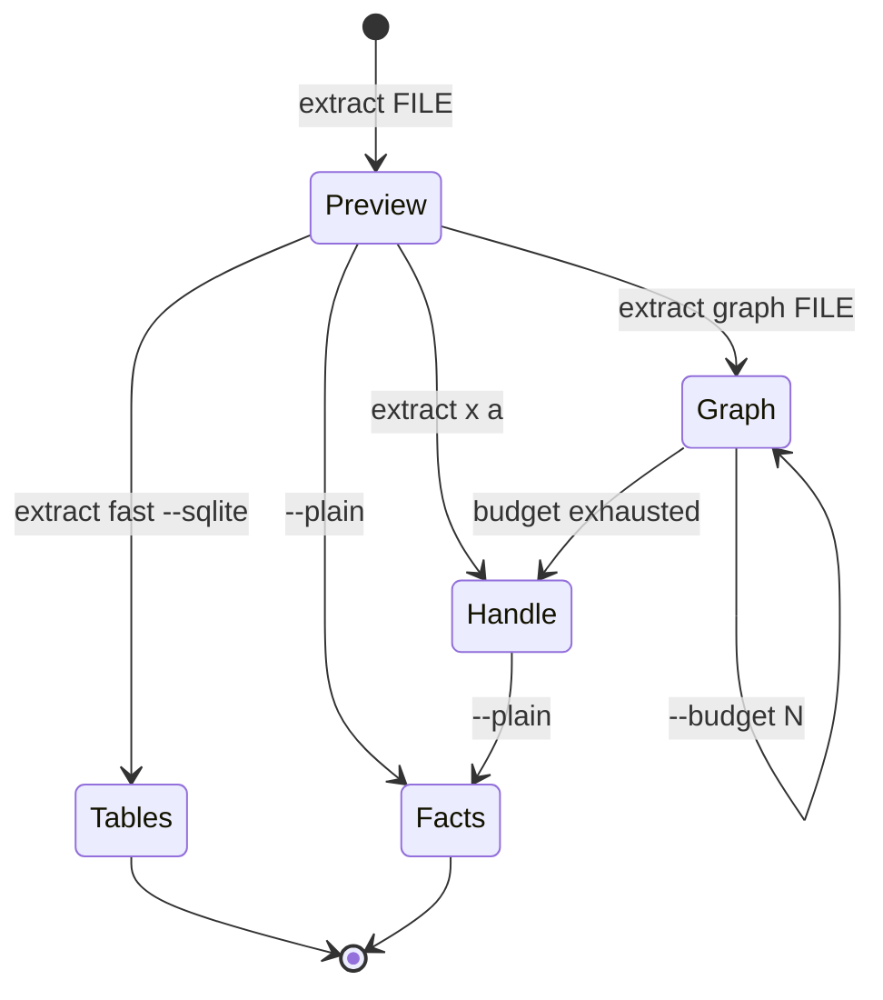

# CLI philosophy: token UX and human UX are the same problem

Working notes, 2026-09-18. Derived from `~/projects/hafley-rxjs/packages/bewpp`
(shipped, the reference implementation) and applied to
`~/projects/hafley-rs/crates/sprefa-extract` (in refinement).

Collect more cases before promoting any of this to a framework.

## Contents

- [The premise](#the-premise)
- [The twelve laws](#the-twelve-laws)
- [Law receipts in bewpp](#law-receipts-in-bewpp)
- [Anti-patterns, with the case that produced each](#anti-patterns-with-the-case-that-produced-each)
- [Worked case: sprefa-extract](#worked-case-sprefa-extract)
- [The HATEOAS state set](#the-hateoas-state-set)
- [Open, unproven](#open-unproven)

## The premise

A CLI has two readers and one constraint.

| reader | reads | fails when |
| --- | --- | --- |
| human | a terminal screen, roughly 50 lines | the answer scrolls past |
| model | a context window, roughly 600 tokens per tool result | the answer eats the budget |

Both want the same thing: the shape first, the content on request, and the
next command on screen. A CLI tuned for one is tuned for the other. The
inverse holds too, which is why a firehose is equally useless to both.

## The twelve laws

| # | law | one-line test |
| --- | --- | --- |
| L1 | Never refuse. Every state has an exit. | does any input path end in an error with no suggested next command? |
| L2 | Budget the output. Count what you withheld. | does the output ever exceed the budget, or hide the overflow count? |
| L3 | Name the withheld part. Make it addressable. | can the reader retype a short handle to page into the rest? |
| L4 | The footer is the transition set, not help text. | is every line in the footer a runnable command for THIS state? |
| L5 | Grade every row by confidence. Let the reader filter by grade. | can the reader ask for only the rows the tool is sure about? |
| L6 | Budget in tokens. No tokenizer dependency. | `ceil(bytes / 4)` |
| L7 | The footer converges by fixpoint. | adding the footer changes the budget, which changes the footer |
| L8 | Config resolves flag, then env, then file, then default. | is the order documented in one line beside the code? |
| L9 | Verbs, not flag soup. | does a flag change the shape of the run rather than filter it? |
| L10 | Bare invocation previews. A flag prints everything. | what does the tool do with no arguments but a target? |
| L11 | Handles are cursors when the producer is pure. | can the handle be re-derived instead of stored? |
| L12 | Show the shape before the content. | counts, grades and structure precede the first data row |

### L7 stated as a trace

Adding a footer consumes budget, which changes what fits, which changes the
footer. It settles.

```
pass 0  footerBytes=0    render -> 40 rows withheld  footer="bew x a  40 more"
pass 1  footerBytes=52   render -> 41 rows withheld  footer="bew x a  41 more"
pass 2  footerBytes=52   render -> 41 rows withheld  footer unchanged, stop
```

Terminates at a fixpoint, not a base case. `bewpp/src/cli/6_expand.ts:20-31`
caps it at 4 passes.

### L11 stated as a decision

| producer | handle holds | why |
| --- | --- | --- |
| impure (live DOM, network) | the rows | the source cannot be re-read |
| pure, content-addressed | argv + input digests + offset | re-running is cheaper than storing |

`bewpp` stores rows (`cli/1_config.ts:9`, `~/.cache/bewpp/handles.json`)
because a page changes under it. `sprefa-extract` is "per-file, parallel,
pure, cacheable" (`AGENTS.md:3`), so its handle can be a cursor. The digest
list is what lets the tool say "those files changed, rerunning" instead of
serving stale rows.

## Law receipts in bewpp

| law | file:line | mechanism |
| --- | --- | --- |
| L1, L2 | `cli/2_budget.ts:15` | `allocateBudget` splits by weight; at zero budget every region still renders a bare handle |
| L2 | `cli/6_expand.ts:33` | `[${result.withheld} rows :-${handle}]` |
| L3 | `cli/6_expand.ts:30` | handle assigned only when `result.clipped` |
| L4 | `cli/5_render.ts:8` | `  ${cmd.padEnd(24)}${description}` |
| L5 | `cli/0_grade.ts:37` | `+` role and label, `~` any name, `-` nothing |
| L6 | `cli/0_estimate.ts:8` | `Math.ceil(bytes / 4)` |
| L7 | `cli/6_expand.ts:20-31` | 4-pass loop, exits when `nextBytes === footerBytes` |
| L8 | `cli/1_config.ts:39` | flag, `BEW_BUDGET`, `bew.config.json`, 600 |

The footer is state-dependent, which is what makes it HATEOAS rather than
help text. `cli/5_render.ts:123-133` only offers `bew grep` when a controls
handle exists, and only offers `--grade +` when at least one row grades `+`.
Per-row transitions appear per row: a textbox gets `bew fill #3 "<text>"`,
a button does not.

## Anti-patterns, with the case that produced each

| anti-pattern | case | cost |
| --- | --- | --- |
| Silent partial answer | `extract --resolve src/main.ts` alone returns 1 edge, rc=0, no warning. Adding the 2 files it imports returns 6. | the wrong answer is indistinguishable from the right one |
| Refuse on correct usage | proposed refuse-by-default for an unclosed file set; `--help` already documents "One path is a legal universe", and 228 test call sites depend on it | punishes the documented feature |
| One table, two record shapes | sqlite `unresolved` has `_input_path` set on 2 rows and `path` set on 434, never both | every query needs `COALESCE` or silently drops rows |
| Docs describing one branch | `help.rs:122-124` says "phase-2 records only", true of stdout, silent about the database branch | the reader trusts a statement that is false in half the cases |
| Firehose by default | bare `extract src/main.ts` emits 10853 JSONL lines for a 587-line file | unreadable on a screen, and one tool call blows a context window |
| Flag that changes the run's shape | `--family` has two jobs: filter fact kinds, and switch to whole-project mode. Mixing them is an error the parser has to catch. | the flag is a verb wearing a flag's clothes |
| Verbs bolted on as argv rewrites | `extract.rs:325-326` rewrites `fast` into `--family diet_scip`, while `watch`/`move`/`rename` dispatch as real subcommands at `:578,588,596` | two grammars in one binary |

## Worked case: sprefa-extract

Before, one 587-line file:

```
$ extract src/main.ts
{"record":"node","family":"cst",...}      <- 10853 lines
```

After:

```
$ extract src/main.ts
src/main.ts   587 lines, 27407 bytes, blake3:474618d0

  cst     3786 nodes, 3785 edges
  df      1086 nodes, 930 edges, 276 args, 32 params
  call     246 sites, 76 defs (73 lambda, 2 function)
  type     153 specifiers

  56 local imports, uncrawled                          :-a
  top callees   $ 35, subscribe 12, listenNativeEvent 12

next
  extract graph src/main.ts             crawl 56 imports, resolve call edges
  extract x a                           the 56 import targets
  extract src/main.ts --family call     246 sites as JSONL
  extract resolve src/main.ts A B C     exact file set, no crawl
  extract fast --sqlite f.db src/main.ts   queryable tables
  extract src/main.ts --plain           all 10853 facts, no preview
```

The preview counts a stream the tool already produced. No second pass.

### L5 applied: the grade column already existed

`resolution_origin` was carrying confidence under a different name. Counts
from a 7-file TypeScript run:

| grade | origin | rows | trust |
| --- | --- | --- | --- |
| `+` | `module_plane` | 22 | followed a real import |
| `~` | `corpus_unique` | 199 | bare name matched once across the corpus; wrong if it ever repeats |
| `-` | unresolved | 494 | no answer |

90% of the edges were guesses, and nothing in the output said so. Printing
the split is one line and is the most useful sentence the tool can say about
its own answer.

## The HATEOAS state set



6 states. Every state names its exits in its own footer, so the reader never
has to consult `--help` to move.

## Open, unproven

| question | why it is open |
| --- | --- |
| Does `--plain` auto-engage off a tty, or must it be typed? | auto is friendlier and makes behavior depend on invisible state |
| Preview on bare path only, or on every verb? | a preview on `fast --sqlite` may be pure noise |
| Budget unit: tokens, bytes, or rows? | tokens chosen for extract; a human predicts files better than tokens |
| Does the grade vocabulary generalize past two tools? | `+`/`~`/`-` fit a11y roles and resolution origins; unknown elsewhere |
| Cost of L12 when the shape needs a full pass | cheap for a stream already produced, unknown for a lazy one |

Two cases is not a framework. Collect a third before generalizing.
