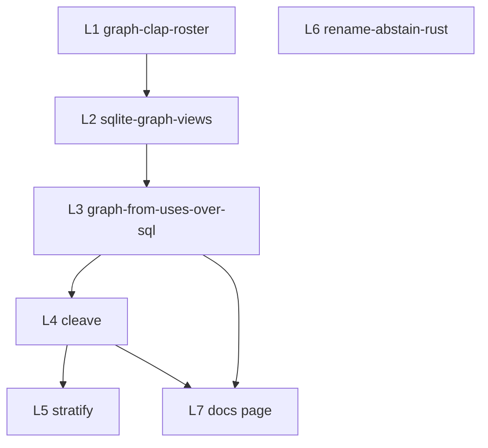

# Graph views and cleave: remaining work on sprefa-extract

Branch point for every lane: `origin/main` (d79bec61 or later). `src/0_graph.rs`
and the `graph_*` TypeSpec models exist only there.

## Goal

Turn `ryi graph` into a clap subcommand that walks paths through the `source_for`
roster instead of a hand parser and a `.ts`-only directory walk.
Move `--callers` / `--from` / `--uses` onto `WITH RECURSIVE` views shipped inside
the sqlite export, so sqlite3 users and the verb run the same SQL.
Then land `ryi cleave`: one item leaves a module with its import closure, the
source loses exactly the orphaned specifiers, every caller is respelled.

## Lane order



`L6` is independent and can run at any time. `L7` is a docs lane under
`docs/AGENTS.md` and never edits `src/`.

## Rules every lane carries

| rule | counted check |
| --- | --- |
| trace | each new test sets `HAFLEY_TRACE=<tmpdir>/<lane>.json` (pattern: `tests/149_graph_callers_ts.rs:4-15`), asserts the file parses and span count > 0 |
| timeout | every `Command` in a test gets a 10s cap; a lane that needs longer says why in the receipt |
| receipt | `cargo test --features cli --no-fail-fast` from `crates/sprefa-extract`, reported as `N binaries, N passed, 0 failed` |
| no refusal | an unanswerable state prints what it has plus a `next` block, exit 0 |

## L1 graph-clap-roster

| field | value |
| --- | --- |
| owned | `src/0_graph.rs`, `src/bin/ryi.rs` (dispatch arm at `:618-625` only) |
| forbidden | `src/types.rs`, `schema/1_facts.tsp`, `src/lang/**`, `src/bin/ryi/0_sqlite.rs` |
| reads | `resolved_edge` |
| writes | `graph_edge` |
| size | half-day |

`src/0_graph.rs:153-175` is a hand-rolled `while let Some(argument)` loop and
`src/0_graph.rs:137-151` walks directories keeping only `extension == "ts"`.
Both go. The parser becomes a `#[derive(Parser)] struct GraphCli` in the same
file, parsed from `std::env::args().skip(1)` the way `src/0_move.rs:33-72` and
`src/0_rename.rs:64-105` already do. Path walking calls
`sprefa_extract::source_for` (`src/lang/mod.rs:139`) and keeps any file the
roster claims, so a `.rs`, `.py`, `.go` or `.kt` sibling stops being silently
dropped.

CLI after the lane:

```
ryi graph --callers NAME [--json] [--lines] [--sqlite DB] [PATH...]
```

`--from`, `--uses`, `--depth`, `--kind`, `--expand` are declared in `GraphCli`
and exit 0 with a `next` block saying which lane ships them. No new records.

Acceptance:
- `ryi graph --callers deep tests/fixtures/ts5_findings/module_plane` still emits exactly 1 row, byte-identical to the snapshot in `tests/149_graph_callers_ts.rs:44-50`
- a fixture dir holding one `.ts` and one `.rs` yields `graph_edge` rows naming both paths; today it yields ts only
- `ryi graph --nonsense` exits 2 with clap's own usage text, not `unknown graph argument`
- `ryi graph` with no `--callers` exits 0 and prints the `next` block, not the `graph requires --callers NAME` error at `src/0_graph.rs:168`
- gate green

Tests: extend `tests/149_graph_callers_ts.rs`; new `tests/151_graph_roster_paths.rs`.
Fixture: `tests/fixtures/ts5_findings/module_plane` plus new `tests/fixtures/graph_roster/` (one `.ts`, one `.rs`, one `.md`).

## L2 sqlite-graph-views

| field | value |
| --- | --- |
| owned | `src/bin/ryi/0_sqlite.rs`, new `src/bin/ryi/1_graph_views.sql` |
| forbidden | `src/0_graph.rs`, `schema/**`, `src/types.rs` |
| reads | tables `resolved_edge`, `resolved_type_edge`, `resolved_import` |
| writes | views `callers`, `uses`, `reach`, `reach_depth` |
| size | half-day |

The seam is `span_lines_view_sql` at `src/bin/ryi/0_sqlite.rs:45`, executed at
`:117` right after the generated DDL. The graph views go in the same place, as
a static `include_str!` rather than a computed string.

A SQLite view takes no arguments. That divides the four cleanly:

| view | body | parameterised by the caller's WHERE |
| --- | --- | --- |
| `callers` | plain projection of `resolved_edge`, callee columns first, plus a `grade` CASE over `resolution_origin` | yes, on every column; this is the whole `--callers` arm |
| `uses` | plain projection of `resolved_type_edge` with `kind` in `param`/`returns`/`uses`/`field` | yes, on every column |
| `reach` | `WITH RECURSIVE` seeded from every distinct `(caller_path, caller_name)`, carrying `root_path`/`root_name` through the recursion | yes on `root_*`, but the all-pairs closure is computed whole before the filter applies |
| `reach_depth` | `reach` plus a `depth` column and `WHERE depth < 32` inside the body | yes on `root_*`; NO on the cap, which is frozen at view-definition time |

The cap is not a taste call. `UNION` in a recursive CTE dedups whole rows, so a
cycle whose rows carry an incrementing `depth` never converges. `reach` drops
`depth` and therefore terminates on `cycle_a.ts` <-> `cycle_b.ts` by dedup
alone; `reach_depth` keeps `depth` and must be bounded.

What cannot be a view at all: a closure seeded from one `PATH:NAME` the caller
supplies. The recursive anchor cannot read the outer query's WHERE. So
`ryi graph --from` templates the seeded CTE from `issues/graph-from-arm/item.md`
at runtime and pays O(E); a sqlite3 user filtering `reach` pays O(V*E).

The landed `--callers` arm emits `kind` = `import_resolve`, not `call`
(`tests/149_graph_callers_ts.rs:47`). The `callers` view projects
`resolved_edge.kind` through unchanged so view and verb agree.

Acceptance:
- `sqlite3 facts.db '.tables'` lists 4 new views; `.schema callers` is non-empty
- `SELECT count(*) FROM callers WHERE from_name='deep'` equals the row count `ryi graph --callers deep` prints for the same fixture
- `SELECT count(*) FROM reach WHERE root_name='walk'` over the cycle fixture returns in under 1s and does not hang
- `reach_depth` over the two-hop chain returns depth groups 0,1,2,3 with counts matching the oracle query in `issues/graph-from-arm/item.md`
- the `finish()` banner (`src/bin/ryi/0_sqlite.rs:201-216`) gains a `Callers:` and a `Reach:` example line
- gate green

Test: `tests/152_sqlite_graph_views.rs`. Fixture: `tests/fixtures/ts5_findings/module_plane`.

## L3 graph-from-uses-over-sql

| field | value |
| --- | --- |
| owned | `src/0_graph.rs`, `src/bin/ryi/0_sqlite.rs` (one new constructor) |
| forbidden | `src/types.rs`, `schema/1_facts.tsp`, `src/lang/**` |
| reads | `resolved_edge`, `resolved_type_edge`, `resolved_import`, `file_edge` |
| writes | `graph_node`, `graph_edge`, `graph_root` |
| size | day |

`run_callers` at `src/0_graph.rs:82-115` becomes SQL. After `GraphCx::load`
runs `resolve_project` once, the facts go into an in-memory `rusqlite`
`Connection` through the generated `writers::insert_all`, the L2 views are
created on it, and each arm is one prepared statement. `Database::create`
refuses `:memory:` at `src/bin/ryi/0_sqlite.rs:105`, so this lane adds
`Database::memory()` beside it and leaves the noclobber rule on `--sqlite`
untouched.

CLI after the lane:

```
ryi graph --callers NAME            [--depth N] [--json] [--lines] [--sqlite DB] [PATH...]
ryi graph --from PATH:NAME [--expand] [--kind call|type|both] [--budget N] [PATH...]
ryi graph --uses TYPE               [--json] [--lines] [PATH...]
```

Acceptance:
- `--callers deep` output is byte-identical to L1's snapshot, now produced by SQL
- `--from .../two_hop_consumer.ts:reach --expand` depth counts equal the `reach_depth` groups for the same root
- `--from missing.ts:nope` emits one `graph_root` with `found=false` and exits 0
- `--uses Widget tests/fixtures/ts_checker/src` returns the two `param` rows named in `issues/graph-uses-arm/item.md`
- an unexpanded run that left an import outside the set prints a `next` block naming `--expand`, exit 0
- gate green

Tests: `tests/153_graph_from_ts.rs`, `tests/154_graph_uses_ts.rs`.
Fixtures: `tests/fixtures/ts5_findings/module_plane` (from), `tests/fixtures/ts_checker/src` (uses).

## L4 cleave

| field | value |
| --- | --- |
| owned | new `src/0_cleave.rs`, `src/bin/ryi.rs` dispatch arm, new `src/cleave_cx.rs` |
| forbidden | `src/0_move.rs`, `src/0_rename.rs`, `src/lang/ts_rename.rs`, `src/lang/rust_rename.rs` (reuse, never edit) |
| reads | `node`, `specifier`, `resolved_edge`, `resolved_type_edge`, `resolved_import` |
| writes | `cleave_plan`, `cleave_specifier`, `cleave_drag` rows; soopy stages |
| size | 2 days |

`MoveCx` (`src/move_cx.rs:33`) supplies root discovery, the file list and
`abs`/`rel`; `Respell` and `replace_action` supply the caller edit; `move_stage`
supplies `stage_and_commit`, `VerifyJournal` and rollback. Dry run is the
default, exactly as `src/0_move.rs:57`.

```
ryi cleave SRC#ITEM DEST [--root DIR] [--state DIR] [--drag] [--commit]
                         [--verify CMD] [--text-refs] [--json]
```

### Step trace, three TS files

Before.

`src/util.ts`
```ts
import { readFileSync } from "node:fs";
import { join } from "node:path";
import { LOG } from "./log";

export function slug(raw: string): string { return raw.toLowerCase(); }

export function loadConfig(dir: string): string {
  LOG("load");
  return readFileSync(join(dir, "config.json"), "utf8");
}
```

`src/config.ts`
```ts
import { join } from "node:path";
export const CONFIG_NAME = "config.json";
```

`src/app.ts`
```ts
import { loadConfig, slug } from "./util";
export function boot(dir: string) { return slug(loadConfig(dir)); }
```

Command: `ryi cleave src/util.ts#loadConfig src/config.ts`

1. Resolve once over the root. The `node` row for `loadConfig` gives its span.
   No file changes.
2. `refs_out(loadConfig)` = names referenced inside that span and not declared
   there: `LOG`, `readFileSync`, `join`, `string`. `string` is a builtin and is
   dropped. No file changes.
3. Partition against `util.ts`'s `specifier` rows. Case (b), imported into F:
   `LOG` from `./log`. Case (c), package path: `readFileSync` from `node:fs`,
   `join` from `node:path`. Case (a), declared in F: empty. No file changes.
4. Remove the item span from `util.ts`.
   `util.ts` now: the three imports, then `slug` only.
5. Count remaining references in `util.ts` for each specifier. `slug` uses none
   of `readFileSync`, `join`, `LOG`, so all three are orphaned and deleted.
   `util.ts` now:
   ```ts
   export function slug(raw: string): string { return raw.toLowerCase(); }
   ```
6. Add the (b)+(c) specifiers to `config.ts`, deduped and respelled relative to
   `config.ts`'s directory. `join` is already carried, so only two lines land.
   `config.ts` now:
   ```ts
   import { readFileSync } from "node:fs";
   import { join } from "node:path";
   import { LOG } from "./log";
   export const CONFIG_NAME = "config.json";
   ```
7. Append the item text to `config.ts`.
   ```ts
   export function loadConfig(dir: string): string {
     LOG("load");
     return readFileSync(join(dir, "config.json"), "utf8");
   }
   ```
8. Drag pass. Case (a) was empty, so the dragged set is empty and step 0 does
   not re-run. The fixpoint is reached in one iteration and the iteration count
   is asserted, not assumed. No file changes.
9. Caller respell. `resolved_import` rows with
   `target_path=src/util.ts, target_name=loadConfig` name `src/app.ts`. The
   specifier is split, not rewritten whole, because `slug` stayed behind.
   `src/app.ts` now:
   ```ts
   import { slug } from "./util";
   import { loadConfig } from "./config";
   export function boot(dir: string) { return slug(loadConfig(dir)); }
   ```
10. One soopy stage per touched file, three files, committed only under
    `--commit`; `--verify` runs afterwards and rolls all three back together.

Out of scope for this lane: Rust cleave (the `mod` relocation and `pub(crate)`
visibility widening are their own issue, after the TS arm proves the planner),
cross-language cleave, moving a type together with its `impl` blocks, and any
item whose free-name set contains a name the resolver graded `-`. That last one
prints the unresolved names and the `ryi graph --uses` command that would
answer them, exit 0.

Acceptance:
- the three-file fixture above: `util.ts` loses exactly 3 import lines, `config.ts` gains exactly 2, `app.ts` gains exactly 1
- `config.ts`'s existing `join` import is not duplicated: `grep -c 'node:path'` equals 1
- a variant fixture where `slug` is private and unreferenced offers exactly 1 drag candidate under `--drag` and 0 without it
- the fixpoint iteration count is emitted as a `cleave_plan` field and asserted equal to 2 on a two-level drag fixture
- without `--commit` the tree is byte-identical after the run (digest of every fixture file unchanged)
- `--commit --verify 'tsc --noEmit'` on a fixture where verify fails restores all three files
- gate green

Test: `tests/155_cleave_ts.rs`. Fixture: new `tests/fixtures/cleave_ts/`.

## L5 stratify

| field | value |
| --- | --- |
| owned | new `src/0_stratify.rs`, `src/bin/ryi.rs` dispatch arm |
| forbidden | `src/0_graph.rs`, `src/0_move.rs`, `src/0_cleave.rs` |
| reads | `file_edge`, `file`, `resolved_edge`, `reach` view |
| writes | `stratum`, `stratum_cycle`, `locality`, `stratify_move` |
| size | day |

```
ryi stratify --from PATH[:NAME] [--from ...] [--base-lines N] [--kind call|type|both] [PATH...]
```

Acceptance:
- SCC condensation over `file_edge` is deterministic: two runs produce identical stdout bytes
- the cycle fixture yields exactly 1 `stratum_cycle` row with 2 members
- every `locality` row carries internal, touching, score, lines, target_lines; scores sum-check against `resolved_edge` counts
- a fixture exhibiting all four reasons yields at least 1 `stratify_move` row per reason, 4 distinct `reason` values
- the tree is byte-identical after a run
- the emitted plan feeds `ryi move --list` with no hand editing, exit 0
- gate green

Test: `tests/156_stratify.rs`. Fixture: new `tests/fixtures/stratify_ts/`.

## L6 rename-abstain-rust

| field | value |
| --- | --- |
| owned | `src/lang/rust_rename.rs` |
| forbidden | `src/0_rename.rs`, `src/lang/ts_rename.rs`, `src/types.rs` |
| reads | rust scope plane |
| writes | `RenameAbstain` rows |
| size | half-day |

Surface unchanged: `ryi rename FILE#OLD NEW [--json]`, exit 7 when abstains
exist. `src/lang/rust_rename.rs:577` pushes a `SymbolSeat { form: "untyped
field" }` and `:112` turns any seat into `RenameStop::Dynamic`; the change is to
emit one abstain per untyped access when at least one access typed, and keep
`Dynamic` only when zero typed. Glob seats at `:555` stay stops.

Acceptance:
- fixture with 1 typed and 1 untyped `.old` field access: exit 7, 1 seat, 1 abstain
- fixture with 0 typed accesses: exit 6, unchanged message
- glob-import fixture: exit 6, 0 abstains
- `--json` closes with an `abstains` array of length 1 on the first fixture
- gate green

Test: `tests/150_rename_abstain_rust.rs`. Fixture: new `tests/fixtures/rust_rename_abstain/`.

## Open questions

| # | question | recommended answer |
| --- | --- | --- |
| 1 | `cleave` or `split` as the verb name | `cleave`. `split` collides with the stratify vocabulary (`split_candidate`) and with every reader's mental model of splitting a file. |
| 2 | `ryi graph --callers NAME` flags, or `ryi graph callers NAME` sub-subcommands | keep flags. Three issue cards, a landed test snapshot and the docs draft all spell them as flags; a second dispatch level buys nothing. |
| 3 | `reach_depth` cap of 32 | yes, 32, no flag. It covers every corpus this crate has measured, and a deeper walk is `ryi graph --from --depth N`, which templates its own CTE. |
| 4 | `ryi cleave` when DEST does not exist | create it. For TS that is the whole answer; for Rust the `mod` wiring is L4's out-of-scope note and lands with the Rust arm. |
| 5 | should `--sqlite` gain an in-memory mode, or only the verb | verb only. Add `Database::memory()` for L3 and leave the `--sqlite` noclobber refusal at `src/bin/ryi/0_sqlite.rs:105` exactly as it is. |
