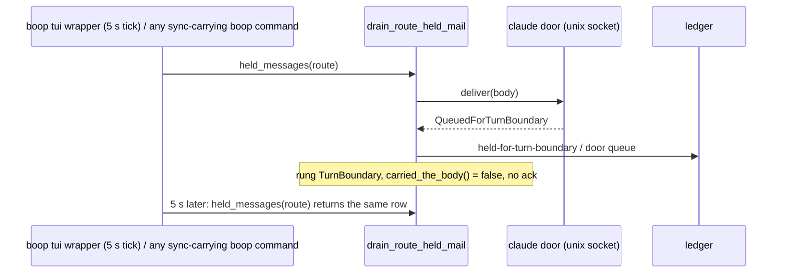
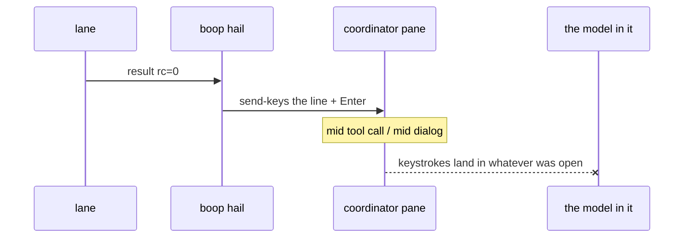
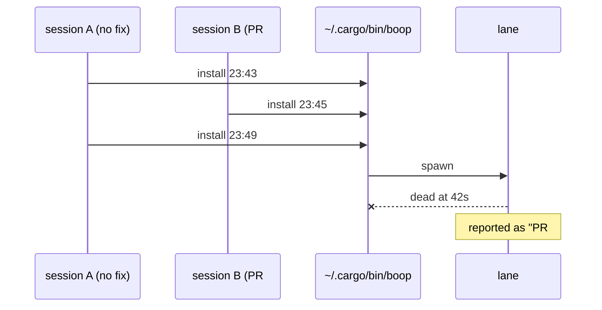
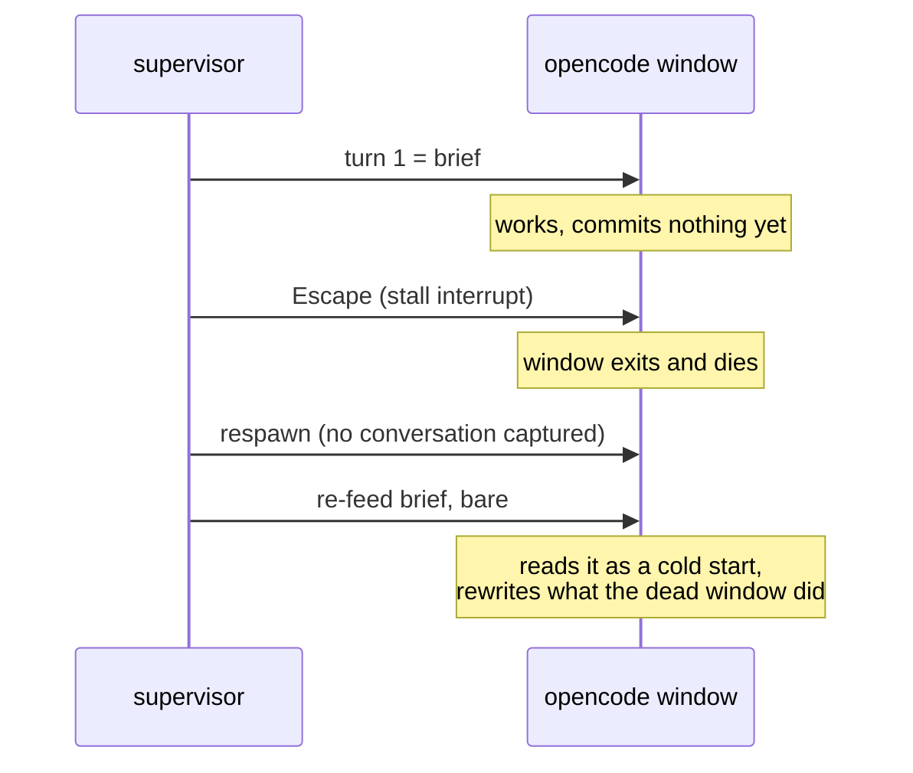
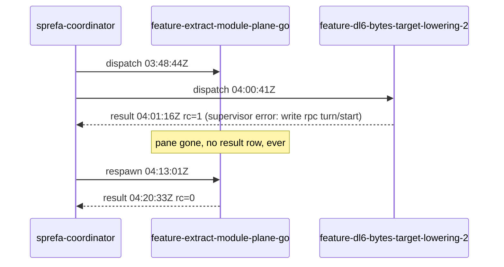

# failure modes

Every incident that bit gets a row: what happened, why, the test that fails
without the fix, the rail that stops it recurring. Newest first.

| # | date | title |
|---|---|---|
| 14 | 2026-09-03 | a hail a claude session already held was pushed at it again every 5 s, 29 copies per row |
| 13 | 2026-08-20 | 512 concurrent `boop db` reads each ran their own transcript sync, and the machine stopped |
| 12 | 2026-08-21 | a lane that ended its turn to report a finding was closed and read `dead` |
| 11 | 2026-08-19 | an opencode ACP session starts on a dead model endpoint and retries forever in silence |
| 10 | 2026-08-19 | 90% of the live store's trace events were test fixture lanes, written by unit tests inside src/ |
| 9 | 2026-08-17 | a coordinator restart left every child running with an edge that answered nobody |
| 8 | 2026-08-17 | four lane spawns died in minutes on two error strings that were one bug |
| 7 | 2026-08-17 | a dead-on-arrival spawn left a worktree no boop command could clear |
| 6 | 2026-08-18 | a registry-only verb re-parsed 4.2 GB of transcripts, and cargo test -p boop took 8.7 minutes |
| 5 | 2026-08-17 | every lane completion arrived twice in the coordinator inbox |
| 4 | 2026-08-17 | coordinator mail is typed into a pane a model is driving |
| 3 | 2026-08-17 | ~/.cargo/bin/boop is whatever the last session built, and nothing printed says which |
| 2 | 2026-08-17 | a respawned agent window is re-fed a brief it cannot place, or the wrong text entirely |
| 1 | 2026-08-17 | a lane can die with no result row, no log, no trace |

---

## 14. a hail a claude session already held was pushed at it again every 5 s, 29 copies per row

**Incident.** 2026-09-03. A claude coordinator (`claude-299`) saw its 21
lane hails replayed as fresh peer messages on every turn and every tool round,
until the session's context was spent. The live store, read at 15:38:

| count | what |
|---|---|
| 2484 | `door queue` transitions in `agent_delivery_transition` |
| 29-30 | pushes of each of the 22 `claude-299` rows |
| 752 | open rows across 15 claude routes that a door had already taken at least once |
| 283 | of those addressed to one route (`claude-3611`), waiting to fire as a batch |



**RCA.** Three lines agreed with each other and disagreed with the claude door.

| where | what it said |
|---|---|
| `boop-harness/src/door/claude.rs` `deliver` | a socket write answers `Delivered::QueuedForTurnBoundary`: the session holds the body and reads it at its next turn boundary |
| `boop-proc/src/deliver.rs` `land` | mapped that answer to `Rung::TurnBoundary`, the rung for "nothing took it, hold it for a retry" |
| `Rung::carried_the_body` | false for `TurnBoundary`, so `drain_route_held_mail` never acked the row |
| `boop-store/src/bus.rs` `held_messages` | read only the latest transition word, which every re-push rewrote to `held-for-turn-boundary` |
| `deliver.rs` tests `FakeClaudeDoor` | answered `Delivered::Injected`, so `held_mail_pushes_itself_once_the_route_can_take_it` passed against a door the real binary never runs |

Commit 45e0cf2 (2026-09-02, "held mail pushes itself") added the 5 s tick and
the per-command drain on top of that mapping. Before it, a mis-filed row sat
in the mailbox; after it, every reader of the mailbox re-fired the row.

**Fix.**

| # | change | file |
|---|---|---|
| 1 | `Rung::DoorQueue`: state `accepted-by-harness`, `carried_the_body()` true, so the drain stamps the row. `Delivered::QueuedForTurnBoundary` lands there | `boop-proc/src/deliver.rs` |
| 2 | `held_messages` excludes a row with any `accepted-by-harness` transition or any `door` / `door queue` detail in its whole history, so the pre-fix ledger rows stop replaying without a store migration | `boop-store/src/bus.rs` |
| 3 | `fan_out_to_children` acks a row its door took; it wrote the row and skipped the ledger, which left it held | `boop/src/cli/mail.rs` |
| 4 | `FakeClaudeDoor` answers `QueuedForTurnBoundary` and logs every body it takes | `deliver.rs` tests |

**Fail-pre-fix tests.**

| test | pre-fix result |
|---|---|
| `held_mail_pushes_itself_once_the_route_can_take_it` | with the double answering the real door's word: `pushed` was 0, the row stayed held, and seven further drains each handed the door another copy |
| `a_row_a_door_already_queued_is_never_pushed_again` | a row with a `held-for-turn-boundary` / `door queue` history came back from `held_messages` and reached the door |
| `a_claude_coordinator_takes_its_row_at_the_door_with_no_hooks_installed` | asserted `Rung::Door`; now `Rung::DoorQueue` with the same `accepted-by-harness` outcome |

**Rail.** A door that answers anything but `Unreachable` has the body, and the
row is stamped in the same call. `held_messages` asks "did a door ever take
this", never "what was the last word". A test double for a door answers the
same variant the real door answers, or the test is measuring nothing.

**Live store.** The 752 open rows read as held by no drain once this binary is
installed. Stamping them is one statement, for a store that should not carry
open rows a door already took:

```sql
UPDATE agent_mail SET to_timestamp = strftime('%Y-%m-%dT%H:%M:%fZ','now')
 WHERE to_timestamp IS NULL
   AND message_id IN (SELECT message_id FROM agent_delivery_transition
                      WHERE detail IN ('door','door queue'));
```

---

## 13. 512 concurrent `boop db` reads each ran their own transcript sync, and the machine stopped

**Incident.** `target/debug/instant` under `just dev` spawns
`boop db turn list --session <id> --format ndjson` once per read. Two
observations on 2026-08-20 caught 512 and 511 of them alive at once. Load
average went 13 to 47 with only 4 to 8 threads runnable, so the machine was
blocked, not computing, and killing the binary did not stick because tauri
respawns it. On the same machine, `boop db "SELECT 1"` alone measured 43.96s
real against 0.34s user and 0.65s sys.

**RCA.** Four causes, each multiplying the next.

| # | cause | site |
|---|---|---|
| A | every read verb ran a full `sync_all` first, and nothing coordinated the passes | `crates/boop/src/cli/db.rs` `sync_all`, reached from `main.rs` `sync_before_local_command` |
| B | `backfill_cursor_modified` ran once per candidate in autocommit: 3893 write transactions per pass whose `WHERE modified_ms = 0` matched zero rows | `crates/boop-store/src/ident.rs` `backfill_cursor_modified` |
| C | the opencode adapter reported `size: 0` for every session while its cursor is a message rowid, so `session_needs_sync` was true for all 962 already-synced sessions on every pass | `crates/boop-harness/src/harness/opencode.rs` `sessions_from`, `crates/boop/src/cli/db.rs` `session_needs_sync` |
| D | a pass had no budget and no trail, so a 43.96s pass reported nothing at all, and `boop debug` paid its own cold sync before it could say so | `crates/boop/src/cli/db.rs` `sync_all` |

B and C are per-pass write amplification; A turns one pass into N. 512 callers
times 3893 no-op writes is 1.99M write transactions queued on one SQLite writer
lock, which is why the threads were blocked rather than busy.

The coordinator's first hypothesis, that `backfill_cursor_modified` outside a
transaction was itself the 43s, was tested and disproved: 400 replayed no-op
backfills against a copy of the 446 MB store cost 0.01s. It is not the wall on
one pass. It is the amplifier across 512.

**Same incident, a discovery defect found while building the rail.** A
transcript the store had never seen, written into a claude project directory
the store already knew, was invisible to sync. `root_stamps_match` compared the
mtime of `~/.claude/projects` itself, which does not move when a file is
created inside a child directory, and `KnownSessions::has_moved` only stats
paths the store already holds. The early-out was simultaneously too eager, since
an append to any known transcript re-walked every adapter, and too lazy, since a
new session beside a known one was never found.

**Fix.**

| # | change | file |
|---|---|---|
| 1 | one pass across all callers: `std::fs::File::try_lock` on `<db>.sync.lock`, a caller that finds it held reads without syncing | `crates/boop/src/cli/db.rs` `claim_sync`, `SyncFlight`, `SyncContention` |
| 2 | the v12 cursor backfill runs only while a cursor still carries `modified_ms = 0`, and then inside one transaction per adapter | `crates/boop-store/src/ident.rs` `cursors_missing_modified`, `crates/boop/src/cli/db.rs` `sync_all_budgeted` |
| 3 | the opencode adapter reports its per-session max message rowid as `size` | `crates/boop-harness/src/harness/opencode.rs` `last_message_rowid` |
| 4 | the startup sync yields at `STARTUP_SYNC_BUDGET` and says what it was doing; every session commits on its own, so the next pass resumes | `crates/boop/src/cli/db.rs` `SyncPhases::spent` |
| 5 | every pass appends `start` then `done` with its phase table to `~/.agent/sync-trail.ndjson`, and `boop debug` reads it back | `crates/boop-store/src/trail.rs` `append_sync_trail`, `crates/boop/src/debug.rs` `sync_report` |
| 6 | the root-stamp early-out is deleted; discovery walks, which measured 12ms for 1700 claude transcripts | `crates/boop/src/cli/db.rs` `sync_all_budgeted` |
| 7 | `BOOP_NO_SYNC=1` skips the startup sync for any caller that wants the store as it stands | `crates/boop/src/main.rs` `sync_suppressed` |

`BOOP_NO_SYNC` is a workaround, not the fix. A diagnostic verb that is as slow
as the thing it diagnoses is its own defect, and the answer to it is 1, 4 and 5.

**Fail-pre-fix tests.** Each carries its sabotage receipt in its header. Run
against a worktree at `898be94`:

| test | file | pre-fix |
|---|---|---|
| `concurrent_reads_perform_one_sync_pass_between_them` | `tests/sync_convoy.rs` | `24 concurrent reads took 4.393911042s, over the 1.5s budget` |
| `a_caller_that_finds_the_sync_lock_held_reads_without_syncing` | `tests/sync_convoy.rs` | `and must record why it did not: left 0, right 1` |
| `a_new_session_in_a_known_project_directory_is_discovered` | `tests/sync_discovery.rs` | `left: 2, right: 4` |
| `the_no_sync_hatch_skips_the_startup_sync_and_still_reads_rows` | `tests/no_sync_hatch.rs` | `left: 4, right: 2` |

**Receipts.** Same machine, a copy of the live 446 MB store, cursors cold:

| condition | 898be94 | after |
|---|---|---|
| cold cursors | 1.20s | 0.27s |
| second | 0.22s | 0.17s |
| warm | 0.22s | 0.18s |
| 24 concurrent | 1.81s, 24 passes | 0.20s, 1 pass and 23 deferrals |

**Rail.** `crates/boop/tests/sync_convoy.rs` spawns 24 concurrent invocations
against a 4000-transcript fixture and asserts the count first: every invocation
records either a pass or a deferral, and fewer passes than invocations. The
wall budget behind it is the incident itself, and no count expresses it,
because a pass that wrote nothing leaves no row in the store.

**What still cannot be answered.** The 43.96s was never reproduced on demand.
Every measurement here ran with the transcript roots already in the page cache,
where the same pass costs 1.20s; the 43.96s reading was taken minutes after the
transcript trees had moved on disk, and nothing in the trail from that run
survived, because the trail did not exist yet. A pass killed by SIGKILL now
leaves a `start` with no `done`, which `boop debug` prints as
`started and never finished`.

## 12. a lane that ended its turn to report a finding was closed and read `dead`

**Incident.** 2026-08-21, two sprefa lanes each ended a turn to report a
finding or wait on a background job. `crates/boop-proc/src/supervise.rs`
closed the channel, wrote a terminal verdict, and returned; `lane run` exited
and took the tmux session with it. `lane list` then read the lane `dead`, and
both reports sat unread in a pane that no longer existed. User, verbatim:
"that is opposite behavior i want out of boop."

**RCA.** `supervise`'s post-turn branch treated "no pending hail" as
"nothing left to do": `held.is_empty()` closed the channel and returned
`Ended` unconditionally, whether or not the turn had ended cleanly.
`completion_verdict` then invented `rc=1 "agent stopped before completing the
brief"` for a clean turn that had not (yet) finished the brief, so even a
lane mid-work with nothing queued this instant looked like a named failure.
Separately, `STALL_LIMIT` was 5 minutes with no config key, so a turn
legitimately waiting on a background build over that bound was killed and
retried mid-wait.

**Fix.**

| # | change | file |
|---|---|---|
| 1 | a turn that ends cleanly with no pending hail parks instead of ending: the channel stays open, the process stays alive, the supervisor polls the mailbox and `ParentWatch` every 700ms until a hail arrives or the parent dies | `supervise.rs` `supervise` |
| 2 | `Ended` returns only on an explicit delete (`SIGTERM`/`SIGHUP`/`SIGINT`), a hard failure or exhausted retry budget, or the parent dying under `ParentDeathPolicy::Kill` | `supervise.rs` `supervise`, `completion_verdict` |
| 3 | `completion_verdict` returns `Option<(i32, Option<String>)>`; a clean turn with the brief not yet done is `None`, no verdict, not a failure | `supervise.rs` `completion_verdict` |
| 4 | the brief-done result row is written once, inline, the moment the brief is done, not deferred to process exit | `supervise.rs` `supervise` (`result_written`) |
| 5 | `lane list` gains a third state, `idle`, read from a residency file the supervisor writes each turn boundary; `dead` stays a tmux fact | `supervise.rs` `record_residency`/`read_residency`, `job.rs` `lane_state` |
| 6 | `STALL_LIMIT` is a config key (`BOOP_STALL_LIMIT_SECS`), default raised 5m -> 30m; a parked lane never calls `stalled()` at all | `supervise.rs` `stall_limit`, `parse_stall_limit` |

**Fail-pre-fix tests.**

| test | file |
|---|---|
| `a_turn_with_no_pending_hail_parks_instead_of_ending` | `supervise.rs` |
| `a_nudge_only_completion_has_no_verdict_yet` | `supervise.rs` |
| `a_background_wait_survives_the_old_five_minute_bound` | `supervise.rs` |
| `a_reparent_policy_moves_the_edge_onto_the_registered_coordinator`, `an_orphan_policy_leaves_the_lane_and_its_edge_alone` | `tests/parent_death.rs` |
| `a_clean_completion_hails_nothing_but_its_rc` | `tests/parent_failure_hail.rs` |

**Rail.** `crates/boop/docs/lane-lifecycle.md` names the three real exits and
the `live`/`idle`/`dead` state read; a fourth exit path added later without a
matching row there is a doc that no longer matches the code, not a rail that
catches it.

**What still cannot be answered.** `LaneChannel` exposes `last_activity_ms`
only, no tool-call content, so a turn legitimately waiting mid-flight on a
backgrounded Bash or an `until`-loop still relies on the 30-minute bound
rather than an exemption tied to the tool call itself; that needs a
`boop-acp` surface this fix's ownership did not include.

## 11. an opencode ACP session starts on a dead model endpoint and retries forever in silence

**Incident.** Measured in `~/projects/labs/acp-lab` on 2026-08-19. `opencode
acp`, prompted `reply with the single word pong`, answered `end_turn` in 4s
when the client sent `session/set_config_option {configId:"model"}` and hung to
the 180s cap when it did not. Nothing was written to the child's stdout or
stderr for those 180s. The one line naming the cause sat in opencode's own
`~/.local/share/opencode/log/opencode.log`: `AI_APICallError: Upstream request
failed: Endpoint is unavailable.`

**RCA.** Two roots.

| root | detail |
|---|---|
| opencode's ACP path reads neither `~/.config/opencode/opencode.json` nor `OPENCODE_MODEL` | every ACP session starts on the built-in default `opencode/big-pickle`, whose endpoint is down. ACP `session/set_config_option` is the only model lever the protocol gives a client. |
| the old channel could not see a provider failure at all | `OpencodeChannel` ran one `opencode run` child per turn and read the verdict out of opencode's SQLite store. `opencode run` exits 0 when the provider drops the stream, so `rc=0` plus a trailing `MessageAbortedError` row was the whole signal, and a turn that never produced a row read as healthy. |

**Fix.**

| # | change | file |
|---|---|---|
| 1 | the lane channel speaks ACP through the official `agent-client-protocol` crate: `initialize`, `session/new` with an absolute cwd, then `session/set_config_option {model}` whenever the spec names a model | `crates/boop/src/channel/acp.rs` `AcpChannel::open`, `handshake` |
| 2 | a JSON-RPC error on `session/prompt` becomes `TurnEvent::Flaked` carrying the peer's message verbatim, so the supervisor retries instead of grading the lane failed | `crates/boop/src/channel/acp.rs` `turn_verdict` |
| 3 | `opencode run` and the store scrape are gone from the opencode channel | `crates/boop/src/channel/opencode.rs` `OpencodeChannel::open` |

**Fail-pre-fix test.**

| test | file |
|---|---|
| `a_prompt_error_frame_is_a_retryable_flake` | `channel/acp.rs` |
| `a_real_opencode_acp_turn_ends_the_turn` (`#[ignore]`, the live leg) | `channel/acp.rs` |

**Rail.** Every `session/update` stamps `AcpChannel::last_activity_ms`, so a
session that goes quiet is visible to the stall watchdog within one poll rather
than at a 180s cap. Agent stderr is forwarded into `tracing` and lands in the
lane trail through `trail::lane_writer`.

**What still cannot be answered.** ACP has no `error` kind in the
`SessionUpdate` union, so a provider failure that neither fails the
`session/prompt` request nor fails a specific tool call has no protocol-level
channel; each agent invents its own convention. A silent mid-turn stall is
still only detectable as silence.

## 10. 90% of the live store's trace events were test fixture lanes, written by unit tests inside src/

**Incident.** Measured 2026-08-19 on `~/.agent/boop.db`: `agent_trace_event`
held 5774 rows, of which 5217 named a lane no human ever spawned. 5052 for
`mine` and 165 for `lane-test`, spread over three days. `boop debug` reported
`lane-test` supervisor errors at 13:22:55 that day as if a real lane had
flaked. PR #32 had already pointed every `tests/*.rs` at a temp `HOME` and
`BOOP_DB`, and the leak went on anyway.

**RCA.** Two roots, both inside `#[cfg(test)]` modules under `src/`, both
invisible to the rail #32 shipped.

| leak | path | why the temp HOME missed it |
|---|---|---|
| `~/.agent/boop.db` grows `mine` rows | `supervise.rs` `remember_conversation` calls `Store::default_path()`, which reads `BOOP_DB` and otherwise `dirs::home_dir()` (`ident.rs:526`). Seven `supervise::tests::*` reach it. | the lib test binary never sets `BOOP_DB`; #32 set it per `tests/*.rs` file only |
| `~/.agent/lanes/lane-test/supervise.log` grows | the `spec()` fixture in `harness/claude.rs:556`, `harness/codex.rs:715`, `harness/opencode.rs:862` sets `env_stamp: None`, so the `boop beep lane run` that `supervisor_command` builds inherits the test process `HOME` and resolves `trail::lanes_root()` to the real one | tmux runs the supervisor, so the test text never contains `CARGO_BIN_EXE_boop`, which is the only marker the #32 rail matched |

Attribution, counting `agent_trace_event` and the log size around each cargo
target on 2672085:

| target | `mine` rows | `supervise.log` bytes |
|---|---|---|
| `--lib` | +37 | +663 |
| `--lib supervise::` | +37 | 0 |
| `--lib harness::claude` | 0 | +215 |
| `--lib harness::codex` | 0 | +233 |
| `--lib harness::opencode` | 0 | +218 |
| every `tests/*.rs` target, each run alone | 0 | 0 |

The seven writers: `a_flaked_brief_turn_is_refed_even_when_the_channel_has_an_id`
(+7), `a_parentless_lane_writes_no_result_row` (+6),
`a_supervisor_error_still_writes_the_lane_s_result_row` (+6),
`a_fresh_identified_channel_receives_the_full_brief` (+5),
`an_explicit_resume_receives_the_resume_nudge` (+5),
`the_brief_reaches_the_channel_before_a_resume_nudge_opens_the_lane` (+5),
`a_supervisor_panic_still_writes_the_lane_s_result_row` (+3).

**Fix.**

| # | change | file |
|---|---|---|
| 1 | a named SQL report counts fixture lane rows in any store | `crates/boop/sql/fixture_lanes.sql` |
| 2 | the scan that #32 shipped gains a second pass over `src/**`, matching the two shapes that reach the real root | `crates/boop/tests/temp_home_rail.rs` |

Still open, because this lane may not edit `supervise.rs` or `harness/**`:
`spec()` in the three harness test modules needs
`env_stamp: Some(format!("HOME={temp} BOOP_DB={temp}/boop.db"))`, and the
`supervise::tests` module needs `BOOP_DB` pointed at a temp store before it
calls anything that reaches `remember_conversation`. Both are waived by name in
the rail, so neither can be joined by a third.

**Fail-pre-fix tests.** `no_new_src_unit_test_reaches_the_machine_s_own_agent_root`
in `tests/temp_home_rail.rs`. Sabotage 1, delete `"harness/claude.rs"` from
`SPAWN_WAIVED`: `these src modules spawn a SpawnSpec with env_stamp: None, so
the supervisor inherits the real HOME: ["harness/claude.rs"]`. Sabotage 2, add
an unmatched `"channel.rs"` to `STORE_WAIVED`: `these waivers no longer match
anything and must be deleted: ["channel.rs"]`.

**Rail.** The waiver lists are the ratchet. A new `SpawnSpec` spawned with
`env_stamp: None`, or a new module that opens the default store while naming a
fixture lane, fails the rail by name. A waiver that stops matching also fails,
so the lists shrink to zero and cannot rot in place.

**What is not answered yet.** The purge itself. `crates/boop/sql/fixture_lanes.sql`
counts; the matching delete script and its one run against `~/.agent/boop.db`
did not land with this change. A backup of the store as it stood sits at
`~/.agent/boop.db.bak-2026-08-19` (sqlite3 `.backup`, `PRAGMA integrity_check`
ok), and `~/.agent/lanes/lane-test/` is still on disk.

## 9. a coordinator restart left every child running with an edge that answered nobody

**Incident.** On 2026-08-17 the sprefa coordinator process restarted. Two native
opus drivers and their rigs died silently, three flash4 lanes were already
dead. Nothing told the survivors and nothing reaped them.

**RCA.** Every reader of the parent edge on a registry route used it as an
address and never as a fact to check. `crates/boop/src/supervise.rs`
`record_result` reads it to address the completion row;
`crates/boop/src/main.rs` `run_pstree` reads it to render an orphan under a
`[gone]` root. No poll, anywhere, asked whether the parent was still
addressable. A lane therefore ran to its own end against a parent that had
stopped existing, and its completion row was appended to a mailbox nobody was
reading.
## 8. four lane spawns died in minutes on two error strings that were one bug

**Incident.** 2026-08-17 03:00-03:15, four spawns died across two drivers with
two signatures: codex lanes rc=1 `supervisor error: write rpc turn/start`
(`feature-extract-module-plane-rust` twice, `feature-shell-v2-terra-wait`,
`feature-dl6-bytes-target-lowering`), opencode lanes rc=1 `stalled: 30s with no
harness activity` (`chore-soopy-public-seams`,
`feature-extract-flow-cli-dispatch`). It was read as two bugs and as codex
lane spawning being dead. It recurred at 14:46 and 22:24-22:28 the same day,
17 `write rpc turn/start` result rows and 6 `stalled: 30s` rows in total.

**RCA.** One kill, two exits. `~/.agent/lanes/<lane>/supervise.log` for the
seven incidents whose lane directory survives shows the same chain every time,
for example `feature-agent-network-frames/supervise.log:6-15`:

| step | line |
|---|---|
| 1 | `lane turn starting turn_bytes=<n>` |
| 2 | `lane turn stalled; killing the harness child idle_ms=30453..30559` |
| 3 | `turn_end_reason="stalled: 30s with no harness activity" retryable=true` |
| 4 | `lane provider flake; resuming flake_resumes=1` |
| 5 | `lane supervisor failed harness="codex" error=write rpc turn/start` |

The stall window was 30s and the model had not spoken yet. A codex reasoning
model emits nothing until its first tool call, so a healthy child was killed at
~30s; the flake resume then opened a new turn on the channel the kill had
closed, and `RpcChild::call` reported the write into dead stdin as
`write rpc turn/start` (`channel/jsonrpc.rs:111`). opencode has no rpc turn to
re-open, so the same kill exits on the stall string alone. Corroboration: the
codex rollout for `01a00db1-c222-7ad0-b5d4-bbf903c70c2f` ends mid-`reasoning`
at 03:09:38.001Z, 29.3s after its `session_meta`, with no error of its own;
seven other rollouts from that night end the same way at 27.4-30.0s. Not the
harness, not machine load: 12 spawns in the 15-minute window is ordinary.
`tmux send-keys failed socket=` and `tui agent window respawned after death`
appear only inside a driver's own bus message (`~/.agent/mail/bus.ndjson:1104`,
`:1114`); `agent_trace_event` has zero rows matching either, so no keystroke
loss is evidenced.

**Fix.** Already landed on this base, which is why no code changes here.
`STALL_LIMIT` is 300s (`supervise.rs:21`), sized off a week of healthy traffic
where 261 in-message gaps ran past 120s. The rpc write names its own state,
`rpc session closed: <io error>` (`channel/jsonrpc.rs:20,99`), so a driver
reading the string learns the peer was gone rather than that a turn failed.

**Fail-pre-fix tests.** `a_quiet_opening_gap_is_not_a_stall`
(`supervise.rs:868`) pins 90s of opening quiet as alive and its header records
the ~70s death and the retry into dead stdin.
`a_write_to_a_closed_session_names_the_session` (`channel/jsonrpc.rs:227`)
holds a peer with a closed stdin and asserts both `rpc session closed` and
`write rpc turn/start`. `a_child_s_stderr_lands_in_the_lane_trail`
(`trail.rs:190`) keeps the child's own complaint out of the dead pane.

**Rail.** `~/.agent/lanes/<lane>/supervise.log` is why this RCA is answerable
at all: seven independent chains, each with `idle_ms` on the kill line. A lane
whose directory is already gone leaves only its driver's narrative, which is
what made this look like two bugs for a day.

---

## 7. a dead-on-arrival spawn left a worktree no boop command could clear

**Incident.** 2026-08-17 ~03:05, after the spawns in entry 8 died, respawning
the same lane name was blocked in both directions. `boop beep lane create`
bailed `worktree path already exists`; `boop beep lane delete <lane>` bailed
`no registry route for lane`. Two drivers hit it on four lanes the same night,
and each dug out with `git worktree remove --force` plus `git branch -D`.

**RCA.** A DOA lane is exactly half-dead. The pane epilogue runs
`beep lane delete --route-only`, so the registry row is gone within seconds,
but the worktree and branch that `prepare_spawn_dir` created are still on disk.
`prepare_spawn_dir` refused a path it had made itself
(`worktree.rs`, the `worktree.exists()` bail) and `run_lane_delete` refused a
lane it could not find a route for, so the one state a driver most wants to
retry from was the one state neither verb answered.

**Fix.**

| # | change | file |
|---|---|---|
| 1 | a lane records an on-parent-death policy at spawn: kill, reparent, or orphan (the default, which is what every lane did before) | `crates/boop/src/supervise.rs` `ParentDeathPolicy`, `record_parent_policy`, declared by `main.rs` `--on-parent-death` on `beep lane create` and `beep agent register` |
| 2 | the supervisor checks parent liveness on its existing poll interval and applies the policy within one interval | `crates/boop/src/supervise.rs` `ParentWatch::probe`, `parent_alive` |
| 3 | `kill` ends the lane the way a stall kill does, with the typed detail `parent-died: <parent>` on its result row | `crates/boop/src/supervise.rs` `ParentWatch::probe`, `PARENT_DIED_EXIT` |
| 4 | `reparent` rewrites the parent edge onto the one registered coordinator and mails it a `kind=reparented` row | `crates/boop/src/supervise.rs` `reparent` |
| 5 | a dead lane's reason and a surviving orphan's row both name the edge: `DEAD=parent-died=<parent>`, `DEAD=reparented=<parent>`, and `PARENT-GONE=<parent>` on any row whose parent route is gone | `crates/boop/src/trail.rs` `DeadReason`, `main.rs` `run_lane_list`, `gone_parent` |

**Fail-pre-fix tests.**

| test | file |
|---|---|
| `a_parent_death_and_a_rewritten_edge_are_typed_reasons_of_their_own` | `trail.rs` |
| `a_kill_policy_ends_the_lane_when_the_parent_pane_dies` | `tests/parent_death.rs` |
| `a_reparent_policy_moves_the_edge_onto_the_registered_coordinator` | `tests/parent_death.rs` |
| `an_orphan_policy_leaves_the_lane_and_its_edge_alone` | `tests/parent_death.rs` |
| `each_failure_kind_reaches_the_parent_exactly_once` | `tests/parent_failure_hail.rs` |

**Rail.** The policy is `orphan` unless the spawn asked for another one, so no
existing spawn changes behavior. `boop beep lane list` names a gone parent on
every row it appears on, so a survivor is visible without asking. The same PR
also has the supervisor send the parent one typed row per actionable
transition, `retrying`, `retry_budget_exhausted` and
`exited_without_completion`, each at most once per lane, deduplicated against
the mailbox itself so a respawned supervisor is quiet.

**What still cannot be answered.** A pane-less native agent
(`beep agent register`) runs no supervisor of its own, so its recorded policy
is stored and nothing polls on its behalf; only a lane with a supervisor
process enforces kill or reparent. And `reparent` needs exactly one
pane-backed registered coordinator to adopt the lane; when the coordinator is
itself the dead parent, the lane stays orphaned.
| 1 | `lane create --reclaim` removes the dead lane's worktree and branch, then spawns | `main.rs` (flag), `lane.rs` `reclaim_for_spawn` |
| 2 | `lane delete <lane>` with no route finds the carcass by branch slug and removes it | `main.rs` `run_lane_delete_carcass`, `lane.rs` `delete_carcass`, `find_carcass` |
| 3 | the git surgery, and what stops it | `worktree.rs` `reclaim_carcass` |
| 4 | the plain bail names the flag and the delete verb | `worktree.rs` `prepare_spawn_dir` |

Neither verb destroys a live lane or unreachable work. A live tmux target on
the name refuses (a dead target has no pane pid left, so one question answers
liveness), a worktree with uncommitted changes refuses, and a branch carrying
commits no other ref has refuses and prints them.

**Fail-pre-fix tests.** `crates/boop/tests/lane_carcass.rs` spawns a real DOA
lane, with the harness absent from a throwaway PATH, and waits for the route to
be dropped. `a_reclaim_respawns_the_name_a_dead_lane_left_behind` asserts the
plain respawn bails naming `--reclaim` and the flagged one rebuilds the
worktree; `lane_delete_clears_a_carcass_and_names_what_it_removed` asserts the
delete works with no route and prints both removals;
`a_reclaim_refuses_a_worktree_that_still_holds_work` asserts the dirty case.
On the pre-fix binary `--reclaim` is `unexpected argument '--reclaim' found`.

**Rail.** One command returns a dead lane name to spawnable, and it says what
it destroyed. A carcass that still holds work is not reclaimable by boop at
all; boop quotes the dirt or the commits and leaves the manual dig to a
human who can read them.

---

## 6. a registry-only verb re-parsed 4.2 GB of transcripts, and cargo test -p boop took 8.7 minutes

**Incident.** `cargo test -p boop --no-fail-fast` on `daa2b0a` took 520.66s.
Two integration binaries owned almost all of it: `coordinator_ping` 233.94s for
3 tests, `inbox_hooks` 266.32s for 8. Every one of those seconds was spent
inside `serde_json::from_slice`, parsing transcript files no assertion reads.
The 10-second law says a single operation over 10s is a defect to investigate
now; a whole suite is not a single operation, but a 234s `boop adopt` is.

**RCA.** Two independent causes multiplying.

| # | cause | site |
|---|---|---|
| A | verbs that read no `agent_*` row asked for a full projection first | `main.rs` `command_needs_startup_sync` listed `Adopt`, `Beep agent register|done`, `Beep lane list` |
| B | tests pointed `BOOP_DB` at a temp file and left `HOME` alone | `coordinator_ping.rs`, `inbox_hooks.rs`, `wait_mail.rs`, `registry_kinds.rs`, `native_agent_liveness.rs`, `lane_wait_exit.rs`, `install_rail.rs`, `host_chat.rs` |

A fresh `BOOP_DB` starts every sync cursor at zero. `dirs::home_dir()` reads
`$HOME`, so with the real one inherited each adapter root resolved to the live
tree: `~/.codex/sessions` (2.5 GB, ~1034 `.jsonl`) and `~/.claude/projects`
(1.7 GB, ~1620 `.jsonl`), re-read from offset 0, once per `boop` invocation,
eight binaries in parallel, debug build.

**Fix.** `command_needs_startup_sync` keeps only the verbs whose answer comes
out of an `agent_*` table. Every test that spawns the binary sets `HOME` to a
directory under its own temp root beside its `BOOP_DB`, so no test can reach
the machine's transcripts at all.

**Fail-pre-fix test.** `startup_sync_policy_limits_projection_to_transcript_consumers`
(`crates/boop/src/main.rs`) asserts each registry-only verb returns false; on
the pre-fix tree four of those assertions failed. Timing receipt, same tree,
same machine, pre-fix binaries run directly:

| target | before | after |
|---|---|---|
| `coordinator_ping` | 233.94s | 1.19s |
| `inbox_hooks` | 266.32s | 1.56s |

**Rail.** `crates/boop/tests/temp_home_rail.rs` reads every `tests/*.rs` file
and fails when one spawns the binary without redirecting both `HOME` and
`BOOP_DB`.

---

## 5. every lane completion arrived twice in the coordinator inbox

**Incident.** `boop inbox drain --as sprefa-coordinator` printed each lane's
completion twice, 4 ms apart, differing only in `id` and `from_timestamp`
(`~/.agent/mail/bus.ndjson:1774` and `:1775`).

**RCA.** Two unconditional writers and no dedupe. Entry 1 added the in-process
supervisor row (`supervise.rs` `record_result`, on every exit path) on top of
the pane epilogue's `boop hail --kind result`, and left both armed. Ids come
from `bus::mint_id`, so the two rows never collide, and the drain filters by id
alone (`inbox.rs` `undelivered`). `lane wait` folds a pair back to one rc, which
is why the pair survived: the test that blessed it reasoned about `lane wait`
and never about the inbox.

**Fix.** The epilogue keeps `boop beep lane delete --route-only` and writes no
row (`lane::pane_epilogue`, composed at `main.rs` `run_lane_create`). The
supervisor is the writer that survives a killed pane; the epilogue is the one
that is lost, so the epilogue is the half that goes.

**Fail-pre-fix test.** `one_lane_exit_writes_exactly_one_result_row`
(`crates/boop/tests/lane_completion_row.rs`) runs the supervisor to completion
and then the pane epilogue against one mailbox. On the pre-fix shape it counted
`["lane mine done rc=0", "lane mine done rc=0"]`.

**Rail.** One writer. A second `kind=result` row for one lane is a defect, and
the test counts rows rather than folding them.

---

## 4. coordinator mail is typed into a pane a model is driving

**Incident.** The user, 2026-08-16: "we need a different mail system,
interrupting the enter key and dialog is a bit noisy, how do others solve this".
Every hail to a coordinator-kind route was typed into its tmux pane, whatever
that pane was doing: a tool call, a permission dialog, a half-written line. The
keystrokes are indistinguishable from the human's own.



**RCA.** Delivery had exactly one mechanism and no notion of a turn boundary.
Two local orchestrators had already answered it differently, and neither types
blind: herdr wraps its keystrokes in bracketed paste and learns pane state from
the agent's own hooks (`~/projects/ext/herdr/src/app/api_helpers.rs:26-60`), and
cate never types at all, driving its agent over RPC with hook state bridged in
(`~/projects/cate-local/src/cateAgent/main/piRpcClient.ts:139`). A claude pane is
driven by a model between turns, so its mail belongs at a turn boundary. An
interim shell-hook version proved the shape live in sprefa on 2026-08-17, with
one half missing: it could not ack on the bus, so a `boop wait` replayed mail the
hook had already delivered.

**Fix.**

| # | change | file |
|---|---|---|
| 1 | `boop inbox drain --as <name> --hook stop\|prompt\|plain`: unread rows for `<name>`, recorded as handed over, then printed in that hook's shape. Silent on an empty inbox | `crates/boop/src/inbox.rs`, `main.rs` `run_inbox_drain` |
| 2 | `boop adopt --harness claude` installs both hooks in `<cwd>/.claude/settings.json`, idempotently. `--no-hooks` opts out, `--uninstall-hooks` takes them back out with no live pane needed, and `boop inbox hooks --name X --uninstall` does the same | `main.rs` `run_adopt`, `write_inbox_hooks` |
| 3 | `deliver_hail` queues instead of typing when the recipient's settings hold its drain hook. The installed hook IS the routing decision, so no registry field can disagree with it and removing the hook restores injection by itself | `main.rs` `deliver_hail` |
| 4 | delivery is recorded twice: the bus ack (so a `boop wait` does not replay it) and the drained-id ledger `inbox-drained.<name>` (so a lost ack race cannot double-deliver) | `inbox.rs` `record_drained`, `main.rs` `append_acks` |
| 5 | the ack batch is one open and one write, never one per row | `main.rs` `append_acks` |

**Fail-pre-fix tests.** 12 unit tests in `inbox.rs`, 8 e2e in
`tests/inbox_hooks.rs` over a real tmux pane. Sabotage receipts:

| test | sabotage that failed it |
|---|---|
| `a_hail_during_a_long_turn_arrives_once_at_the_next_stop_and_never_as_keystrokes` | the `installed_for` branch cut from `deliver_hail`: `injected into tmux boop-inbox-61308-deliver` and the body in `capture-pane` |
| `a_second_install_adds_nothing` + `adopting_a_claude_coordinator_installs_both_hooks_once` | the dedupe check cut from `install`, giving two Stop hooks and every hail twice |
| `the_stop_payload_is_json_whatever_the_body_holds` | the payload hand-formatted instead of serialized; a body carrying a quote stopped parsing |
| `a_drained_id_is_never_offered_again` | `record_drained` made a no-op |
| the same e2e, on its wait assertion | `append_acks` cut from the drain: `a wait replayed drained mail`, printing the row the hook had already handed over |

**Rail.** No keystroke reaches a claude coordinator. The e2e asserts the pane
holds neither the hail body nor an injected `[bus ` line, and that a second
drain, a second Stop, and a blocking `boop wait` all come back empty.

**What still cannot be answered.** A hook that never fires never delivers: a
coordinator killed mid-turn leaves its mail unread until it next reaches a Stop
or a prompt, which is the same property the interim shell hooks had. Lanes keep
the mailbox poll, deliberately: their pane runs a supervisor that reads the bus
itself, and `beep lane patch` installs no hooks.

**Test hygiene closed with it.** `coordinator_ping.rs` adopted a claude session
with no `--cwd`, so once adopt installed hooks it wrote
`crates/boop/.claude/settings.json` into the crate's own source tree, and its
pane-injection test passed only because the route carried no cwd for
`installed_for` to read. Both of its adopts now name a temp `--cwd`, and the
injection test says `--no-hooks` out loud: pane injection is the opt-out path
now.

**A flake closed on the way past.** `tests/coordinator_ping.rs` wrote the
machine's live `~/.agent/boop.db` and died on `database is locked` (SQLite code
5) in 3 of 5 whole-suite runs: 374MB, `journal_mode=delete`, a 5s busy timeout,
and the user's own boop processes holding write locks longer than that. Both
files now point `BOOP_DB` at a store of the test's own. WAL on that store is a
separate question and still open.

## 3. ~/.cargo/bin/boop is whatever the last session built, and nothing printed says which

**Incident.** 2026-08-16, three installs over ~/.cargo/bin/boop inside ten
minutes: 23:43 from a session carrying no fix, 23:45 from the tree holding PR
#10, 23:49 from the no-fix session again. A lane spawned on the 23:49 bytes died
at 42s and was reported as PR #10 failing, which it was not. 2026-08-17, a
fourth install by plain `cp` over the existing file died on first run with
`Killed: 9`: macOS kept the old code signature attached to the new bytes.



**RCA.** Three defects, none of them in any lane.

| # | defect | consequence |
|---|---|---|
| 1 | any tree could install, committed or not, merged or not | the running binary matched no nameable commit |
| 2 | `boop --version` printed the package version and nothing else | all three installs printed `boop 0.0.2`, so no receipt could tell them apart |
| 3 | a lane spawn logged no binary identity | a lane death could not be attributed to a build even in hindsight |

**Fix.**

| # | change | file |
|---|---|---|
| 1 | `just install-boop`: fetch, guard, build with the sha in the environment, then `rm` + `cp` + `codesign --force --sign -` | `justfile`, `crates/boop/scripts/install.sh` |
| 2 | the guard refuses a tree whose tracked files differ from HEAD, or whose HEAD is not an ancestor of `origin/main`, or that has no `origin/main` to check against; untracked files are printed and allowed | `crates/boop/scripts/install-guard.sh`, also `just install-boop-check <repo>` |
| 3 | `boop --version` prints `boop <version> (<short sha>[-dirty])`, the stamp coming from `BOOP_BUILD_SHA` when the recipe passes it and from git otherwise | `crates/boop/build.rs`, `crates/boop/src/lib.rs` `BUILD` |
| 4 | `lane create` names its own build on its first log line, `lane create resolved` | `crates/boop/src/main.rs` `run_lane` |

**Fail-pre-fix tests.** `crates/boop/tests/install_rail.rs`, each with its
sabotage receipt in its header.

| test | sabotage that failed it |
|---|---|
| `a_tracked_change_refuses_the_install` | the guard's tracked-changes block deleted (the install was ALLOWED) |
| `a_commit_that_never_reached_origin_main_refuses_the_install` | the guard's `merge-base --is-ancestor` block deleted (the install was ALLOWED) |
| `the_version_string_carries_the_commit_it_was_built_from` | the bare `version` clap attribute restored (`no build stamp in "boop 0.0.2"`) |
| `a_lane_spawn_names_the_binary_that_ran_it` | `boop_build` dropped from `run_lane`'s first event |

**Rail.** Installing is one recipe and the recipe refuses. `boop --version`
names a commit, and every `lane create` prints that same string before it spawns
anything, so a death has a build attached to it in the trail.

**What still cannot be answered.** Nothing stops `cargo install --path` or a
hand `cp`; the rail is the recipe being the easy path, not a lock on the file.
The stamp rides the log rather than stdout: `lane create`'s stdout first line is
a contract two tests in `tests/lane_wait_exit.rs` read.
The `-dirty` suffix is best-effort: an edit made after the build script ran
leaves the stamp behind, since no `rerun-if-changed` rule can watch every file.

## 2. a respawned agent window is re-fed a brief it cannot place, or the wrong text entirely

**Incident.** 2026-08-16, four flash4 lanes 0-for-4: three empty worktrees, one
delivered-uncommitted. A fifth lane on the same model, dispatched the same way,
finished clean because nothing stalled in it, so the model was never the
variable. Each of the four had its opencode window killed by the stall
interrupt and respawned.



**RCA.** Two defects, both in the refeed path
(`crates/boop/src/channel/tui.rs` `type_and_submit_or_respawn`).

| # | defect | consequence |
|---|---|---|
| 1 | the re-fed brief carried no marker that this was a resumption | the harness could not tell that the dead window's work was already in the worktree, so it started over on top of it |
| 2 | the re-fed text was `TuiChannel`'s own capture of turn one, not the brief | a lane opened on `RESUME_NUDGE` (the explicit-resume path, `supervise.rs`) held the nudge as its refeed text; the brief had never entered the channel at all, and re-feeding a bare "continue from where you left off" to a blank window is the empty worktree |

**Fix.**

| # | change | file |
|---|---|---|
| 1 | `RESPAWN_PREFACE` opens every re-fed brief, one line, naming the window death and the worktree | `crates/boop/src/channel/tui.rs` |
| 2 | `LaneChannel::set_brief` hands the brief to the channel before the first turn; the TUI channel keeps it and re-feeds it, falling back to turn one's text only when no supervisor set it | `crates/boop/src/channel.rs`, `channel/tui.rs`, `supervise.rs` |

**Fail-pre-fix tests.** Each carries its sabotage receipt in its header.

| test | sabotage that failed it | file |
|---|---|---|
| `a_refed_brief_opens_with_the_resumption_preface` | dropping `RESPAWN_PREFACE` from the refeed text | `channel/tui.rs` |
| `a_supervisor_supplied_brief_outranks_the_first_turn` | a no-op `TuiChannel::set_brief` (re-fed `RESUME-NUDGE` in the brief's place) | `channel/tui.rs` |
| `the_brief_reaches_the_channel_before_a_resume_nudge_opens_the_lane` | dropping the `channel.set_brief` call from `supervise` | `supervise.rs` |

**Rail.** The brief is the supervisor's, handed over once and owned by the
channel, so no respawn can re-feed anything else; and no refeed reaches a
harness without the line telling it to read the worktree first.

**What still cannot be answered.** A respawn that DOES resume a pinned
conversation is trusted to have reattached it: `opencode -s <id>` with an id the
store no longer holds opens a fresh session, and the channel still reports the
id as its conversation. Verifying the reattach needs a store read after boot,
which nothing does today.

## 1. a lane can die with no result row, no log, no trace

**Incident.** Two lanes died inside one hour on 2026-08-17.



`feature-extract-module-plane-go` left no `result` row for its first run:
`~/.agent/mail/bus.ndjson` holds its 03:48:44Z dispatch and then nothing until
the 04:13:01Z respawn. The driver's `boop wait --me` sat 540s and timed out.
`feature-dl6-bytes-target-lowering-2` did report, with
`supervisor error: write rpc turn/start`: a broken pipe writing into
`codex app-server` stdin (`crates/boop/src/channel/jsonrpc.rs` `write_frame`,
reached from `channel/codex.rs` `start_turn`), while the same
initialize/thread/start/turn/start handshake replays clean by hand.

**RCA.** Both deaths are un-RCA-able and stay that way. The trail they would
have been read from did not exist when they happened: `~/.agent/lanes` was not
a directory on this machine until this fix, the supervisor's tracing went only
to the pane's stderr, and both panes were gone. Nothing retroactive recovers
them. What the code says about each:

| death | what the code accounts for | what nothing accounts for |
|---|---|---|
| dl6-bytes: `write rpc turn/start` | the supervisor's own error path ran and wrote the row (`supervise.rs` `run`) | why the child's stdin was closed. `codex app-server` wrote its complaint to fd 2, which was `Stdio::inherit()` into a pane that no longer exists |
| module-plane-go: no row at all | nothing. No `Err` arm, no `Ok` arm, and no exit path of `supervise` was reached | whether it was a panic, a SIGHUP from the pane, or a SIGKILL. All three left the same evidence: none |

**Second failure, same root.** `MAIN-TREE-COMMIT-SUSPECT` blamed
`feature-extract-module-plane-go` for `cd71912cd` and `36f56f008`, which
`feature-dl6-bytes-target-lowering-2` made in the shared sprefa main tree. The
rule was a one-sided window: any commit on local `main` and not on
`origin/main`, committed after the lane's spawn. The go lane's window opened
03:48:44Z; the commits are authored 03:49:19Z and 03:57:58Z. Both inside, and
nothing else was consulted. `git branch --contains cd71912cd` names
`feature/dl6-bytes-target-lowering-2` and `main`, never the go lane's branch.

**Fix.**

| # | change | file |
|---|---|---|
| 1 | the supervisor's tracing is teed to `~/.agent/lanes/<lane>/supervise.log` | `crates/boop/src/trail.rs` `lane_writer`, installed by `main.rs` `init_tracing` |
| 2 | the harness child's stderr goes to `~/.agent/lanes/<lane>/child.stderr` | `crates/boop/src/trail.rs` `child_stderr`, called by the four channels |
| 3 | a panic and SIGHUP/SIGTERM/SIGINT both write the result row | `crates/boop/src/supervise.rs` `run` (`catch_unwind`), `arm_signal_trail`, `signal_exit` |
| 4 | a dead lane row carries a typed reason, never blank | `crates/boop/src/trail.rs` `DeadReason`, printed by `main.rs` `run_lane_list` |
| 5 | attribution reads branch reachability first, then a two-sided author-time window, and names every overlapping lane instead of picking one | `crates/boop/src/worktree.rs` `attribute` |

**Fail-pre-fix tests.** Each carries its sabotage receipt in its header.

| test | file |
|---|---|
| `the_lane_writer_tees_every_event_into_supervise_log` | `trail.rs` |
| `a_child_s_stderr_lands_in_the_lane_trail` | `trail.rs` |
| `a_second_open_appends_instead_of_truncating` | `trail.rs` |
| `a_dead_lane_always_carries_a_typed_reason` | `trail.rs` |
| `a_supervisor_panic_still_writes_the_lane_s_result_row` | `supervise.rs` |
| `a_signalled_supervisor_writes_a_typed_result_row` | `supervise.rs` |
| `a_sibling_lane_s_main_commit_is_not_this_lane_s` | `worktree.rs` |
| `two_overlapping_lanes_make_a_commit_ambiguous_instead_of_blaming_one` | `worktree.rs` |
| `branch_reachability_beats_the_time_window` | `worktree.rs` |

**Rail.** `~/.agent/lanes/<lane>/` is the answer to "what was it doing". A lane
that dies with no result row now leaves `supervise.log` and `child.stderr`
behind, and `boop beep lane list` prints `DEAD=died-before-result` for exactly
that case. `DEAD=no-trail` means the lane predates this fix or never started.

**What still cannot be answered.** SIGKILL cannot be caught, so a `kill -9`
still ends the supervisor with no result row. It leaves the two trail files and
the `died-before-result` verdict, which is the whole of what is recoverable.
Two lanes committing into one shared main tree in the same window remain
indistinguishable from git alone: reachability clears the case where either
lane's branch witnessed the commit, and the rest prints
`MAIN-TREE-COMMIT-AMBIGUOUS` naming every candidate. A per-lane commit trailer
or a main-tree lock is the only thing that would decide it.
