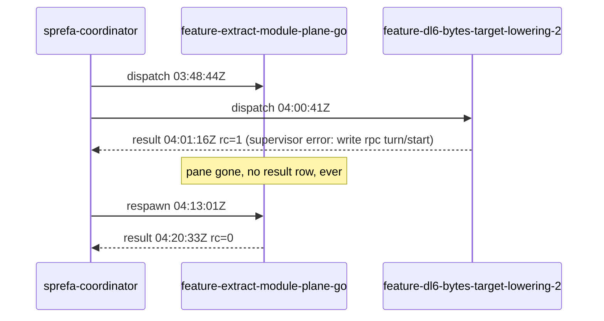

# failure modes

Every incident that bit gets a row: what happened, why, the test that fails
without the fix, the rail that stops it recurring. Newest first.

| # | date | title |
|---|---|---|
| 1 | 2026-08-17 | a lane can die with no result row, no log, no trace |

---

## 1. a lane can die with no result row, no log, no trace

**Incident.** Two lanes died inside one hour on 2026-08-17.

`feature-extract-module-plane-go` left no `result` row for its first run:
`~/.agent/mail/bus.ndjson` holds its 03:48:44Z dispatch and then nothing until
the 04:13:01Z respawn. The driver's `boop wait --me` sat 540s and timed out.
`feature-dl6-bytes-target-lowering-2` did report, with
`supervisor error: write rpc turn/start`: a broken pipe writing into
`codex app-server` stdin (`crates/boop/src/channel/jsonrpc.rs` `write_frame`,
reached from `channel/codex.rs` `start_turn`), while the same
initialize/thread/start/turn/start handshake replays clean by hand.

**RCA.** Both deaths are un-RCA-able and stay that way. The trail they would
have been read from did not exist when they happened: `~/.agent/lanes` was not
a directory on this machine until this fix, the supervisor's tracing went only
to the pane's stderr, and both panes were gone. Nothing retroactive recovers
them. What the code says about each:

| death | what the code accounts for | what nothing accounts for |
|---|---|---|
| dl6-bytes: `write rpc turn/start` | the supervisor's own error path ran and wrote the row (`supervise.rs` `run`) | why the child's stdin was closed. `codex app-server` wrote its complaint to fd 2, which was `Stdio::inherit()` into a pane that no longer exists |
| module-plane-go: no row at all | nothing. No `Err` arm, no `Ok` arm, and no exit path of `supervise` was reached | whether it was a panic, a SIGHUP from the pane, or a SIGKILL. All three left the same evidence: none |

**Second failure, same root.** `MAIN-TREE-COMMIT-SUSPECT` blamed
`feature-extract-module-plane-go` for `cd71912cd` and `36f56f008`, which
`feature-dl6-bytes-target-lowering-2` made in the shared sprefa main tree. The
rule was a one-sided window: any commit on local `main` and not on
`origin/main`, committed after the lane's spawn. The go lane's window opened
03:48:44Z; the commits are authored 03:49:19Z and 03:57:58Z. Both inside, and
nothing else was consulted. `git branch --contains cd71912cd` names
`feature/dl6-bytes-target-lowering-2` and `main`, never the go lane's branch.

**Fix.**

| # | change | file |
|---|---|---|
| 1 | the supervisor's tracing is teed to `~/.agent/lanes/<lane>/supervise.log` | `crates/boop/src/trail.rs` `lane_writer`, installed by `main.rs` `init_tracing` |
| 2 | the harness child's stderr goes to `~/.agent/lanes/<lane>/child.stderr` | `crates/boop/src/trail.rs` `child_stderr`, called by the four channels |
| 3 | a panic and SIGHUP/SIGTERM/SIGINT both write the result row | `crates/boop/src/supervise.rs` `run` (`catch_unwind`), `arm_signal_trail`, `signal_exit` |
| 4 | a dead lane row carries a typed reason, never blank | `crates/boop/src/trail.rs` `DeadReason`, printed by `main.rs` `run_lane_list` |
| 5 | attribution reads branch reachability first, then a two-sided author-time window, and names every overlapping lane instead of picking one | `crates/boop/src/worktree.rs` `attribute` |

**Fail-pre-fix tests.** Each carries its sabotage receipt in its header.

| test | file |
|---|---|
| `the_lane_writer_tees_every_event_into_supervise_log` | `trail.rs` |
| `a_child_s_stderr_lands_in_the_lane_trail` | `trail.rs` |
| `a_second_open_appends_instead_of_truncating` | `trail.rs` |
| `a_dead_lane_always_carries_a_typed_reason` | `trail.rs` |
| `a_supervisor_panic_still_writes_the_lane_s_result_row` | `supervise.rs` |
| `a_signalled_supervisor_writes_a_typed_result_row` | `supervise.rs` |
| `a_sibling_lane_s_main_commit_is_not_this_lane_s` | `worktree.rs` |
| `two_overlapping_lanes_make_a_commit_ambiguous_instead_of_blaming_one` | `worktree.rs` |
| `branch_reachability_beats_the_time_window` | `worktree.rs` |

**Rail.** `~/.agent/lanes/<lane>/` is the answer to "what was it doing". A lane
that dies with no result row now leaves `supervise.log` and `child.stderr`
behind, and `boop beep lane list` prints `DEAD=died-before-result` for exactly
that case. `DEAD=no-trail` means the lane predates this fix or never started.

**What still cannot be answered.** SIGKILL cannot be caught, so a `kill -9`
still ends the supervisor with no result row. It leaves the two trail files and
the `died-before-result` verdict, which is the whole of what is recoverable.
Two lanes committing into one shared main tree in the same window remain
indistinguishable from git alone: reachability clears the case where either
lane's branch witnessed the commit, and the rest prints
`MAIN-TREE-COMMIT-AMBIGUOUS` naming every candidate. A per-lane commit trailer
or a main-tree lock is the only thing that would decide it.
