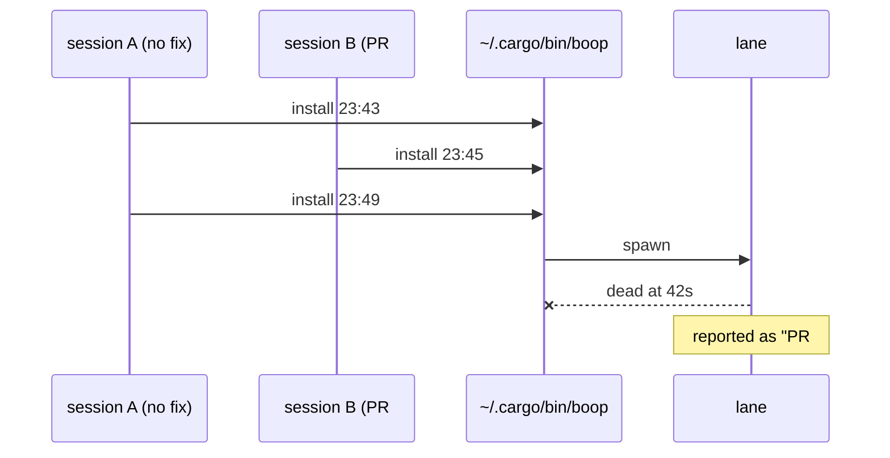
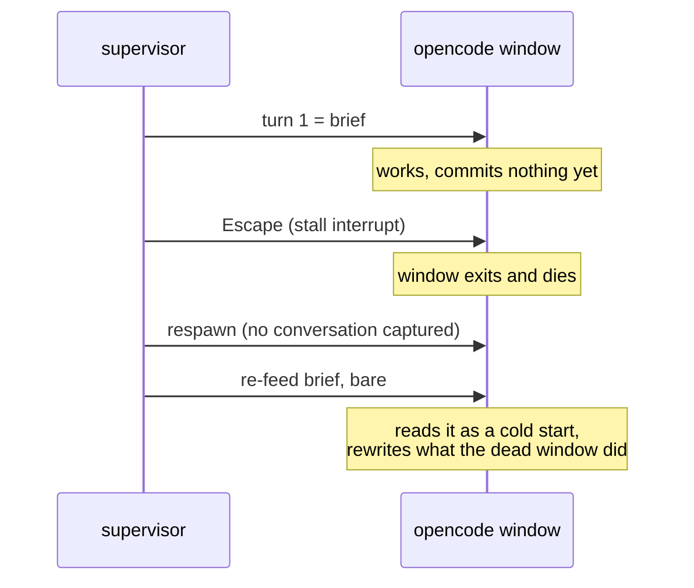
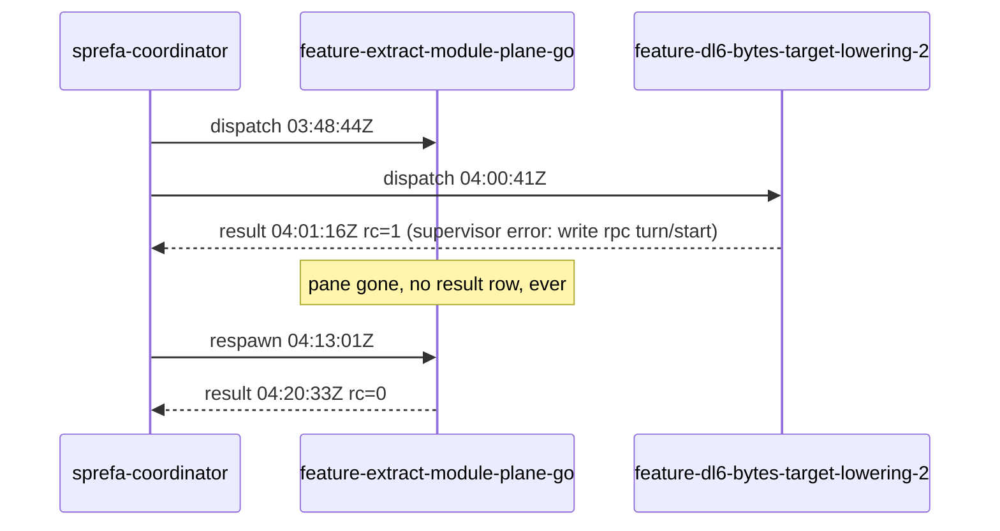

# failure modes

Every incident that bit gets a row: what happened, why, the test that fails
without the fix, the rail that stops it recurring. Newest first.

| # | date | title |
|---|---|---|
| 3 | 2026-08-17 | ~/.cargo/bin/boop is whatever the last session built, and nothing printed says which |
| 2 | 2026-08-17 | a respawned agent window is re-fed a brief it cannot place, or the wrong text entirely |
| 1 | 2026-08-17 | a lane can die with no result row, no log, no trace |

---

## 3. ~/.cargo/bin/boop is whatever the last session built, and nothing printed says which

**Incident.** 2026-08-16, three installs over ~/.cargo/bin/boop inside ten
minutes: 23:43 from a session carrying no fix, 23:45 from the tree holding PR
#10, 23:49 from the no-fix session again. A lane spawned on the 23:49 bytes died
at 42s and was reported as PR #10 failing, which it was not. 2026-08-17, a
fourth install by plain `cp` over the existing file died on first run with
`Killed: 9`: macOS kept the old code signature attached to the new bytes.

**RCA.** Three defects, none of them in any lane.

| # | defect | consequence |
|---|---|---|
| 1 | any tree could install, committed or not, merged or not | the running binary matched no nameable commit |
| 2 | `boop --version` printed the package version and nothing else | all three installs printed `boop 0.0.2`, so no receipt could tell them apart |
| 3 | a lane spawn logged no binary identity | a lane death could not be attributed to a build even in hindsight |

**Fix.**

| # | change | file |
|---|---|---|
| 1 | `just install-boop`: fetch, guard, build with the sha in the environment, then `rm` + `cp` + `codesign --force --sign -` | `justfile`, `crates/boop/scripts/install.sh` |
| 2 | the guard refuses a tree whose tracked files differ from HEAD, or whose HEAD is not an ancestor of `origin/main`, or that has no `origin/main` to check against; untracked files are printed and allowed | `crates/boop/scripts/install-guard.sh`, also `just install-boop-check <repo>` |
| 3 | `boop --version` prints `boop <version> (<short sha>[-dirty])`, the stamp coming from `BOOP_BUILD_SHA` when the recipe passes it and from git otherwise | `crates/boop/build.rs`, `crates/boop/src/lib.rs` `BUILD` |
| 4 | `lane create` names its own build on its first log line, `lane create resolved` | `crates/boop/src/main.rs` `run_lane` |

**Fail-pre-fix tests.** `crates/boop/tests/install_rail.rs`, each with its
sabotage receipt in its header.

| test | sabotage that failed it |
|---|---|
| `a_tracked_change_refuses_the_install` | the guard's tracked-changes block deleted (the install was ALLOWED) |
| `a_commit_that_never_reached_origin_main_refuses_the_install` | the guard's `merge-base --is-ancestor` block deleted (the install was ALLOWED) |
| `the_version_string_carries_the_commit_it_was_built_from` | the bare `version` clap attribute restored (`no build stamp in "boop 0.0.2"`) |
| `a_lane_spawn_names_the_binary_that_ran_it` | `boop_build` dropped from `run_lane`'s first event |

**Rail.** Installing is one recipe and the recipe refuses. `boop --version`
names a commit, and every `lane create` prints that same string before it spawns
anything, so a death has a build attached to it in the trail.

**What still cannot be answered.** Nothing stops `cargo install --path` or a
hand `cp`; the rail is the recipe being the easy path, not a lock on the file.
The stamp rides the log rather than stdout: `lane create`'s stdout first line is
a contract two tests in `tests/lane_wait_exit.rs` read.
The `-dirty` suffix is best-effort: an edit made after the build script ran
leaves the stamp behind, since no `rerun-if-changed` rule can watch every file.

## 2. a respawned agent window is re-fed a brief it cannot place, or the wrong text entirely

**Incident.** 2026-08-16, four flash4 lanes 0-for-4: three empty worktrees, one
delivered-uncommitted. A fifth lane on the same model, dispatched the same way,
finished clean because nothing stalled in it, so the model was never the
variable. Each of the four had its opencode window killed by the stall
interrupt and respawned.

**RCA.** Two defects, both in the refeed path
(`crates/boop/src/channel/tui.rs` `type_and_submit_or_respawn`).

| # | defect | consequence |
|---|---|---|
| 1 | the re-fed brief carried no marker that this was a resumption | the harness could not tell that the dead window's work was already in the worktree, so it started over on top of it |
| 2 | the re-fed text was `TuiChannel`'s own capture of turn one, not the brief | a lane opened on `RESUME_NUDGE` (the explicit-resume path, `supervise.rs`) held the nudge as its refeed text; the brief had never entered the channel at all, and re-feeding a bare "continue from where you left off" to a blank window is the empty worktree |

**Fix.**

| # | change | file |
|---|---|---|
| 1 | `RESPAWN_PREFACE` opens every re-fed brief, one line, naming the window death and the worktree | `crates/boop/src/channel/tui.rs` |
| 2 | `LaneChannel::set_brief` hands the brief to the channel before the first turn; the TUI channel keeps it and re-feeds it, falling back to turn one's text only when no supervisor set it | `crates/boop/src/channel.rs`, `channel/tui.rs`, `supervise.rs` |

**Fail-pre-fix tests.** Each carries its sabotage receipt in its header.

| test | sabotage that failed it | file |
|---|---|---|
| `a_refed_brief_opens_with_the_resumption_preface` | dropping `RESPAWN_PREFACE` from the refeed text | `channel/tui.rs` |
| `a_supervisor_supplied_brief_outranks_the_first_turn` | a no-op `TuiChannel::set_brief` (re-fed `RESUME-NUDGE` in the brief's place) | `channel/tui.rs` |
| `the_brief_reaches_the_channel_before_a_resume_nudge_opens_the_lane` | dropping the `channel.set_brief` call from `supervise` | `supervise.rs` |

**Rail.** The brief is the supervisor's, handed over once and owned by the
channel, so no respawn can re-feed anything else; and no refeed reaches a
harness without the line telling it to read the worktree first.

**What still cannot be answered.** A respawn that DOES resume a pinned
conversation is trusted to have reattached it: `opencode -s <id>` with an id the
store no longer holds opens a fresh session, and the channel still reports the
id as its conversation. Verifying the reattach needs a store read after boot,
which nothing does today.

## 1. a lane can die with no result row, no log, no trace

**Incident.** Two lanes died inside one hour on 2026-08-17.

`feature-extract-module-plane-go` left no `result` row for its first run:
`~/.agent/mail/bus.ndjson` holds its 03:48:44Z dispatch and then nothing until
the 04:13:01Z respawn. The driver's `boop wait --me` sat 540s and timed out.
`feature-dl6-bytes-target-lowering-2` did report, with
`supervisor error: write rpc turn/start`: a broken pipe writing into
`codex app-server` stdin (`crates/boop/src/channel/jsonrpc.rs` `write_frame`,
reached from `channel/codex.rs` `start_turn`), while the same
initialize/thread/start/turn/start handshake replays clean by hand.

**RCA.** Both deaths are un-RCA-able and stay that way. The trail they would
have been read from did not exist when they happened: `~/.agent/lanes` was not
a directory on this machine until this fix, the supervisor's tracing went only
to the pane's stderr, and both panes were gone. Nothing retroactive recovers
them. What the code says about each:

| death | what the code accounts for | what nothing accounts for |
|---|---|---|
| dl6-bytes: `write rpc turn/start` | the supervisor's own error path ran and wrote the row (`supervise.rs` `run`) | why the child's stdin was closed. `codex app-server` wrote its complaint to fd 2, which was `Stdio::inherit()` into a pane that no longer exists |
| module-plane-go: no row at all | nothing. No `Err` arm, no `Ok` arm, and no exit path of `supervise` was reached | whether it was a panic, a SIGHUP from the pane, or a SIGKILL. All three left the same evidence: none |

**Second failure, same root.** `MAIN-TREE-COMMIT-SUSPECT` blamed
`feature-extract-module-plane-go` for `cd71912cd` and `36f56f008`, which
`feature-dl6-bytes-target-lowering-2` made in the shared sprefa main tree. The
rule was a one-sided window: any commit on local `main` and not on
`origin/main`, committed after the lane's spawn. The go lane's window opened
03:48:44Z; the commits are authored 03:49:19Z and 03:57:58Z. Both inside, and
nothing else was consulted. `git branch --contains cd71912cd` names
`feature/dl6-bytes-target-lowering-2` and `main`, never the go lane's branch.

**Fix.**

| # | change | file |
|---|---|---|
| 1 | the supervisor's tracing is teed to `~/.agent/lanes/<lane>/supervise.log` | `crates/boop/src/trail.rs` `lane_writer`, installed by `main.rs` `init_tracing` |
| 2 | the harness child's stderr goes to `~/.agent/lanes/<lane>/child.stderr` | `crates/boop/src/trail.rs` `child_stderr`, called by the four channels |
| 3 | a panic and SIGHUP/SIGTERM/SIGINT both write the result row | `crates/boop/src/supervise.rs` `run` (`catch_unwind`), `arm_signal_trail`, `signal_exit` |
| 4 | a dead lane row carries a typed reason, never blank | `crates/boop/src/trail.rs` `DeadReason`, printed by `main.rs` `run_lane_list` |
| 5 | attribution reads branch reachability first, then a two-sided author-time window, and names every overlapping lane instead of picking one | `crates/boop/src/worktree.rs` `attribute` |

**Fail-pre-fix tests.** Each carries its sabotage receipt in its header.

| test | file |
|---|---|
| `the_lane_writer_tees_every_event_into_supervise_log` | `trail.rs` |
| `a_child_s_stderr_lands_in_the_lane_trail` | `trail.rs` |
| `a_second_open_appends_instead_of_truncating` | `trail.rs` |
| `a_dead_lane_always_carries_a_typed_reason` | `trail.rs` |
| `a_supervisor_panic_still_writes_the_lane_s_result_row` | `supervise.rs` |
| `a_signalled_supervisor_writes_a_typed_result_row` | `supervise.rs` |
| `a_sibling_lane_s_main_commit_is_not_this_lane_s` | `worktree.rs` |
| `two_overlapping_lanes_make_a_commit_ambiguous_instead_of_blaming_one` | `worktree.rs` |
| `branch_reachability_beats_the_time_window` | `worktree.rs` |

**Rail.** `~/.agent/lanes/<lane>/` is the answer to "what was it doing". A lane
that dies with no result row now leaves `supervise.log` and `child.stderr`
behind, and `boop beep lane list` prints `DEAD=died-before-result` for exactly
that case. `DEAD=no-trail` means the lane predates this fix or never started.

**What still cannot be answered.** SIGKILL cannot be caught, so a `kill -9`
still ends the supervisor with no result row. It leaves the two trail files and
the `died-before-result` verdict, which is the whole of what is recoverable.
Two lanes committing into one shared main tree in the same window remain
indistinguishable from git alone: reachability clears the case where either
lane's branch witnessed the commit, and the rest prints
`MAIN-TREE-COMMIT-AMBIGUOUS` naming every candidate. A per-lane commit trailer
or a main-tree lock is the only thing that would decide it.
