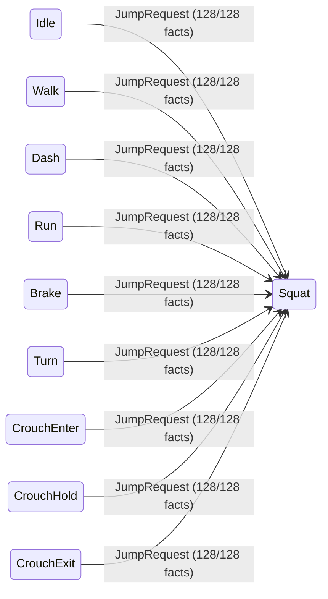
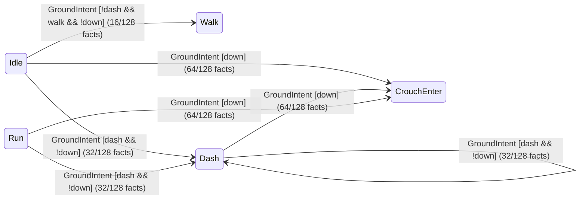
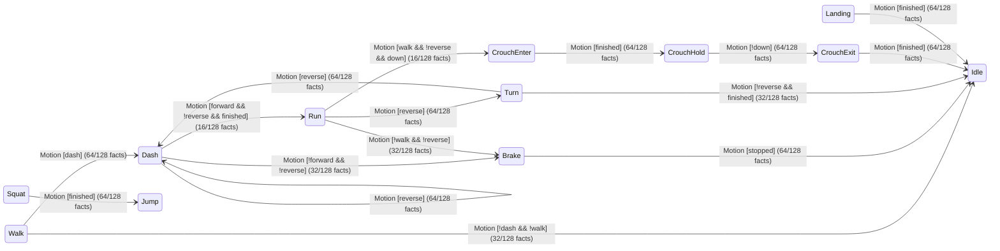

# Ground statechart (generated)

Source: `src/_1a_chart.rs`, evaluated through `_1a_chart::decide`.

14 phases × 3 events × 128 boolean assignments. Counts measure semantic fact
combinations, including combinations the controller may never supply.
This is the local grounded policy, not full Melee/PM behavior or caller scheduling.
Self-edges reset phase age. Rejected events preserve phase and age.

[Rendered SVG](5_ground_chart.svg) | [D2 source](5_ground_chart.d2)

## JumpRequest

Rejected events return `None`, preserving their source state:

| Source | Guard | Assignments |
| --- | --- | --- |
| Squat | `true` | 128/128 |
| Landing | `true` | 128/128 |
| Jump | `true` | 128/128 |
| Fall | `true` | 128/128 |
| AirJump | `true` | 128/128 |

## GroundIntent

Rejected events return `None`, preserving their source state:

| Source | Guard | Assignments |
| --- | --- | --- |
| Idle | `!dash && !walk && !down` | 16/128 |
| Walk | `true` | 128/128 |
| Dash | `!dash && !down` | 32/128 |
| Run | `!dash && !down` | 32/128 |
| Brake | `true` | 128/128 |
| Turn | `true` | 128/128 |
| Squat | `true` | 128/128 |
| CrouchEnter | `true` | 128/128 |
| CrouchHold | `true` | 128/128 |
| CrouchExit | `true` | 128/128 |
| Landing | `true` | 128/128 |
| Jump | `true` | 128/128 |
| Fall | `true` | 128/128 |
| AirJump | `true` | 128/128 |

## Motion

Rejected events return `None`, preserving their source state:

| Source | Guard | Assignments |
| --- | --- | --- |
| Idle | `true` | 128/128 |
| Walk | `!dash && walk` | 32/128 |
| Dash | `forward && !reverse && !finished` | 16/128 |
| Run | `walk && !reverse && !down` | 16/128 |
| Brake | `!stopped` | 64/128 |
| Turn | `!reverse && !finished` | 32/128 |
| Squat | `!finished` | 64/128 |
| CrouchEnter | `!finished` | 64/128 |
| CrouchHold | `down` | 64/128 |
| CrouchExit | `!finished` | 64/128 |
| Landing | `!finished` | 64/128 |
| Jump | `true` | 128/128 |
| Fall | `true` | 128/128 |
| AirJump | `true` | 128/128 |
