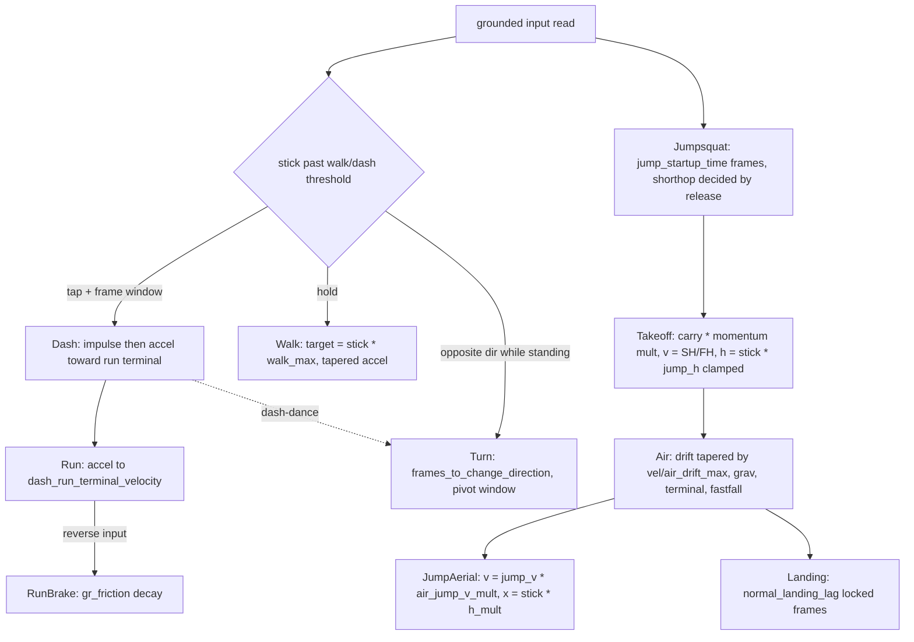

# Falcon movement evidence

- [Sources and revisions](#sources-and-revisions)
- [Phase rules from the Melee decomp](#phase-rules-from-the-melee-decomp)
- [Falcon constants by source](#falcon-constants-by-source)
- [Frame update order](#frame-update-order)
- [Unresolved evidence](#unresolved-evidence)
- [Suggested numeric test vectors](#suggested-numeric-test-vectors)

## Sources and revision | Source | Revision | License | API surface used | Notes |

| --- | --- | --- | --- | --- |
| ssbm_utils crate (cargo cache) | 0.4.0 exact pin, `games/smash/Cargo.toml` | Apache-2.0 | `enums::character::{Character, Attributes}`, `Character::get_stats()`, `calc::general::jump_arc` | Source read at `~/.cargo/registry/src/index.crates.io-…/ssbm_utils-0.4.0/`. No per-character dash/run/jumpsquat data; `Attributes` struct carries a TODO naming exactly those gaps (character.rs:304). |
| doldecomp/melee via `.ext` | unversioned checkout (submodule gitdir broken; no rev pinned) | decomp license: internal use | C source, `ft/chara/ftCommon/*`, `ft/types.h` | Identical file tree also at `~/projects/kneeman-lines/4_melee_decomp` at rev `cca1beea` (2026-09-05); formula lines below cite the `.ext` copy. |
| libmelee characterdata.csv (via `.ext`) | unversioned checkout | LGPL (altf4/libmelee) | plain CSV | 14 base-physics columns only; no dash/run/jumpsquat/launch values. |
| Melee-decomp-movement skill (archived) | `~/projects/claude-research/skills_archive/melee-decomp-movement/SKILL.md`, June 2026 read | n/a | summary | Cross-checked against the decomp files directly for this report; skill matches source. |

Ruleset separation: physics/phase rules below are **Melee (GALE01 1.02)**. PM
(Brawl-engine) supplies poses only; PM physics constants are out of scope for
this report and none are used. `games/smash` currently uses ssbm_utils only for
knockback helpers (`1_sandbag.rs:130-153`); its falcon sim
(`2_simulation.rs:100-115`) uses hand-picked constants not traced to any
source above.

## Phase rules from the Melee decomp

All formulas from `.ext/melee/melee/src/melee/ft/chara/ftCommon/` (unit:
world-units/frame, 60 fps, `pos += vel` per frame; no pixel scale exists in
the decomp).

| Phase | File:line | Rule |
| --- | --- | --- |
| Dash enter | ftCo_Dash.c:63-69 | `init_vel = facing * dash_initial_velocity`; if current `gr_vel * facing < 0` (reversing), `impulse = init_vel - gr_vel`, else `impulse = init_vel`. One-shot applied on frame 0 (`mv.co.dash.x0`). |
| Dash sustain | ftCo_Dash.c:152-162 | After the impulse frame: `getAccelAndTarget` gives accel/target, integrate toward `dash_run_terminal_velocity` with friction `gr_friction * ftCommonData.x60`. |
| Walk | ftwalkcommon.c:190-198 | `target = lstick.x * walk_max_vel` (or `walk_init_vel` first frames); when moving toward target, accel = `walk_accel * (1 - gr_vel/target_vel)`. Walk anim tier (slow/mid/fast) picked from `slow_walk_max / mid_walk_point / fast_walk_min` vs stick x (ftwalkcommon.c:27-51). |
| Run | ftCo_Run.c:140 | Same `getAccelAndTarget` acceleration toward `dash_run_terminal_velocity`; anim rate = `|vel| / run_animation_scaling`. |
| Traction (no input) | ftCo_Dash.c:142-143 (pattern) | `gr_vel -= gr_vel * friction_mul * gr_friction` each frame (multiplicative decay, not a constant subtraction). |
| Standing turn / pivot | ftCo_Turn.c:69,85-86 | Counts down `frames_to_change_direction_on_standing_turn`, then flips `facing_dir` and sets `just_turned`, which opens the immediate dash-out (pivot) window; releasing early restores facing (ftCo_Turn.c:103-123). |
| Jumpsquat (KneeBend) | ftCo_KneeBend.c:35,57 | Runs `jump_startup_time` frames; if jump released before takeoff, `is_short_hop = true`. |
| Jump takeoff | ftCo_Jump.c:115-134 | `self_vel.x *= ground_to_air_jump_momentum_multiplier`; `h_init = lstick.x * jump_h_initial_velocity` clamped to `jump_h_max_velocity`; `v = hop_v_initial_velocity` (short) or `jump_v_initial_velocity` (full). |
| Air drift / friction | ftCo_Fall.c:164-183 | Drift accel scales down as `self_vel.x / air_drift_max` approaches ±1 (clamped fraction); extra friction applies past `ftCommonData.x444`. Gravity: `vel.y -= grav`, clamped to `-terminal_vel`; fastfall sets `-fast_fall_velocity`. |
| Double jump | ftCo_JumpAerial.c:99-101,175-177 | `vel.x = lstick.x * air_jump_h_multiplier`; `vel.y = jump_v_initial_velocity * air_jump_v_multiplier`. |
| Landing | ftCo_Landing.c | Locked `normal_landing_lag` frames before IASA (not extracted line-by-line this pass). |

## Falcon constants by source

Units: per-frame. NA = not present in that source.

| Constant | ssbm_utils 0.4.0 (character.rs:327-342) | libmelee CSV (Cptfalcon) | DAT-only (no local text source) |
| --- | --- | --- | --- |
| gravity | 0.13 | 0.13 | NA |
| terminal (max fall) | 2.9 | 2.9 | NA |
| fast fall | 3.5 | 2.9 (CSV col disagrees; ssbm_utils value matches community tables) | NA |
| max walk | 0.85 | 0.85 | NA |
| ground friction / traction | 0.08 (friction) | 0.08 | NA |
| air speed cap | 1.12 | 1.12 | NA |
| air friction | 0.01 | 0.01 | NA |
| air accel / mobility | 0.06 | 0.06 | NA |
| fullhop v | 3.1 (fh_jump_force) | NA | jump_v_initial_velocity |
| shorthop v | 1.9 (sh_jump_force) | NA | hop_v_initial_velocity |
| airjump v | 2.66 (CSV InitDJSpeed; ssbm_utils models it as fh * 0.9 = 2.79, disagrees) | 2.66 | air_jump_v_multiplier path |
| airjump x momentum keep | 0.9 (dj_x_speed) | 0.96 (InitDJSpeed_x; values disagree) | air_jump_h_multiplier |
| jumpsquat frames | NA | NA | jump_startup_time |
| dash initial velocity | NA | NA | dash_initial_velocity |
| run accel (a/b) | NA | NA | dash_run_acceleration_a/_b |
| run terminal | NA | NA | dash_run_terminal_velocity |
| walk init / accel | NA | NA | walk_init_vel / walk_accel |
| ground->air momentum mult | NA | NA | ground_to_air_jump_momentum_multiplier |
| jump h init / max | NA | NA | jump_h_initial_velocity / jump_h_max_velocity |
| turn frames | NA | NA | frames_to_change_direction_on_standing_turn |

Jump-arc integration order (ssbm_utils `calc::general::jump_arc`,
general.rs:11-33, with a unit test against Falco): gravity is skipped on the
first airborne frame unless an aerial is used that frame (`grav_frame_1`),
position accumulates `height += vel` before `vel -= gravity`, and downward
velocity clamps at `-terminal_velocity`. That ordering is the
community-verified Melee arc model; the crate pins it with an exact-value
regression test.

## Frame update order

## Unresolved evidence

1. Falcon's `PlCa.dat` numbers (jumpsquat, dash initial, run accel/terminal,
   walk init/accel, jump h/v, momentum multiplier, turn frames, landing lag)
   are absent from every local text source. Requires either a DAT extraction
   (BrawlCrate-class tool does not read Melee DATs; needs a Melee DAT/figatree
   reader) or accepting a community table (SSBWiki/Melee Framedata) as the
   ruleset source with its own citation. No values invented here.
2. ssbm_utils vs libmelee CSV disagree on fastfall (3.5 vs 2.9), airjump v
   (2.79 vs 2.66), and airjump x momentum (0.9 vs 0.96). Pick one source per
   ruleset decision before implementation; ssbm_utils carries regression
   tests, the CSV does not.
3. `.ext/melee` submodules have no pinned revision (broken gitdir). The
   kneeman-lines copy is `cca1beea` (2026-09-05); formulas were spot-matched
   between the two, full diff not done.
4. PM pose mapping (CHR0 via brawllib_rs) is untouched here; nothing in this
   report constrains pose selection.

## Correction (crate cut, verified against kneeman-lines cca1beea)

General ground traction is a LINEAR constant-magnitude deceleration clamped at
zero (`ftCommon_ApplyFrictionGround`, ft/ftcommon.c:50-60), not the
multiplicative decay this report first stated. The multiplicative form
(`gr_vel -= gr_vel * x54 * friction`, ftCo_Dash.c:142-144) is dash-sustain
only. Also, dash/run accel is `stick * dash_accel_mul + sign(stick) *
dash_accel_base` toward `stick * dash_max_velocity` (`getAccelAndTarget`,
ft/inlines.h:135-145); the `.ext` copy names these fields
`dash_run_acceleration_a/_b`. Update the "Traction (no input)" row
accordingly; superseded wording retained above for the record.

## Suggested numeric test vectors

1. Jump arc: feed Falcon `fh_jump_force=3.1, gravity=0.13, terminal=2.9`
   through `jump_arc(..., false)` and snapshot the full height series; assert
   apex value and first-negative-airborne frame are stable across platforms
   (pattern: the crate's own Falco test, general.rs:56-77).
2. Traction decay: `v_{n+1} = v_n * (1 - k * 0.08)` from run speed; assert
   frames-to-zero-crossing matches the decomp's multiplicative rule rather
   than a linear subtraction.
3. Walk taper: from rest with stick=1, integrate
   `v += 0.85-component accel * (1 - v/target)`; assert monotone approach to
   0.85 with no overshoot.
4. Dash reversal impulse: `gr_vel = -1.0 * v_run`, entering dash opposite must
   set `x0 = facing * dash_init - gr_vel` (ftCo_Dash.c:67); assert frame-0
   position delta equals that impulse exactly.
5. Ground-to-air carry: take off while running at `v_run`; assert frame-1
   airborne `x = v_run * ground_to_air_jump_momentum_multiplier` (pending the
   DAT value; freeze the multiplier as a test parameter).
6. Double-jump reset: `vel.y = jump_v_initial_velocity * air_jump_v_mult`,
   `vel.x = stick.x * air_jump_h_multiplier` with stick=0 must zero horizontal
   momentum only through aerial friction afterward (ftCo_JumpAerial.c:99).
