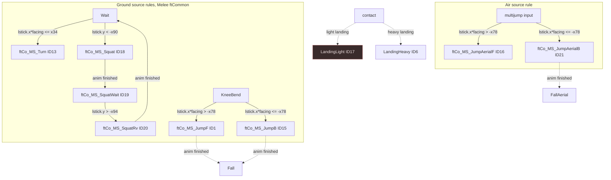

# Pigeon selection sources: seven retained clips

Source report for the seven catalog clips the runtime never selects
(ID 13 Turn, 15 JumpB, 17 LandingLight, 18 Squat, 19 SquatWait, 20 SquatRv,
21 JumpAerialB). It records the source action each clip is, the source
entry/exit rule, the durable facts a selection needs, and whether the current
`game_fighter` state model can emit it without invention. Research only: no
Rust, TypeSpec, tests, tasks, generated output or deployment changed.

## TOC

- [Scope and method](#scope-and-method)
- [Current selection seam](#current-selection-seam)
- [Selection map](#selection-map)
- [Per-action findings](#per-action-findings)
- [Expected-tape table](#expected-tape-table)
- [Unresolved binary/DAT-only facts](#unresolved-binarydat-only-facts)
- [Validation](#validation)

## Scope and method

Rules are read from the checked-out Melee decomp
`kneeman-lines/4_melee_decomp/`, read-only, and cross-checked against the
retained PM3.6 rukaidata payloads in this directory's `imported/` and manifest
`imported/0_sources.json`. Clip identity is the embedded rukaidata subaction
name plus the imported-payload `IASA` and frame count in the payload HTML
`<meta>` header; identity comes from the payload, not from the clip name.
Animation names and frame counts are treated as payload facts, never as
behavioral rules. PM3.6 is Brawl-based; the local Melee decomp supplies the
common callback rules, and its unnamed `ftCommonData` fields are DAT-only.

## Current selection seam

`movement::pose_for_phase` (`games/smash/src/fighters/pigeon/1c_movement.rs:43`)
maps every host `Phase` to one fixed catalog ID. `movement::select`
(`1c_movement.rs:92`) overrides only ID2 (air attack) and ID5 (landing
recovery). No path emits IDs 13, 15, 17, 18, 19, 20, 21. Host phases are the 12
variants in `games/crates/fighter/src/1_state.rs:33`; ground permission is
`ground::decide` (`games/crates/fighter/src/1b_ground.rs:44`) and air permission
is `air::decide` (`games/crates/fighter/src/1c_air.rs:59`).

| Catalog ID | Clip | Emitting path today | Reached by |
| ---: | --- | --- | --- |
| 13 | Turn | none | `Phase::Turn` maps to ID14 TurnRun (`1c_movement.rs:47`); `ground::decide` enters Turn only from Run (`1b_ground.rs:66`) |
| 15 | JumpB | none | `pose_for_phase(Phase::Jump)` is ID1 JumpF (`1c_movement.rs:48`) |
| 17 | LandingLight | none | `pose_for_phase(Phase::Landing)` is ID6 LandingHeavy (`1c_movement.rs:49`) |
| 18 | Squat | none | `Phase::Squat` is ID3 JumpSquat and `Phase::Crouch` is ID3 (`1c_movement.rs:48-49`) |
| 19 | SquatWait | none | `Phase::Crouch` is ID3; crouch entered straight from Idle (`1b_ground.rs:54`) |
| 20 | SquatRv | none | crouch release is `Crouch -> Idle` (`1b_ground.rs:72`) |
| 21 | JumpAerialB | none | `pose_for_phase(Phase::AirJump)` is ID16 JumpAerialF (`1c_movement.rs:49`) |

## Selection map

Solid edges are local source-backed; dotted edges are destination facts from
the same callbacks. `LandingLight` selection is not in any local source
(see unresolved facts).

## Per-action findings

### 13 Turn

- Meaning: `ftCo_MS_Turn`, the standing turn. `ftCo_Turn_Enter_Basic`
  (`ftCo_Turn.c:67`) sets `frames_to_turn = co_attrs.standing_turn_frames` and
  `facing_after = -facing_dir`; `ftCo_Turn_Anim_Inner` (`ftCo_Turn.c:75-89`)
  counts the delay down, flips `facing_dir` once, and sets `just_turned`.
- Entry: from `ftCo_MS_Wait` IASA through `ftCo_Turn_CheckInput`
  (`ftCo_Turn.c:41`, called at `ftCo_Wait.c:67`) when
  `lstick.x * facing <= p_ftCommonData->x34` (`ftCo_800C97A8`, `ftCo_Turn.c:26`).
- Exit: `!ftAnim_IsFramesRemaining` -> `ft_8008A2BC` (`ftCo_Turn.c:91-98`).
  `ftCo_Turn_IASA` (`ftCo_Turn.c:100`) also allows special/attack/jump/dash
  interrupts.
- Required durable facts: the source needs `frames_to_turn` (a countdown from a
  per-character attribute), `facing_after`, and `just_turned`; the local model
  has `State.facing` and `State.phase_tick` but no turn-origin flag and no
  standing-turn phase distinct from the running turn.
- Evidence: `kneeman-lines/4_melee_decomp/src/melee/ft/kinds/ftCommon/ftCo_Turn.c:26,41,67,75-98,100`;
  `ftCo_Wait.c:67`. Local: `1c_movement.rs:47`, `1b_ground.rs:66`.
- Representable: no. `Phase::Turn` is the running-turn policy entered only from
  Run and mapped to ID14. Source Turn ID13 needs a standing-turn entry
  (`Wait` + reverse stick) and, for fidelity, the `frames_to_turn` countdown.

### 15 JumpB

- Meaning: `ftCo_MS_JumpB`, the backward ground jump animation.
- Entry: ground takeoff `ftCo_Jump_Enter` (`ftCo_Jump.c:155`) selects
  `ftCo_MS_JumpF` when `lstick.x * facing > -p_ftCommonData->x78`, otherwise
  `ftCo_MS_JumpB` (`ftCo_Jump.c:160-162`). `ftCo_Jump_Enter` runs from
  `ftCo_KneeBend_Anim` (`ftCo_KneeBend.c:42`) when jump startup finishes.
- Exit: `ftCo_Jump_Anim` -> `ftCo_Fall_Enter` on animation end
  (`ftCo_Jump.c:169-174`).
- Required durable facts: the takeoff stick sign relative to facing, sampled
  once at the KneeBend-to-Jump change and held until Fall. The local
  `Phase::Jump` stores no takeoff direction; `select` receives the current-tick
  axis, not the takeoff axis (`1c_movement.rs:92`).
- Evidence: `ftCo_Jump.c:155,160-162,169-174`; `ftCo_KneeBend.c:30-42`.
  Local: `1c_movement.rs:48`, `games/crates/fighter/src/2_advance.rs:78`
  (`takeoff` enters `Phase::Jump`).
- Representable: no. A backward-jump fact or phase is needed; the axis at
  takeoff is not durable in `World`.

### 17 LandingLight

- Meaning: `ftCo_MS_LandingLight` per the retained payload (rukaidata PM3.6
  subaction index 0x31, frames 3, IASA 4). There is no `ftCo_LandingLight` and
  no `LandingLight` symbol anywhere in `kneeman-lines/4_melee_decomp` or
  `kneeman-lines/5_brawl_decomp`.
- Closest Melee rule: `ftCo_Landing_Enter_Basic` (`ftCo_Landing.c:95`) chooses
  the single `ftCo_MS_Landing` action; `ftCo_Landing_IASA` gates on
  `co_attrs.normal_landing_lag` and `allow_interrupt` (`ftCo_Landing.c:134-136`).
  Melee has one common landing action, not a named light/heavy pair.
- Required durable facts: a landing-type fact (light vs heavy vs the aerial
  landing already used as ID5/ID6). This is a PM/Brawl runtime decision.
- Evidence: `ftCo_Landing.c:95,134-136`; imported
  `imported/LandingLight.html` (`Frames:3; IASA:4`) and
  `imported/0_sources.json:24`.
- Representable: no, and the rule is unresolved. Melee names no light landing;
  the PM selection condition is binary/DAT-only here (see below). It must not
  be inferred from the clip name or from its 3-frame length (identical to
  LandingHeavy).

### 18 Squat

- Meaning: `ftCo_MS_Squat`, crouch enter (the `Squat` subaction, index 0x2a,
  frames 8, IASA None).
- Entry: `ftCo_Squat_Enter` (`ftCo_Squat.c:72`) through `ftCo_800D5FB0`
  (`ftCo_Squat.c:62`) when `lstick.y < -p_ftCommonData->x90`
  (`ftCo_Squat_CheckInput`, `ftCo_Squat.c:47`).
- Exit: `ftCo_Squat_Anim` -> `ftCo_800D638C` -> `ftCo_MS_SquatWait` on
  animation end (`ftCo_Squat.c:83-86`, `ftCo_SquatWait.c:94`).
- Required durable facts: a crouch-enter phase and the down-stick threshold
  fact. Local `ground::decide` collapses Idle/Dash/Run + down straight to
  `Phase::Crouch` (`1b_ground.rs:54`); there is no enter phase.
- Evidence: `ftCo_Squat.c:47,62,72,83-86,106`; `ftCo_SquatWait.c:94`.
  Local: `1b_ground.rs:54`, `1c_movement.rs:48-49`.
- Representable: no. Needs a crouch-enter phase (`Phase::Crouch` is hold-only).

### 19 SquatWait

- Meaning: `ftCo_MS_SquatWait`, crouch hold (frames 61, IASA None).
- Entry: `ftCo_SquatWait_Enter_inline` (`ftCo_SquatWait.c:61`) from
  `ftCo_800D638C` on Squat completion (`ftCo_Squat.c:83-86`), or from
  `fn_800D62C4` when already crouched and down is re-held
  (`ftCo_SquatWait_CheckInput`, `ftCo_SquatWait.c:49`).
- Exit: `ftCo_SquatRv_CheckInput` on release (`ftCo_SquatWait.c:105,121`);
  the action itself loops (`ftCo_SquatWait_Anim`, `ftCo_SquatWait.c:99`).
- Required durable facts: none beyond the crouch-hold state. `Phase::Crouch`
  already models the hold condition; only its pose mapping is wrong (ID3).
  `1c_movement.rs:144` also forces the jumpsquat final frame under Crouch.
- Evidence: `ftCo_SquatWait.c:49,61,99,105,121`. Local: `1c_movement.rs:49,144`.
- Representable: yes. Map `Phase::Crouch` to ID19 and hold the SquatWait loop;
  no new phase or fact. This is a mapping correction, not a state addition.

### 20 SquatRv

- Meaning: `ftCo_MS_SquatRv`, crouch exit (frames 10, IASA None).
- Entry: `ftCo_SquatRv_Enter` (`ftCo_SquatRv.c:53`) through
  `ftCo_SquatRv_CheckInput` when `lstick.y > -p_ftCommonData->x94`
  (`ftCo_SquatRv.c:42`), called from `ftCo_SquatWait_IASA`
  (`ftCo_SquatWait.c:121`).
- Exit: `ftCo_SquatRv_Anim` -> `ft_8008A2BC` on animation end
  (`ftCo_SquatRv.c:59-64`).
- Required durable facts: a crouch-exit phase. Local `ground::decide` sends
  `Crouch -> Idle` directly on release (`1b_ground.rs:72`), with no exit action.
- Evidence: `ftCo_SquatRv.c:42,53,59-64`; `ftCo_SquatWait.c:121`.
  Local: `1b_ground.rs:72`.
- Representable: no. Needs a crouch-exit phase (the action is 10 frames with no
  interruptible window, so it cannot be a one-tick emission).

### 21 JumpAerialB

- Meaning: `ftCo_MS_JumpAerialB`, the backward midair jump (frames 40,
  IASA None).
- Entry: `ftCo_JumpAerial_Enter_Basic` (`ftCo_JumpAerial.c:162`) selects
  `ftCo_MS_JumpAerialF` when `lstick.x * facing > -p_ftCommonData->x78`,
  otherwise `ftCo_MS_JumpAerialB` (`ftCo_JumpAerial.c:173-175`). It runs from
  `ftCo_JumpAerial_CheckInput` (`ftCo_JumpAerial.c:90`) when `ft_did_jump`
  holds: `jumpsUsed < max_jumps` and a jump input edge
  (`ftCo_JumpAerial.c:50-58`).
- Exit: `ftCo_JumpAerial_Anim` -> `ftCo_FallAerial_Enter` on animation end
  (`ftCo_JumpAerial.c:274-279`).
- Required durable facts: takeoff stick sign relative to facing at the double
  jump, sampled once. Local `enter_air` uses `input.axis` for the horizontal
  impulse (`2_advance.rs:320`) but stores no direction fact, and
  `pose_for_phase(Phase::AirJump)` is ID16.
- Evidence: `ftCo_JumpAerial.c:50-58,90,162,173-175,274-279`.
  Local: `1c_movement.rs:49`, `2_advance.rs:317-334`.
- Representable: no. A backward-air-jump fact or phase is needed.

## Expected-tape table

Independent probes for the parent. Each row is a `(Phase, axis, SelectionFacts)`
input to `movement::select` after the required model change, with the expected
catalog ID. All rows currently fail (IDs never emitted). `IASA`/frames are
payload anchors from `imported/0_sources.json` and the payload `<meta>`.

| Probe | Starting state | Tape [buttons, axis] | Expected ID | Payload frames | Payload IASA | Source rule to satisfy |
| ---: | --- | --- | ---: | ---: | --- | --- |
| P13 | `Phase::Idle`, facing +1 | `[(0,-1.0)]` then hold | 13 | 12 | None | `lstick.x*facing <= x34` from Wait -> Turn (`ftCo_Turn.c:26,41`) |
| P15 | `Phase::Squat`, facing +1, jump held | `[(1,-1.0)]` at takeoff | 15 | 51 | None | KneeBend -> `lstick.x*facing <= -x78` -> JumpB (`ftCo_Jump.c:160-162`) |
| P17 | airborne, descending contact | light-landing fact true | 17 | 3 | 4 | PM/Brawl landing-type selection; unresolved locally |
| P18 | `Phase::Idle` | `[(4,-1.0)]`, stick.y below x90 | 18 | 8 | None | squat request -> Squat (`ftCo_Squat.c:47,62`) |
| P19 | `Phase::Crouch` | `[(4,-1.0)]` after Squat completes | 19 | 61 | None | Squat anim end -> SquatWait (`ftCo_Squat.c:83-86`) |
| P20 | `Phase::Crouch` | release to stick.y above x94 | 20 | 10 | None | `SquatRv_CheckInput` -> SquatRv (`ftCo_SquatRv.c:42,53`) |
| P21 | `Phase::Fall`, facing +1, jump edge, jumps_left 1 | `[(1,-1.0)]` | 21 | 40 | None | `lstick.x*facing <= -x78` -> JumpAerialB (`ftCo_JumpAerial.c:173-175`) |

Notes for test authors:

- P13 distinguishes source Turn (13) from the running turn (14). A test that
  only reverses from Run must keep expecting 14.
- P15 and P21 both key off the same `x78` comparison at different entry points;
  they must not share the current-tick axis as a proxy, because the source
  samples the axis once at the change.
- P18/P19/P20 form one lifecycle: enter (18, 8f) -> hold (19, 61f, loops) ->
  exit (20, 10f). A hold tick must not fall back to ID3 JumpSquat.
- P17 has no local rule; keep it an explicit expected-blocker case, not a
  guess.

## Unresolved binary/DAT-only facts

- `p_ftCommonData->x34`, `x78`, `x90`, `x94` are unnamed floats in the shared
  `ftCommonData` table (`kneeman-lines/4_melee_decomp/src/melee/ft/types.h:71,88,94,95`).
  Their numeric values are DAT-only. The local attributes payload has no
  entries for them (`games/smash/src/fighters/pigeon/generated/1_attributes.rs`,
  checkable via `imported/attributes.html`).
- `LandingLight` selection: no local Melee/Brawl/PM source defines a light
  landing action or the heavy/light choice. Its identity is established
  (rukaidata index 0x31, frames 3, IASA 4, `imported/LandingLight.html`), but
  the selection condition is unresolved and must not be derived from the
  identical 3-frame length of `LandingHeavy`.
- PM3.6 vs Melee: the imported payloads are PM3.6 subactions. Melee decomp paths
  give the common callback rules; no PM patch word was interpreted
  (`kneeman-lines/7_project_m_cc/[Dev Resources]/codes-3_6.txt` is a GCT, not
  source), so PM-specific overrides remain unqualified.

## Validation

- Every path cited above exists under the repository or the read-only
  `kneeman-lines/` research checkout.
- `git diff --check` clean.
