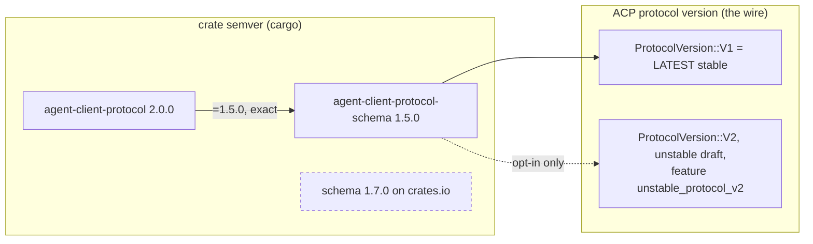
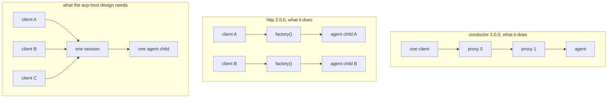

# ACP ecosystem: what boop buys, what boop deletes

Lab branch `lab/acp-ecosystem`, cut from `172ee58`. Every crate below was downloaded and read
from source; a README claim is treated as a hypothesis. Registry paths are `~/.cargo/registry/src/index.crates.io-1949cf8c6b5b557f/`,
abbreviated `REG/`.

## Contents

| § | subject |
|---|---|
| [1](#1-verdict-table) | Verdict table, plus the three rows the `acp-host` lane needs today |
| [2](#2-the-version-story) | schema 1.5 vs 1.7, protocol v1 vs v2, what polyfill is for |
| [3](#3-per-candidate-detail) | Per-candidate API reads |
| [4](#4-what-stays-bespoke-and-why) | What stays bespoke |
| [5](#5-forks-for-chris) | Forks for Chris |

---

## 1. Verdict table

### 1.0 The three rows the `acp-host` lane needs today

| finding | cite | what it changes |
|---|---|---|
| `agent-client-protocol-conductor` does **not** carry the fan-out. It is a linear chain, one client in, one agent out: `pub async fn run(self, transport: impl ConnectTo<Host>)` takes exactly one transport (`REG/agent-client-protocol-conductor-2.0.0/src/conductor.rs:200`) | plan `§5.2` left this "unverified, must be checked before any code is written" | the N-clients-to-one-session residue stays bespoke. Proceed on the `lspmux` id-rewrite design |
| `agent-client-protocol-http` exists at 2.0.0 and does **not** carry it either. `AcpHttpServer::new` takes a factory (`REG/agent-client-protocol-http-2.0.0/src/server.rs:104`) that is called per connection at `connection.rs:465` (`self.factory.spawn_agent()`): one fresh agent child per HTTP/WS client | plan `§5.1` marked it "unverified existence and version" | it exists, it is Apache-2.0, and it is the wrong shape. `ByteStreams` over a `UnixStream` stands |
| An **official agent registry is live**: `https://cdn.agentclientprotocol.com/registry/v1/latest/registry.json`, HTTP 200, 50,612 bytes, `version 1.0.0`, **39 agents** with pinned versions, npx/uvx/binary distributions and per-platform SHA-256. Contains `claude-acp@0.70.0`, `codex-acp@1.6.2`, `kimi` 1.49.0, `opencode` 1.18.19 | const at `REG-scratch/acp-agent-0.0.5/src/registry.rs:15-16`; second consumer at `acpr-0.4.0/src/registry.rs:99` | `crates/boop-acp/src/channel/acp.rs:35-38` stops floating on npm dist-tags |

### 1.1 Full verdict table

| crate | ver | license | last update | dl | replaces in boop | verdict |
|---|---|---|---|---|---|---|
| `agent-client-protocol` | 2.0.0 | Apache-2.0 | 2026-07-23 | 3,815,399 | already bought (`crates/boop-acp/Cargo.toml:30`) | **KEEP** |
| ACP **agent registry JSON** (not a crate) | v1.0.0 | n/a, CDN | live 2026-08-20 | n/a | `acp.rs:35-38`, four floating npx/binary rows | **BUY** as data. One GET, cached; 39 pinned agents replace 4 floating ones |
| `agent-client-protocol-trace-viewer` | 2.0.0 | Apache-2.0 | 2026-07-23 | 2,055 | nothing; it *adds* the wire sequence view `boop debug` cannot give (`crates/boop/src/cli/debug.rs:13-33` reports WARN/ERROR rows, never a request/response pairing) | **BUY as an installed binary.** `serve_file` reads plain JSONL of `serde_json::Value` (`lib.rs:131`, `lib.rs:23`); as a lib it drags axum + tower-http + open into a 280-package tree |
| `agent-client-protocol-conductor` **trace format** | 2.0.0 | Apache-2.0 | 2026-07-23 | 1,896 | nothing | **BUY the types only** if the copy is cheaper than the dep. `TraceEvent`/`RequestEvent`/`ResponseEvent`/`NotificationEvent` are `pub` + `Serialize` (`trace.rs:30-133`) and `viewer.html` reads exactly those fields |
| `agent-client-protocol-conductor` **as the fan-out** | 2.0.0 | Apache-2.0 | 2026-07-23 | 1,896 | plan `§5.2` | **NO.** One transport per `run` (`conductor.rs:200`); the topology in its own doc comment is `Editor → Conductor → Proxy 1 → Proxy 2 → Agent` (`lib.rs:11`) |
| `agent-client-protocol-conductor` **as the trace tap** | 2.0.0 | Apache-2.0 | 2026-07-23 | 1,896 | `acp.rs:84-89` | **NO.** `TraceWriter::spawn` is `pub(crate)` (`trace.rs:434`), `TraceHandle` is `pub(crate)` (`trace.rs:459`), `mod snoop` is private (`lib.rs:73`). The tap is unreachable without running a whole `ConductorImpl` |
| `agent-client-protocol-http` | 2.0.0 | Apache-2.0 | 2026-07-23 | 92,449 | plan `§5.1` socket transport | **NO.** Per-connection agent spawn (`connection.rs:465`); HTTP and WebSocket only, no unix socket |
| `agent-client-protocol-tokio` | 0.11.1 | Apache-2.0 | 2026-04-21 | 71,369 | nothing | **NO, already correctly rejected.** Its `AcpAgent`/`Stdio` are in 2.0.0; its own `lib.rs:8-9` re-exports what the core now owns. `Cargo.toml:26-31` already says this |
| `agent-client-protocol-polyfill` | 2.0.0 | Apache-2.0 | 2026-07-23 | 963 | nothing | **NO.** It is MCP-over-ACP only (`lib.rs:1-10`, sole module `mcp_over_acp`). It has no protocol-version bridging in it |
| `agent-client-protocol-cookbook` | 2.0.0 | Apache-2.0 | 2026-07-23 | 456 | nothing | **NO as a dependency, READ as docs.** 863 lines, all of it `//!` prose and examples (`src/lib.rs`) |
| `agent-client-protocol-rmcp` | 3.0.0 | Apache-2.0 | 2026-07-23 | 8,566 | nothing today | **WATCH.** The only sibling on `agent-client-protocol = "2.0.0"` besides conductor/http/trace-viewer. Relevant the day a lane needs MCP tools injected |
| `agent-client-protocol-derive` | 2.0.0 | Apache-2.0 | 2026-07-23 | 704,136 | `crates/boop-acp/src/channel/jsonrpc.rs` (274 lines) | **MOOT: delete instead.** See §3.5 |
| `boltz-acpx` | 0.1.3 | Apache-2.0 | 2026-07-07 | 71 | `acp.rs` client | **NO as a dependency.** Pins `agent-client-protocol = "=1.0.1"` and schema `"=1.1.0"` (`Cargo.toml`), two majors behind boop. Owner `nguyendkn`, single user, one repo, 3 versions |
| `boltz-acpx::agent_command::registry` | 0.1.3 | Apache-2.0 | 2026-07-07 | 71 | `acp.rs:35-38` | **WATCH as a cross-check only.** `built_in_agent_registry()` (`registry.rs:23-47`) is a 19-agent name→command-line table. Superseded by the official CDN registry, which has 39 and ships checksums |
| `acpr` | 0.4.0 | MIT OR Apache-2.0 | 2026-06-03 | 1,413 | `acp.rs:35-38` | **WATCH.** Official-org repo (`github.com/agentclientprotocol/acpr`), owner `nikomatsakis`. As a **binary** it is a drop-in adapter argv. As a **library** it is out: pins `agent-client-protocol = "0.13"` (`Cargo.toml:68-69`). Costs one extra JSON-RPC relay hop |
| `acp-agent` | 0.0.5 | (see repo) | 2026-08-09 | 131 | `acp.rs:35-38` | **NO, mined.** Owner `observerw`, 0.0.x. Its value is the `REGISTRY_URL` const (`src/registry.rs:15-16`) and `data/yolo-modes.json`, a per-agent unattended-mode table |
| `acp-tunnel` | 0.1.0 | MIT | 2026-07-31 | 17 | plan `§5.1` | **NO, and flagged.** No `repository` field on crates.io, one version, one owner `benthecarman`, 7,703 lines carrying auth and token storage (`src/credentials.rs`, `src/auth.rs`). It does not use the ACP SDK at all. Chris's call to make. Priced alternative: `ByteStreams` over `UnixStream`, already free |
| `acp-hub-core` | 0.2.0 | (see repo) | 2026-07-19 | 117 | the whole `acp-host` design | **NO as a dependency, READ as prior art.** Pins acp and conductor at `=1.2.0`. 22,743 lines. Its daemon is exactly the target shape: advisory file lock, `daemon.json` discovery, newline JSON-RPC over an `interprocess` local socket (`src/daemon.rs:1-5`) |
| `gate4agent` | 0.3.0 | (see repo) | 2026-08-18 | 1,795 | `crates/boop-acp/src/channel/tui.rs` (864 lines) | **NO.** Its `acp` module hand-rolls JSON-RPC with zero `agent-client-protocol` dependency (`Cargo.toml` has no ACP crate). Buying it would un-buy the SDK. Owner `ZENG3LD`, single user |
| `navi-acp` | 0.3.7 | (see repo) | 2026-07-23 | 129 | `acp.rs` client | **NO.** Same defect: no ACP SDK dependency, hand-rolled client under an ACP name |
| `zeph-acp` | 0.22.4 | MIT OR Apache-2.0 | 2026-08-16 | 1,017 | nothing | **NO.** It is an ACP **server** for IDE embedding. boop is the client side |
| `acp-llm-adapter` | 0.7.2 | MIT OR Apache-2.0 | 2026-07-17 | 68 | nothing | **NO.** Exposes DeepSeek/GLM *as* ACP agents. Wrong direction |
| `sacp` | 11.0.0 | MIT OR Apache-2.0 | 2026-03-16 | 210,460 | nothing | **NO.** A fork of ACP with Symposium extensions, last published 2026-03-16, five months behind the official SDK's 2026-07-23 |

Everything in the `agentclientprotocol/rust-sdk` repo is Apache-2.0 and owned by the
`github:agentclientprotocol:rust-maintainers` team plus `benbrandt` and `agu-z`. Every
third-party crate above is a single named individual.

---

## 2. The version story

### 2.1 Two version axes

boop writes `schema::v1` (`crates/boop-acp/src/channel/acp.rs:12`) and sends
`ProtocolVersion::V1` (`acp.rs:344`). Both are correct and current.

| claim in the brief | measured answer |
|---|---|
| "boop speaks v1 while the core crate is at 2.0.0" | different axes. `v1` is the *wire* version; `2.0.0` is the *crate* version. `schema-1.5.0/src/version.rs:41-49`: `LATEST = V1`, and the doc comment says `V2` "is an unstable draft used for protocol iteration", available only under `unstable_protocol_v2` |
| "the local registry is 1.5.0, crates.io is 1.7.0, boop is behind" | boop **cannot** move. `REG/agent-client-protocol-2.0.0/Cargo.toml:139-141` requires `agent-client-protocol-schema version = "=1.5.0"`, an exact pin |
| is that pin actually binding | measured. Scratch crate with only `agent-client-protocol = "2.0.0"`: `cargo update -p agent-client-protocol-schema --precise 1.7.0` → `error: failed to select a version for the requirement 'agent-client-protocol-schema = "=1.5.0"' / candidate versions found which didn't match: 1.7.0` |
| is boop on a retired protocol | no. Protocol v1 is `LATEST`. v2 has shipped no stable release |

### 2.2 What actually changed, 1.5.0 → 1.7.0

| step | published | diff, `v1` module only | breaks boop |
|---|---|---|---|
| 1.5.0 → 1.6.0 | 2026-07-20 → 2026-07-21 | one file: `v1/tool_call.rs`. Adds `ToolCall.name: Option<String>` and `ToolCallUpdateFields.name`, both behind a new `unstable_tool_call_name` feature | no. Feature-gated off |
| 1.6.0 → 1.7.0 | 2026-07-21 → **2026-08-20 19:43 UTC**, today | every file touched, almost all of it mechanical: `JsonSchema` derives move to `#[cfg_attr(feature = "schemars", ...)]` and `schemars` becomes an optional default-on feature (`1.7.0/src/lib.rs:32-38`). Real removals: `unstable_auth_methods` and `unstable_elicitation` are **gone from the feature list**. New: `unstable_session_compaction` (`SessionUpdate::CompactionUpdate`). `v2/conversion.rs` deleted | no, and it cannot be reached anyway |

The removal is the hard blocker in both directions: `REG/agent-client-protocol-2.0.0/Cargo.toml`
declares `unstable_auth_methods = ["agent-client-protocol-schema/unstable_auth_methods"]` and
`unstable_elicitation = [...]`. Schema 1.7.0 has neither feature. Core 2.0.0 cannot compile
against schema 1.7.0 even with the exact pin relaxed.

### 2.3 What polyfill is for

Not this. `REG/agent-client-protocol-polyfill-2.0.0/src/lib.rs:1-10` declares one module,
`mcp_over_acp`, described as "consumes schema-native `McpServer::Acp` declarations and `mcp/*`
messages, exposing each server to an agent through a loopback HTTP bridge." The three source
files are `mcp_over_acp/{mod,actor,http}.rs`, 2,451 lines, all MCP. There is no protocol-version
shim in the crate. The "backward compatibility" in its crates.io description means *older agents
lacking newer MCP capabilities*, with no bearing on wire versions.

### 2.4 Cost to move

| move | cost |
|---|---|
| schema 1.5.0 → 1.7.0 | **impossible today**, and worth nothing if it were. Wait for the SDK to bump |
| protocol v1 → v2 | premature. No stable v2 |
| watch item | when `agent-client-protocol` publishes a release depending on schema `1.7.x`, re-read `unstable_auth_methods` and `unstable_elicitation` before upgrading; boop uses neither today (`grep` over `crates/boop-acp` finds no `elicitation`, no `auth_method`) |

---

## 3. Per-candidate detail

### 3.1 The agent registry: BUY

API actually read:

| where | what |
|---|---|
| `https://cdn.agentclientprotocol.com/registry/v1/latest/registry.json` | fetched 2026-08-20, HTTP 200, 50,612 bytes, `{"version":"1.0.0","agents":[...39...],"extensions":[]}` |
| `acp-agent-0.0.5/src/registry.rs:15-16` | `pub const REGISTRY_URL` |
| `acp-agent-0.0.5/src/registry.rs:24-49` | `Platform` enum: `darwin-aarch64`, `darwin-x86_64`, `linux-*`, `windows-*` |
| `acp-agent-0.0.5/src/registry.rs:52-67` | `BinaryTarget { archive, cmd, sha256, args, env }` |
| `acp-agent-0.0.5/src/registry.rs:141-152` | `Distribution { binary, npx, uvx }`, at least one required |

What boop has today, `crates/boop-acp/src/channel/acp.rs:35-38`, four rows, no versions:

| boop const | boop value | registry value |
|---|---|---|
| `CLAUDE_ADAPTER` | `npx -y @agentclientprotocol/claude-agent-acp` | `@agentclientprotocol/claude-agent-acp@0.70.0` |
| `CODEX_ADAPTER` | `npx -y @agentclientprotocol/codex-acp` | `@agentclientprotocol/codex-acp@1.6.2` |
| `KIMI_ADAPTER` | `kimi acp` | binary 1.49.0, `./kimi acp`, per-platform tarball + sha256 |
| `OPENCODE_ADAPTER` | `opencode acp` | binary 1.18.19, `./opencode acp`, per-platform archive + sha256 |

The comment at `acp.rs:29-34` already names the failure: "The npx rows float on the npm dist-tag;
the versions that answered `end_turn` on this machine were `claude-agent-acp@0.70.0` and
`codex-acp@1.4.0`". The registry pins claude at exactly the version that worked. A float is a
silent-breakage surface with no test that catches it.

What breaks: nothing at compile time. The registry adds a network read to channel open. Mitigation
is the one both `acpr` and `acp-agent` chose: cache the JSON on disk and fall back to the compiled-in
four rows. `crates/boop-harness/src/registry.rs:19-24` is the natural owner, it already declares
itself "the ONE place a harness is named".

`data/yolo-modes.json` in `acp-agent-0.0.5` is a second table worth mining: per-agent unattended
posture, including `kimi` → `{"option": {"configId": "mode"}}`, the same session-config lever boop
already drives for model selection at `acp.rs:26` (`MODEL_CONFIG_ID`).

### 3.2 `agent-client-protocol-trace-viewer`: BUY, as a binary

API actually read, `REG/agent-client-protocol-trace-viewer-2.0.0/src/lib.rs`:

| item | line | signature |
|---|---|---|
| `TraceSource` | 23 | `File(PathBuf)` \| `Memory(Arc<Mutex<Vec<serde_json::Value>>>)` |
| `serve_memory` | 102 | `(TraceViewerConfig) -> (TraceHandle, impl Future<Output = Result<()>>)` |
| `serve_file` | 131 | `(PathBuf, TraceViewerConfig) -> Result<()>`, re-reads the file each request so a growing trace is live |
| `VIEWER_HTML` | 19 | `include_str!("viewer.html")`, 767 lines, an interactive sequence diagram |
| file parse | 170-176 | `content.lines().filter_map(serde_json::from_str)`. **No schema validation.** Any JSONL of objects is accepted |

`viewer.html` reads only `.from` (11 sites), `.to` (10), `.method` (4), `.ts` (3), `.protocol` (3),
`.params` (2), `.is_error` (2), `.session` (1). Those are exactly the fields of
`agent-client-protocol-conductor::trace::{RequestEvent, ResponseEvent, NotificationEvent}`
(`REG/agent-client-protocol-conductor-2.0.0/src/trace.rs:55-131`), which are `pub` and `Serialize`.

The boop side that feeds it already exists. `crates/boop-acp/src/channel/acp.rs:84-89` installs
`AcpAgent::with_debug`, whose callback signature is `Fn(&str, LineDirection)`
(`REG/agent-client-protocol-2.0.0/src/acp_agent.rs:237-243`) and whose direction enum is
`Stdin | Stdout | Stderr` (`acp_agent.rs:26-35`). Today boop routes all of it to `debug!` and drops
the frames. Turning `Stdin`/`Stdout` lines into `RequestEvent`/`ResponseEvent`/`NotificationEvent`
rows in the lane trail is the change; `Stderr` keeps its current path.

What breaks: nothing. The viewer is a separate `cargo install`.

Cost of the alternative, taking it as a library: measured. Empty crate + `agent-client-protocol`
alone locks 145 packages; adding `conductor` + `trace-viewer` locks 203. boop's tree is 280 packages
and carries no `axum` and no `tower-http`. A browser UI is not worth +58 crates inside a CLI.

### 3.3 The fan-out: NO, stays bespoke

Cites for the two NOs:

| crate | missing thing |
|---|---|
| conductor | `ConductorImpl::run(self, transport: impl ConnectTo<Host>)` at `conductor.rs:200-203`. Singular `transport`, no accept loop, no client set. The public surface (`conductor.rs`, 20 `pub` items) has no method taking more than one predecessor |
| http | `AcpHttpServer::new<F, C>(factory: F) where F: Fn() -> C` at `server.rs:104-110`; `ConnectionRegistry::create_connection_with_transport` calls `self.factory.spawn_agent()` at `connection.rs:465`, per connection. `ConnectionRegistry` itself is `pub(crate)` (`connection.rs:400`) so the map cannot be pre-seeded from outside |

Prior art confirming the gap is real rather than a search failure: `acp-hub-core` 0.2.0 is a
22,743-line hub that *does* run one daemon over many clients, and it does **not** speak ACP to
those clients. `src/daemon.rs:1-5`: "Clients discover it through `daemon.json`, then speak
newline-delimited JSON-RPC 2.0 over an interprocess local socket", its own protocol, with a
`broadcast::Sender<RpcRequest>` for notification fan-out (`src/callbacks.rs:189`). The one
shipped implementation of this shape chose a bespoke client protocol too.

Two pieces `acp-hub-core` does buy that boop's plan currently hand-waves: `interprocess`
(`local_socket::tokio`) for the listener and `fd_lock::RwLock` for the singleton advisory lock.
Both are named in `acp-hub-core-0.2.0/src/daemon.rs:22,25`.

### 3.4 `boltz-acpx`: NO, with the cite

The brief's hypothesis is that "ACP client + session runtime" replaces
`crates/boop-acp/src/channel/acp.rs`. Two facts kill it:

1. Version. `boltz-acpx-0.1.3/Cargo.toml` declares `agent-client-protocol version = "=1.0.1"` and
   `agent-client-protocol-schema version = "=1.1.0"`. boop is on 2.0.0 / 1.5.0. The two SDK majors
   would coexist in the tree with no type interop, and every boop `schema::v1::*` value would need
   re-marshalling at the boundary.
2. `acp.rs` is **not hand-rolled**. It is already SDK-native: `Client.builder()`,
   `.on_receive_notification`, `.on_receive_request`, `.connect_with(agent, ...)`,
   `ConnectionTo<Agent>`, `send_request(PromptRequest::new(...)).block_task()`. The header comment
   at `acp.rs:1-4` says so. The brief's table row "the ACP client" describes code that was already
   bought.

Worth taking from it anyway: `agent_command/registry.rs:23-47`, a 19-agent name→command table with
pinned adapter versions, and the per-agent quirk modules (`claude_quirks.rs`,
`gemini_quirks.rs`, `codex_compat.rs`) that encode startup timeouts and stdin-close delays per
agent. The official CDN registry supersedes the table; the quirks have no published equivalent.

### 3.5 `crates/boop-acp/src/channel/jsonrpc.rs`: the brief's premise is wrong, and the answer is delete

The brief prices this as "hand-written JSON-RPC framing over the child's stdio" replaceable by an
ACP crate. Measured:

| fact | cite |
|---|---|
| it is not ACP framing | `jsonrpc.rs:1-2`: "codex `app-server` writes one JSON object per line". `codex.rs:6-7`: "`codex app-server` is not ACP, so the two doors share no frames" |
| it has exactly one consumer | `grep -rn "jsonrpc::" crates --include=*.rs` → one hit, `codex.rs:15` |
| that consumer is retired and unwired | `codex.rs:4-6`: "RETIRED as a lane transport ... nothing outside its own tests constructs it". `grep -c CodexChannel` outside its own file → **0** |

The same measurement over the whole `boop-acp` channel set:

| file | lines | external references |
|---|---|---|
| `channel/tui.rs` | 864 | 0 (`TuiChannel`) |
| `channel/claude.rs` | 330 | 0 (`ClaudeChannel`) |
| `channel/jsonrpc.rs` | 274 | 0 (`RpcChild` outside `codex.rs`) |
| `channel/codex.rs` | 182 | 0 (`CodexChannel`) |
| `channel/kimi.rs` | 174 | 0 (`KimiChannel`) |
| **total** | **1,824** | **0** |
| `channel/acp.rs` | 883 | live, the one transport |
| `channel/opencode.rs` | 207 | live, but `OpencodeChannel::open` is a 2-line shim onto `AcpChannel::open_adapter` (`opencode.rs:37-38`); the store readers below it are called only from the retired `tui.rs` |

The largest single reduction available in `boop-acp` is a deletion. The rollback
doors the ACP migration left behind run to 1,824 lines with zero live callers, against 883 lines of live
ACP client.

If a codex `app-server` door is ever wanted back, the SDK's own JSON-RPC layer takes it: `Role` is
a public, externally implementable trait (`REG/agent-client-protocol-2.0.0/src/role.rs:32-63`),
`Builder`/`Channel`/`ByteStreams`/`Dispatch` are all re-exported (`src/lib.rs:97-106`), and
`agent-client-protocol-derive` supplies `JsonRpcRequest`/`JsonRpcNotification`/`JsonRpcResponse`
(`src/lib.rs:133`). A `CodexAppServer` role would reuse the bought framing instead of `RpcChild`.
That is the buy answer for the day it is wanted. Nothing wants it today.

---

## 4. What stays bespoke and why

The datalog engine is the house's one legitimately bespoke layer and none of this is that, so
each row carries a cite for why the market does not sell it.

| boop code | lines | why it stays |
|---|---|---|
| the sync/async bridge in `acp.rs:60-160`, `Command`/`Note` over `std::sync::mpsc` plus one current-thread runtime per channel | ~100 | `LaneChannel` is a sync trait (`crates/boop-acp/src/channel.rs:105`) and the SDK connection is scoped to an async `connect_with`. Nothing publishes a sync facade over `ConnectTo`; `agent-client-protocol-tokio` 0.11.1 is the closest and it is pinned to SDK 0.11.1 |
| permission auto-allow, `acp.rs:281-305` | ~25 | policy, decided by boop: "a lane runs unattended, an unanswered permission request wedges the turn forever". `acp-agent`'s `data/yolo-modes.json` is a table of per-agent yolo flags; the decision procedure is boop's. The nearest thing to a library answer is a data file to consume, listed in §3.1 |
| model selection through `session/set_config_option`, `acp.rs:26` + `select_model` | ~60 | driven by an opencode defect boop measured: `acp.rs:333-335`, "Under ACP opencode ignores `opencode.json` and `OPENCODE_MODEL` and hangs on its dead default, so the config-option call is the only model lever". No crate encodes that |
| N-clients-to-one-session routing, planned | ~200 est. | §3.3. Conductor is a chain, http is per-connection, and the one shipped hub sidesteps it with a private protocol |
| the lane trail and `boop debug` | 384 + 164 | `boop debug` answers "which lane logged WARN/ERROR in the last window" from trail files plus the store (`crates/boop/src/cli/debug.rs:13-33`). trace-viewer answers "what was the request/response sequence". Different questions; the trace is additive |
| `boop-harness` per-harness modules | 3,475 | boop-specific: preset resolution, worktree lifecycle, `git log` verification. Not protocol |

Two of these have a market answer the moment a version moves: the sync facade (if the SDK ever
ships one) and the fan-out (if conductor ever grows an accept loop). Both are watch items, not
today's build.

---

## 5. Forks for Chris

| # | fork | cites | what hangs on it |
|---|---|---|---|
| 1 | **Delete the rollback doors, or keep them another arc?** 1,824 lines across `tui.rs`, `claude.rs`, `jsonrpc.rs`, `codex.rs`, `kimi.rs` have zero live callers (§3.5 table). Each file's own header says "RETIRED ... kept unwired this arc as the rollback door" | `channel/tui.rs:4-7`, `channel/claude.rs:4-6`, `channel/codex.rs:4-7`, `channel/kimi.rs:4-6` | the single largest reduction available in `boop-acp`. Deleting also removes the last hand-rolled JSON-RPC in the repo, which makes the `Cargo.toml:26-31` claim ("never a hand-rolled frame") literally true |
| 2 | **Adopt the official agent registry, and how?** Three spellings: (a) boop fetches `registry.json` itself and caches it, no new dependency; (b) spell `acpr <agent>` as the adapter argv and require `cargo install acpr`, costing one JSON-RPC relay hop and a dependency on a 0.4.0 owned by one person; (c) vendor a pinned snapshot of the 39 rows into `boop-harness` and refresh by hand | registry live at the CDN URL, 39 agents; `acpr-0.4.0/Cargo.toml:68` pins acp `0.13`; `crates/boop-harness/src/registry.rs:1-3` claims to be the one naming place | whether `boop beep lane create` can ever name an agent boop has no Rust file for. Today the roster is 4 (`registry.rs:19-24`); the registry has 39 |
| 3 | **Emit the conductor trace format from `with_debug`?** boop already has every wire line at `acp.rs:84-89` and throws them away. The event types are `pub` + `Serialize` and the viewer is a standalone binary | `trace.rs:30-133`, `trace-viewer/src/lib.rs:131`, `acp_agent.rs:26-35` | the "why was that slow, what was it doing" answer for ACP lanes. `boop debug` cannot give a request/response pairing today |
| 4 | **`acp-tunnel` for any remote leg: yes or no?** 17 downloads, one version, one owner, **no repository URL on crates.io**, and it carries auth token storage (`src/credentials.rs`, 270 lines; `src/auth.rs`, 82 lines) | crates.io owners → `[('benthecarman','user')]`; `repository: None` | flagged rather than decided, per the brief. The priced alternative is `ByteStreams` over a local `UnixStream`, which is free and local-only |
| 5 | **Watch or ignore `agent-client-protocol-rmcp` 3.0.0?** The only third-party-facing sibling already on SDK 2.0.0, and the only route by which a boop lane could carry MCP tools into an agent session | `REG-scratch/agent-client-protocol-rmcp-3.0.0/Cargo.toml:51-52`, `src/lib.rs:1-24` | whether boop lanes ever inject tools. No work today either way |

### Not a fork, a correction to the record

The brief's premise "boop hand-rolls a lot" holds for one file, and that file is dead code. The
ACP client, the JSON-RPC framing under it, the process spawn, the stdio transport and the session
lifecycle were all bought in `crates/boop-acp/Cargo.toml:26-31`. The remaining gaps are a data
table (the agent registry), an output format (the trace), and one genuine hole the ecosystem does
not fill (N clients into one session).
