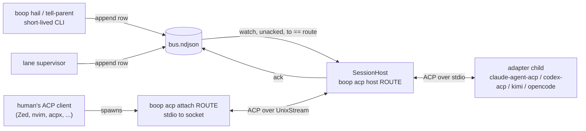
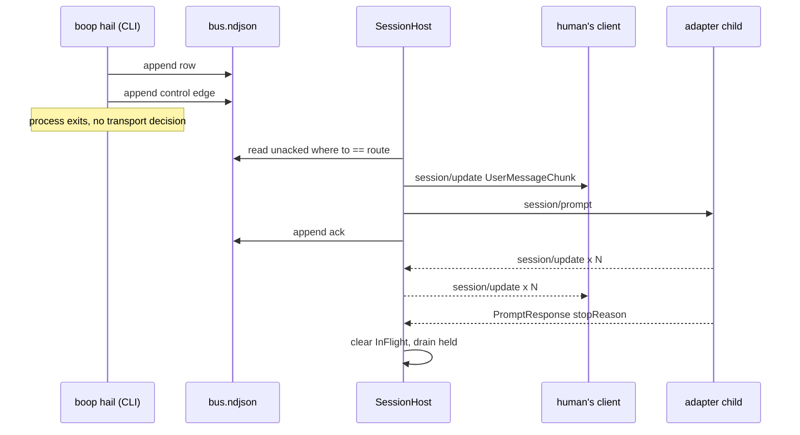

# One send path: the session host

Design lab against `issues/acp-one-send-path/item.md`, worktree `lab/acp-one-send-path`
at `172ee58`. No behavior code changed.

## Contents

1. [Corrections to the contract](#1-corrections-to-the-contract)
2. [The protocol, enumerated from the schema](#2-the-protocol-enumerated-from-the-schema)
3. [Adapter capabilities, measured 2026-08-20](#3-adapter-capabilities-measured-2026-08-20)
4. [The structural blocker the contract does not name](#4-the-structural-blocker-the-contract-does-not-name)
5. [Build vs buy](#5-build-vs-buy)
6. [The shape: one host per route](#6-the-shape-one-host-per-route)
7. [The six hard parts](#7-the-six-hard-parts)
8. [Type signatures](#8-type-signatures)
9. [Instance lifetimes](#9-instance-lifetimes)
10. [Storage layout, reads and writes, uniqueness](#10-storage-layout-reads-and-writes-uniqueness)
11. [What is deleted](#11-what-is-deleted)
12. [Forks for Chris](#12-forks-for-chris)
13. [Receipts appendix](#13-receipts-appendix)

---

## 1. Corrections to the contract

Every cite in `issues/acp-one-send-path/item.md` was re-read against the worktree at
`172ee58`. Four claims need correction, one of them decisive.

| # | contract claim | code says |
|---|---|---|
| C1 | "`deliver_hail` still has four early returns before any delivery" | FIVE: `crates/boop/src/cli/mail.rs:161` (no route), `:168` (`kind == "lane"`), `:179` (hook installed), `:193` (`no_pane` and coordinator/native), `:197` (no pane at all). `:202` is the only delivery arm |
| C2 | "`session/*` in `agent-client-protocol-schema-1.5.0` is `new load resume fork list close delete prompt cancel set_mode set_config_option request_permission update`" | that list splices two protocol versions. `session/load` and `session/set_mode` exist only in v1 (`v1/agent.rs:4893`, `:4895`); v2 has neither (`v2/agent.rs:5190-5207`). `session/request_permission` and `session/update` are client-side, not agent-side (`v1/client.rs:2282-2284`). boop speaks v1: `crates/boop-acp/src/channel/acp.rs:12` imports `schema::v1::*` and `:344` sends `ProtocolVersion::V1` |
| C3 | "boop can prompt over ACP only a session whose stdio it owns" | true of boop's code, false of the protocol. The SDK's transport is `ByteStreams<OB: AsyncWrite, IB: AsyncRead>` (`agent-client-protocol-2.0.0/src/jsonrpc.rs:5551-5559`) and `Channel::duplex()` is in-process (`jsonrpc.rs:5648`). A unix socket is a legal ACP transport with no crate fork. `Stdio` (`src/stdio.rs:11`) is one `ConnectTo` impl among several |
| C4 | "`prompt` is one request per turn; a second one before the first resolves is out of protocol" (and `acp.rs:177-180` says the same in a comment) | **contradicted by measurement.** `claude-agent-acp` 0.70.0 advertises `agentCapabilities._meta.claudeCode.promptQueueing: true` and answered two overlapping prompts with `end_turn` each. `codex-acp` 1.6.2 answered the second one too. Kimi 0.37.2 rejected with a typed `-32600` / `data.code = turn.agent_busy`. Behavior is per-adapter and boop reads neither the capability nor the error code. Full trace in [§13](#13-receipts-appendix) |

C4 is why `Delivery::MidTurn` (`crates/boop-acp/src/channel.rs:19`) is currently
unreachable on the ACP path. It is unreachable because `acp.rs:180` returns
`Delivery::NextTurn` unconditionally, on a stated premise the wire disagrees with.
That is unbuilt work in boop. The schema permits what the comment forbids.

The rest of the contract holds. `open_channel`'s three call sites are
`crates/boop-proc/src/concatmap.rs:198`, `:260`, and `crates/boop/src/cli/job.rs:388`,
all inside lane or resident-chat supervision, verified. `Route.session_id` exists
(`crates/boop-store/src/bus.rs:42`) and only `run_lane_supervisor` loads it into a channel
(`job.rs:379-387` through `supervise::pinned_conversation`, `supervise.rs:998-1002`).
`TuiChannel` is unwired (`crates/boop-acp/src/channel/tui.rs:4-7`, no non-test constructor).

---

## 2. The protocol, enumerated from the schema

Read out of `agent-client-protocol-schema-1.5.0/src`, method-name constants only.

### Agent side (client calls these)

| v1 | const | v2 | const |
|---|---|---|---|
| `initialize` | `v1/agent.rs:4878` | `initialize` | `v2/agent.rs:5177` |
| `authenticate` | `:4880` | `auth/login` | `:5179` |
| `logout` | `:4914` | `auth/logout` | `:5209` |
| `providers/list` `providers/set` `providers/disable` | `:4883-4889` | same | `:5182-5188` |
| `session/new` | `:4891` | `session/new` | `:5190` |
| `session/load` | `:4893` | ABSENT | |
| `session/set_mode` | `:4895` | ABSENT | |
| `session/set_config_option` | `:4897` | same | `:5192` |
| `session/prompt` | `:4899` | same | `:5194` |
| `session/cancel` | `:4901` | same | `:5196` |
| `session/list` | `:4903` | same | `:5198` |
| `session/delete` | `:4905` | same | `:5200` |
| `session/fork` | `:4908` | same | `:5203` |
| `session/resume` | `:4910` | same | `:5205` |
| `session/close` | `:4912` | same | `:5207` |
| `$/cancel_request` | `v1/protocol_level.rs:73` | same | `v2/protocol_level.rs:72` |

### Client side (agent calls these)

| method | v1 | v2 |
|---|---|---|
| `session/update` (notification) | `v1/client.rs:2282` | `v2/client.rs:2135` |
| `session/request_permission` | `:2284` | `:2137` |
| `fs/write_text_file` `fs/read_text_file` | `:2286-2288` | ABSENT from v2 method table |
| `terminal/create output release wait_for_exit kill` | `:2290-2298` | ABSENT from v2 method table |
| `elicitation/create` `elicitation/complete` | `:2301-2304` (feature-gated) | `:2140-2143` (feature-gated) |

### The escape hatch

`ExtRequest` and `ExtNotification` (`v1/ext.rs:25`, `:73`) carry an arbitrary method name
that "must start with `_`", plus `Meta` (`v1/ext.rs:15`) on every request and response.
So a mid-turn primitive is expressible as `_boop/steer` without leaving the protocol.
Whether any adapter would answer it is a separate question, unbuilt everywhere.

### `SessionUpdate` variants

`v1/client.rs:99-139`. The one that matters for a proxy is
`SessionUpdate::UserMessageChunk(ContentChunk)` at `:101`: an agent-to-client frame
carrying **user** content. A host that injects a turn can mirror it into every attached
client's transcript with a frame the protocol already defines.

---

## 3. Adapter capabilities, measured 2026-08-20

Probe: raw JSON-RPC `initialize` over stdio, no SDK, read `agentCapabilities`.
Script and full output in [§13](#13-receipts-appendix).

| adapter | version | `loadSession` | `resume` | `list` | `fork` | `close` | `delete` | queueing advertised |
|---|---|---|---|---|---|---|---|---|
| `@agentclientprotocol/claude-agent-acp` | 0.70.0 | true | yes | yes | yes | yes | yes | `_meta.claudeCode.promptQueueing: true` |
| `@agentclientprotocol/codex-acp` | 1.6.2 | true | yes | yes | no | yes | yes | none |
| Kimi Code CLI (`kimi acp`) | 0.37.2 | true | yes | yes | yes | yes | yes | none |
| OpenCode (`opencode acp`) | 1.18.18 | true | yes | yes | yes | yes | no | none |

Every adapter on this machine advertises `loadSession: true` and `sessionCapabilities.resume`.
That is the whole factual basis for hard part 5.

Second probe: `session/prompt` A (a 20-second shell sleep), then `session/prompt` B on the
same session 4 seconds later while A was still in flight.

| adapter | second prompt | evidence |
|---|---|---|
| claude 0.70.0 | accepted and queued; A resolved `end_turn` at t+24425ms, B resolved `end_turn` at t+25664ms | both prompts answered, no error frame |
| codex 1.6.2 | accepted; B resolved `end_turn` at t+29977ms with its own usage block | A's response had not arrived when the probe exited 3s later, so codex's ordering is **not** established by this run |
| kimi 0.37.2 | rejected in 1ms: `{"code":-32600,"message":"Invalid request: another turn is already in progress","data":{"code":"turn.agent_busy"}}` | typed error code, machine-readable |
| opencode 1.18.18 | accepted, and then something else: both prompts resolved `end_turn` at t+35681 and t+35682 with **byte-identical** usage blocks. Reads as the second prompt joining the first turn rather than running its own. Whether BRAVO was ever produced is unverified | first run of this probe timed out with `initialize` unanswered at 75s; the trace above is the retry |

Doubt markers, stated rather than smoothed over:

| gap | why |
|---|---|
| codex's ordering is not established | the probe exited 3s after B resolved and A's response had not arrived |
| opencode's second prompt may have been merged, not queued | identical usage in the same millisecond is consistent with merging and with a coincidence; one run does not separate them |
| opencode ran on its default model | the probe's `session/set_config_option` frame was malformed (`-32602 Invalid params`, the `value` shape) and the model was never set |
| opencode's first run hung at `initialize` | possibly the class recorded at `docs/failure-modes.md:22`; unconfirmed |

The design below reads a capability and handles a typed error. It assumes none of these
four behaviors.

---

## 4. The structural blocker the contract does not name

The contract says the blocker is session ownership. Underneath that sits a smaller, harder
fact.

**`boop hail` is a short-lived CLI process.** `run_hail` appends the row and calls
`deliver_hail` inline (`crates/boop/src/cli/mail.rs:131-133`), then the process exits.
An `AcpChannel` owns a spawned child, a dedicated thread and a current-thread tokio runtime
(`crates/boop-acp/src/channel/acp.rs:62-68`, `:110-113`). A CLI invocation cannot own one
and cannot reach one somebody else owns: `grep -rn "UnixListener\|UnixStream" crates/*/src`
returns nothing, and there is no boop daemon.

So a mail row can only become a `session/prompt` inside a **long-lived process that already
holds the session**. There is exactly one such process kind today, and it works:

| piece | site |
|---|---|
| the lane pane runs `boop beep lane run`, not the harness | `crates/boop-harness/src/harness.rs:173-180` (`supervisor_command`) |
| it opens the ACP channel | `crates/boop/src/cli/job.rs:388` |
| it polls the mailbox for its own name every 700ms | `crates/boop-proc/src/supervise.rs:15` (`POLL`), `:116-133` (`pending`), `:663` |
| `deliver_hail` therefore does nothing for a lane, on purpose | `crates/boop/src/cli/mail.rs:166-174` |

The lane arm reads as a special case. It is the general case. The one send path already
exists for lanes and it is a **pull**: append a row, and the process that owns the session
turns it into a turn.

Generalizing that is the whole design. It adds no transport. It removes four.

---

## 5. Build vs buy

Mandatory before any bespoke component. Three components are candidates for purchase: the
socket transport, the fan-out/multiplex policy, and process durability.

### 5.1 Transport: many connections into one process

| candidate | what it is | version | fits | cost | disqualifier |
|---|---|---|---|---|---|
| `agent-client-protocol` `ByteStreams` | the SDK's own transport, generic over `OB: AsyncWrite`, `IB: AsyncRead` (`jsonrpc.rs:5551-5559`); `Lines` is generic over any `Sink<String>`/`Stream<io::Result<String>>` (`jsonrpc.rs:5411`) | 2.0.0, already a dependency (`crates/boop-acp/Cargo.toml:31`) | **yes** | a `UnixStream` through a compat adapter, single digit lines | none |
| `agent-client-protocol-http` | official sibling, "HTTP/SSE and WebSocket transports", named in the crate README's Related Crates | unverified: not in the local registry, crates.io API refused the query (rate policy) | maybe | one dependency | unverified existence and version; check before relying on it |
| `tokio-listener` | "unix sockets, socket activation, inetd mode" behind one listener type | 0.5.2, already in the local cargo registry, referenced by no `Cargo.toml` in this repo | yes for the listener half | one dependency | none found; buys accept-loop uniformity, not protocol logic |
| `jsonrpsee` | generic async JSON-RPC framework, WS/HTTP, native pub/sub | maintained | partially | large dependency, would sit beside the ACP SDK rather than under it | duplicates the SDK's JSON-RPC layer; no concept of "N connections share one upstream session" |
| hand-rolled framing | | | | | already rejected once in this repo: `crates/boop-acp/Cargo.toml:26-31` says the SDK's JSON-RPC is used "never a hand-rolled frame" |

Call: `ByteStreams` over a `UnixStream`. The transport is bought and already paid for.

### 5.2 Multiplex policy: N clients, one upstream session

| candidate | what it is | version / status | solves it | cost | disqualifier |
|---|---|---|---|---|---|
| `lspmux` (formerly `ra-multiplex`) | shares one language server among many LSP clients; socket server plus a thin stdio shim per client; rewrites JSON-RPC ids per client and reverses on the way back | GitHub repo archived 2025-10-12; Codeberg `lspmux` last commit 2026-03-11, 178 commits; crates.io `ra-multiplex` 0.2.6 | **for LSP, yes.** This is the proven prior art for exactly this shape | not a library: LSP-specific binary, would be ported not imported | its own docs say it **drops server-initiated requests**. Translated to ACP that drops `session/request_permission`, which blocks the turn until answered. Adopting the code wholesale imports a correctness bug; adopting the id-rewrite design is free |
| OpenClaw ACP bridge | ACP-over-stdio front end forwarding to a WebSocket gateway, maps ACP session to gateway session key | active, documented at `docs.openclaw.ai/cli/acp` | **no, by its own admission**: "If multiple ACP clients share the same Gateway session key, event and cancel routing are best-effort rather than strictly isolated per client" | | the clearest primary-source statement that this is unsolved off the shelf |
| `agentrq/acp-gateway` | ACP agent to MCP server bridge | v0.1.26, 67 commits, pre-alpha, "APIs subject to change without notice" | no: one subprocess, one conversation; `--max-concurrency` throttles MCP tasks, not client connections | | wrong direction and pre-alpha |
| `agent-client-protocol-conductor` | official sibling, "Proxy-chain orchestration", named in the SDK README's Related Crates; the SDK's `ConnectTo<R>` trait is documented for exactly this ("A proxy implements `ConnectTo<Conductor>`", `src/component.rs:43`) | unverified: not in the local registry, crates.io API refused the query | possibly the closest official answer | one dependency | **must be checked before any code is written.** If it does what its name says, the fan-out layer is bought too |
| `abduco`, `zellij attach`, `tmux` | shared-PTY attach | maintained | no | | all three broadcast one raw byte stream to N terminals with no per-client identity; concurrent writers race on the same stdin, which is the exact failure this design exists to end (`docs/failure-modes.md:355`) |
| `mcphub.nvim` ACP proxy | proposed proxy-over-socket for Neovim | issue #266, no code | no | | not built |
| searched and found nothing | terms: `acp proxy`, `agent-client-protocol proxy`, `acp gateway`, `acp multiplexer`, `agent client protocol middleware`, `acp bridge`, `MCP gateway ACP adapter` | | | | three phrasings converge on the two real projects above; this is a genuine gap |

Call: **verify `agent-client-protocol-conductor` first.** If it carries the fan-out, buy it.
If it does not, the bespoke part is roughly 200 lines of routing policy sitting on the SDK's
`ConnectTo`/`Channel`/`ByteStreams`, and `lspmux`'s id-rewrite design is the reference for
it. That residue is scheduling policy over boop's own mail, which is boop's domain, not
infrastructure.

### 5.3 Durability

| candidate | what it is | fits Darwin | verdict |
|---|---|---|---|
| ACP `session/load` + `session/resume` | the protocol's own answer; every adapter here advertises `loadSession: true` (§3); boop already implements the load branch at `crates/boop-acp/src/channel/acp.rs:355-362` | yes | **already bought and already built.** Restart means: new child, `session/load(session_id, cwd)` |
| `notify` 8 + `notify-debouncer-full` | filesystem watch, already a workspace dependency (`crates/soopy/Cargo.toml:19-20`) | yes (`macos_kqueue` feature already on) | buys the mail-dir watch that replaces the 700ms poll at `supervise.rs:15`, if the poll is ever a problem. It is not one today |
| systemd socket activation (`sd-notify` 0.5.0, cached locally, unused) | listening socket outlives the process | **no, Linux only** | disqualified on platform |
| launchd socket activation | the Darwin analogue, `launch_activate_socket()` | yes, OS feature | no maintained Rust crate found; a thin FFI wrapper would be bespoke. Not needed for this design |
| `abduco` / `dtach` | keep a PTY alive across parent death | yes | solves PTY durability, not JSON-RPC session durability. `dtach` is unmaintained per its own successor's framing |
| `daemonize`, `s6`, `runit` | detach or supervise a process | partly | solve "keep it running", not "reattach the same conversation". Orthogonal |

Call: `session/load`. Nothing is bought that is not already in the tree.

---

## 6. The shape: one host per route

One long-lived boop process per addressed route. It owns the ACP child and it is the only
caller of `session/prompt`. Everything else appends a row.



Three claims the diagram makes that a list would not:

1. mail and the human converge on the same node, and only that node calls `session/prompt`;
2. the human's client is unmodified: it spawns what it thinks is an agent binary;
3. `bus.ndjson` is both the inbound queue and the delivery ledger, so there is no second
   IPC protocol to design.

Lanes already run this shape with the downstream half absent
(`harness.rs:173`, `job.rs:388`, `supervise.rs:663`).

### Why the attach shim rather than a boop TUI

A boop-owned chat TUI would put boop in the terminal-UI business and pin Chris to it. The
shim is ~40 lines: read stdin, write the socket, read the socket, write stdout, over
`ByteStreams`. Every ACP client on the machine works unmodified because to them it is just
an agent command. Build-vs-buy applied to the UI: the UI is bought, N times over, by not
being written.

---

## 7. The six hard parts

### 1. A session boop did not spawn

Confirmed. `open_channel` has three call sites and all three are supervision:
`crates/boop-proc/src/concatmap.rs:198` (resident chat open), `:260` (resident chat
re-open after a context ceiling), `crates/boop/src/cli/job.rs:388` (lane supervisor).
`run_adopt` writes `Route.tmux` and never touches a channel
(`crates/boop/src/cli/me.rs:100-116`), so an adopted pane has a target and no stdio pair.

Answer: under this design a route boop did not spawn has **no host and therefore no
delivery**. Two ways out, and the choice is Chris's (fork 1, §12):

| option | consequence |
|---|---|
| adopt is retired; every addressed session is a boop child under an adapter | one arm, the acceptance criteria are met literally, and Chris changes how he starts a coordinator |
| adopt survives for panes boop cannot own | those routes keep the hook inbox, `deliver_hail` keeps two arms, and "every send goes over ACP" is false for exactly that case |

A third option exists and is worth pricing before the other two: the human starts the
coordinator by running his ACP client with `boop acp host --spawn <preset>` in place of a
bare agent command. boop still owns the child; the human still typed the command that
started it. "adopt" then means "attach a client to a host boop already owns".

### 2. The human at the keyboard

The crux. The answer proposed is a proxy; the boop-TUI and boop-owns-stdin alternatives are
priced against it below.

The constraint is real but narrower than stated. ACP over stdio is 1:1 by construction, and
`agentclientprotocol.com` describes exactly one JSON-RPC stdio pair per agent subprocess.
The SDK does **not** inherit that constraint: `ByteStreams<OB: AsyncWrite, IB: AsyncRead>`
(`jsonrpc.rs:5551-5559`) accepts any byte stream, `Channel::duplex()` (`jsonrpc.rs:5648`)
is in-process, `DynConnectTo<Client>` (`component.rs:83-95`) exists precisely to hold a
heterogeneous collection of connected components, and the crate README's first line under
"What can you build" names **proxies**.

So the host serves the `Agent` role downstream and the `Client` role upstream. The human's
client believes it is talking to an agent; the adapter believes it is talking to one client.

| frame | direction | host does |
|---|---|---|
| `initialize` | human -> host | answers with the upstream's own `agentCapabilities`, cached from its own handshake |
| `session/new` | human -> host | answers with the **already open** session id; the human's client thinks it opened one |
| `session/prompt` | human -> host | remaps the rpc id, forwards upstream, records `InFlight { origin: Human }` |
| `session/update` | adapter -> host | fans out to every attached client, unchanged |
| `session/request_permission` | adapter -> host | forwarded to the single permission holder if a human is attached; otherwise auto-allowed exactly as today (`acp.rs:279-297`) |
| mail row | bus -> host | mirrored downstream as `SessionUpdate::UserMessageChunk` (`v1/client.rs:101`), then sent upstream as `session/prompt` |

That last row is the answer to "how does the human know boop spoke": the mail turn appears
in his own transcript as a user message, because ACP already has a frame for user content
flowing agent-to-client.

`lspmux`'s known defect is the thing to design against rather than inherit: it drops
server-initiated requests. Under ACP that would drop `session/request_permission` and wedge
every turn that asks for permission. `Fanout.permission_holder` (§8) is the fix, and it is a
strict improvement on today's blanket auto-allow.

Priced alternatives:

| option | cost | why not first |
|---|---|---|
| **proxy + attach shim** | one new long-lived process kind; ~200 lines of routing on bought transport; every ACP client works | chosen |
| boop ships a chat TUI as the only input device | a terminal UI to write, style and maintain; Chris loses his editor | infra is bought, and a TUI is infra |
| boop drives the human's client through that client's own extension port | works where a port exists: Neovim `nvim --listen` msgpack-RPC, Emacs `emacsclient`, cate's pi RPC (`~/projects/cate-local/src/cateAgent/main/piRpcClient.ts:139`, which has `prompt`, `steer`, `follow_up` and `set_steering_mode`) | one integration per client, none of them ACP, and the surface is that client's internals |
| tmux keystrokes, better | herdr 0.8.0 does this well: bracketed paste plus agent-hook state (`~/projects/ext/herdr/src/app/api_helpers.rs:25-35`) | it is transport 2 with better manners. `grep -rln agent_client_protocol ~/projects/ext/herdr` returns nothing: herdr has no ACP at all |

### 3. Mid-turn delivery

The contract says ACP has no inject-into-a-running-turn method. The method table (§2)
agrees: no `session/*` name carries content into a turn already in flight, and `session/cancel`
(`v1/agent.rs:4901`) discards it.

That is where the agreement ends. Measured (§3), three of the four adapters **accept** a
second `session/prompt` during a running turn and one refuses it: claude 0.70.0 queued both,
codex 1.6.2 answered the second, opencode 1.18.18 answered both with identical usage, and
kimi 0.37.2 refused in a millisecond with a typed `turn.agent_busy`. claude says so up front
in
`agentCapabilities._meta.claudeCode.promptQueueing`. `_meta` is the protocol's own
extensibility field (`v1/ext.rs:15`), so this stays inside ACP.

Precision about what that buys: queued is not mid-turn. In the claude trace, B ran after A
finished. What it buys is that **boop stops holding mail**. The adapter owns the queue, mail
lands in submission order, and the supervisor's `held` vector and re-offer loop
(`supervise.rs:664-698`) become dead weight for those adapters.

True mid-turn, in the sense of text reaching the model before the current turn ends, is
**not built anywhere** in ACP core. It is expressible: `ExtRequest`/`ExtNotification`
(`v1/ext.rs:25`, `:73`) take any `_`-prefixed method, so `_boop/steer` is legal wire. No
adapter answers it today. Two systems nearby already do the thing under different protocols:
cate's pi RPC has a first-class `steer` and `follow_up` with a `set_steering_mode` of
`all | one-at-a-time` (`~/projects/cate-local/src/cateAgent/main/piRpcClient.ts:139-160`),
and hcom claims mid-turn injection between tool calls (`docs/design/boop-process.md:126`).
So this is unfinished work in the ACP adapters. Nothing in the schema forbids it.

Semantics for a turn that was doing work, if mid-turn is ever wanted: `session/cancel` then
`session/prompt` loses the tool call in flight and every partial result the agent had not
written down. That is a data-loss operation and should be a named verb the caller opts into,
never the delivery default. Recommendation to Chris, for him to decide: the turn boundary is the
right semantic for mail; keep cancel-then-prompt as an explicit `--interrupt`.

Design consequence: `steer` reads a capability instead of returning a constant.

### 4. Agent-tool subagents

`crates/boop-proc/src/lane.rs:365-369` refuses to spawn a claude model as a tmux lane and
says claude workers run as the coordinator's own Agent-tool subagents. That makes the fleet's
primary worker kind structurally invisible to ACP, and this design does not change it.

Why, precisely: a native Agent-tool subagent runs inside the coordinator's own process. It
has no stdin, no pane, and no ACP session id. To the ACP wire it does not exist; its tool
calls arrive as the coordinator's `session/update` frames. There is nothing to address
because there is no endpoint.

The traffic is one-directional today and stays that way:

| direction | works | why |
|---|---|---|
| subagent -> fleet | yes | `boop tell-parent` resolves the caller through the identity ladder (`crates/boop-harness/src/identity.rs:87-121`) and the env stamp rung (`:53-59`), then appends a row like anything else |
| fleet -> subagent | no | no route, no session, no host |

Stated plainly: **out of scope, and no ACP change makes it in scope.** The only way to
address a worker is to give it its own session, which is what a lane is. If Chris wants
claude workers addressable, the decision to revisit is `lane.rs:365`. ACP has no bearing on it.

### 5. Restart and reattach

Three failure kinds, three different answers.

| what dies | recovers | mechanism |
|---|---|---|
| the human's ACP client, or the terminal, or the ssh link | yes, fully | the shim's socket closes, `Fanout` drops that `ClientId`, the host and the adapter child never noticed. Reattach re-runs the shim |
| the host process (boop restart, crash, SIGKILL) | yes, with a new child | the adapter child is the host's child and dies with it. `boop acp host <route>` reads `Route.session_id` (`bus.rs:42`, written by `supervise.rs:1006-1018`), spawns a fresh adapter, and calls `session/load(session_id, cwd)`. That branch already exists at `acp.rs:355-362` and is gated on `initialized.agent_capabilities.load_session`, which all four adapters advertise (§3) |
| the machine sleeping | yes, untested | nothing in the path holds a network connection; the adapter child holds provider sockets and reconnects on its own. `docs/failure-modes.md:22` records an opencode session that retried a dead endpoint in silence, so a stall detector stays mandatory (`supervise.rs:623-640` already has one) |

State that must be persisted, and where it already lives:

| field | route key | written today at |
|---|---|---|
| ACP session id | `sessionId` | `supervise.rs:1006-1018` |
| cwd | `cwd` | `me.rs:104`, `job.rs` spawn |
| model | `model` | same |
| harness (which adapter argv) | `harness` | same |
| worktree | `worktreeDir` | `bus.rs:56` |

**No new persisted field is needed.** That is the strongest evidence the shape is the one
the code was already growing toward.

One caveat to measure before building: `session/load` replays history to the client as
`session/update` frames. A freshly attached human client will receive the whole transcript.
That is desirable. A host with no client attached must not choke on the replay volume.
Unmeasured here.

### 6. What is left when it is done

Transports before: 4 (`item.md` table rows 1-4). After: 1. No fifth is added; the socket is
not a mail transport, it is the human's door onto a session boop already owns. Full ledger
in [§11](#11-what-is-deleted).

---

## 8. Type signatures

Signatures first, pseudo-code body as a comment under each.

```rust
// crates/boop-acp/src/host.rs

/// One boop-owned ACP conversation plus every client attached to it. Exactly
/// one exists per registry route that boop addresses.
pub struct SessionHost {
    route: String,
    upstream: AcpChannel,
    downstream: Fanout,
    inflight: Vec<InFlight>,
    held: VecDeque<Message>,
    queueing: PromptQueueing,
}

/// Whether this adapter takes a second `session/prompt` before the first
/// resolves. Read off `initialize`, demoted on a typed error, never assumed.
#[derive(Clone, Copy)]
pub enum PromptQueueing {
    /// `agentCapabilities._meta.<vendor>.promptQueueing == true`.
    Advertised,
    /// A prompt came back `turn.agent_busy`.
    Rejects,
    /// Nothing advertised and nothing refused yet.
    Unknown,
}

/// A prompt sent upstream with no response yet.
struct InFlight { rpc_id: u64, origin: TurnOrigin, started_ms: u64 }

pub enum TurnOrigin { Human(ClientId), Mail(String) }

/// Every attached downstream client.
pub struct Fanout {
    clients: BTreeMap<ClientId, Channel>,
    /// The one client that answers `session/request_permission`. `None` means
    /// nobody is watching and the host auto-allows, as it does today.
    permission_holder: Option<ClientId>,
}
```

```rust
impl SessionHost {
    /// Spawn the adapter, open or load the session, bind the door.
    pub fn open(route: &str, spec: &ChannelSpec, adapter: &[&str], socket: &Path)
        -> Result<SessionHost>;
    // bind `socket` FIRST: a live bind is the uniqueness proof, and a second
    //   host on one route must fail before it has spawned a child.
    // upstream = AcpChannel::open_adapter(spec, adapter)   // acp.rs:143
    // queueing = capabilities._meta.<vendor>.promptQueueing ? Advertised : Unknown
    // record_conversation(dir, route, upstream.conversation_id())  // supervise.rs:1006

    /// Adopt one downstream connection.
    pub fn attach(&mut self, stream: UnixStream) -> Result<ClientId>;
    // serve the Agent role on ByteStreams::new(write_half, read_half)
    // answer its `initialize` with the cached upstream agentCapabilities
    // answer its `session/new` with the session id already open
    // if permission_holder.is_none() { permission_holder = Some(id) }

    /// Turn one mail row into a turn, or hold it.
    pub fn deliver(&mut self, row: &Message) -> Result<Delivery>;
    // text = render_mail(mood_template(route), row)        // supervise.rs, existing
    // fanout.broadcast(SessionUpdate::UserMessageChunk(text))
    // match (self.inflight.is_empty(), self.queueing) {
    //   (true,  _)          => prompt(text); Delivery::MidTurn
    //   (false, Advertised) => prompt(text); Delivery::MidTurn   // adapter queues
    //   (false, Rejects)    => held.push_back(row); Delivery::NextTurn
    //   (false, Unknown)    => match prompt(text) {
    //        Ok(_)                       => Delivery::MidTurn,
    //        Err(e) if busy(&e)          => { queueing = Rejects;
    //                                         held.push_back(row);
    //                                         Delivery::NextTurn }
    //        Err(e)                      => Err(e) } }
    // ack(row) only after the prompt is accepted, never before

    /// Move every frame that is due, both directions, once.
    pub fn pump(&mut self, timeout: Duration) -> Result<Vec<HostEvent>>;
    // upstream session/update      -> fanout.broadcast, unchanged
    // upstream request_permission  -> permission_holder, else allow_option() // acp.rs:279
    // downstream session/prompt    -> remap rpc id, forward up, record InFlight
    // downstream session/cancel    -> forward up only if that client owns the InFlight
    // prompt response              -> drop its InFlight, drain `held` if now empty

    /// Rebuild a host for a route whose previous host died.
    pub fn reattach(route: &str, socket: &Path) -> Result<SessionHost>;
    // read sessionId, cwd, model, harness off the route      // bus.rs:34-56
    // spec.resume = Some(session_id); SessionHost::open(..)
    // acp.rs:355-362 already picks session/load when loadSession is advertised

    /// True while the adapter child is alive and answering.
    pub fn alive(&self) -> bool;
}

/// Whether a JSON-RPC error is the adapter saying a turn is already running.
/// Kimi 0.37.2 spells it `data.code == "turn.agent_busy"` with code -32600;
/// the string match is per-adapter and belongs in the harness roster, never
/// inline.
fn busy(error: &agent_client_protocol::Error) -> bool;
```

```rust
// crates/boop/src/cli/mail.rs, replacing lines 150-212

/// Record one message. Delivery is the recipient's host reading the bus, so
/// there is no per-kind arm and no transport choice here.
pub(crate) fn deliver_hail(dir: &Path, message: &bus::Message) -> Result<()>;
// let routes = bus::read_routes(dir)?;
// match routes.get(&message.to) {
//   None    => println!("queued {} -> {}: no route", id, to),
//   Some(_) => println!("queued {} -> {}", id, to),
// }
// Ok(())
```

`registry` and `socket` leave the signature. That is the acceptance criterion
"`deliver_hail` has one delivery arm", met by having no arms at all.

---

## 9. Instance lifetimes

| type | born | dies | cardinality |
|---|---|---|---|
| `SessionHost` | `boop acp host <route>`; for a lane, inside `boop beep lane run` (`harness.rs:173`) | route deleted, `session/close`, or process exit | 1 per addressed route |
| `AcpChannel` (upstream) | inside `SessionHost::open` | host exit, or the stall kill at `supervise.rs:623-640` | 1 per host |
| adapter child process | `AcpChannel::open` (`acp.rs:81-84`) | `Command::Close` (`acp.rs:222-228`), or the host dying | 1 per host |
| the ACP connection thread + its tokio runtime | `acp.rs:110-113` | joined in `close()` (`acp.rs:224`) | 1 per `AcpChannel` |
| ACP session id | `session/new` | `session/delete`, never on host restart | 1 per host, persisted on the route |
| downstream `Channel` | a shim connects | that socket closes | 0..n per host |
| `Fanout.permission_holder` | first human attach | that client detaches; then re-elected or `None` | 0..1 per host |
| `InFlight` | a `session/prompt` goes up | its response comes back | 0..1 when `queueing == Rejects`, 0..k when `Advertised` |
| `held` row | `deliver` on a busy `Rejects` adapter | drained when `inflight` empties | 0..n, bounded by the mailbox |
| the unix socket file | `SessionHost::open` binds | host exit unlinks; a stale file is unlinked after a failed connect | 1 per route |
| `boop hail` process | one command | one append | ephemeral, holds no session state |

The row that matters: **`SessionHost` outlives every client and every turn, and the ACP
session id outlives `SessionHost`.** Those two facts are what make restart survivable.

---

## 10. Storage layout, reads and writes, uniqueness

### Layout

| location | holds | new? |
|---|---|---|
| `<mail-dir>/registry.json` `<route>.sessionId` | the id `session/load` resumes | no, `supervise.rs:1006-1018` |
| `<mail-dir>/registry.json` `<route>.{cwd,model,harness,worktreeDir}` | what `reattach` re-spawns with | no, `bus.rs:36-56` |
| `<mail-dir>/bus.ndjson` | every message row | no, `mail.rs:131` |
| `<mail-dir>` ack rows | delivered marks, read by `bus::unacked` | no, `supervise.rs:121` |
| `<mail-dir>/inbox-drained.<name>` | the hook ledger | **deleted with the hooks** (`inbox.rs:186-188`) |
| `~/.agent/acp/<route>.sock` | the host's downstream door | **new**, one file per route |
| `<route>.tmux` | a window to watch, never a target to type into | no, meaning changes |

Zero new registry fields.

### Sequence, one mail row



Write order is the whole correctness argument: the ack is written **after** the prompt is
accepted and **before** the response arrives, so a host killed mid-turn does not replay the
row into a session that already has it, and a host killed before the prompt leaves it
unacked for the next host to pick up. That is the same ordering FM4's fix row 4 already
established for the hook drain (`docs/failure-modes.md:397`).

### Uniqueness

| condition | enforced by |
|---|---|
| one host per route | the `bind()` on `~/.agent/acp/<route>.sock`; a second host exits nonzero before spawning a child |
| one live `InFlight` when `queueing == Rejects` | `deliver` matches on `inflight.is_empty()` |
| a row becomes at most one prompt | the ack row plus the in-process `seen` set (`supervise.rs:663`) |
| one rpc id space per downstream client | the host remaps every downstream id before forwarding; `lspmux`'s trick, cited in §5.2 |
| one permission answerer | `Fanout.permission_holder: Option<ClientId>` |
| one ACP session id per route | written once by `record_conversation`, read by `reattach`; never minted twice while the route lives |

---

## 11. What is deleted

| thing | site | fate |
|---|---|---|
| `deliver_hail`'s five early returns | `mail.rs:161,168,179,193,197` | collapse to zero; the function records and returns |
| `inject_mail` | `mail.rs:217` | delete |
| `Harness::send` + the four impls | `harness.rs:152`, `claude.rs:173`, `codex.rs:104`, `kimi.rs:98`, `opencode.rs:163` | delete |
| `Multiplexer::send_keys_literal` and the paste-buffer path | `boop-mux/src/lib.rs:64`, `:341`, `:735-777` | delete the send half; keep session/window/pane management, which is how a human gets a window to watch a host in |
| `write_inbox_hooks` | `mail.rs:536-552` | delete |
| `inbox::install` / `uninstall` / `installed_for` / `drain_command` / `Hook::{Stop,Prompt}` | `inbox.rs:87,112,163,80,25-31` | delete |
| `boop inbox drain --hook stop\|prompt` | `mail.rs:501` | delete those two shapes; keep `--hook plain` for a human reading a mailbox by hand |
| `inbox-drained.<name>` ledger | `inbox.rs:186-188` | delete |
| `boop adopt --no-hooks` / `--uninstall-hooks` | `main.rs:369-380` | delete with the hooks |
| the "queued (no pane)" arm | `mail.rs:191-196` | delete |
| the `kind == "lane"` arm | `mail.rs:166-174` | delete as a special case; it becomes the only case |
| `TuiChannel`, `TuiProfile`, both profiles | `tui.rs:31`, `:45`, `:271`, `:504`, `:527` | delete now. It is already unwired (`tui.rs:4-7`) and the host closes the rollback door it was kept for |
| `channel/claude.rs`, `codex.rs`, `kimi.rs` `LaneChannel` impls | `claude.rs:98`, `codex.rs:81`, `kimi.rs:40` | already retired per their own headers; delete with `TuiChannel` |
| `AcpChannel::steer`'s constant | `acp.rs:177-181` | body replaced by the capability match, signature unchanged |
| `boop adopt` itself | `me.rs:60-127` | **fork 1.** Retired, or narrowed to "attach a host to a route" |
| `Route.tmux` as a delivery target | `bus.rs:38` | field survives; every read of it on a mail path goes |

Transport count 4 -> 1. `Delivery::MidTurn` (`channel.rs:19`), dead on the ACP path today,
becomes reachable.

---

## 12. Forks for Chris

Language and protocol calls are not the lab's to make. Each row is a cited fork.

| # | fork | what hangs on it |
|---|---|---|
| 1 | Does a coordinator started by hand keep an adopt path? | if yes, transport 3 stays for that case and the card's first acceptance criterion cannot be met as written. The third option in §7.1 (start the client with `boop acp host --spawn`) is a middle that keeps the human's hand on the launch and boop's hand on the child |
| 2 | The human's input device: attach shim (any ACP client, unmodified), or a boop TUI, or driving the client's own port | §7.2 prices all three. The shim is the only one that does not put boop in the UI business |
| 3 | Mid-turn semantics. Measured: claude, codex and opencode accept a second prompt; kimi refuses with `turn.agent_busy` (§3) | three coherent policies: (a) always send and let the adapter queue, uniform and adapter-ordered; (b) always hold to the turn boundary, uniform and boop-ordered; (c) per-adapter by capability, fastest and two behaviors to reason about. `acp.rs:180` currently hardcodes (b) on a premise §1 C4 refutes |
| 4 | `session/cancel` then `session/prompt` for true interruption | loses the tool call in flight. Worth a named `--interrupt` verb; wrong as a delivery default |
| 5 | `session/request_permission` with a human attached: does he answer it, or does boop keep auto-allowing (`acp.rs:279-297`)? | today every lane auto-allows because an unanswered request wedges the turn. With a human attached there is somebody to ask |
| 6 | Agent-tool subagents stay unaddressable (§7.4) | accept it, or revisit `lane.rs:365` and let claude workers be lanes with their own sessions |
| 7 | Verify `agent-client-protocol-conductor` and `agent-client-protocol-http` before writing any proxy code | both are named in the SDK README's Related Crates and neither is in the local registry; the crates.io API refused the query. If conductor carries the fan-out, §5.2's residue drops to near zero |

---

## 13. Receipts appendix

### Probe 1: `initialize` capabilities

Raw JSON-RPC over stdio, no SDK, one `initialize` per adapter, killed on response.
Run 2026-08-20 on this machine.

```
{"agent":"claude","protocolVersion":1,"agentInfo":{"name":"@agentclientprotocol/claude-agent-acp","title":"Claude Agent","version":"0.70.0"},"agentCapabilities":{"_meta":{"claudeCode":{"promptQueueing":true}},"promptCapabilities":{"image":true,"embeddedContext":true},"mcpCapabilities":{"http":true,"sse":true},"auth":{"logout":{}},"providers":{},"loadSession":true,"sessionCapabilities":{"additionalDirectories":{},"close":{},"delete":{},"fork":{},"list":{},"resume":{}}}}
{"agent":"codex","protocolVersion":1,"agentInfo":{"name":"@agentclientprotocol/codex-acp","title":"Codex","version":"1.6.2"},"agentCapabilities":{"auth":{"logout":{}},"providers":{},"loadSession":true,"promptCapabilities":{"embeddedContext":true,"image":true},"sessionCapabilities":{"resume":{},"list":{},"close":{},"delete":{},"additionalDirectories":{}},"mcpCapabilities":{"acp":false,"http":true,"sse":false}}}
{"agent":"kimi","protocolVersion":1,"agentInfo":{"name":"Kimi Code CLI","version":"0.37.2"},"agentCapabilities":{"loadSession":true,"promptCapabilities":{"image":true,"audio":false,"embeddedContext":true},"sessionCapabilities":{"list":{},"resume":{},"close":{},"delete":{},"fork":{},"additionalDirectories":{}},"mcpCapabilities":{"http":true,"sse":true},"auth":{"logout":{}}}}
{"agent":"opencode","protocolVersion":1,"agentInfo":{"name":"OpenCode","version":"1.18.18"},"agentCapabilities":{"loadSession":true,"mcpCapabilities":{"http":true,"sse":true},"promptCapabilities":{"embeddedContext":true,"image":true},"sessionCapabilities":{"close":{},"fork":{},"list":{},"resume":{}}}}
```

Note `codex-acp` reports 1.6.2 here; `crates/boop-acp/src/channel/acp.rs:33` records 1.4.0 as
the version that answered `end_turn` on 2026-08-19. The npx rows float on the dist-tag, as
that comment says.

### Probe 2: overlapping `session/prompt`

Prompt A: "Run the shell command `sleep 20` and then reply with the single word ALPHA."
Prompt B, sent 4s later on the same session: "Reply with the single word BRAVO."
Elapsed ms from process start.

```
claude |   2091 -> prompt A
claude |   3225 update tool_call Terminal
claude |   4150 update tool_call_update sleep 20
claude |   6091 -> prompt B (while A in flight)
claude |  24425 PROMPT-A result {"stopReason":"end_turn",...}
claude |  25664 PROMPT-B result {"stopReason":"end_turn",...}

codex  |   1121 -> prompt A
codex  |   5122 -> prompt B (while A in flight)
codex  |   8235 update tool_call sleep 20
codex  |  29977 PROMPT-B result {"stopReason":"end_turn","usage":{"totalTokens":22657,...}}
codex  |        (probe exited 3s later; PROMPT-A result had not arrived)

kimi   |   1076 -> prompt A
kimi   |   5069 update tool_call Bash
kimi   |   5076 -> prompt B (while A in flight)
kimi   |   5077 PROMPT-B result {"code":-32600,"message":"Invalid request: another turn is already in progress","data":{"code":"turn.agent_busy"}}

opencode | 75001 CAP reached      (run 1: initialize never answered inside the cap)

opencode |  3363 session ses_fdecb17d2ffeLGu9gDEeSk8LwN
opencode |  3365 model set {"code":-32602,"message":"Invalid params",...}   (probe's own frame was malformed)
opencode |  3365 -> prompt A
opencode |  7366 -> prompt B (while A in flight)
opencode | 10368 update tool_call bash / sleep 20
opencode | 35681 PROMPT-A result {"stopReason":"end_turn","usage":{"inputTokens":70,"outputTokens":5,"totalTokens":14603,"cachedReadTokens":14528}}
opencode | 35682 PROMPT-B result {"stopReason":"end_turn","usage":{"inputTokens":70,"outputTokens":5,"totalTokens":14603,"cachedReadTokens":14528}}
```

The two opencode usage blocks are identical field for field. Either the second prompt joined
the first turn, or one response object was handed to both waiters. One run does not tell them
apart.

Both probe scripts are throwaway node, written to the session scratchpad and not committed.
Reproducing them is 60 lines: spawn the adapter, write `initialize`, write `session/new`,
write two `session/prompt` frames 4s apart, print every frame with a timestamp.

### Prior art read on this machine

| thing | where | what it settles |
|---|---|---|
| herdr 0.8.0 | `~/projects/ext/herdr`, `src/app/api_helpers.rs:25-35` | a background server owning terminals with reattach and blocked/working/idle state, and **no ACP at all**: `grep -rln agent_client_protocol` over its tree returns nothing. Its `agent send` is bracketed-paste keystrokes |
| cate pi RPC | `~/projects/cate-local/src/cateAgent/main/piRpcClient.ts:139-160` | an agent protocol with first-class `steer`, `follow_up` and `set_steering_mode`. Proof that mid-turn is a design choice, not a law |
| acp-lab matrix | `~/projects/labs/acp-lab/README.md` | the 2026-08-19 per-adapter run, the opencode dead-default-model finding, and a build-vs-buy section naming `acpx` 0.13.1, `yopo`, `acp-cli`, `acp-inspector` |
| neighbour survey | `docs/design/boop-process.md:107-135` | herdr, cmux, hcom, guild, agent-console compared. hcom is the one claiming mid-turn injection between tool calls |
| FM4 | `docs/failure-modes.md:355-431` | why keystroke delivery was retired for claude coordinators, and the ack ordering this design reuses |
