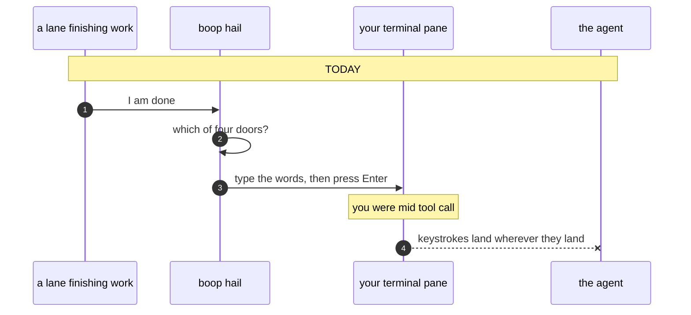
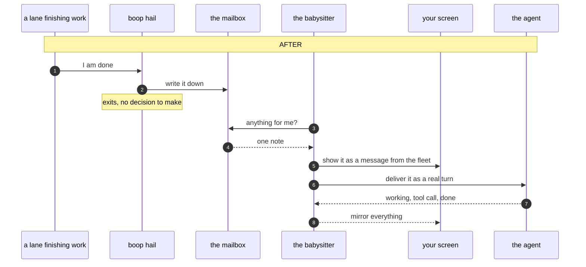
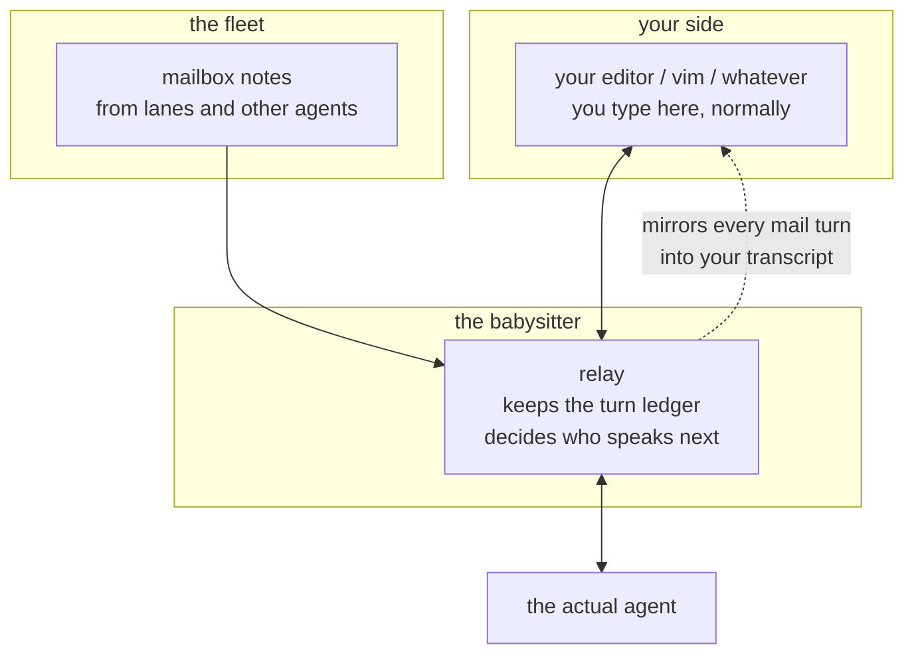
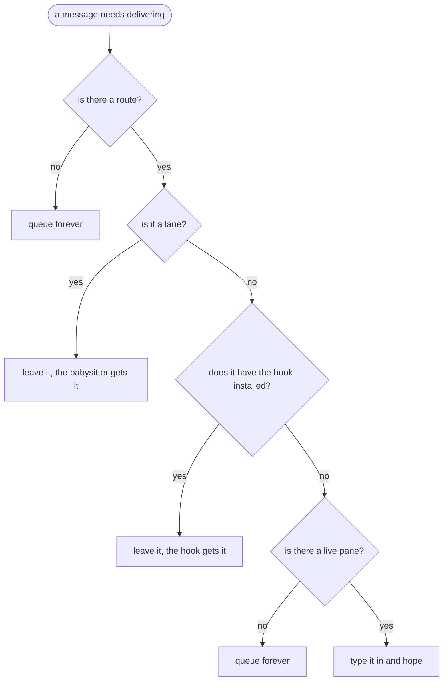
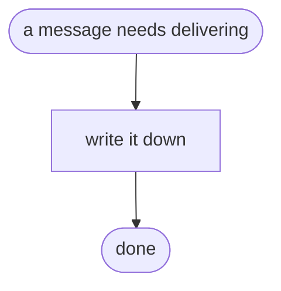
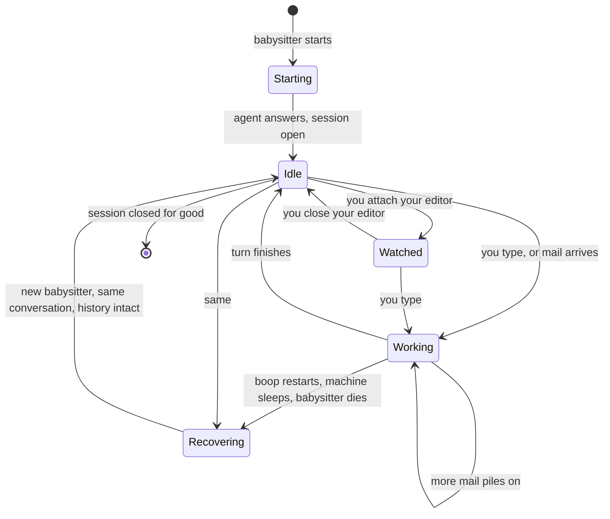

# One send path, in plain words

## Contents

1. [The one-sentence version](#the-one-sentence-version)
2. [Four doors today](#four-doors-today)
3. [The thing nobody wrote down](#the-thing-nobody-wrote-down)
4. [A message's path, today and after](#a-messages-path-today-and-after)
5. [You and boop, both typing at one agent](#you-and-boop-both-typing-at-one-agent)
6. [The delivery decision, before and after](#the-delivery-decision-before-and-after)
7. [A session's whole life](#a-sessions-whole-life)
8. [What we measured, and what surprised us](#what-we-measured-and-what-surprised-us)
9. [What gets deleted](#what-gets-deleted)
10. [What I need from you](#what-i-need-from-you)

---

## The one-sentence version

Give every agent session a small permanent babysitter process, let mail be a note the
babysitter reads, and the four ways a message can reach an agent collapse into one.

---

## Four doors today

| # | door | who goes through it |
|---|---|---|
| 1 | a real protocol message | lanes boop started itself |
| 2 | fake keystrokes typed into a terminal | everyone else |
| 3 | a note the agent picks up when it finishes a turn | Claude coordinators |
| 4 | nothing at all | a few kinds of session |

Door 1 is the good one. It exists. It reaches almost nobody.

---

## The thing nobody wrote down

`boop hail` is a command. It runs for a few milliseconds and exits.

Talking to an agent over the protocol means owning a live conversation with it. A command
that exits cannot own a live conversation. So the reason mail cannot go over the protocol is
not really about the protocol at all. It is that nobody is home.

Except for lanes. A lane already has somebody home: the babysitter process sitting in its
pane, holding the conversation, checking the mailbox every second. Mail to a lane already
works the good way.

The whole design is: **give that same babysitter to everything else.** Not a new door. The
door that already works, handed to every session.

---

## A message's path, today and after

Two things changed. The sender stopped choosing a door. You started seeing the mail arrive.

---

## You and boop, both typing at one agent

This is the hard one, and it is the reason the pane injection ever existed.

An agent listens to exactly one thing. If boop owns that ear, your keyboard does not.

The trick is that boop stops being the only listener and starts being a relay. Your editor,
your vim plugin, whatever you like, thinks it is talking to an agent. It is talking to boop.
boop is talking to the agent. Now two mouths, one ear, one referee in between.

You give up nothing. You keep your own editor. You see the fleet's messages appear in your
own scrollback as if somebody typed them, because that is exactly what happened.

One bonus falls out. Right now, when a lane's agent asks "may I run this command", boop says
yes on your behalf, always, because there is nobody to ask. With you attached, there is
somebody to ask.

### The three ways we could have done this

| way | what it costs | verdict |
|---|---|---|
| boop relays, you keep your editor | one small permanent process per session | the one worth building |
| boop ships its own chat screen | we write and maintain a terminal chat UI, and you are stuck in it | writing a UI is writing infrastructure, and we buy infrastructure |
| boop drives your editor through the editor's own back door | a different integration per editor, none of them standard | brittle, and it never ends |

The nearest thing anyone else has built for the shape "many typists, one long-lived server"
is a tool that shares one rust-analyzer between several editors. It works. It also openly
drops the messages that flow backward from the server, and in our case those are the
"may I?" questions that freeze a turn until answered. We take its idea and design out its
bug.

---

## The delivery decision, before and after

Today. Five forks, four of which mean the message sits there.

After. The sender has no decision to make, because every recipient has somebody home.

---

## A session's whole life

The line that matters is `Recovering --> Idle`. The conversation has an id. The agent
remembers it. A new babysitter says "load conversation X" and everything is back, including
the transcript. We checked: all four agents on your machine offer this.

Attaching and detaching your editor is not a lifecycle event at all. The session does not
notice.

---

## What we measured, and what surprised us

We wrote a throwaway probe and talked to all four agents directly. Two findings changed the
design.

**One.** The code says a second message cannot be sent while the agent is busy, and calls it
a protocol rule. The agents disagree. We sent a second message four seconds into a twenty
second job:

| agent | what actually happened |
|---|---|
| Claude | took it, queued it, answered both |
| Codex | took it, answered it |
| opencode | took it, answered both, in a way we could not fully explain in one run |
| Kimi | refused, politely, with a machine-readable reason |

Claude even announces this up front when it connects. We never read that announcement.

So, plainly: the code holds mail back for a reason that holds for one agent in four. It
should ask each agent instead of assuming.

**Two.** Genuinely interrupting a turn in progress, so the words reach the model before the
current job ends, is not something any of these agents offer. The protocol has a proper
escape hatch for adding it, and your own cate work already has exactly this feature under a
different protocol. So it is unfinished work. Nothing in the protocol blocks it, and there is
nothing to do about it today.

The four measurements are not all clean. Codex and opencode each have one loose end we could
not close in one run, and the write-up says so.

---

## What gets deleted

| gone | why |
|---|---|
| typing into panes, in every form | nothing on a mail path presses a key any more |
| the hook that drains a coordinator's mailbox at the end of a turn | the babysitter is the turn boundary now |
| the "no pane, so nowhere to put this" arm | there is always somewhere |
| the "it is a lane, skip it" arm | every session is that case now |
| the old terminal-driving channel we already stopped using | the door it was kept open for is closed |
| the whole delivery decision | writing it down is the delivery |

Four ways in becomes one. Nothing new is added on the side.

The terminal multiplexer stays. It stops being how mail gets delivered and goes back to being
how you get a window to look at.

---

## What I need from you

| # | question | why it blocks things |
|---|---|---|
| 1 | When you start a coordinator by hand, does boop get to own it? | if no, that one case keeps the old hook door and "one path" is not literally true. There is a middle: you still type the command, boop is just inside it |
| 2 | Relay, or boop's own chat screen? | I think relay. Say if you disagree |
| 3 | Mail while the agent is busy: send it and let the agent queue, or hold it until the turn ends? | all three answers are coherent. The current code picks "hold" for a reason that turned out to be wrong for three of four agents |
| 4 | Interrupting for real means throwing away the work in flight. Do you ever want that, as its own explicit command? | it should never be the default |
| 5 | When you are watching, do you answer the "may I run this?" questions, or does boop keep saying yes? | today boop always says yes because nobody is there |
| 6 | Claude workers running as your own subagents stay unreachable by mail. They can talk out; nothing can talk in. Accept that? | they have no address of any kind. Changing it means making them lanes instead |
