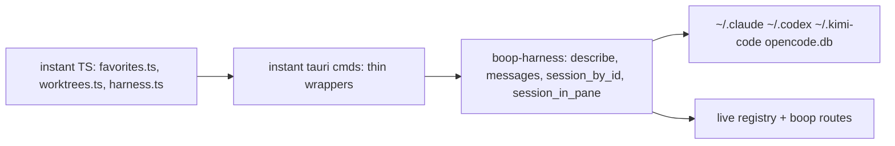

# Harness logic out of instant, into boop-harness

## TOC
1. Seam today
2. Target types (signatures first)
3. Lanes and ownership
4. Validation
5. Out of scope

## 1. Seam today

| instant file | lines | what it holds | boop home after |
| --- | --- | --- | --- |
| src-tauri/src/0_harness_store.rs | 490 | per-harness session shaping (tokens, model, provider, title, parent), `refs`, `session_ids`, `resume_id`, `claude_session_path`, `boop_mux_session` pane->session with interactive-parent repair and route fallback | boop-harness `Harness::describe`, `Harness::session_by_id`, `Harness::resume_id`, `Registry::sessions_in_cwd`, `live::session_in_pane` |
| src-tauri/src/ledger.rs | 1251 | `read_claude/read_codex/read_kimi/read_opencode` -> `AiMessage` (full text, preview, locator, subtype, injected tag, diagram fence), `iso_to_ms`, tauri cmds | boop-harness `Harness::messages`, `transcript::Message` |
| src-tauri/src/0_harness_store_tests.rs | 327 | 8 tests | boop-harness tests, same names |
| src-tauri/src/harness.rs | 45 | `harness_sessions`, `harness_session` cmds | stays, calls `Registry::session_ids_for_cwd` |
| src-tauri/src/favorites.rs | 155 | instant-local favorites sqlite over `AiMessage` | stays, imports `boop_harness::transcript::Message` |

boop-store `agent_turn.said` is capped at 512 bytes (ident.rs:489), so the store cannot replace `messages`; the reader moves as a transcript parser.
`crates/boop/src/chat.rs` (287 lines, claude-only, `#![allow(dead_code)]`, no callers) is superseded by `Harness::messages`; delete it in lane A.



## 2. Target types

```rust
// crates/boop-harness/src/transcript.rs
#[derive(Clone, Debug, Serialize)]
#[serde(rename_all = "camelCase")]
pub struct SessionMeta {            // == instant HarnessSession, field for field
    pub id: String,
    pub harness: HarnessId,
    pub cwd: String,
    pub source_path: Option<String>,
    pub title: Option<String>,
    pub model: Option<String>,
    pub provider: Option<String>,
    pub input_tokens: Option<u64>,
    pub parent_id: Option<String>,
    pub parent_kind: Option<&'static str>,
    pub created_at_ms: u64,
    pub last_activity_ms: u64,
}

#[derive(Clone, Debug, Serialize, Deserialize)]
pub struct Message {                // == instant AiMessage, wire JSON byte-identical
    #[serde(rename = "editor")] pub harness: HarnessId,   // serializes "claude"|"codex"|"kimi"|"opencode"
    pub session_id: String,
    pub id: String,
    pub seq: u64,
    pub role: String,
    #[serde(default, skip_serializing_if = "Option::is_none")] pub subtype: Option<String>,
    pub ts: u64,
    pub preview: String,
    pub text: String,
    pub locator: String,
}

pub fn iso_to_ms(s: &str) -> u64;   // moved from ledger.rs:546 with chrono_lite

// crates/boop-harness/src/harness.rs, trait Harness (line 253), new methods
fn describe(&self, session: &SessionRef) -> Option<SessionMeta>;
//   claude_shape / codex_shape / kimi_shape / opencode_shape, verbatim per adapter file
fn messages(&self, session: &SessionRef, after_seq: Option<u64>) -> Vec<Message>;
//   read_claude / read_codex / read_kimi / read_opencode, verbatim per adapter file
fn resume_id<'a>(&self, session: &'a SessionRef) -> &'a str { &session.session_id }
//   claude overrides: &session.nickname
fn lists_session(&self, _session: &SessionRef) -> bool { true }
//   kimi overrides: session.parent.is_none() (one wire.jsonl per agent; only main is a row)
fn session_by_id(&self, session_id: &str, cwd: Option<&str>) -> Option<SessionRef>;
//   claude: claude_session_path (direct or */subagents/<id>.jsonl) under cwd's project dir
//   codex: codex_session_path; kimi: kimi_session_path; opencode: db row by id

// crates/boop-harness/src/registry.rs
impl Registry {
    pub fn sessions_in_cwd(&self, id: HarnessId, cwd: Option<&str>) -> Vec<SessionRef>;
    //   was instant `refs`: cwd filter, then `harness.lists_session(&s)`
    pub fn describe_all(&self, id: HarnessId, cwd: Option<&str>) -> Vec<SessionMeta>;
    //   was instant `sessions`: describe each, sort last_activity desc then id asc
    pub fn session_ids_for_cwd(&self, id: HarnessId, cwd: &str) -> Vec<String>;
    //   was instant `session_ids`: modified_ms desc then id asc, resume_id
    pub fn messages_by_id(&self, id: HarnessId, session_id: &str, cwd: &str, after_seq: Option<u64>) -> Vec<Message>;
    //   was instant `messages`: session_by_id then messages
}

// crates/boop-harness/src/live.rs
pub fn session_in_pane(registry: &Registry, pane: &str, mail_dir: &Path) -> anyhow::Result<Option<String>>;
//   was instant boop_mux_session body: every harness live_session_in_pane,
//   then interactive_session_id (Child -> parent_session -> closest preceding Root in cwd),
//   then route fallback (bus::read_routes, route.tmux == pane) -> resolve_registered_session
```

State holders: none new. `Registry` is built per call as today (`Registry::discover()`).
Storage: no schema change. Reads: transcript files, opencode.db read-only, routes dir. Writes: none.

Principal-trait law (user, 2026-09-05): harness-specific bodies live in their adapter file under `impl Harness`. `transcript.rs`, `registry.rs`, `live.rs` carry no `HarnessId::` match and no per-harness branch.

## 3. Lanes and ownership

| lane | repo | owns | preset | after |
| --- | --- | --- | --- | --- |
| A `refactor/harness-transcript` | hafley-rs | crates/boop-harness/src/**, crates/boop-harness/Cargo.toml, crates/boop/src/chat.rs (delete), crates/boop/src/lib.rs (drop `pub mod chat`) | flash4 | coordinator design review, merge to main, `cargo install --path crates/boop --force` |
| B `refactor/harness-out` | instant (dev worktree base) | src-tauri/src/0_harness_store.rs, ledger.rs, 0_harness_store_tests.rs, harness.rs, favorites.rs, lib.rs | flash4 | vitest 474 + cargo test; merge dev -> main |

B starts only after A is on hafley-rs main: instant's Cargo path dep points at `../../hafley-rs/crates/boop-harness`.

## 4. Validation

- A: `cargo test -p boop-harness` (8 ported tests + any `#[test]` from ledger.rs), `cargo build -p boop`, `cargo clippy -p boop-harness -- -D warnings`.
- A wire test: serialize one `Message` and one `SessionMeta`, compare JSON keys to the instant golden list (`editor, session_id, id, seq, role, ts, preview, text, locator` and camelCase `sourcePath, inputTokens, parentId, parentKind, createdAtMs, lastActivityMs`).
- B: `cd src-tauri && cargo test` (90 today), `pnpm vitest run` (474 today), `node scripts/generate-native.mjs` shows no command-name change.

## 5. Out of scope

- `locate_turns` and xterm marks (separate plan, tmux capture-pane -J path).
- Replacing `AiMessage` consumers in TS with store turns.
- `boop chat.rs` replacement CLI verb (`boop db chat` keeps its current reader until B lands).
