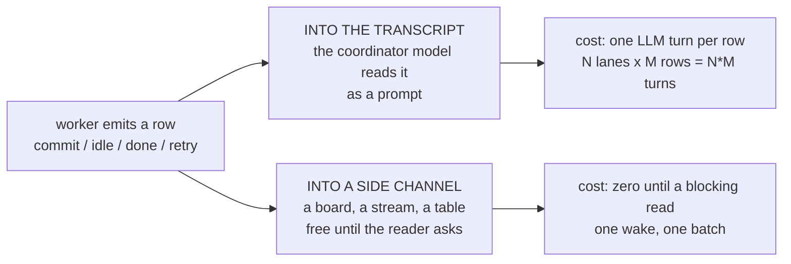
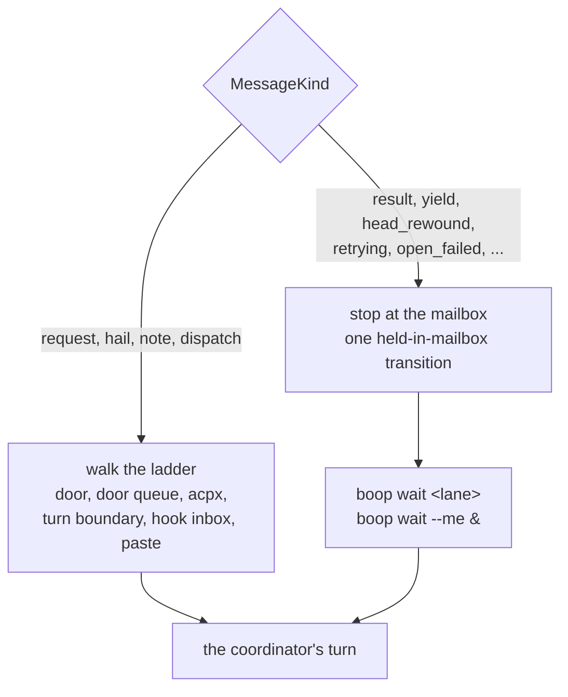

# Quiet door: prior art before the bespoke fix

Research pass required before `issues/supervisor-rows-off-the-door` is fixed.
Question: **a coordinator agent supervises N worker agents; workers emit
progress rows (commit, idle, done, retry); how do existing systems get those
rows to the coordinator without spending a chat turn per row, and what do they
let the coordinator block on.**

## Contents

1. [The two answers every system gives](#1-the-two-answers-every-system-gives)
2. [Candidates: Claude Code native and the Agent SDK](#2-candidates-claude-code-native-and-the-agent-sdk)
3. [Candidates: harness and protocol transports](#3-candidates-harness-and-protocol-transports)
4. [Candidates: multi-agent orchestrators, the vibe tier](#4-candidates-multi-agent-orchestrators-the-vibe-tier)
5. [Candidates: agent protocols and frameworks](#5-candidates-agent-protocols-and-frameworks)
6. [Candidates: plain infrastructure shapes](#6-candidates-plain-infrastructure-shapes)
7. [What boop's mailbox already is](#7-what-boops-mailbox-already-is)
8. [What the door rung change borrows, and from whom](#8-what-the-door-rung-change-borrows-and-from-whom)
9. [Recommendation and the trade-off](#9-recommendation-and-the-trade-off)
10. [What this rules out for later](#10-what-this-rules-out-for-later)

---

## 1. The two answers every system gives

Every candidate lands on one side of one line.

Counted across the 27 candidates below: **3 put worker rows into a coordinator
model's context by default. 24 do not.** The three that do are Claude Code's own
Agent tool, Claude Code `SendMessage`, and claude-flow's Task-tool half. Even
claude-flow keeps a parallel SQLite blackboard, because the transcript path does
not survive context compaction
([claude-flow](https://github.com/ruvnet/claude-flow)).

boop today is on the wrong side of that line for supervisor rows, and on the
right side for everything else.

---

## 2. Candidates: Claude Code native and the Agent SDK

| candidate | how a worker row reaches the coordinator | costs a coordinator turn? | blocking read primitive | adoption cost into boop | verdict |
|---|---|---|---|---|---|
| Agent tool subagent completion ([sub-agents](https://code.claude.com/docs/en/sub-agents)) | Only the subagent's final message returns, as the `Agent` tool_result. A background run lands as "a completion notification in a later turn" | **Yes.** And there is no per-row path at all: a whole lane lifetime collapses to one blob | Foreground `run_in_background: false` blocks the entire main conversation; no partial read | n/a, it is the thing boop replaces | **reject** as a row transport: no commit/idle/retry granularity, and the one blob it does give costs a turn |
| `SendMessage` + `notify_when_idle` ([cross-session-messaging](https://code.claude.com/docs/en/cross-session-messaging)) | Sender writes newline JSON to the target's per-session unix socket (`CLAUDE_CODE_MESSAGING_SOCKET`); the receiver's harness delivers it between tool calls or opens a turn | **Yes.** "Once delivered, the message counts toward usage like a prompt you type." `notify_when_idle` subscribes free, but its notice is itself a message | None. One-shot push, 12h expiry, "neither session polls the other" | Low. The socket, the auth line, the `accept`/`hold`/`refuse` inbound policy and the burst caps (50 queued, 100 held) map onto a mailbox table | **borrow the shape** (inbox policy, dedup and burst caps), **reject** as the bus: every row is a paid prompt. This is the exact defect boop has |
| Hooks: `Notification`, `Stop`, `SubagentStop` ([hooks](https://code.claude.com/docs/en/hooks)) | The harness spawns your process on the event; your process writes where it likes. "For most events, Claude Code writes stdout to the debug log and doesn't show it in the transcript" | **No**, when the hook only writes to your store | None for the coordinator. Exit 2 on `Stop`/`SubagentStop` blocks the **worker's** stop, not the parent's read | Very low. boop already installs Stop and UserPromptSubmit hooks (`boop inbox hooks`) | **adopt**, already adopted: this is boop's existing hook-inbox rung |
| `hookSpecificOutput.additionalContext` ([hooks](https://code.claude.com/docs/en/hooks)) | Injects text into the coordinator's context, honored on `PostToolUse`, `PostToolUseFailure`, `Stop`, `SubagentStop` and ignored elsewhere | **Partial, and it free-rides.** It lands at a turn boundary the model already reached, so N rows cost 0 extra turns | None; it is a push into context, not a read | Very low; boop's `inbox drain --hook prompt` already prints mail as context | **adopt** for the case where the coordinator's turn is ending anyway. It is the only Claude-native way to hand over N rows for zero extra prompts |
| `--append-system-prompt` ([cli-reference](https://code.claude.com/docs/en/cli-reference)) | Static text at launch. Carries no runtime data | **No**, and no data either | None | Trivial | **borrow the shape** only as the place to state the wait contract. Not a transport |
| Agent SDK subagents / `AgentDefinition` ([agent-sdk/subagents](https://code.claude.com/docs/en/agent-sdk/subagents)) | To the parent **model**: a final-message tool result. To the host **program**: every subagent message streams through `query()` tagged `parent_tool_use_id` | **No for the program, yes for the model.** The two audiences are served by two different channels | `async for message in query(...)`; the iterator is the block | Medium. Nothing to import, but it proves the split | **borrow the shape.** The two-tier split (host reads rows, model reads a summary) is precisely the design boop needs |

---

## 3. Candidates: harness and protocol transports

| candidate | how a worker row reaches the coordinator | costs a coordinator turn? | blocking read primitive | adoption cost into boop | verdict |
|---|---|---|---|---|---|
| Codex app-server ([README](https://github.com/openai/codex/blob/main/codex-rs/app-server/README.md), [docs](https://developers.openai.com/codex/app-server)) | Newline-delimited JSON-RPC over stdio pushes `thread/started`, `turn/started`, `item/started`, `item/completed`, `turn/completed`, `thread/status/changed` (idle / active / systemError / notLoaded) | **No.** Notifications go to the client process, never into a model's context | Read the notification stream; `thread/status/changed` to idle is the done edge; `thread/unsubscribe` drops a connection | Medium-low. boop already speaks app-server for codex lanes | **borrow the shape**: the `item/started` to `item/completed` pairing plus `status/changed(idle)` is a better row taxonomy than boop's flat `yield` |
| opencode `prompt_async` + SSE `/event` ([server](https://opencode.ai/docs/server/), [sdk](https://opencode.ai/docs/sdk/)) | `POST /session/:id/prompt_async` returns 204 immediately; `GET /event` is one long-lived SSE bus (`session.status`, `session.idle`, deltas) | **No.** SSE lands in the client process | The SSE read itself; `POST /session/:id/message` is the synchronous variant | Low. It is literally "fire the worker, block on the bus", which is `beep` plus `wait` | **adopt the pattern** (async fire, one long-lived read), **reject the dependency**: SQLite plus a `wait` verb already covers it |
| ACP `session/update` ([prompt-turn](https://agentclientprotocol.com/protocol/prompt-turn), [overview](https://agentclientprotocol.com/protocol/overview)) | A JSON-RPC **notification**, no `id`, no response, carrying `agent_message_chunk`, `tool_call`, `tool_call_update`, `plan`, `usage_update` | **No.** Consumed by the client program | The client blocks on the `session/prompt` **response**, which returns a `StopReason`; updates flow freely meanwhile | Medium. boop already has an ACP channel | **borrow the shape.** "One-way notification for progress, request/response only where you must block" is the cleanest one-line statement of the fix |
| ACP `session/request_permission` | Agent asks the client, client answers with a chosen option | n/a, it is a genuine block by design | The request/response pair | Medium | **borrow the shape** for the kinds that genuinely need an answer (`request`), which is exactly the set boop keeps on the door |
| Kimi ACP (`kimi acp`) ([kimi-acp](https://moonshotai.github.io/kimi-cli/en/reference/kimi-acp.html)) | Same ACP wire shape. Transport and the supported notification list beyond the standard set are **unverified** in Moonshot's docs | **No** (inherits ACP) | ACP's `session/prompt` response | Low incremental if you already speak ACP | **reject as a distinct mechanism.** It is ACP with a different binary; adopt ACP, not Kimi |

---

## 4. Candidates: multi-agent orchestrators, the vibe tier

| candidate | how a worker's finish reaches the coordinator or human | chat text, or board / notification / side channel? | blocking read primitive | adoption cost into boop | verdict |
|---|---|---|---|---|---|
| claude-squad ([repo](https://github.com/smtg-ai/claude-squad)) | A TUI tick loop captures each tmux pane; `HasUpdated()` diffs pane content; `Status` is set at lifecycle points | **Board only** (a TUI column). No notification, no injection | None. The human attaches to the pane; a git commit is the sync point | Low value; boop would be rebuilding a pane-diff poller it does not need | **reject.** Status is set by lifecycle, not reported by the worker, so there is no event model to copy |
| vibe-kanban ([repo](https://github.com/BloopAI/vibe-kanban), [docs](https://www.vibekanban.com/docs)) | Child exit code, diff and token counts land as a SQLite row; an `EventService` hangs off SQLite update hooks and pushes to the browser over WebSocket; the task moves todo to inprogress to inreview to done | **Board plus a push side channel.** Never chat text in an agent's transcript | Host side: tokio child wait. Client side: a WebSocket subscription | **Very low. Same stack**: Rust, axum, sqlx, SQLite | **adopt the shape.** boop's closest architectural twin, and it independently arrived at "worker writes a row, reader subscribes" |
| ccmanager ([repo](https://github.com/kbwo/ccmanager)) | Per-agent PTY state classified busy / waiting / idle; status-change hooks run a shell command on transition (desktop notify) | **Board plus a user-configured OS notification.** No injection | None; the TUI polls the PTY, hooks are fire and forget | Low: an `on_status_change` shell hook keyed by lane | **borrow the shape.** The cheapest way to ping a human without the coordinator spending a turn |
| conductor.build ([docs](https://www.conductor.build/docs/concepts/workflow)) | Workspace list with status badges; a system notification when an agent needs input, not on every step | **Board plus OS notification.** The human is the only coordinator | None. Human attention is the join | Nothing to port; closed Mac GUI, no CLI or webhook surface | **reject.** No programmable surface, and it declines to have a coordinator agent at all |
| oh-my-claudecode ([repo](https://github.com/yeachan-heo/oh-my-claudecode)) | Exists. tmux workers write markdown artifacts to `.omc/artifacts/ask/`; native `/team` subagents return text into the lead session; HUD statusline plus Discord/Telegram/Slack webhooks | **Both**, deliberately split by worker type | `omc wait` is a rate-limit auto-resume daemon, not a worker join | Medium; its file artifacts are weaker than boop's rows | **borrow the shape** of the split only (cheap row for machines, webhook for the human) |
| claude-flow ([repo](https://github.com/ruvnet/claude-flow)) | Dual: Task-tool results return into the queen's transcript, **and** agents write a SQLite blackboard at `.swarm/memory.db` (`shared_state`, `events`, `consensus_state`, TTL 1800s) | **Both.** Transcript for the immediate return, SQLite for durable state | Task-tool synchronous return, or polling `consensus_state` for quorum | Low mechanically, high in tokens | **borrow the blackboard half.** The `events` plus `shared_state` schema is a good target; copying the transcript half reintroduces boop's exact defect |
| agent-deck ([TUI](https://github.com/asheshgoplani/agent-deck), [web](https://github.com/claude-world/agent-deck)) | Two unrelated projects. TUI: polling classifies Running/Waiting/Idle/Error; a Conductor session watches panes and escalates over Telegram/Slack using a `NEED:` prefix. Web: `deck:agent:status` / `deck:agent:output` WebSocket events over SQLite history | **Board plus remote escalation to a human**; the TUI conductor reads polled pane text, never a delivered message | TUI: none, it polls. Web: DAG dependency edges gate a node's start | Medium. The `NEED:` prefix is a one-column change | **borrow the shape** of the escalation tier (needs a peer vs needs a human); reject the polling conductor |
| crystal ([repo](https://github.com/stravu/crystal)) | SQLite-backed `SessionManager` emits Electron IPC events; statuses initializing / running / waiting / stopped / error; desktop notification when input is needed | **Board plus OS notification** | None exposed | Deprecated Feb 2026 into [Nimbalyst](https://nimbalyst.com/), which added a session kanban board | **reject.** Dead, and its successor converged on the vibe-kanban board shape anyway |
| tmux session managers ([craftzdog/tmux-claude-session-manager](https://github.com/craftzdog/tmux-claude-session-manager)) | Reads `claude agents --json`: each Claude session self-reports busy / waiting / idle to a supervisor daemon. The picker sorts waiting and idle to the top; the terminal bell forwards to the launching window | **Side channel** (a JSON status feed) plus a bell. Zero chat text | None. Poll `claude agents --json`; the bell is the nudge | Very low. It is a shipped per-worker status feed boop can shell out to | **adopt.** boop can read real agent state instead of inferring from process liveness |
| Cursor background agents ([API](https://cursor.com/docs/cloud-agent/api/overview)) | REST: agents are ACTIVE / IDLE / ARCHIVED, runs are CREATING / RUNNING / FINISHED / ERROR / CANCELLED / EXPIRED. Poll the run, or subscribe to SSE at `/stream`. Webhooks are explicitly not on v1 | **Board plus a polled or streamed API.** Follow-ups are chat, but human to agent | The SSE stream, bounded by `X-Cursor-Stream-Retention-Seconds`; otherwise poll to a terminal status | Low: a schema change, not an architecture change | **borrow the shape.** Split lane-lifetime status from per-run terminal state. Note that even Cursor ships bounded replay rather than webhooks |
| Devin / Jules ([Devin Slack](https://docs.devin.ai/integrations/slack), [Jules sessions](https://jules.google/docs/api/reference/sessions/)) | Devin: replies in a Slack thread with a working/blocked/done chip and emoji reactions. Jules: session states QUEUED, PLANNING, AWAITING_PLAN_APPROVAL, AWAITING_USER_FEEDBACK, IN_PROGRESS, PAUSED, COMPLETED, FAILED, polled via `GetSession` | Devin: chat text, but into a **human's** Slack thread. Jules: **pure polled board state** | Devin: poll the session. Jules: poll `GetSession` to COMPLETED or FAILED | Low; the state enum is the takeaway | **borrow the state enum.** A single `waiting` cannot route: blocked on a human and blocked on a peer need different words |

---

## 5. Candidates: agent protocols and frameworks

| candidate | how a worker row reaches the coordinator | forces immediate processing? | blocking read primitive | adoption cost into boop | verdict |
|---|---|---|---|---|---|
| A2A ([spec](https://a2a-protocol.org/latest/specification/), [streaming](https://a2a-protocol.org/latest/topics/streaming-and-async/)) | Two transports for one row: SSE `TaskStatusUpdateEvent` / `TaskArtifactUpdateEvent` on `message/stream`, or an HTTPS webhook set by `tasks/pushNotificationConfig/set` | **No.** The webhook is a doorbell; the spec then has the client call `tasks/get` for the real state | None native. Hold the SSE connection (`tasks/resubscribe` to reattach), or poll `tasks/get` | High: an HTTP server, SSE framing, webhook token validation. The task state enum is free | **borrow the shape.** The doorbell / `tasks/get` split (the notice carries no payload, the reader re-reads the row) is exactly what a SQLite mailbox wants |
| MCP notifications and `resources/subscribe` ([resources](https://modelcontextprotocol.io/specification/2025-06-18/server/resources)) | `resources/subscribe` on a URI, then `notifications/resources/updated` carrying `params.uri` only | **No**, and the receiver MUST NOT respond. But there is no ack and no cursor, so a dropped notification is gone | None defined; the client's transport read loop | High: a live session per worker, capability negotiation | **borrow the shape.** URI-only doorbell plus `resources/read` is the same re-read contract, minus any redelivery. The missing redelivery is the warning |
| LangGraph supervisor ([repo](https://github.com/langchain-ai/langgraph-supervisor-py)) | A handoff tool returns `Command(goto=..., graph=Command.PARENT)`; worker messages merge into supervisor state per `output_mode` (`full_history` or `last_message`) | **Yes.** One in-process graph; the supervisor node runs the instant control returns | None. A function return and a graph edge | n/a as a transport | **reject** for delivery, **borrow** `output_mode` as a mailbox read filter (whole trail vs last row) |
| AutoGen Swarm / SelectorGroupChat ([teams](https://microsoft.github.io/autogen/stable//reference/python/autogen_agentchat.teams.html)) | Agents broadcast onto a shared team message stream; `HandoffMessage` names the next speaker | **Yes.** Termination is evaluated after each response in the same async loop | `async for` over `run_stream()` | n/a, in-process Python | **reject.** Broadcast-to-all with no cursor scales into the coordinator's context, not out of it |
| CrewAI hierarchical ([docs](https://docs.crewai.com/en/learn/hierarchical-process)) | The manager calls a `Delegate work to coworker` tool; the worker's output is that call's return value | **Yes**, hard synchronous. The manager is parked inside the tool call for the worker's whole run | None. A tool return | n/a | **reject.** There is no row to defer, only a function return |
| OpenAI Agents SDK handoffs ([handoffs](https://openai.github.io/openai-agents-python/handoffs/), [streaming](https://openai.github.io/openai-agents-python/streaming/)) | `handoff()` exposes `transfer_to_<agent>`; the original agent does not regain control. Progress is `RawResponsesStreamEvent` / `RunItemStreamEvent` | **Yes.** Events are consumed by iterating the stream to the end | The async iterator | n/a | **reject.** One-way transfer, no ack, no replay; a coordinator that must survive a worker restart gets nothing |

---

## 6. Candidates: plain infrastructure shapes

Evaluated as shapes only. boop already has the SQLite mailbox; the question is
which shape `boop wait` should imitate.

| candidate | how a worker row reaches the coordinator | forces immediate processing? | blocking read primitive | ack / cursor semantics, cross-process? | verdict |
|---|---|---|---|---|---|
| GitHub notifications inbox ([REST](https://docs.github.com/en/rest/activity/notifications)) | The row lands in a server-side thread list; the reader calls `GET /notifications`, unread by default, with `all`, `since`, `before` | **No.** Rows sit unread indefinitely | **None.** Short poll only, with `Last-Modified` to `304` and a server-supplied `X-Poll-Interval` | Reader marks read per thread (`PATCH .../threads/{id}`) or by watermark (`PUT /notifications` with `last_read_at`). The producer is never told. Server-side, so cross-process | **adopt.** boop's mailbox already is this table. Two refinements worth stealing: a server-supplied poll interval, and a watermark ack beside the per-row ack |
| tmux `wait-for` (`cmd-wait-for.c`) | It carries no row at all. `wait-for chan` blocks until `wait-for -S chan`. Source confirms `-S` with no waiter latches `wc->woken = 1`, so one pending signal survives | **No**, because nothing is delivered | `wait-for chan`, a true block in the tmux client through the server socket. It does not break on SIGINT ([tmux#832](https://github.com/tmux/tmux/issues/832)) | None. No payload, no cursor, one latched bit. Cross-process through the tmux server | **borrow the shape** as a wakeup edge only: worker writes the row, then signals. Payload stays in SQL |
| inotify / kqueue / FSEvents ([inotify(7)](https://man7.org/linux/man-pages/man7/inotify.7.html), [FSEvents](https://developer.apple.com/library/archive/documentation/Darwin/Conceptual/FSEvents_ProgGuide/UsingtheFSEventsFramework/UsingtheFSEventsFramework.html)) | The kernel says "this path changed". No payload and no identity: inotify gives "no information about the user or process that triggered the event" | **No** | Real and cross-process: blocking `read()` on the inotify fd, `kevent()`, or `CFRunLoopRun`. macOS has no inotify | None. Identical consecutive events coalesce if unread; overflow drops events with one `IN_Q_OVERFLOW`; FSEvents can return `MustScanSubDirs` | **borrow the shape**: event as wakeup, SQL as truth. Coalescing and overflow mean you can never count rows from events |
| `sqlite3_update_hook` ([sqlite.org](https://www.sqlite.org/c3ref/update_hook.html)) | It does not cross processes. The callback fires only for the connection that registered it, inside the writer's transaction, on the writer's thread | **Yes**, and in the wrong place | None. A C callback, not a wait | None. And the coordinator is not the writer | **reject the hook.** **Adopt its substitute:** `PRAGMA data_version`, which changes exactly when another connection commits and ignores your own writes. One integer compare skips a full mailbox scan per poll tick |
| NATS JetStream ([consumers](https://docs.nats.io/nats-concepts/jetstream/consumers)) | The worker publishes; the **consumer is a server-side cursor** over the stream, advancing as messages are acked | **No.** Rows persist independent of any reader | Yes: pull `fetch`, bounded by `batch` and `expires`, a server-side long poll | Explicit client ack advances the cursor; unacked messages are redelivered after a timeout. The publisher learns nothing | **borrow the shape.** Durable cursor plus explicit ack plus redelivery-after-idle maps to three mailbox columns, and `expires` is the right model for a bounded `wait` |
| ZeroMQ ([zmq_socket](https://libzmq.readthedocs.io/en/latest/zmq_socket.html)) | In-memory socket queues; `PUSH` round-robins, `PULL` fair-queues | **No**, but there is no durability either | `zmq_recv()` blocks by default; `zmq_poll` multiplexes | **None.** No persistence, no cursor, no retry, no confirmation | **reject.** A mailbox that already survives a coordinator restart would be trading down |
| Redis Streams ([docs](https://redis.io/docs/latest/develop/data-types/streams/)) | Worker `XADD`s; the coordinator reads `XREADGROUP GROUP g c STREAMS key >` | **No** | Yes: `BLOCK <ms>` on `XREAD`/`XREADGROUP`, `BLOCK 0` forever, nil on timeout | Reading with `>` marks the entry **delivered** into that consumer's Pending Entries List; `XACK` removes it; re-reading with id `0` returns your own delivered-but-unacked rows; `XAUTOCLAIM min-idle-time` steals from a dead consumer | **borrow the shape.** Closest match to boop. The delivered-vs-acked two-phase PEL plus idle reclaim is exactly what `wait` needs so a crashed coordinator loses nothing |

---

## 7. What boop's mailbox already is

boop did not need to buy anything, because it already built the shape the field
converged on. Naming it precisely:

| boop piece | the prior-art shape it already implements |
|---|---|
| `agent_mail` rows with `to_timestamp` NULL | GitHub's unread notification inbox; Redis Streams entries before `XACK` |
| `agent_delivery_transition` outcome words | Redis Streams' two-phase delivered-then-acked PEL, spelled as a ledger instead of a set |
| `boop wait --me --wait-timeout 540` | Redis `XREADGROUP ... BLOCK <ms>`, and NATS' `fetch` bounded by `expires` |
| `boop wait <lane>` exiting with the lane's rc | Jules' poll-`GetSession`-to-COMPLETED, and Cursor's poll-to-terminal-status |
| `boop beep <route>` plus the ladder | opencode's `prompt_async`; A2A's `message/send` |
| the delivery ladder's rung ordering | nothing in the field. This is boop's own, and it is the good part |
| `mailwait::already_in_front_of_the_recipient` | Redis' "delivered but not acked" predicate |

Two gaps the research names that boop has not closed, both out of scope here and
filed in section 10: no `PRAGMA data_version` fast path on the poll tick, and no
idle-reclaim for a row a crashed reader took.

The one thing boop has that nobody else does is a **ladder that can put a row
into a live agent's context**. That is a real capability, worth keeping. The
defect is that the ladder applies it to rows that were never worth a turn.

---

## 8. What the door rung change borrows, and from whom

The fix in `issues/supervisor-rows-off-the-door` is 20 lines. Every one of them
is a borrowed shape, not an invention.

| borrowed from | what boop takes |
|---|---|
| **ACP** ([prompt-turn](https://agentclientprotocol.com/protocol/prompt-turn)) | The notification / request split. `session/update` is one-way and answerless; only `session/prompt` and `session/request_permission` block anyone. boop's `MessageKind` now carries the same distinction: supervisor kinds are notifications, `request` and `hail` are requests |
| **A2A** ([streaming](https://a2a-protocol.org/latest/topics/streaming-and-async/)) | The doorbell / re-read split. A2A's push notification deliberately carries no payload; the client calls `tasks/get`. boop's supervisor row is the payload sitting in the table, and `boop wait` is `tasks/get` |
| **GitHub notifications** | Unread-by-default with no push at all. A row waits; the reader asks; nothing is forced on anyone |
| **Codex app-server** | The `thread/status/changed(idle)` shape: an idle notice is a status transition on a side channel, never a message |
| **vibe-kanban** | The confirmation that a Rust plus SQLite plus worker-writes-a-row design is the destination, not a stopgap |
| **Claude Agent SDK** | The two-tier audience split: the host program reads every row, the model reads a summary. `boop wait` is the host program's read |

Nothing is bought. Nothing new is invented either. The change is **deleting a
push boop should never have made**, and the deletion is justified by 24 of 27
candidates doing it that way already.

---

## 9. Recommendation and the trade-off

**Recommendation: proceed with the fix as briefed. Do not adopt a library or a
protocol for this defect.**

The reasoning, stated as the build-vs-buy question demands:

1. There is no library to buy. The candidates that solve this are either a
   protocol boop already speaks (ACP), an architecture boop already has
   (vibe-kanban, GitHub inbox, Redis Streams semantics), or an in-process
   framework for a Python single-process graph (LangGraph, CrewAI, AutoGen,
   OpenAI Agents SDK) that does not survive a coordinator restart, which boop's
   requirements do.
2. Adopting NATS, Redis or ZeroMQ would mean adding a broker daemon to get
   semantics the SQLite mailbox already provides durably. That is trading down,
   not up.
3. The change is a **removal**. Three lines of guard in `land()`, a classifier on
   an enum that already exists, and one skip in the drain. There is no bespoke
   queue, scheduler, parser or retry loop being written.

**The trade-off, stated plainly:** a supervisor row no longer reaches a
coordinator that is not asking for it. A coordinator that runs lanes and never
arms `boop wait --me &` will learn nothing about them until it asks. Today the
coordinator is told whether it wants to be or not; after the fix it must keep one
backgrounded wait armed, or poll.

This is the correct trade for the stated defect, and it matches how every board
system in section 4 works: the human or coordinator looks at the board. It is
also the trade Chris asked for in the words that opened the issue. The mitigation
already exists in boop: `boop wait --me &` costs one background shell and wakes
the harness once for a whole batch, and law 9 plus the WAIT help section now say
so. The residual risk is a coordinator that forgets to arm one; section 10 files
the follow-up that would remove even that.

## 10. What this rules out for later

Filed here so a later session does not re-litigate:

| shape | why it is not this change |
|---|---|
| `PRAGMA data_version` on the poll tick | A performance fix for `wait`, not a delivery fix. One integer compare skips a mailbox scan per tick. Worth doing; unrelated to the door |
| Idle-reclaim (`XAUTOCLAIM min-idle-time`) for a row a crashed reader took | boop's ledger records `held-in-mailbox` and nothing reclaims. A real gap, and a separate issue |
| tmux `wait-for -S` or an fsevent on `boop.db-wal` as a wakeup edge | An optimization on top of the poll, never the source of truth: both coalesce and both drop. Only worth it if the 1s poll ever costs something |
| `additionalContext` on the coordinator's own `Stop` hook to auto-drain the mailbox | The one Claude-native way to hand a coordinator N rows for zero extra turns. It would remove the "remember to arm a wait" residual risk in section 9. boop already installs the hook; the drain would need to select supervisor rows and print them. **This is the strongest follow-up in the whole research pass** |
| A `NEED:`-style escalation tier (agent-deck), and Jules' split of AWAITING_PLAN_APPROVAL from AWAITING_USER_FEEDBACK | boop's `request` kind collapses "blocked on a peer" and "blocked on a human". Worth splitting later; it changes routing, not the door |
| Reading `claude agents --json` for real per-worker status | A shipped status feed boop could reconcile against instead of inferring liveness from the process tree. Separate issue |
