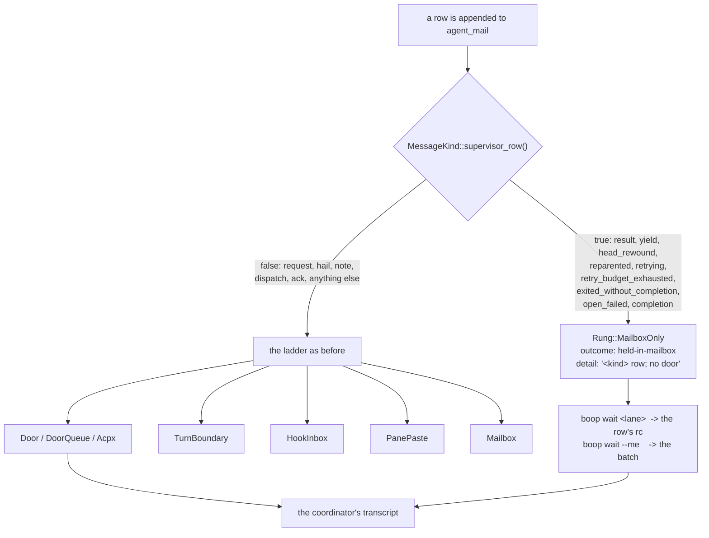

# Supervisor rows off the door

Branch `feature/supervisor-rows-off-the-door`, worktree
`/Users/chrishafley/projects/hafley-rs-worktrees/quiet-door`, off `main` at
`d21d094`.

## Contents

1. [In one sentence](#1-in-one-sentence)
2. [Commits](#2-commits)
3. [The design decision: supersede, not build on](#3-the-design-decision-supersede-not-build-on)
4. [What changed, file by file](#4-what-changed-file-by-file)
5. [Tests](#5-tests)
6. [Gate output](#6-gate-output)
7. [The two issues filed but not fixed](#7-the-two-issues-filed-but-not-fixed)
8. [Left undone](#8-left-undone)

---

## 1. In one sentence

A lane supervisor's own rows about its run (`yield`, `head_rewound`, `result`,
`open_failed`, the retry kinds) now stop at the mailbox for every parent kind
instead of taking the parent's door, so a coordinator no longer spends one
harness turn per progress note; `boop wait <lane>` and `boop wait --me` hand the
rows back unchanged, and a `boop beep` reply or a human hail still takes the door.



## 2. Commits

| sha | subject |
|---|---|
| `179a01b` | `issues:` supervisor rows take the door, dead panes block respawn, one-turn lanes outrun their hail |
| `2412821` | `plans:` buy-vs-build for the quiet door, 27 candidates |
| `1cc23cd` | `boop-proc:` a supervisor row waits in the mailbox and never takes a door |

The buy-vs-build doc at `plans/2026-09-05-quiet-door.BUY-VS-BUILD.md` was
required mid-task by the coordinator under the standing research-before-bespoke
law. Its verdict: no library to buy, proceed with the removal. The 27 candidates
split 24 to 3 in favor of keeping worker rows out of any coordinator model's
context, and the three exceptions are Claude Code's own Agent tool, Claude Code
`SendMessage`, and claude-flow's Task-tool half (which keeps a parallel SQLite
blackboard regardless).

## 3. The design decision: supersede, not build on

**Supersede `7948e82`.** Two reasons, in order of weight.

| finding | consequence |
|---|---|
| `7948e82`'s content is already on `main` as `1270666` ("supervise: quiet yields toward coordinator parents (#61)"). `git merge-base --is-ancestor 7948e82 main` says NOT MERGED, but the code at `supervise.rs:1543` is that commit's rule, rebased. The branch is a stale duplicate | there is nothing to merge; the question is whether to keep `1270666`'s rule or replace it |
| `1270666`'s rule did not work, and could not | it set a `deliver: bool` in `mail_to_parent_kind`, so the writer skipped the ladder. `drain_route_held_mail_budgeted` then found the same unstamped row on the next wrapper tick and pushed it at the door anyway. The quieting was one tick deep |

Three further defects in that rule, all of which the new one fixes:

| `1270666` | now |
|---|---|
| covered `yield` and `head_rewound` only; `result` and the retry kinds still took the door | all nine supervisor kinds |
| only when the parent route's `kind == "coordinator"` | every parent kind: `coordinator`, `native`, `lane`, `shell`, and a route the registry does not carry |
| matched kind names as strings, in `supervise.rs` | the switch is `MessageKind::supervisor_row()`, on the enum that landed in `0c126e7` |
| wrote **no** landing transition at all, so the row sat `appended` and unowned, which is the exact shape `head-rewound-door-retry` closed yesterday | writes one `held-in-mailbox` transition naming the kind and the verb that collects it |

The gate moved from the writer to the ladder. `land()` is the one function every
send path in boop walks, so a rule placed there cannot be routed around by the
drain, by `boop beep --kind result`, or by a future caller.

## 4. What changed, file by file

| file | change |
|---|---|
| `crates/boop-store/src/bus.rs` | `MessageKind::supervisor_row()`, with the doc table naming which verb reads each kind. Nine variants: `Result`, `Completion`, `Yield`, `Reparented`, `Retrying`, `RetryBudgetExhausted`, `ExitedWithoutCompletion`, `OpenFailed`, `HeadRewound` |
| `crates/boop-proc/src/deliver.rs` | new `Rung::MailboxOnly`, recording the existing `DeliveryState::HeldInMailbox` outcome so `held_messages` and `already_in_front_of_the_recipient` need no change; `carried_the_body()` is false, so the row is never stamped. New rung 0 at the top of `land()`. `drain_route_held_mail_budgeted` skips supervisor rows instead of re-walking the ladder per tick |
| `crates/boop-proc/src/supervise.rs` | the `deliver: bool` parameter and the coordinator-only string match are gone; `mail_parent` always walks the ladder and lets it decide |
| `crates/boop/src/cli/mail.rs` | the acpx branch bypasses `land()`, so it takes the same exemption explicitly |
| `crates/boop/src/cli/mod.rs` | LAW 9, and a line in the WAIT help: a wait is the only way a lane's progress reaches you |

The new outcome word question: the brief allowed a new one "if the existing ones
lie". `held-in-mailbox` does not lie, so the ledger vocabulary is unchanged; what
lied was `Rung::Mailbox`'s printed line, which says "the supervisor retries it".
`Rung::MailboxOnly` shares the outcome and prints its own line:

```
held m-0c983299 from feature-quiet-door -> sprefa-coordinator in the mailbox (result row; no door); sprefa-coordinator reads it with `boop wait`
```

## 5. Tests

| test | file | what it pins |
|---|---|---|
| `deliver_door::a_supervisor_row_never_takes_the_door_of_a_live_route` | `crates/boop/tests/deliver_door.rs` | FAIL-PRE-FIX. Four kinds against a live-door harness: rung is `MailboxOnly`, no door log written, ledger is exactly `appended` then `held-in-mailbox` |
| `deliver_door::a_reply_to_a_beep_still_takes_the_door_of_the_same_route` | same | the same route, same store, kind `request`: `Rung::Door`, body in the door log |
| `coordinator_ping::a_supervisor_result_row_to_the_same_coordinator_stops_at_the_mailbox` | `crates/boop/tests/coordinator_ping.rs` | end to end through the real binary against a real tmux pane: the landing line and the ledger, and that `held-for-turn-boundary` never appears |
| `lane_wait_exit::a_wait_reads_the_rc_off_a_result_row_the_ladder_held_in_the_mailbox` | `crates/boop/tests/lane_wait_exit.rs` | `boop wait <lane>` exits 9 off a row whose only landing is `held-in-mailbox`, and the row stays unstamped |
| `wait_mail::me_still_takes_the_yield_and_commit_rows_its_lanes_wrote` | `crates/boop/tests/wait_mail.rs` | `boop wait --me` prints the idle row, the commit row and the result row |
| `bus::tests::the_supervisor_kinds_are_the_ones_a_lane_run_mints_about_itself` | `crates/boop-store/src/bus.rs` | the classifier itself, both directions, including `Other("reply")` and `Other("retry")` keeping the door |
| `supervise::tests::an_idle_yield_reaches_the_trail_and_stops_at_the_mailbox` | `crates/boop-proc/src/supervise.rs` | rewritten from `1270666`'s version: the yield row now carries a landing instead of sitting unowned |
| `supervise::tests::a_result_row_to_a_coordinator_parent_also_stops_at_the_mailbox` | same | rewritten. `1270666` asserted the opposite, that a result row walked the ladder to a door |
| `supervise::tests::a_lane_parent_reads_its_yield_rows_off_the_mailbox_too` | same | rewritten. The exemption is the kind, not the parent's kind |

**Fail-first receipt.** Removing only the rung-0 guard from `land()`, keeping
everything else:

```
test deliver_door::a_supervisor_row_never_takes_the_door_of_a_live_route ... FAILED
assertion `left == right` failed: a result row stops at the mailbox
  left: Door
 right: MailboxOnly
```

**Fixtures retyped, not deleted.** Four tests used `kind: "result"` for what was
really "any body headed at a door": `deliver::tests` budget and requeue fixtures,
`coordinator_ping`'s turn-boundary receipt, and `inbox_hooks`' `hail()` helper.
Each now uses `request`, with a comment saying why, because the rail each pins is
the rung ladder rather than the kind. `a_row_a_door_already_queued_is_never_pushed_again`
carries the note that its captured rows were `result`s and cannot be anymore.

## 6. Gate output

Baseline first. `main` at `d21d094` in a clean worktree, same command:

```
test deliver_door::a_route_with_a_live_pane_takes_the_paste_rung ... FAILED
test result: FAILED. 100 passed; 1 failed; 0 ignored; 0 measured; 0 filtered out
```

This branch:

```
$ cargo test -p boop-proc -p boop-store -p boop --no-fail-fast 2>&1 | grep -E '^test result|FAILED$'
test result: ok. 10 passed; 0 failed; 0 ignored; 0 measured; 0 filtered out; finished in 0.00s
test result: ok. 84 passed; 0 failed; 0 ignored; 0 measured; 0 filtered out; finished in 0.54s
test deliver_door::a_route_with_a_live_pane_takes_the_paste_rung ... FAILED
test result: FAILED. 105 passed; 1 failed; 0 ignored; 0 measured; 0 filtered out; finished in 7.57s
test result: ok. 143 passed; 0 failed; 0 ignored; 0 measured; 0 filtered out; finished in 1.50s
test result: ok. 4 passed; 0 failed; 0 ignored; 0 measured; 0 filtered out; finished in 3.85s
test result: ok. 5 passed; 0 failed; 0 ignored; 0 measured; 0 filtered out; finished in 0.50s
test result: ok. 151 passed; 0 failed; 0 ignored; 0 measured; 0 filtered out; finished in 1.09s
test result: ok. 1 passed; 0 failed; 0 ignored; 0 measured; 0 filtered out; finished in 0.16s
test result: ok. 1 passed; 0 failed; 0 ignored; 0 measured; 0 filtered out; finished in 0.02s
test result: ok. 0 passed; 0 failed; 0 ignored; 0 measured; 0 filtered out; finished in 0.00s
test result: ok. 0 passed; 0 failed; 0 ignored; 0 measured; 0 filtered out; finished in 0.00s
test result: ok. 0 passed; 0 failed; 0 ignored; 0 measured; 0 filtered out; finished in 0.00s
```

```
$ cargo clippy -p boop-proc -p boop-store --all-targets -- -D warnings
    Finished `dev` profile [unoptimized + debuginfo] target(s) in 0.32s
```

| gate | count |
|---|---|
| tests passed | 404 (was 399 on `main`; +9 new, and 4 `deliver.rs` unit fixtures retyped rather than added) |
| tests failed | 1, the same one that fails on `main` |
| clippy `boop-proc`, `boop-store`, `--all-targets -D warnings` | clean |

The one failure is `deliver_door::a_route_with_a_live_pane_takes_the_paste_rung`,
the known environment failure named in the brief. It fails identically at
`d21d094`. `install_rail::the_version_string_carries_the_commit_it_was_built_from`
passed here, because this worktree used its own `CARGO_TARGET_DIR` rather than
the shared one.

## 7. The two issues filed but not fixed

| slug | what it says |
|---|---|
| `issues/lane-dead-pane-blocks-respawn/item.md` | a lane that exits leaves its tmux session standing with a dead pane, so the next `lane create --lane <same>` fails with `duplicate session`. Receipt: feature-fork-render, 2026-09-05 19:39 |
| `issues/one-turn-lane-exits-before-hail/item.md` | a lane whose `--expect-*` is met exits at the end of its first turn and deletes its route; a hail sent after the `idle` row lands `held-in-mailbox (no registry route)` forever. Receipts: `m-da1a54ff` to feature-turn-cwd, `m-86333624` to feature-fork-render, 2026-09-05 |

Both carry frontmatter matching the neighbours (`type: bug`, `status: open`,
`epic: boop-process`), a receipts section, an expected-behavior section naming
the alternatives, and acceptance criteria. Neither was touched in code.

## 8. Left undone

| item | why |
|---|---|
| the `Stop`-hook auto-drain using `hookSpecificOutput.additionalContext` | the research's strongest follow-up. It would remove the one residual risk of this change (a coordinator that forgets to arm `boop wait --me &`) by handing over N rows at a turn boundary the coordinator already reached, for zero extra turns. boop already installs the hook. Filed in section 10 of the buy-vs-build doc, not as an issue |
| `PRAGMA data_version` fast path for the `wait` poll tick | a performance fix, unrelated to the door. Same section |
| idle-reclaim for a row a crashed reader took (`XAUTOCLAIM min-idle-time` shape) | a real gap in boop's ledger, unrelated to the door. Same section |
| splitting `request` into "blocked on a peer" vs "blocked on a human" | routing, not delivery. Same section |
| `feature/boop-quiet-yields` (7948e82) and its worktree `.boop-worktrees/feature/boop-quiet-yields` | superseded and now provably dead. Safe to delete both; not deleted here, since the brief said not to merge it blindly and said nothing about removing it |
| the `deliver_door::a_route_with_a_live_pane_takes_the_paste_rung` env failure | pre-existing at `d21d094`, out of scope |
